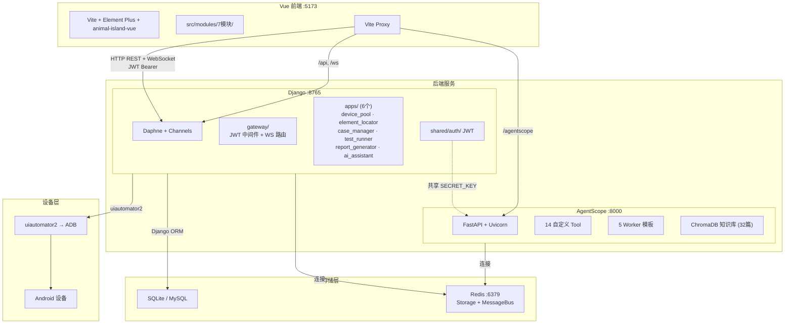

# Architecture — Android-AutoTests

## 项目概述

AI 驱动的 Android UI 自动化测试平台，采用**前后端分离**架构，通过 HTTP REST + WebSocket 通信。

### 前端

**Vue 3 + Vite + Element Plus**，按业务拆分为 7 个独立模块（设备管理、元素定位、用例编排、执行引擎、测试报告等），其中 AI 助手模块独立采用 animal-island-vue 主题（暖木色/大圆角），其余模块保持 Element Plus 蓝白风格。

### 后端

**Django 纯 API 后端**（Daphne + Channels），不渲染模板，只输出 JSON。按领域拆分为 6 个 App，统一 JWT 鉴权，共享一套命名规范与模块通信规则。

### AI 引擎

**AgentScope 2.0**（FastAPI + Uvicorn），独立于 Django 运行，通过 Redis 进行消息总线和状态存储。内置 14 个自定义 Tool，可直接调用 Django ORM 操作设备、元素、用例、报告等资源。支持 5 种 SubAgent 模板组成的 Agent Team 协作模式，并集成 ChromaDB 向量知识库（32 篇文档）为对话提供 RAG 上下文。

### 手机控制

**uiautomator2 + ADB** 连接 Android 设备，实现 UI 层级 dump、元素定位（8 种 XPath 策略）、14 种步骤编排（点击、等待、验证、轮询等）、截图流推送（2fps WebSocket）。

### AI 助手

面向测试人员的自然语言对话界面，支持**智能体创建 → 知识库检索 → 用例生成 → 测试执行 → 报告输出**全流程。用户无需编写代码，通过对话即可完成自动化测试。

## 架构



## 项目结构

```
├── run.py                     # 一键启停 Django + AgentScope + Vite
├── run_agentscope.py          # AgentScope 独立启动
├── manage.py                  # Django CLI
├── requirements.txt           # Python 依赖
│
├── config/                    # Django 项目配置
│   ├── settings.py            # DB · Channels · CORS · Redis · AgentScope · JWT
│   ├── urls.py                # include('apps.{name}.urls') × 6 + admin
│   ├── asgi.py                # Daphne 入口 (HTTP + WS)
│   └── agentscope_config.py   # AgentScope 服务配置
│
├── gateway/                   # 网关层
│   ├── middleware.py           # JWTAuthenticationMiddleware
│   └── routing.py              # WebSocket 中央路由
│
├── shared/                    # 共享服务
│   └── auth/
│       └── jwt_auth.py        # JWT 签发 · 验证 · 黑名单 (Django + AgentScope 共享)
│
├── apps/                      # Django 业务模块 (6 个)
│   ├── device_pool/           # ✅ · 5 端点 · dp_devices/locks/queue
│   ├── element_locator/       # ✅ · 11 端点 · el_pages/elements/flows
│   ├── case_manager/          # ✅ · 8 端点 · cm_test_definitions/cases
│   ├── test_runner/           # ✅ · 4 端点 · tr_test_runs/results
│   ├── report_generator/      # ✅ · 2 端点 · rg_reports/templates
│   └── ai_assistant/          # ✅ · 13 端点 · ai_agents/tools/conversations/messages/tasks/execution_logs
│
├── agentscope_service/        # AgentScope AI 服务
│   ├── app.py                 # FastAPI create_app 入口
│   ├── auth.py                # JWT 依赖注入
│   ├── agent_factory.py       # Django AIAgent → AgentScope Agent
│   ├── tools/                 # 14 个自定义 Tool
│   ├── teams/                 # 5 个 SubAgent 模板 + Leader prompt
│   └── rag/                   # ChromaDB 文档存储 + 加载器 + 初始化脚本
│
├── models/                    # Python dataclass (跨模块共享)
│   ├── step_types.py          # StepType 枚举 (14 种) + TestStep
│   └── test_models.py         # TestCaseDef · TestResult · TestRun
│
├── frontend/                  # Vue 3 + Vite 独立工程
│   ├── package.json
│   ├── vite.config.js         # Element Plus 按需引入 · manualChunks 分包 · proxy
│   └── src/
│       ├── main.js            # Vue 入口
│       ├── App.vue            # 根组件
│       ├── router.js          # SPA 路由 + JWT beforeEach 守卫
│       ├── shared/
│       │   ├── api-client.js  # Axios (JWT 拦截 · 401 刷新)
│       │   ├── event-bus.js   # mitt 事件总线
│       │   └── components/
│       │       └── AppSidebar.vue
│       └── modules/           # 7 个前端业务模块
│           ├── dashboard/          # 仪表盘
│           ├── device-pool/        # 设备管理
│           ├── element-locator/    # 元素定位
│           ├── element-manager/    # 元素管理
│           ├── case-manager/       # 测试用例
│           ├── test-runner/         # 执行引擎
│           ├── report-generator/   # 测试报告
│           └── ai-assistant/       # AI 助手 (animal-island-vue 动森主题)
│
├── dev_docs/         # 项目文档
├── data/                      # SQLite + avatars/ + screenshots/ + chromadb/
├── logs/                      # backend / agentscope / frontend 日志
├── exports/                   # YAML 导出
│
├── tools/dump_ui.py           # 离线 dump 工具
├── tools/generate_html.py     # 离线 HTML 生成
└── migrate_sqlite_to_mysql.py # SQLite → MySQL 数据迁移
```

## 关键依赖

- **AgentScope 依赖 Redis**：Redis 不可用时 AgentScope 无法启动，AI 对话自动降级到 Django 阻塞模式
- **设备依赖**：所有 u2 操作需要 ADB 设备连接，无设备时 API 返回友好提示
