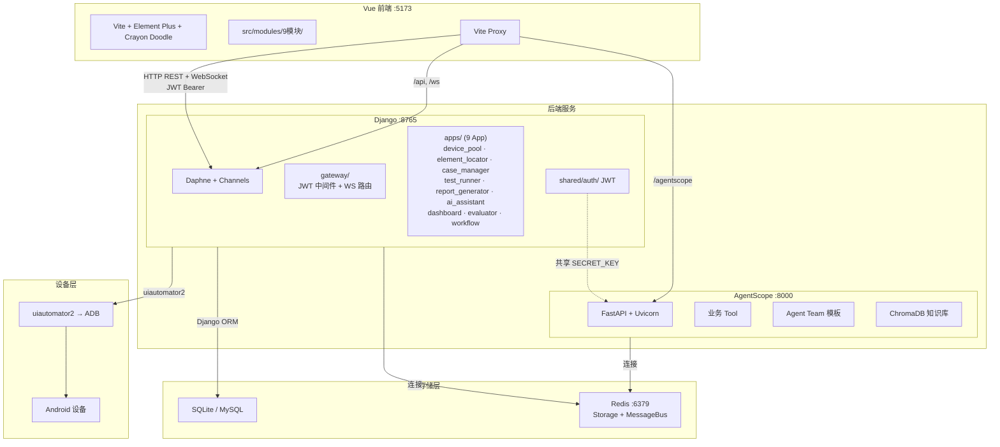

# Architecture — Android-AutoTests

## 项目概述

AI 驱动的 Android UI 自动化测试平台，采用**前后端分离**架构，通过 HTTP REST + WebSocket 通信。

### 前端

**Vue 3 + Vite + Element Plus**，按业务拆分为 9 个独立模块（设备管理、元素定位、用例编排、执行引擎、测试报告等），全局采用 Crayon Doodle 手绘卡通主题（`tokens.css`）。

### 后端

**Django 纯 API 后端**（Daphne + Channels），不渲染模板，只输出 JSON。按领域拆分为 9 个 App，统一 JWT 鉴权，共享一套命名规范与模块通信规则。

### AI 引擎

**AgentScope 2.0**（FastAPI + Uvicorn），独立于 Django 运行，通过 Redis 进行消息总线和状态存储。内置自定义 Tool，可直接调用 Django ORM 操作设备、元素、用例、报告等资源。支持 SubAgent 模板组成的 Agent Team 协作模式，并集成 ChromaDB 向量知识库为对话提供 RAG 上下文。

### 手机控制

**uiautomator2 + ADB** 连接 Android 设备，实现 UI 层级 dump、多策略元素定位、多种步骤编排（点击、等待、验证、轮询、API、Web 等）、截图流推送（WebSocket）。

### AI 助手

面向测试人员的自然语言对话界面，支持**智能体创建 → 知识库检索 → 用例生成 → 测试执行 → 报告输出**全流程。用户无需编写代码，通过对话即可完成自动化测试。

## 架构

## 关键依赖

- **AgentScope 依赖 Redis**：Redis 不可用时 AgentScope 无法启动，AI 对话自动降级到 Django 阻塞模式
- **设备依赖**：所有 u2 操作需要 ADB 设备连接，无设备时 API 返回友好提示
