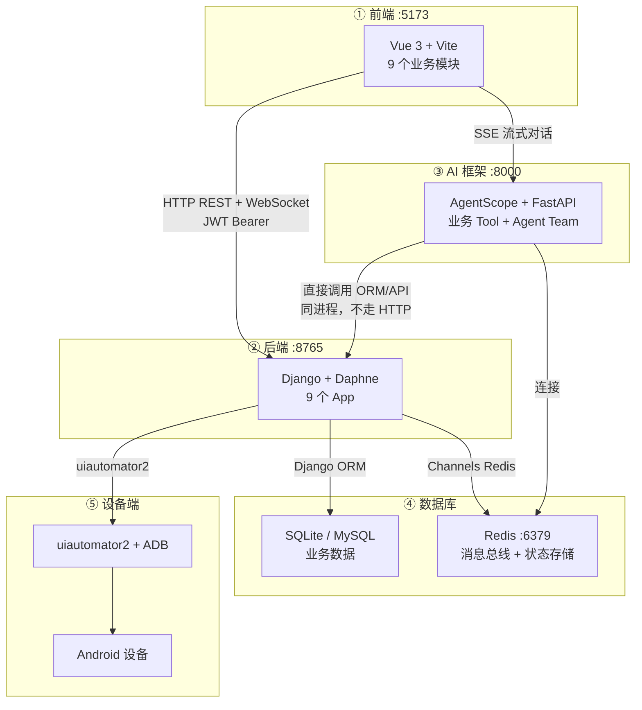

# Module Boundaries — Android-AutoTests

## 五层边界总览



## 各层交互方式

### ① → ②：前端 → 后端

| 项目 | 说明 |
|------|------|
| 协议 | HTTP REST + WebSocket |
| 鉴权 | JWT Bearer（`beforeEach` 守卫，Axios 拦截器自动刷新） |
| API 格式 | `{"ok": true, "data": {...}}` / `{"ok": false, "error": "..."}` |
| 代理 | Vite proxy：`/api`、`/ws` → `:8765` |
| 截图流 | WebSocket `/ws/screenshot`，2fps 推送 |

### ① → ③：前端 → AI 框架

| 项目 | 说明 |
|------|------|
| 协议 | SSE（Server-Sent Events）流式对话 |
| 鉴权 | JWT（Django + AgentScope 共享 SECRET_KEY） |
| 代理 | Vite proxy：`/agentscope`、`/agentscope-stream` → `:8000` |

### ③ ↔ ②：AI 框架 ↔ 后端

| 项目 | 说明 |
|------|------|
| 调用方式 | **同进程**，AgentScope Tool 直接 import Django ORM/API |
| 不走网络 | AgentScope 不通过 HTTP 调 Django，零网络开销 |
| 读操作 | Tool 内直接 ORM 查询 |
| 写操作 | Tool 内调用 Django api 函数 |
| 鉴权 | Tool 调用前 AgentScope 已通过 JWT 依赖注入验证用户身份 |

### ② → ④：后端 → 数据库

| 数据库 | 用途 | 后端访问方式 |
|--------|------|-------------|
| SQLite/MySQL | 业务表（设备、元素、用例、报告等） | Django ORM |
| Redis | Channels 消息总线 + AgentScope 状态存储 | `channels_redis` / `redis-py` |

### ⑤：设备端 → 后端

| 项目 | 说明 |
|------|------|
| 协议 | ADB（Android Debug Bridge） |
| 框架 | uiautomator2（Python 封装 ADB 命令） |
| 操作 | UI dump、截图、点击、滑动、输入 |
| 阻塞特性 | u2 调用是同步阻塞的，在 Daphne 工作线程中执行 |

## 后端内部边界（三道防火墙）

Django App 之间的模块通信规则：

```
防火墙 #1: service.py 互不 import
  ✅ 跨 App import Model (只读) + api.py (复杂写)
  ❌ 跨 App import service / 内部实现

防火墙 #2: 读放开，写收敛
  ✅ 跨 App 读 (SELECT): 直接 ORM
  ❌ 跨 App 写 (INSERT/UPDATE/DELETE): 必须走 api 函数

防火墙 #3: 外部访问只走 API
  Vue → HTTP → Django API → ORM → DB
  AgentScope → Tool → Django ORM/API (同进程，不走 HTTP)
  Django Admin → ORM → DB (管理员专用)
```

### 代码示例

```python
# ✅ 允许：跨 App import Model（只读）
from apps.device_pool.models import Device
device = Device.objects.get(serial="...")

# ✅ 允许：跨 App import api.py（复杂写操作）
from apps.device_pool.api import acquire_device
acquire_device(serial="...", user_id="...", timeout=300)

# ❌ 禁止：跨 App import service / 内部实现
from apps.device_pool.service import allocate_device

# ❌ 禁止：跨 App 直接 ORM 写操作
Device.objects.update(status="ONLINE")  # 在别的 App 代码里
```
