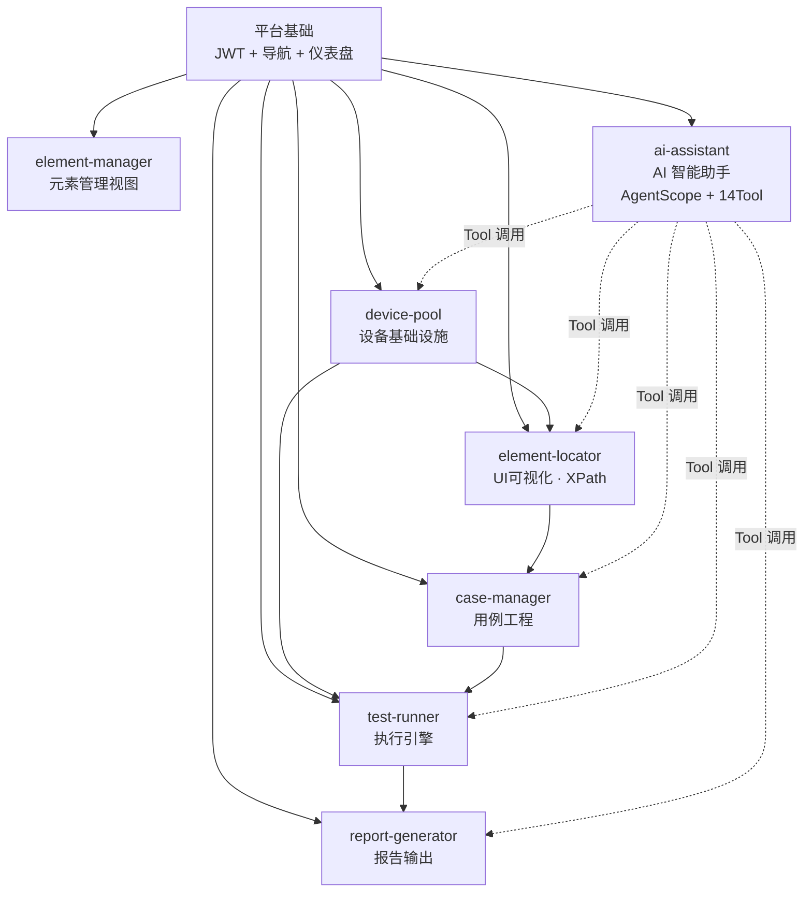

# Android-AutoTests 实际需求文档

> 基于已实现代码，合并全局 PRD 与 6 个子 PRD 的最终版本
> 版本：v1.0 · 日期：2026-07-01

---

## 第一部分：总体需求

### 1. 平台定位

**Android-AutoTests** 是一个 AI 驱动的 Android UI 自动化测试平台。核心定位：

- **可视化元素定位**：手机实时截图 + 8 种 XPath 自动生成，让测试工程师无需手写定位表达式
- **AI 智能用例生成**：通过自然语言描述即可自动搜索元素、构造步骤、保存可执行用例
- **数据驱动执行**：14 种原子步骤类型，支持循环压测、实时进度推送、失败自动诊断
- **多设备管理**：设备池锁定/释放/排队，支持多设备并行执行
- **全流程闭环**：从元素发现 → 用例编写 → 执行测试 → 报告输出，一个平台完成

### 2. 目标用户

| 角色 | 特征 | 核心需求 | 使用频率 |
|------|------|----------|:--:|
| **测试工程师**（主要） | 25-35 岁，熟悉 Android 测试 | 快速定位元素、批量回归、专业报告 | 每日 |
| **产品经理**（次要） | 30-40 岁，不写代码 | 一键执行冒烟用例、查看通过率 | 每周 |
| **QA 负责人**（次要） | 管理测试团队 | 多设备并行、执行历史、质量趋势 | 每周 |

### 3. 用户故事地图

```
登录 → 首页仪表盘
  │
  ├─ 设备管理 → 连接设备 → 查看状态 → 锁定/释放
  │
  ├─ 元素定位 → 选择设备 → 实时截图 → 点击元素查看XPath → 标记测试点
  │     │
  │     └─ 元素管理 → 编辑别名/标签 → 搜索元素
  │
  ├─ 测试用例 → 新建用例 → 编排步骤(14种) → 保存
  │     │                      ↑
  │     │         元素定位提供 XPath
  │     │
  │     └─ 执行测试 → 选择用例 + 设备 → 设定循环次数 → 启动
  │           │
  │           ├─ 实时进度（WebSocket 推送每步结果）
  │           │
  │           └─ 测试报告（通过率 / 失败详情 / 执行时间）
  │
  └─ AI 助手 → 选择智能体 → 新建对话 → 自然语言发指令
        │
        ├─ "给登录页创建冒烟用例" → AI 自动搜索元素 → 生成用例
        ├─ "在设备 X 上跑一遍" → AI 自动锁定设备 → 执行 → 报告
        └─ "查询设备池有哪些设备" → AI 直接回答
```

### 4. 非功能需求

| 类别 | 指标 | 目标值 | 当前状态 |
|------|------|:--:|:--:|
| **性能** | 截图延迟 | ≤500ms | ✅ |
| **性能** | 截图帧率 | ≥2fps | ✅ |
| **可用性** | 无设备降级 | 友好提示，不崩溃 | ✅ |
| **安全** | API 认证 | JWT Bearer 全覆盖（除 /login） | ✅ |
| **可扩展性** | 新增模块成本 | 4 个文件各 1 行 | ✅ |
| **兼容性** | Android 版本 | 8.0+ | ✅ |
| **AI 降级** | AgentScope 不可用 | 自动降级到 Django 阻塞模式 | ✅ |

### 5. 技术栈

| 层 | 技术 | 版本 |
|----|------|------|
| 前端框架 | Vue 3 + Vite + Element Plus | 3.4 / 5.4 / 2.7 |
| AI 模块主题 | animal-island-vue | 0.2 |
| 状态管理 | Pinia | 2.1 |
| 动画 | animejs | 4.5 |
| 图表 | ECharts | 5.5 |
| 后端框架 | Django (裸视图 + JsonResponse) | 4.2 |
| ASGI | Daphne + Django Channels | 4.0 |
| 数据库 | SQLite(dev) / MySQL(prod) | — |
| 认证 | 自定义 JWT (PyJWT · HS256 · SECRET_KEY) | 2.8 |
| 设备控制 | uiautomator2 + ADB | 3.0 |
| Admin 主题 | Jazzmin | — |
| AI 引擎 | AgentScope + FastAPI + Redis | 2.0.3 |
| 向量库 | ChromaDB | 1.5 |
| 调度 | APScheduler | 3.11 |

---

## 第二部分：模块需求

---

### 模块 M1：设备管理 (device-pool)

**定位**：平台设备基础设施。管理所有已连接 Android 设备的生命周期。

**用户**：测试工程师、QA 负责人

| 编号 | 功能 | 描述 | 优先级 |
|:--:|------|------|:--:|
| DP-01 | 设备注册 | 通过 serial 自动发现并注册设备，识别 USB/WiFi 连接类型 | P0 |
| DP-02 | 设备状态查看 | 列表展示全部设备：在线/离线/忙碌状态、型号、Android 版本 | P0 |
| DP-03 | 设备锁定 | 执行测试前锁定设备，防止并发冲突。超时自动释放 | P1 |
| DP-04 | 设备释放 | 测试完成后主动释放设备回池 | P1 |
| DP-05 | 设备切换 | 运行时切换当前操作的目标设备 | P0 |

**数据模型**：`dp_devices` · `dp_device_locks` · `dp_device_queue`

---

### 模块 M2：元素定位 (element-locator)

**定位**：UI 可视化中枢。连接手机获取实时截图和 UI 层级树，自动生成元素定位表达式。

**用户**：测试工程师

| 编号 | 功能 | 描述 | 优先级 |
|:--:|------|------|:--:|
| EL-01 | 实时截图流 | WebSocket 持续推送手机截图到浏览器，≥2fps，延迟 ≤500ms | P0 |
| EL-02 | UI 层级抓取 | 一键 dump 当前页面完整 UI 树，解析为结构化 Element 记录 | P0 |
| EL-03 | XPath 自动生成 | 为每个元素自动生成 8 种 XPath 候选策略，按匹配数升序排列 | P0 |
| EL-04 | 元素交互点击 | 在截图上点击元素自动定位，展示 XPath、class、text 等属性 | P0 |
| EL-05 | 测试点标记 | 标记元素为 test_point，为用例模块提供可测试锚点 | P1 |
| EL-06 | 页面流程管理 | 记录页面间跳转关系（from → to + 触发元素） | P1 |
| EL-07 | 元素别名/标签 | 编辑元素别名和标签，便于用例编写时引用 | P2 |

**数据模型**：`el_pages` · `el_elements` · `el_page_flows`

**8 种 XPath 策略**：
```
resource-id > text > content-desc > class > index >
combined(class+index) > wildcard(text contains) > wildcard(content contains)
```

---

### 模块 M3：元素管理 (element-manager)

**定位**：元素数据的管理视图。提供搜索、筛选、批量编辑能力。

| 编号 | 功能 | 描述 | 优先级 |
|:--:|------|------|:--:|
| EM-01 | 元素列表搜索 | 按文本/class/resource_id/页面搜索全部元素 | P1 |
| EM-02 | 元素编辑 | 修改别名、标签、测试点标记、备注 | P1 |
| EM-03 | 按页面筛选 | 按页面分组查看元素 | P2 |

---

### 模块 M4：测试用例 (case-manager)

**定位**：测试资产管理中枢。创建、编排、管理可重用的测试用例定义。

**用户**：测试工程师

| 编号 | 功能 | 描述 | 优先级 |
|:--:|------|------|:--:|
| CM-01 | 用例 CRUD | 创建/编辑/删除/启用-禁用用例定义。字段：ID、标题、分类、描述、包名 | P0 |
| CM-02 | 14 种步骤编排 | 拖拽排序组合 click / wait / verify_text / sleep 等 14 种原子操作 | P0 |
| CM-03 | XPath 接入 | 从 element-locator 已标记元素获取 XPath 填充步骤 | P1 |
| CM-04 | YAML 导出 | 用例导出为 YAML 文件，支持跨环境迁移 | P1 |
| CM-05 | 用例搜索筛选 | 按分类、包名、关键词搜索 | P2 |

**14 种步骤类型**：

| 步骤类型 | 说明 |
|----------|------|
| `click` | 点击元素 |
| `click_indexed` | 点击第 N 个匹配元素 |
| `wait` | 等待元素出现 |
| `wait_disappear` | 等待元素出现后消失 |
| `wait_either` | 等待两个元素之一出现 |
| `wait_toast` | 等待 Toast 消息 |
| `verify_text` | 验证元素文本内容 |
| `poll_text` | 轮询等待文本变为期望值 |
| `sleep` | 固定等待 |
| `kill_app` | 杀掉 APP |
| `start_app` | 启动 APP |
| `restart_app` | 重启 APP |
| `retry_click` | 点击 + 失败重试 |
| `log` | 打印日志 |

**数据模型**：`cm_test_definitions` · `cm_test_cases`

---

### 模块 M5：执行引擎 (test-runner)

**定位**：测试执行核心。将用例定义转换为设备操作序列，驱动 uiautomator2 完成自动化测试。

**用户**：测试工程师、产品经理

| 编号 | 功能 | 描述 | 优先级 |
|:--:|------|------|:--:|
| TR-01 | 异步执行 | 加载用例 → 构建 TestRunner → async 后台运行 → 返回 run_id | P0 |
| TR-02 | 14 种步骤执行 | StepExecutor 将每种步骤映射为 uiautomator2 操作（含超时/重试） | P0 |
| TR-03 | 实时进度推送 | WebSocket 推送每步结果：日志/迭代/用例完成/运行完成/设备错误 | P0 |
| TR-04 | 循环执行 | 设定 loop_count，自动化重复执行压力测试 | P1 |
| TR-05 | 中途停止 | 运行中可手动终止 | P1 |
| TR-06 | 执行历史 | 查询历史执行记录和单次结果 | P1 |

**WebSocket 消息类型（6 种）**：
`case_started` · `iteration_result` · `case_finished` · `run_finished` · `log` · `device_error`

**数据模型**：`tr_test_runs` · `tr_test_results`

---

### 模块 M6：测试报告 (report-generator)

**定位**：执行结果收口。汇总执行数据，输出可追溯的测试报告。

**用户**：测试工程师、QA 负责人

| 编号 | 功能 | 描述 | 优先级 |
|:--:|------|------|:--:|
| RG-01 | CSV 报告 | 每个用例执行结果写入 CSV（通过/失败/耗时/详情） | P1 |
| RG-02 | 失败详情 | 失败用例的 Markdown 诊断报告 | P1 |
| RG-03 | 报告列表 | 查询历史报告记录 | P2 |
| RG-04 | 报告模板 | 预定义报告模板（基础/详细/摘要） | P2 |

**数据模型**：`rg_reports` · `rg_report_templates`

---

### 模块 M7：AI 助手 (ai-assistant)

**定位**：平台 AI 入口。通过自然语言对话，让 AI 智能体自主调用平台各模块完成测试任务。

**用户**：测试工程师（主要）、产品经理

| 编号 | 功能 | 描述 | 优先级 |
|:--:|------|------|:--:|
| AI-01 | 智能体管理 | 创建/编辑/删除 AI 智能体。配置模型（百炼/OpenAI/Claude）、系统提示词、温度、工具集 | P0 |
| AI-02 | 多会话对话 | 创建/切换/删除对话。消息持久化存储，支持审计回溯 | P0 |
| AI-03 | SSE 流式输出 | 智能体回复实时逐字展示，不再阻塞等待完整响应 | P0 |
| AI-04 | 自然语言生成用例 | "给登录页创建冒烟用例" → AI 自动搜索元素 → 构造步骤 → 保存到 case-manager | P1 |
| AI-05 | 设备查询与控制 | "查看在线设备" → AI 调用设备工具回答；"锁定设备 X" → AI 执行锁定 | P1 |
| AI-06 | 测试执行 | "在设备 X 上跑用例 Y，循环 3 轮" → AI 锁定设备 → 执行 → 返回结果 | P1 |
| AI-07 | 知识库检索 | AI 自动查询项目文档/StepType 参考/历史用例，提升生成质量 | P1 |
| AI-08 | 智能体编队 (Agent Team) | Leader 智能体自动派生子 Worker 并行处理复杂任务 | P2 |
| AI-09 | 定时任务 (Cron) | 按 cron 表达式定时触发智能体执行（如"每天早 8 点跑冒烟"） | P2 |
| AI-10 | 平台统一登录 | 登录一次即可访问全部模块（含 AI 助手）。JWT 鉴权，刷新/退出 | P0 |
| AI-11 | 动森主题 | AI 模块独立视觉风格：暖木色调、大圆角、动画光标、页脚装饰 | P2 |

**14 个 AgentScope 自定义 Tool**：

| 工具 | 调用的平台 API |
|------|--------------|
| `get_test_points` | element-locator: 获取测试点元素 |
| `search_elements` | element-locator: 搜索 UI 元素 |
| `save_test_case` | case-manager: 创建/更新用例 |
| `get_test_case` | case-manager: 获取用例详情 |
| `list_test_cases` | case-manager: 列出用例 |
| `get_online_devices` | device-pool: 列出在线设备 |
| `acquire_device` | device-pool: 锁定设备 |
| `release_device` | device-pool: 释放设备 |
| `run_test` | test-runner: 执行测试 |
| `get_run_results` | test-runner: 查询执行结果 |
| `stop_run` | test-runner: 停止执行 |
| `save_report` | report-generator: 保存报告 |
| `list_reports` | report-generator: 列出报告 |
| `search_knowledge_base` | ChromaDB: 知识库检索（32 篇文档） |

**5 个 Agent Team 子智能体**：
`element-inspector` · `case-writer` · `device-operator` · `test-executor` · `report-writer`

**数据模型**：`ai_agents` · `ai_tools` · `ai_conversations` · `ai_messages` · `ai_tasks` · `ai_execution_logs`

---

### 模块 M8：平台基础 (platform)

**定位**：跨模块的平台级基础设施。

| 编号 | 功能 | 描述 | 优先级 |
|:--:|------|------|:--:|
| PF-01 | JWT 统一认证 | 平台统一登录页。JWT 签发/验证/刷新/黑名单。Django + AgentScope 共享密钥 | P0 |
| PF-02 | 导航侧边栏 | 7 个模块入口 + 用户显示 + 退出。SVG 图标库（24 个图标） | P0 |
| PF-03 | 仪表盘 | 首页概览：设备状态/用例统计/执行概况/快速入口 | P1 |
| PF-04 | Django Admin | Jazzmin 主题管理后台。全部 18 张表注册 | P1 |
| PF-05 | 一键启停 | `python run.py start/stop/restart/status/logs` | P0 |
| PF-06 | 报错诊断 | 常见错误快速诊断手册（见 `01-技术架构/报错诊断手册.md`） | P2 |

---

## 第三部分：模块依赖关系



---

## 变更记录

| 版本 | 日期 | 变更摘要 |
|------|------|----------|
| v1.0 | 2026-07-01 | 合并全局PRD + 6个子PRD + 架构方案，只保留已实现内容。新增 AI-03~AI-11（原始 PRD 仅 2 个用户故事）。按实际代码重写模块 M7（Dify → AgentScope） |
