# Android-AutoTests 当前实现架构方案
<!-- DEPRECATED: 2026-07-15 内容已合并到 项目架构.md。本文档保留作为历史参考，不再维护。 -->
<!-- 请以 项目架构.md 为唯一真相来源。 -->

> 2026-07-01 · 基于实际代码生成（非计划文档）

---

## 一、设计视角：技术大框架

### 1.1 核心架构图

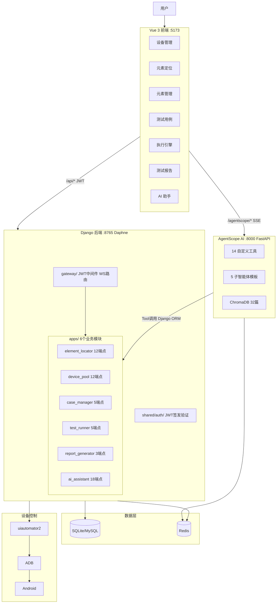

### 1.2 两条执行通道

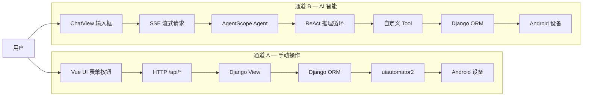

### 1.3 分层职责

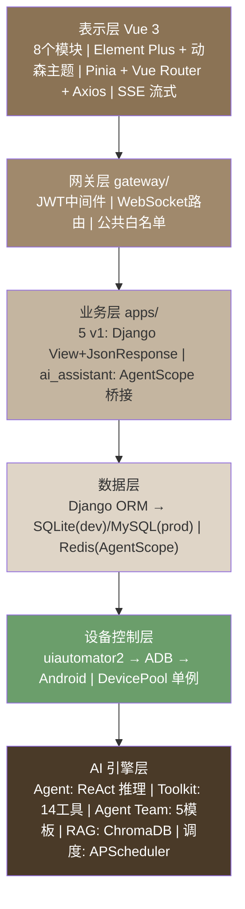

### 1.4 设计模式

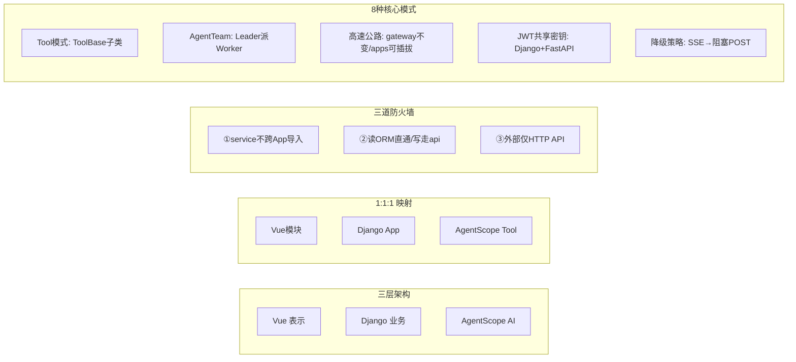

### 1.5 技术栈全景

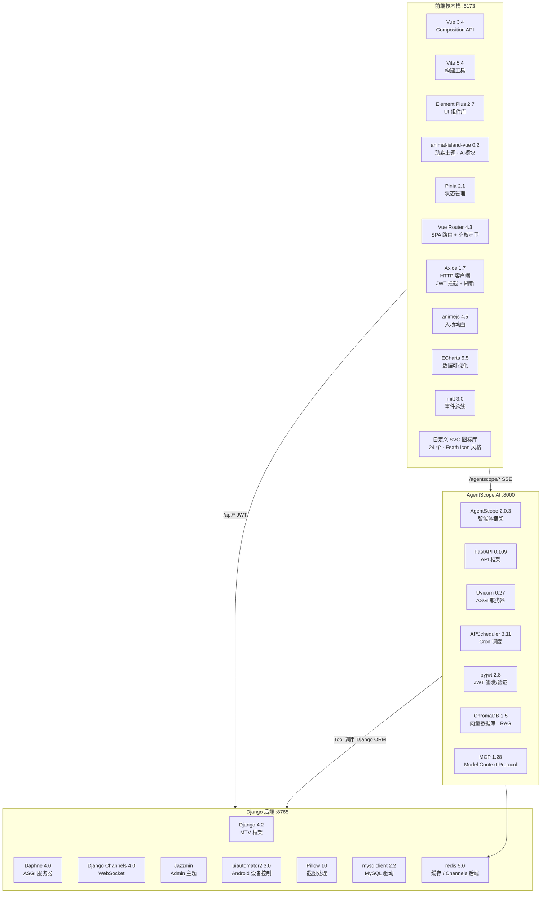

#### 前端

| 类别 | 技术 | 版本 | 用途 |
|------|------|:--:|------|
| **框架** | Vue 3 | 3.4 | Composition API + SFC |
| **构建** | Vite | 5.4 | 开发服务器 + 打包 |
| **UI 主库** | Element Plus | 2.7 | 70+ 组件：表单/表格/对话框/标签页 |
| **UI 主题** | animal-island-vue | 0.2 | AI 助手模块独立视觉：暖木色 · 大圆角 · 羊皮纸底 |
| **全局样式** | CSS 变量 + 毛玻璃 | — | `style.css` 定义 16 个设计 Token，`App.vue` 三个动态 blob |
| **状态管理** | Pinia | 2.1 | 模块级 store |
| **路由** | Vue Router | 4.3 | HTML5 History 模式 + beforeEach 鉴权守卫 |
| **HTTP** | Axios | 1.7 | 请求拦截器注入 JWT · 响应拦截器 401 刷新 |
| **动画** | animejs | 4.5 | 侧边栏入场 · 卡片 staggered · blob 视差 |
| **图表** | ECharts | 5.5 | 仪表盘数据可视化 |
| **事件总线** | mitt | 3.0 | 跨组件轻量通信 |
| **图标** | 自定义 SVG | — | 24 个 Feather 风格图标：`h()` 渲染函数，tree-shakable |
| **字体** | Inter + Quicksand | — | Google Fonts · 中英文混排栈 |

#### 后端

| 类别 | 技术 | 版本 | 用途 |
|------|------|:--:|------|
| **框架** | Django | 4.2 | MTV 架构 · ORM · Admin |
| **ASGI** | Daphne | 4.0 | HTTP + WebSocket 双协议 |
| **WebSocket** | Django Channels | 4.0 | 截图流 2fps · 测试进度推送 |
| **Admin 主题** | Jazzmin | — | Bootstrap 5 管理后台 · 自定义 CSS 字体 |
| **设备控制** | uiautomator2 | 3.0 | Python → ADB → Android 自动化 |
| **图像** | Pillow | 10.0 | 截图处理 |
| **数据库** | SQLite(dev) / MySQL(prod) | — | 环境变量 `DB_ENGINE` 切换 |
| **缓存** | Redis | 5.0 | Channels 后端 + AgentScope Storage |
| **跨域** | django-cors-headers | — | 开发环境全开放 |

#### AgentScope AI 服务

| 类别 | 技术 | 版本 | 用途 |
|------|------|:--:|------|
| **智能体框架** | AgentScope | 2.0.3 | Agent · Toolkit · Agent Team · Cron |
| **API 框架** | FastAPI | 0.109 | RESTful 端点 · 自动 OpenAPI |
| **服务器** | Uvicorn | 0.27 | ASGI 高性能 |
| **调度** | APScheduler | 3.11 | Cron 表达式 → 定时触发 Agent |
| **鉴权** | PyJWT | 2.8 | Django 共享 SECRET_KEY · dependency_overrides |
| **向量库** | ChromaDB | 1.5 | 32 篇项目文档 · RAG 检索 |
| **协议** | MCP | 1.28 | Model Context Protocol · 外部工具接入 |

#### 自定义资产

| 资产 | 数量 | 说明 |
|------|:--:|------|
| AgentScope 自定义 Tool | 14 个 | element(2) + case(3) + device(3) + runner(3) + report(2) + rag(1) |
| Agent Team 子智能体模板 | 5 个 | inspector · case-writer · device-operator · test-executor · report-writer |
| 前端业务模块 | 8 个 | 仪表盘 · 设备 · 元素定位 · 元素管理 · 用例 · 执行 · 报告 · AI助手 |
| Django App | 6 个 | 同上（无 element-manager） |
| 数据库表 | 18 张 | 6 组前缀：el_ dp_ cm_ tr_ rg_ ai_ |
| API 端点 | 55 个 | REST 55 + WebSocket 2 + AgentScope 动态 |
| JWT 端点 | 5 个 | login · register · refresh · logout · me |
| SVG 图标 | 24 个 | Dashboard · Device · Target · Brain · Play · BarChart... |

---

## 二、实现视角：当前实际架构

### 2.1 已实现 vs 裁剪清单

| 原方案（废弃） | 原因 |
|:--|:--|
| `project_hub` / `requirement_tracker` (v3) | 无实际代码，仅骨架注册 |
| `api_tester` / `data_factory` (v4) | 从未创建 |
| `shared/events/` / `shared/config/` | 空目录，无跨模块事件需求 |
| Dify API 集成 | 改为 AgentScope 直连（更灵活） |
| Celery | 改用 APScheduler（AgentScope 内置） |
| DRF Serializer/ViewSet | 保持裸 Django View（详见 2.7） |
| FastAPI `web_server.py` | 已废弃 |

| 原方案（变更） | 变更内容 |
|:--|:--|
| `ai_assistant` v4→v1 | 提前实现：6模型+18端点+AgentScope桥接 |
| JWT Auth v2→v1 | 提前实现：`shared/auth/jwt_auth.py` + 中间件 |
| `ai_sessions` → `ai_conversations` | 拆分为 6 张表 |
| `ai_dify_config` | 删除，配置合并到 AIAgent 字段 |

### 2.2 模块清单

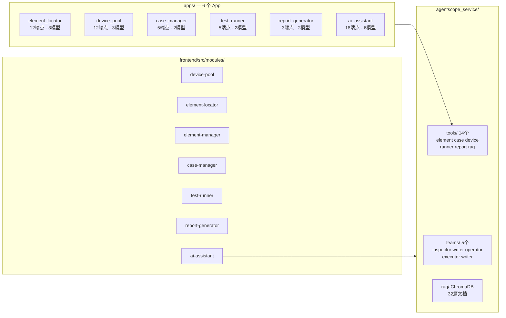

### 2.3 数据库表（18 张）

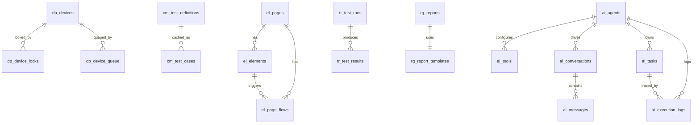

### 2.4 API 端点（55 个）

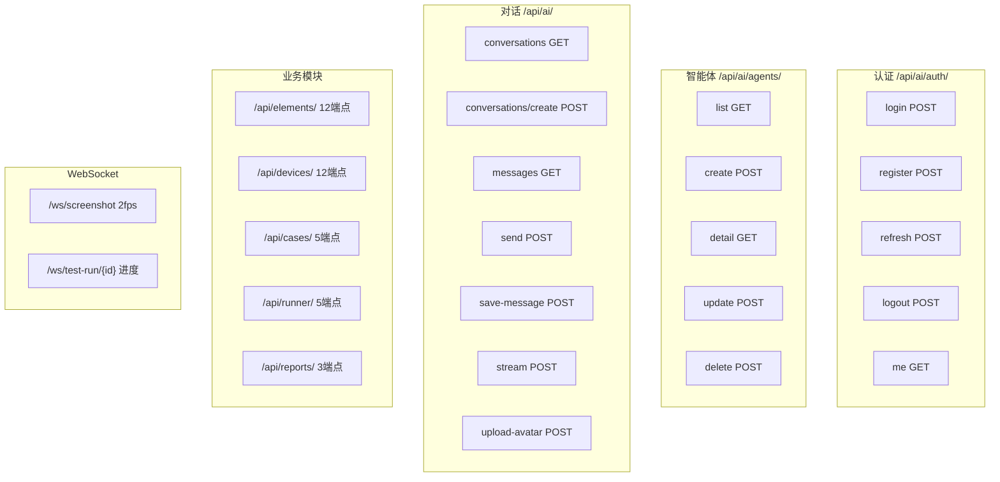

### 2.5 数据流图

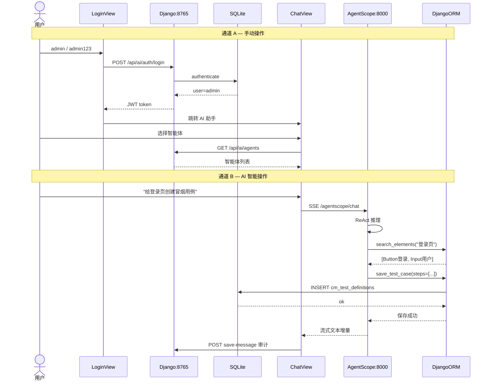

### 2.6 AgentScope ReAct 调用链

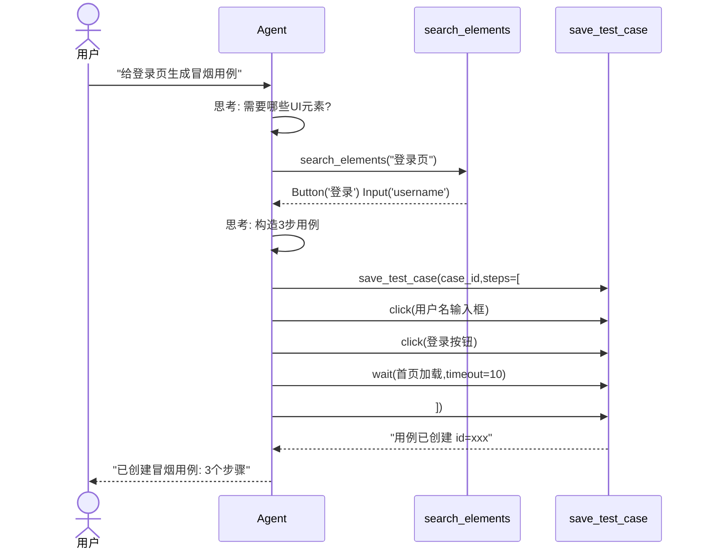

### 2.7 裸 Django View vs DRF（结论）

| 维度 | 裸 Django View（当前） | DRF |
|------|:--:|:--:|
| 代码量 | 少（一个函数搞定） | 多（Serializer+View+Router） |
| 请求解析 | 手动 `json.loads(request.body)` | 自动 `request.data` |
| 参数校验 | 手动 if-return-error | 声明式 Serializer |
| 序列化 | 手动 dict 拼装 | 自动 ModelSerializer |
| API 文档 | 无 | 自动 OpenAPI |
| 路由 | 手动 path() | 自动 SimpleRouter |
| 学习曲线 | 低 | 中等 |

> **结论**：保持裸 Django View。55 个端点已稳定运行，JSON 格式 `{ok, data}` 全项目统一。AgentScope Tool 直接调 Python API 不经 HTTP，DRF 无帮助。未来新建纯 RESTful App 时可局部引入。

---

## 三、部署架构

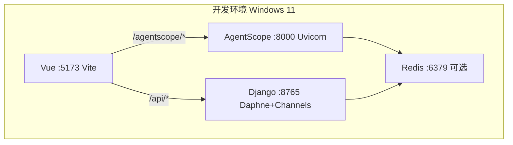

```bash
# 一键启动
python run.py start      # Django + AgentScope + Vite
python run.py status     # 各服务状态
python run.py stop       # 停止全部
# 日志: logs/backend.log  logs/agentscope.log  logs/frontend.log
```
