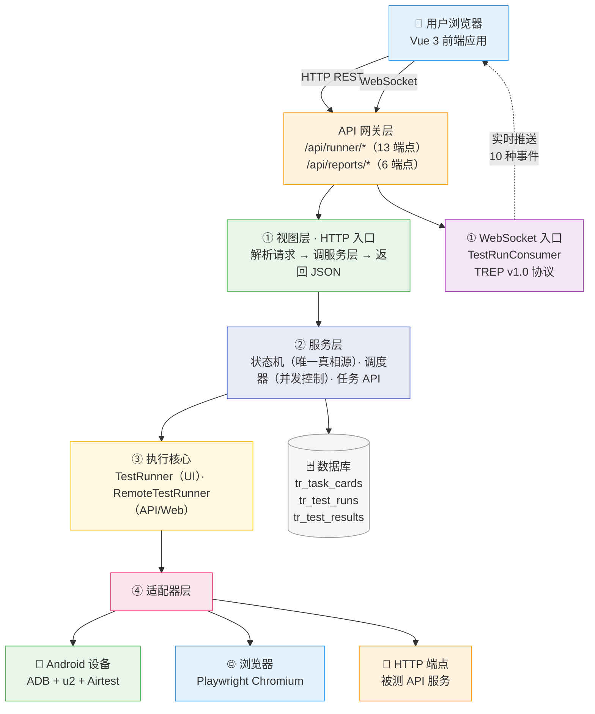
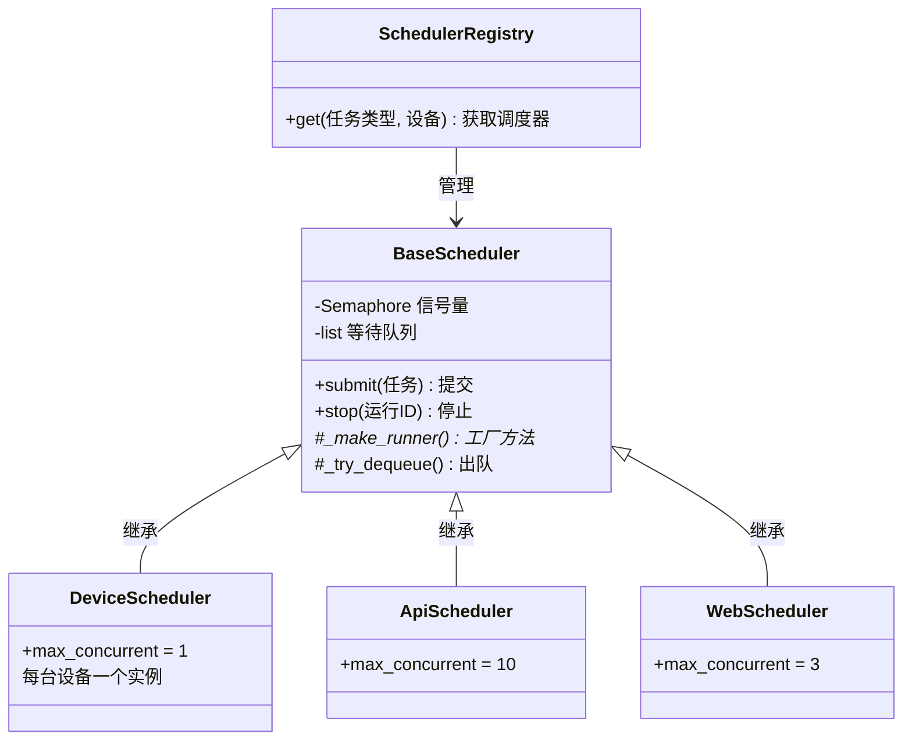
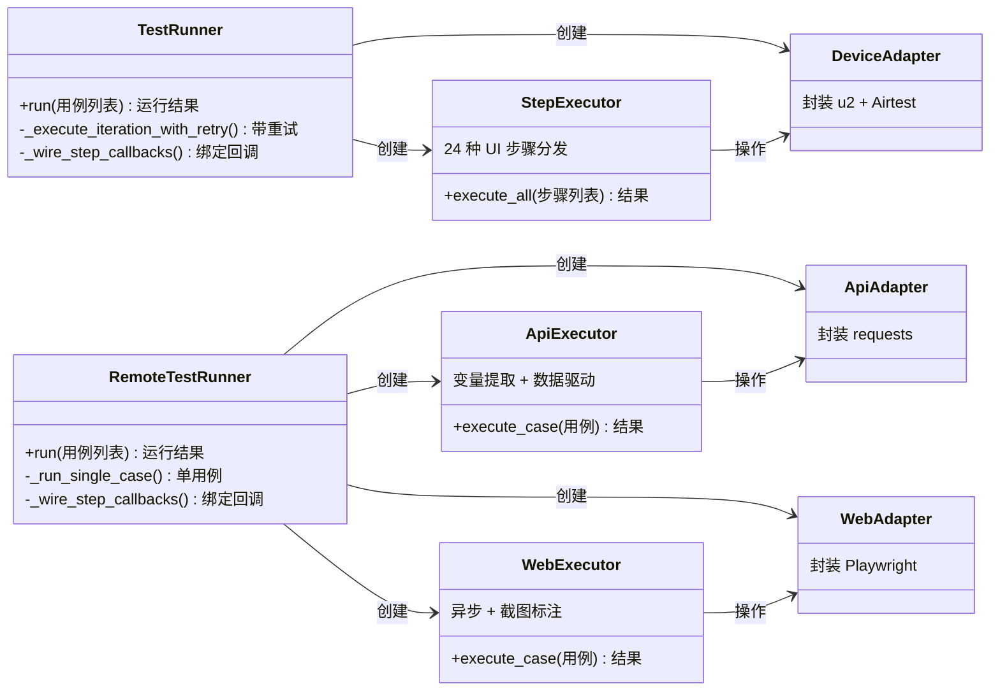
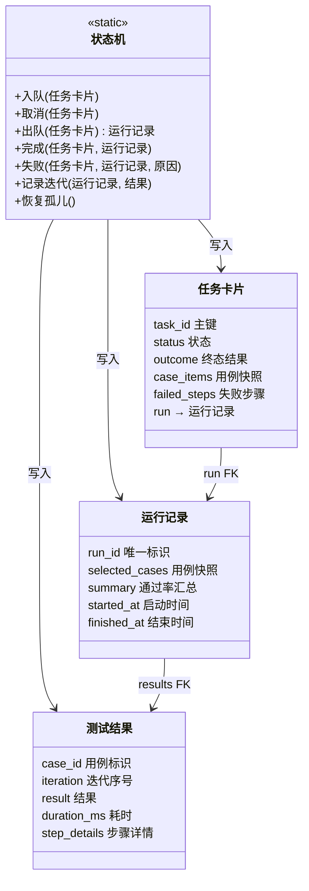
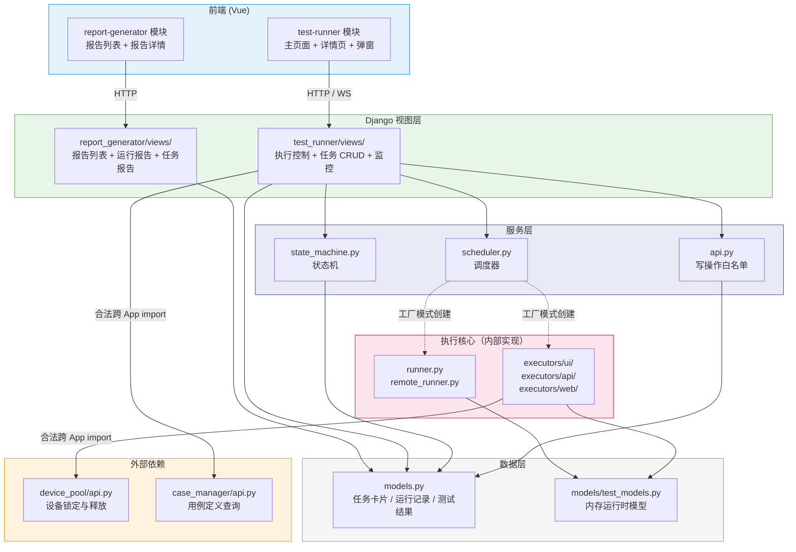

# Mermaid-04 — 执行引擎架构图

> 关联：[PRD-04-执行引擎](./PRD-04-执行引擎.md) · [PRD-04-执行引擎-业务功能](./PRD-04-执行引擎-业务功能.md) · [API-04-执行引擎-接口文档](./API-04-执行引擎-接口文档.md)
> 版本：v2.0 · 日期：2026-07-29

---

## 一、架构全景图

> 从上到下四层：前端 → API 网关 → 业务核心 → 外部目标。



### 各层职责

| 层 | 一句话职责 | 关键组件 |
|:--:|------|------|
| ① 视图层 | 接收 HTTP/WS 请求，调服务层，返回 JSON | 13 个 Django View + 1 个 WS Consumer |
| ② 服务层 | 状态转移 + 并发调度 + 写操作收敛 | 状态机 / 调度器注册表 / api.py |
| ③ 执行核心 | 编排测试生命周期，分发步骤到适配器 | TestRunner（UI）/ RemoteTestRunner（API, Web） |
| ④ 适配器层 | 封装设备/浏览器/HTTP 操作细节 | DeviceAdapter / WebAdapter / ApiAdapter |

### 两条数据通道

| 通道 | 路径 | 用途 |
|------|------|------|
| **HTTP 请求-响应** | 前端 → API 网关 → 视图层 → 服务层 → 执行核心 | 创建任务、启停执行、查询状态 |
| **WebSocket 实时推送** | 执行核心 → WS Consumer → 前端 | 步骤进度、日志、心跳（执行期间持续推送） |

---

## 二、核心类图

> 分三组展示：调度器继承链 → Runner-Executor-Adapter 组合链 → 状态机与持久化。

### 2.1 调度器继承链



**模式**：模板方法。`BaseScheduler` 定义调度框架（提交→获取信号量→执行→finally释放→出队），三个子类只覆写 `_make_runner()` 工厂方法和 `max_concurrent`。

### 2.2 Runner - Executor - Adapter 组合链



**多态**：`TestRunner`（UI 真机）与 `RemoteTestRunner`（API/Web 虚拟设备）暴露相同接口，编排器 `_execute_tests()` 不感知差异。

### 2.3 状态机与持久化



**关键约束**：所有状态变更经状态机，DB 事务 + 行级锁保证原子性，终态禁止再转移。

---

## 三、模块包图

> 箭头方向 = import 方向。只展示模块间的依赖关系，不逐文件列举。



### 防火墙规则

```
视图层 ──✅ import──→ 服务层（state_machine / api.py / scheduler）
视图层 ──❌ import──→ 执行核心（runner / executor）  ← 禁止！由调度器工厂间接创建

服务层 ──✅ import──→ 数据层（models / test_models）
服务层 ──✅ import──→ 外部 App api.py（device_pool / case_manager）

执行核心 ──✅ import──→ 外部设备库（u2 / Playwright / requests）
执行核心 ──❌ 不 import──→ Django 视图 / 服务层  ← 单向依赖

数据层 ──✅ 被所有层 import（只读查询）
数据层 ──❌ 写操作必须走 api.py  ← 写收敛原则
```

### 模块间 import 方向总览

| 从 ↓ / 到 → | 前端 | 视图层 | 服务层 | 执行核心 | 数据层 | 外部 App |
|:--:|:--:|:--:|:--:|:--:|:--:|:--:|
| 前端 | — | HTTP/WS | ❌ | ❌ | ❌ | ❌ |
| 视图层 | ❌ | — | ✅ | ❌ | ✅ | ✅ |
| 服务层 | ❌ | ❌ | — | 工厂间接 | ✅ | ✅ |
| 执行核心 | ❌ | ❌ | ❌ | — | ✅ | ✅ |
| 数据层 | ❌ | ❌ | ❌ | ❌ | — | — |

---

## 附录：三图对照

| 图 | 回答什么问题 | 适合谁看 |
|:--:|------|------|
| 一、架构全景图 | 系统分几层？数据怎么流动？依赖哪些外部系统？ | 新人入职、架构评审 |
| 二、核心类图 | 有哪些类？谁继承谁？谁组合谁？ | 开发人员、代码评审 |
| 三、模块包图 | 哪个模块能 import 哪个？边界在哪里？ | 开发人员、CI 边界检查 |
