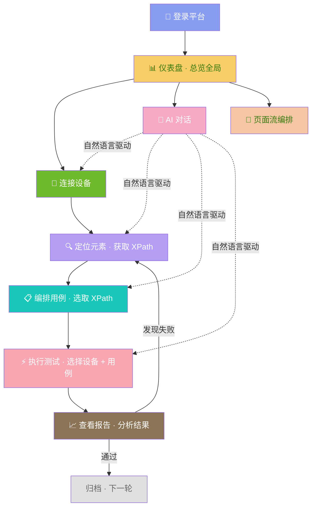
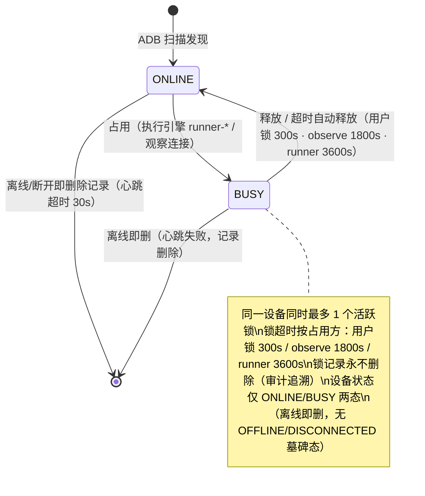
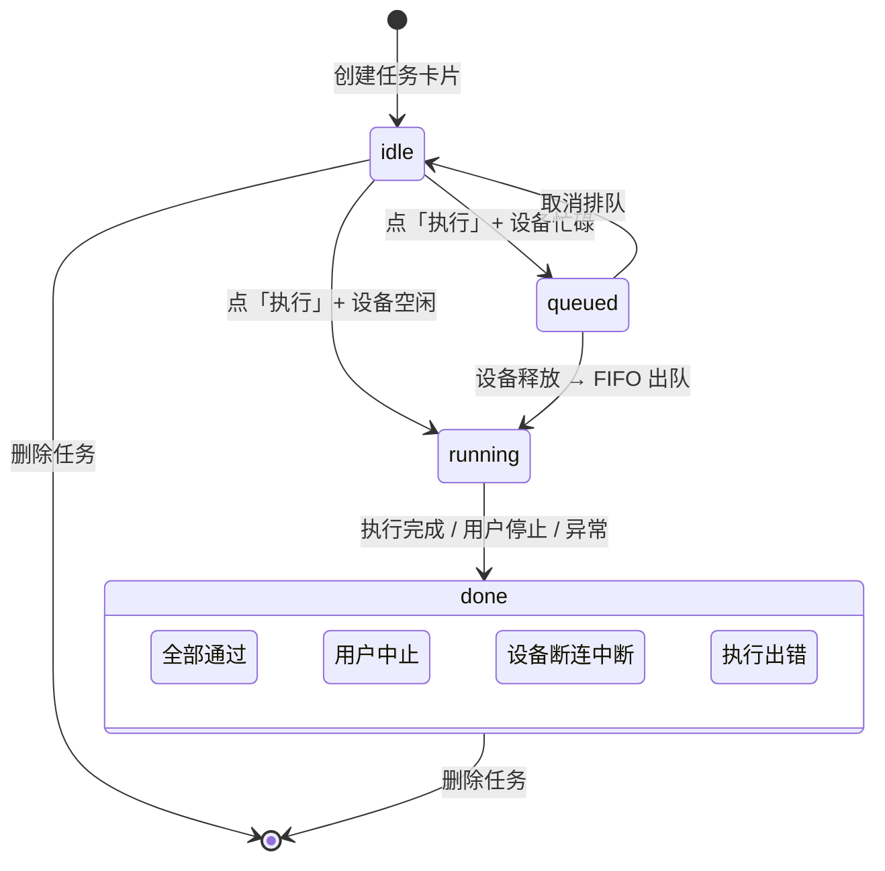

# 需求大纲 — Android-AutoTests

> 版本：v3.6 · 日期：2026-08-21
> 本文档是平台的**需求总纲**，聚焦功能定位、用户场景、模块职责边界和交互流程。
> 架构与技术实现见：[`../03-设计与架构/ARCH-00-平台总体架构.md`](../03-设计与架构/ARCH-00-平台总体架构.md)
> 各模块功能规格见子 PRD：[`PRD-01-仪表盘`](PRD-01-仪表盘.md) ~ [`PRD-09-工作流工作台`](PRD-09-工作流工作台.md)

---

## 一、项目定位

### 1.1 一句话定位

> 为 **Android 测试工程师**打造的 **AI 驱动的 UI 自动化测试平台**，将元素定位、用例编排、执行调度、报告输出整合为**自然语言驱动的全流程闭环**。

### 1.2 解决的痛点

| 痛点 | 传统方式 | Android-AutoTests |
|------|---------|-------------------|
| **元素定位难** | 手写 XPath，反复试错 | 实时截图 + 点击自动生成 8 种 XPath，所见即所得 |
| **用例编写门槛高** | 需编程能力，录制回放不可靠 | 拖拽编排 29 种原子步骤 + AI 自然语言生成 |
| **设备资源冲突** | 多人抢占，测试结果互相污染 | 设备锁定/公开可见性 + 占用保护，独占执行 |
| **执行结果难分析** | 翻日志文件，凭经验诊断 | 在线报告 + 失败步骤定位 + 质量趋势图 |
| **重复劳动多** | 每次回归手工重复 | 循环执行 + AI 一次对话完成全流程 |

### 1.3 产品边界

| ✅ 本期范围 | ❌ 非本期范围 |
|------------|-------------|
| Android 8.0+ UI 自动化测试 | iOS 设备管理 |
| USB + 局域网 WiFi ADB 连接 | 设备云远程租用 |
| — | 多团队项目隔离 / OAuth / SSO |
| 29 种原子步骤类型（点击/等待/验证/控制/API/Web/流程控制） | BDD / Gherkin 语法 |
| JWT 统一认证 | OAuth / SSO 集成 |
| AI 自然语言生成用例 + 执行 | AI 自主修复失败用例 |
| 测试报告在线预览 + CSV/LOG 下载 | 邮件/钉钉/企微推送通知 |
| VueFlow 页面流编排 | — |

---

## 二、目标用户

### 2.1 用户画像

| 角色 | 典型特征 | 核心场景 | 使用频率 | 技术能力 |
|------|------|------|:--:|:--:|
| **测试工程师**（主要） | 25-35 岁，熟悉 Android 测试流程，不精通 XPath | 快速定位元素 → 编排用例 → 批量回归 → 查看报告 | 每日 | 有编码基础，偏好可视化工具 |
| **QA 负责人**（次要） | 管理测试团队，关注效率和质量趋势 | 多设备并行执行、质量趋势分析、执行历史审计 | 每周 | 技术管理岗，关注数据 |
| **产品经理**（次要） | 不写代码，需要快速验证功能 | 一键执行冒烟用例、查看通过率 | 每周 | 无编码能力，需要简单操作 |

### 2.2 用户核心旅程

```
测试工程师的一天：
  上午 9:00  登录平台 → 仪表盘看到 3 台设备在线、昨日 45 条用例全部通过
  上午 9:05  连接设备 → 截图流看到 App 更新了登录页
  上午 9:10  Dump UI → 发现登录按钮 class 变了 → 自动生成新 XPath → 保存
  上午 9:20  打开用例"登录冒烟"→ 更新 XPath → 一键执行
  上午 9:25  执行完成 → 查看报告 → 2 条用例通过 → 下载 CSV 归档
  下午 2:00  新需求来了 → 对 AI 说"给注册页创建冒烟用例"→ AI 自动完成
```

---

## 三、平台业务逻辑架构

### 3.1 总体业务流程

用户使用平台的完整闭环：



### 3.2 三条操作通道

平台提供三种方式完成测试任务，**数据完全互通**：

| 通道 | 入口 | 适合用户 | 场景 |
|------|------|------|------|
| **A · 手动操作** | 各模块页面点击按钮、填表单 | 测试工程师 | 精细化控制每一步，逐条执行 |
| **B · AI 对话** | ChatView 输入自然语言 | 所有用户 | "给登录页创建冒烟用例并在设备 X 跑 3 轮" |
| **C · 可视化编排** | VueFlow 节点图画页面流 | 产品经理、新人 | 不需写代码，图形化编排页面跳转流并持久化 |

### 3.3 模块间功能交互场景流

```
场景 1：手动创建并执行一条用例
═══════════════════════════════
  设备管理 ──连接设备──→ 设备检查器 ──Dump/截图──→ 元素定位 ──保存 XPath──→ 用例管理 ──编排步骤──→ 执行引擎 ──执行完成──→ 测试报告

场景 2：AI 一句话完成全流程
═══════════════════════════════
  AI 助手 ──"查看在线设备"──→ 设备管理 ──返回设备列表──→ AI 助手
  AI 助手 ──"搜索登录页元素"──→ 元素定位 ──返回 XPath──→ AI 助手
  AI 助手 ──"创建冒烟用例"──→ 用例管理 ──返回用例 ID──→ AI 助手
  AI 助手 ──"在设备 X 执行用例 Y"──→ 执行引擎 ──返回执行结果──→ AI 助手

场景 3：页面流编排
═══════════════════════════
  工作流工作台 ──拖拽节点──→ VueFlow 页面流 ──保存为页面流文档（wf_documents）
```

---

## 四、平台核心状态机

### 4.1 设备生命周期



### 4.2 任务执行状态



### 4.3 AI SOP 四阶段工作流

```mermaid
stateDiagram-v2
    [*] --> Phase1: 用户发起对话

    Phase1: 阶段一 · 需求分析与用例设计
    Phase2: 阶段二 · 元素准备
    Phase3: 阶段三 · 用例创建与调试
    Phase4: 阶段四 · 任务执行

    Phase1 --> Phase2: AI 确认需求 → 搜索元素
    Phase2 --> Phase3: 元素就绪 → 创建用例
    Phase3 --> Phase4: 用例调试通过 → 执行
    Phase4 --> [*]: 返回执行结果

    Phase1 --> [*]: 用户取消
    Phase2 --> [*]: 用户取消
    Phase3 --> [*]: 用户取消

    note right of Phase1: 产出: 需求描述 + 用例设计
    note right of Phase2: 产出: 元素映射 + 缺失元素
    note right of Phase3: 产出: 用例 ID + 调试记录
    note right of Phase4: 产出: 执行结果 + 报告
```

---

## 五、模块功能定位与职责

### 5.1 仪表盘 (dashboard)

**定位**：平台首页。用户登录后一眼看到平台全局状态和快捷入口。

| 功能职责 | 描述 |
|------|------|
| KPI 概览 | 11 张统计卡片：平台运营 4（在线设备/活跃智能体/运行中任务/工作流）+ 测试用例 4 + 元素定位 3 |
| 执行趋势 | 近 12 天执行成功/失败趋势 + 最近任务执行结果面板 |
| 最近动态 | 跨模块最近事件流（执行 + 智能体更新，最多 10 条） |
| 导航 | 各卡片一键跳转对应模块 |

**功能边界**：纯聚合展示，不提供数据写入功能。无自有数据，所有数据来自其他模块。

### 5.2 设备管理 (device-pool)

**定位**：平台设备基础设施。用户在此发现、连接、锁定、释放 Android 设备。

| 功能职责 | 描述 |
|------|------|
| 设备发现 | 扫描 ADB 设备并注册入库，支持 USB 和 WiFi 局域网两种连接方式 |
| 状态监控 | 实时显示每台设备状态（在线 / 使用中 两态），30s 心跳检测（离线即删） |
| 设备锁定 | 测试前锁定设备防止抢占，锁定超时 300s 自动释放 |
| 占用保护 | 设备被占用（执行引擎）时他人不可用；执行引擎占用受保护、不可强制释放 |
| 设备详情 | 展示型号、分辨率、Android 版本、连接方式、当前占用者 |

**功能边界**：只管理设备连接与状态，不关心设备上跑什么用例、测试什么元素。

### 5.3 设备检查器 (device-inspector)

**定位**：设备的**快照式页面元素获取工具**。用户从设备管理拉取设备，一键 dump/OCR（可同时）抓取手机当前页面，解析为 JSON 快照落库保存（页面截图 + 元素缩略图 + OCR 缩略图落盘），可回看、可筛减后一键导入元素定位，也可只读打开元素定位已保存页面（左图右表 + 边界框选取）。

| 功能职责 | 描述 |
|------|------|
| 获取表单 | 设备下拉（拉取设备管理）+ 方法单选（dump / OCR / both）+ 一键获取；快照式抓取，不持续占用设备 |
| 快照展示 | 左侧页面截图 + 边界框叠加与选取；右侧元素表格与 OCR 文本表格分开（Tab） |
| 快照管理 | 快照列表回看（选 JSON 解析展示）与删除（连带清理截图/缩略图文件） |
| 导入元素定位 | 筛减勾选后保存：自定义目录/页面名，自动建目录，页面携带截图与页面级 OCR JSON |
| 页面回看 | 打开元素定位已保存页面只读查看（截图 + 元素表格 + OCR 文本） |
| AI 联动 | AI 经 capture / save 工具复用同一快照链路（拉取即落库，保存自定义目录与页面名） |

**功能边界**：快照持久化服务（`di_snapshots` 表）；不扫描/锁定/释放设备（PRD-02）、不做元素资产 CRUD（PRD-04）、不编排/执行用例（PRD-05/06）；无实时截图流、无设备动作。

### 5.4 元素定位 (element-locator)

**定位**：平台的**元素资产仓库**，集中管理三域定位资产（Android UI 元素、Web 页面元素、API 接口定义），供用例管理与执行引擎引用。Android 页面可承载完整快照数据（截图 + 页面级 OCR JSON + dump 完整字段元素），承接检查器 / AI 快照导入。

| 功能职责 | 描述 |
|------|------|
| 页面树/分组树 | 按页面树（Android）/分组树（Web/API）组织资产，支持 CRUD、拖拽、批量移动 |
| 元素资产库 | 维护 XPath/CSS 等定位表达式、别名、测试点标记，形成可复用的元素知识库 |
| 快照导入 | 接收检查器/AI 批量导入：自动建目录+页面（截图/OCR JSON）+ 元素 upsert（完整 dump 字段） |
| 跳转流记录 | 记录页面/分组间导航关系（从哪页点哪个元素跳到哪页） |
| 测试点供给 | 向用例管理供给已标记测试点元素，供步骤编排选取 XPath |

**功能边界**：只做持久化元素资产的 CRUD 管理与快照导入，不执行测试、不管理用例；实时截图/Dump/XPath 候选生成在设备检查器（§5.3）。

### 5.5 用例管理 (case-manager)

**定位**：测试资产管理中枢。用户在此创建、组织、编排可复用的测试用例。

| 功能职责 | 描述 |
|------|------|
| 目录组织 | 两级目录树管理用例，支持拖拽移动、批量选择、右键菜单操作 |
| 用例编辑 | 创建/编辑/删除/启用-禁用用例，ID 全局唯一，同目录下名称不重复 |
| 步骤编排 | 29 种原子步骤拖拽排序，从元素库搜索选取 XPath 自动填入 |
| 步骤查看 | 点击用例直接查看步骤内容，不跳转编辑页 |
| YAML 导入导出 | 支持 YAML 导出 + JSON 批量导入（单次最多 500 条），用于跨环境迁移和版本管理 |

**功能边界**：只管理用例定义，不执行用例。用例执行由执行引擎负责。

### 5.6 执行引擎 (test-runner)

**定位**：任务调度与执行中枢。用户在此创建任务、选择设备与用例、执行并查看实时进度。

| 功能职责 | 描述 |
|------|------|
| 任务卡片 | 创建任务卡片，选择目标设备、勾选用例、设置循环次数 |
| 智能调度 | 设备空闲立即执行，忙碌自动排队，FIFO 出队 |
| 实时进度 | 页面实时展示每步执行结果和日志，无需刷新 |
| 执行控制 | 中途停止执行、取消排队、重新执行（生成新卡片保留历史） |
| 状态筛选 | 6 个 Tab：全部/执行中/等待中/已完成/未完成/未执行 |
| 历史审计 | 执行前快照用例步骤，确保历史可追溯、可对比 |

**功能边界**：只负责调度执行，不管理用例定义和测试报告内容。

### 5.7 测试报告 (report-generator)

**定位**：执行结果收口。用户在此查看执行报告、分析失败原因、下载文件归档。

| 功能职责 | 描述 |
|------|------|
| 报告列表 | 所有执行记录表格：Run ID、设备、通过/失败数、通过率、耗时 |
| 在线详情 | 点击 Run ID 进入完整报告：KPI 摘要 + 用例明细 + 失败分析 |
| 失败定位 | 自动聚合失败用例，展示失败步骤、XPath、错误信息 |
| 趋势图表 | 通过率趋势折线图 + 每日通过/失败柱状图 |
| 文件下载 | CSV 结果文件 + LOG 日志文件下载 |

**功能边界**：只读消费执行结果，不做测试执行和用例管理。

### 5.8 AI 助手 (ai-assistant)

**定位**：AI 智能入口。用户通过自然语言对话驱动全流程测试，无需逐个模块操作。

| 功能职责 | 描述 |
|------|------|
| 智能体管理 | 创建/编辑/删除 AI 智能体，选择模型、配置提示词和参数 |
| 流式对话 | 实时逐字显示 AI 回复，可看到 AI 的思考过程和工具调用 |
| 自然语言生成用例 | "给登录页创建冒烟用例"→ AI 自动搜索元素、编排步骤、保存 |
| 设备语音操控 | "查看在线设备" / "锁定设备 X"→ AI 直接执行 |
| 测试语音执行 | "在设备 X 跑用例 Y 循环 3 轮"→ 锁定→执行→返回结果 |
| 知识库增强 | AI 自动检索项目文档，提升生成质量 |

**功能边界**：AI 不直接操作设备和数据库，所有操作通过调用各模块功能完成。

### 5.9 工作流工作台 (workflow)

**定位**：可视化页面流编排工具。用户通过 VueFlow 节点图画出 App 页面间的跳转关系，配合文件系统风格的资源库管理页面流文档。

| 功能职责 | 描述 |
|------|------|
| 资源库 | 目录树 + 页面流 JSON 文档（doc_id 自然键，wf_ 两表服务端持久化） |
| VueFlow 页面流 | 节点注册表驱动的页面跳转流编排（StartNode 4 模式 + 端口连线验证） |
| 导入导出 | `workflow-doc-v1` envelope 文档级导入导出 |

**功能边界**：编排工具，不存储用例定义、不执行用例（执行归执行引擎）；积木测试用例（Blockly）已下线，步骤编排归用例管理（PRD-05）。

### 5.10 评测中心 (evaluator)

**定位**：平台的 AI 质量评测服务。用户在题库基础上发起评测运行，用 LLM-as-Judge 机器评分 + 人工评分衡量 AI 能力，并支持知识库自测。

| 功能职责 | 描述 |
|------|------|
| 题库管理 | 试卷（question bank）与题目 CRUD、默认题库一键初始化（30 题 · 7 类别） |
| 评测运行 | 选择试卷发起评测运行（run），支持 self / evalscope / deepeval / maseval 四套评测框架 |
| 机器/人工评分 | LLM-as-Judge 四维评分（相关性/准确性/完整性/简洁性，1-5 分），人工分优先覆盖机器分 |
| KB 自测 | 对知识库发起检索自测查询，返回覆盖率与逐查询明细 |

**功能边界**：只做评测与评分；AI 对话归 AI 助手（PRD-08）、用例执行归执行引擎（PRD-06）；前端寄宿于 AI 助手模块（无独立前端模块）。

---

## 六、模块功能边界与违规处理

### 6.1 功能边界总则

每个模块有明确的功能边界。以下行为属于**跨边界违规**：

| 违规类型 | 示例 | 正确处理 |
|------|------|------|
| **跨模块直接操作** | 从用例管理页直接操作设备 | 应跳转到元素定位页操作设备 |
| **数据链路绕过** | 前端直接查询数据库 | 前端只通过 API 获取数据 |
| **循环依赖** | 用例管理依赖执行引擎的运行时状态 | 用例管理不应感知执行状态 |
| **职责越界** | 仪表盘提供"创建设备"按钮 | 仪表盘只做展示和导航，不做写操作 |

### 6.2 模块间功能边界明细

| 模块 | 我能做什么 | 我不能做什么 | 如需越界→引导方式 |
|------|------|------|------|
| **设备管理** | 发现、连接、锁定、释放设备 | 截图、定位元素、执行测试 | "查看设备画面"→跳转设备检查器；"用此设备执行测试"→跳转执行引擎 |
| **设备检查器** | 拉取设备一键 dump/OCR 获取、快照落库与回看/删除、筛减导入元素定位、只读回看已保存页面 | 扫描/锁定/释放设备（PRD-02）、元素资产 CRUD（PRD-04）、编排/执行用例（PRD-05/06）、实时截图流 | 设备经 device_pool；元素保存经 element-locator api |
| **元素定位** | 元素资产 CRUD、页面树/分组树、测试点标记、跳转流 | 实时截图/Dump/XPath 生成（设备检查器）、编排用例、执行测试 | "用此 XPath 创建用例"→EventBus 发送到用例编辑器；"直接执行"→提示先创建用例 |
| **用例管理** | 创建/编辑/组织用例、编排步骤 | 连接设备、执行测试 | "执行此用例"→跳转执行引擎，自动预填用例 |
| **执行引擎** | 创建任务、调度执行、查看进度 | 生成报告内容、管理用例定义 | "查看报告"→跳转报告详情；"编辑用例"→跳转用例管理 |
| **测试报告** | 查看报告、分析失败、下载文件 | 修改用例、重新执行 | "重新执行"→跳转执行引擎，预填原任务配置 |
| **AI 助手** | 通过对话调用各模块功能 | 绕过模块直接操作设备/数据库 | AI 内部通过 Tool 调用模块功能，用户无感知 |
| **工作流工作台** | 目录资源管理、VueFlow 页面流编排、文档导入导出 | 持久化用例定义、执行用例 | "管理用例"→跳转用例管理 |
| **评测中心** | 题库管理、评测运行、机器/人工评分、KB 自测 | AI 对话（PRD-08）、用例执行（PRD-06）、知识库主权管理（PRD-08） | 评测经 evaluator api；KB 检索复用 AI 助手知识库只读 |
| **仪表盘** | 查看全局统计、一键跳转 | 任何写操作 | 所有操作入口均为跳转链接，不内嵌写功能 |

### 6.3 违规引导设计

当用户尝试执行跨边界操作时，系统的处理方式：

| 用户行为 | 系统反馈 | 引导操作 |
|------|------|------|
| 在用例页点「连接设备」| 提示「设备连接请在设备管理页面操作」 | 按钮变为「前往设备管理」，点击跳转 |
| 在仪表盘点「新建用例」| 直接跳转（这是正确的快捷入口） | 跳转到 `/case-manager` 并打开新建对话框 |
| 在报告中点「重新执行」| 跳转到执行引擎 | 自动预填原任务的设备、用例、循环次数 |
| AI 对话中要求操作 | AI 通过 Tool 自动调用对应模块 | 用户无感知，结果显示在对话中 |

---

## 七、子模块功能规格索引

> 以下子 PRD 为各模块的完整功能规格：功能定位、前端页面交互、数据表单设计、正常/异常场景、约束条件。
> 每份末尾含 **附录A：功能边界规则**。

| 模块 | 子 PRD 文件 | 核心功能场景 |
|------|-----------|------|
| 仪表盘 | [`PRD-01-仪表盘.md`](PRD-01-仪表盘.md) | KPI 概览 · 执行趋势 · 任务执行结果 · 活动时间线 |
| 设备管理 | [`PRD-02-设备管理.md`](PRD-02-设备管理.md) | ADB 扫描 · 连接 · 锁定/释放 · 排队 · 断连处理 |
| 设备检查器 | [`PRD-03-设备检查器.md`](PRD-03-设备检查器.md) | 一键 dump/OCR 快照落库 · 快照回看/删除 · 筛减导入元素定位 · 已保存页面回看 |
| 元素定位 | [`PRD-04-元素定位.md`](PRD-04-元素定位.md) | 页面树/分组树 · 元素 CRUD · 跳转流 · 测试点标记 |
| 用例管理 | [`PRD-05-用例管理.md`](PRD-05-用例管理.md) | 目录树 · 步骤编排 · XPath 选取 · YAML 导入导出 · 批量操作 |
| 执行引擎 | [`PRD-06-执行引擎.md`](PRD-06-执行引擎.md) | 任务卡片 · 智能调度 · 实时进度 · 停止/重跑 · 历史审计 |
| 测试报告 | [`PRD-07-测试报告.md`](PRD-07-测试报告.md) | 报告列表 · 在线详情 · 失败分析 · 趋势图 · 文件下载 |
| AI 助手 | [`PRD-08-AI助手.md`](PRD-08-AI助手.md) | 智能体管理 · 流式对话 · NL 生成用例 · 设备操控 · 知识库 |
| 工作流工作台 | [`PRD-09-工作流工作台.md`](PRD-09-工作流工作台.md) | 目录资源库 · VueFlow 页面流 · JSON 导入导出 |
| 评测中心 | [`PRD-11-评测中心.md`](PRD-11-评测中心.md) | 题库管理 · 评测运行 · 机器/人工评分 · KB 自测 |

### 相关文档

| 文档 | 路径 | 说明 |
|------|------|------|
| 架构总纲 | [`../03-设计与架构/ARCH-00-平台总体架构.md`](../03-设计与架构/ARCH-00-平台总体架构.md) | 三层分离 · 模块交互链路 · 数据模型 · 部署 · 设计决策 |
| 架构模块详解 | [`../03-设计与架构/ARCH-01~09`](../03-设计与架构/) | 各模块前端组件树 · 后端文件 · API · 数据库 · 跨模块通信 |

---

## 变更记录

| 版本 | 日期 | 变更摘要 |
|------|------|----------|
| v1.0 | 2026-07-01 | 初始版本：合并全局 PRD + 7 子 PRD + 架构方案 |
| v2.0 | 2026-07-16 | 重写为需求大纲：项目定位/价值主张/产品边界/目标用户/全流程状态机/模块职责 |
| v3.0 | 2026-07-16 | **功能导向重构**：移除架构/技术内容（三层分离/API 计数/数据表计数 → 归属 03-设计与架构）；新增三条操作通道场景流；新增 §六「模块功能边界与违规处理」；步骤数 17→14 对齐实际代码 |
| v3.2 | 2026-08-19 | 补「设备检查器」（03）模块职责与功能边界（§5.3/§6.2/§7 + 场景流 1）；元素定位职责收敛为元素资产仓库（实时截图/Dump/XPath 生成迁至设备检查器）；§五编号重排（元素定位 5.4、用例管理 5.5、执行引擎 5.6、测试报告 5.7、AI 助手 5.8、工作流 5.9）；用例管理导入口径更正为 JSON 批量导入；报告趋势图表口径对齐代码 |
| v3.3 | 2026-08-19 | 设备检查器快照化改造同步（PRD-03 v1.7 / PRD-04 v7.2 / PRD-08 v6.5）：§5.3/§5.4/§6.2/§7 更新为「一键 dump/OCR 快照落库 → 筛减导入元素定位 → 已保存页面回看」口径；元素定位补快照导入职责 |
| v3.4 | 2026-08-19 | 口径统一（ARCH↔PRD 整改）：§4.1 设备状态机改为仅 ONLINE/BUSY 两态（离线即删，无 OFFLINE 墓碑态，对齐 PRD-02 v6.2/ARCH-00 §九）；§5.2 状态监控改两态表述；步骤类型计数 28→29（注册表口径，对齐 PRD-05/ARCH-00 37 枚举） |
| v3.6 | 2026-08-21 | 同步子 PRD 代码对齐整改：§1.2/§5.2 移除 FIFO 排队口径（队列表已删）；§5.1 仪表盘 11 卡/趋势口径对齐 PRD-01；§3 通道与场景、§5.9 工作流对齐 PRD-09（Blockly 已下线，仅 VueFlow 页面流）；新增 §5.10 评测中心（PRD-11）；§6.2/§7 补评测中心 |
| v3.5 | 2026-08-20 | 相关文档索引清理：移除已删除的 `AI编程参考手册.md`（2026-08-03 删除）与 `01-立项与设计/`（已不存在）引用；架构模块详解范围改为 ARCH-01~09 |
