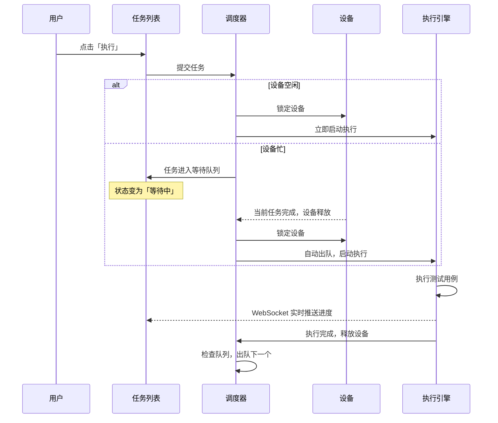
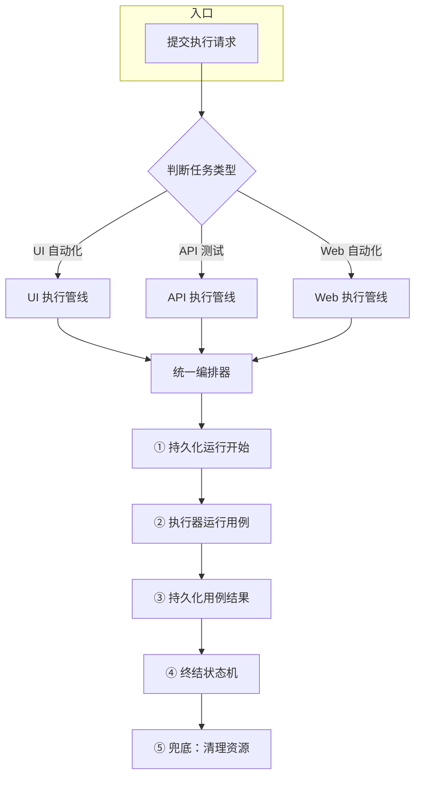
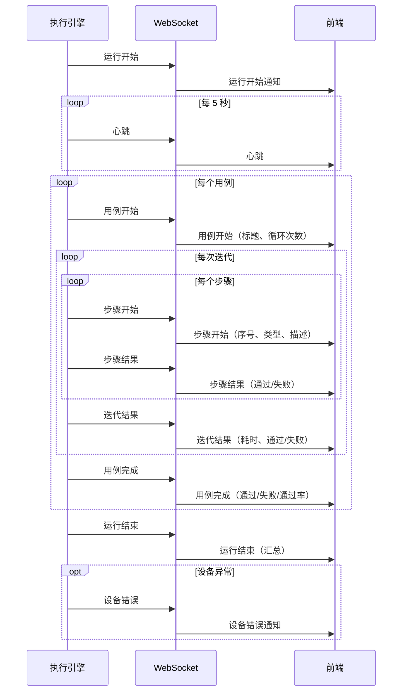

# PRD-04 — 执行引擎 · 业务功能

> 关联文档：[PRD-04-执行引擎.md](./PRD-04-执行引擎.md)（前端页面设计）
> 版本：v1.0 · 日期：2026-07-29

---

## 1. 生命周期管理

执行引擎通过**状态机**管理每张任务卡片从创建到终结的完整生命周期。状态机是唯一真相源——所有状态变更必须经过它，确保数据一致性和可追溯性。

### 1.1 业务全流程

> 从新建任务卡片到生成测试报告的完整业务流程：

```mermaid
flowchart TD
    %% ═══════════════════════════════
    %% 阶段一：新建任务卡片
    %% ═══════════════════════════════
    START(["👤 用户操作：新建任务卡片"]) --> TYPE{"选择任务类型"}

    TYPE -->|"Android UI 自动化"| ANDROID["📱 配置 UI 任务"]
    TYPE -->|"API 测试"| API["🔗 配置 API 任务"]
    TYPE -->|"Web 自动化"| WEB["🌐 配置 Web 任务"]

    ANDROID --> ANDROID_DEVICE["选择目标设备<br/>（从在线设备列表选取）"]
    ANDROID_DEVICE --> ANDROID_CASES["选择 UI 测试用例<br/>（支持多选）"]

    API --> API_CASES["选择 API 测试用例<br/>（无需设备，支持多选）"]

    WEB --> WEB_CASES["选择 Web 测试用例<br/>（无需设备，支持多选）"]

    ANDROID_CASES --> CONFIG["⚙ 公共配置"]
    API_CASES --> CONFIG
    WEB_CASES --> CONFIG

    CONFIG --> CONFIG_DETAIL["设置循环次数（默认 1 次）<br/>设置轮间间隔（默认 5 秒）"]

    %% ═══════════════════════════════
    %% 阶段二：选择执行方式
    %% ═══════════════════════════════
    CONFIG_DETAIL --> EXEC_MODE{"选择执行方式"}

    EXEC_MODE -->|"▶ 立即执行"| IMMEDIATE["提交立即执行"]
    EXEC_MODE -->|"⏰ 定时执行"| SCHEDULED["设置启动时间与截止时间"]

    %% 立即执行分支
    IMMEDIATE --> CHECK_TYPE_IMM{"任务类型？"}
    CHECK_TYPE_IMM -->|"Android UI"| CHECK_DEVICE{"目标设备是否空闲？"}
    CHECK_TYPE_IMM -->|"API / Web"| DIRECT_RUN["直接分配调度器槽位<br/>（无需设备）"]

    CHECK_DEVICE -->|"空闲"| LOCK_DEVICE["锁定设备<br/>任务状态 → 执行中"]
    CHECK_DEVICE -->|"正忙"| ENQUEUE["进入设备等待队列<br/>任务状态 → 等待中"]
    ENQUEUE --> WAIT_QUEUE["排队等待…"]
    WAIT_QUEUE -->|"前一个任务完成<br/>设备释放"| DEQUEUE["自动出队"]
    DEQUEUE --> LOCK_DEVICE

    %% 定时执行分支
    SCHEDULED --> WAIT_START["等待到达启动时间<br/>（最长 24 小时）"]
    WAIT_START -->|"到达启动时间"| CHECK_TYPE_SCH{"任务类型？"}
    CHECK_TYPE_SCH -->|"Android UI"| CHECK_DEVICE_SCH{"目标设备是否空闲？"}
    CHECK_TYPE_SCH -->|"API / Web"| DIRECT_RUN_SCH["直接分配调度器槽位"]

    CHECK_DEVICE_SCH -->|"空闲"| LOCK_DEVICE_SCH["锁定设备<br/>任务状态 → 执行中"]
    CHECK_DEVICE_SCH -->|"正忙"| ENQUEUE_SCH["进入设备等待队列"]
    ENQUEUE_SCH --> WAIT_QUEUE_SCH["排队等待…"]
    WAIT_QUEUE_SCH -->|"前一个任务完成"| DEQUEUE_SCH["自动出队"]
    DEQUEUE_SCH --> LOCK_DEVICE_SCH

    %% 汇聚到执行阶段
    LOCK_DEVICE --> EXECUTE
    DIRECT_RUN --> EXECUTE
    LOCK_DEVICE_SCH --> EXECUTE
    DIRECT_RUN_SCH --> EXECUTE

    %% ═══════════════════════════════
    %% 阶段三：执行测试用例
    %% ═══════════════════════════════
    EXECUTE["🚀 开始执行"] --> CREATE_RECORD["创建运行记录<br/>（冻结用例快照）"]

    CREATE_RECORD --> LOOP_CASES["逐用例执行"]

    subgraph CASE_LOOP["每个用例的执行过程"]
        ITER_START["进入用例迭代"] --> EXEC_STEP["逐步骤执行"]
        EXEC_STEP --> WS_PUSH[("📡 WebSocket<br/>实时推送进度")]
        EXEC_STEP -->|"步骤失败"| CHECK_RETRY{"是否设备崩溃？"}
        CHECK_RETRY -->|"是"| RETRY["重连设备<br/>重试当前迭代<br/>（最多 3 次）"]
        RETRY -->|"恢复成功"| EXEC_STEP
        RETRY -->|"3 次仍失败"| FATAL["标记致命错误<br/>停止整个任务"]
        CHECK_RETRY -->|"否"| RECORD_FAIL["记录失败步骤"]
        RECORD_FAIL --> NEXT_STEP{"还有步骤？"}
        EXEC_STEP -->|"步骤通过"| NEXT_STEP
        NEXT_STEP -->|"有"| EXEC_STEP
        NEXT_STEP -->|"无"| ITER_END["迭代结束<br/>记录本轮结果"]
        ITER_END -->|"还有迭代？"| ITER_START
        ITER_END -->|"迭代全部完成"| CASE_DONE["用例完成<br/>汇总通过率"]
    end

    LOOP_CASES --> CASE_LOOP
    CASE_LOOP -->|"还有用例？"| LOOP_CASES
    CASE_LOOP -->|"全部用例完成"| FINISH_EXEC["执行结束"]

    %% 中途停止
    LOOP_CASES -.->|"⏹ 用户点击停止"| STOP_MID["当前迭代完成后停止"]
    STOP_MID --> FINISH_EXEC

    FATAL --> FINISH_EXEC

    %% ═══════════════════════════════
    %% 阶段四：结果处理
    %% ═══════════════════════════════
    FINISH_EXEC --> RESULT_TYPE{"执行结果类型"}

    RESULT_TYPE -->|"正常完成"| DONE_OK["✅ 已完成<br/>（正常结束）"]
    RESULT_TYPE -->|"手动停止"| DONE_STOP["⏹ 已完成<br/>（手动停止）"]
    RESULT_TYPE -->|"服务中断"| DONE_INT["⚡ 已完成<br/>（服务中断）<br/>下次启动自动修复"]
    RESULT_TYPE -->|"致命错误"| DONE_ERR["❌ 已完成<br/>（执行错误）"]

    DONE_OK --> RELEASE["释放设备 / 出队下一个"]
    DONE_STOP --> RELEASE
    DONE_INT --> RELEASE
    DONE_ERR --> RELEASE

    RELEASE --> GEN_REPORT["📊 生成测试报告"]

    %% ═══════════════════════════════
    %% 阶段五：测试报告
    %% ═══════════════════════════════
    GEN_REPORT --> REPORT_CONTENT["报告内容：<br/>• 运行汇总（总用例数 / 通过率）<br/>• 每用例迭代明细<br/>• 每步骤执行结果<br/>• Web 用例含标注截图<br/>• 失败步骤详情<br/>• 执行日志"]

    REPORT_CONTENT --> USER_ACTION{"用户后续操作"}

    USER_ACTION -->|"📊 查看报告详情"| REPORT_PAGE["跳转测试报告页<br/>按任务查看 / 按运行查看"]
    USER_ACTION -->|"🔄 重跑"| CONFIG
    USER_ACTION -->|"🗑 删除任务"| DEL(["任务删除"])

    %% ═══════════════════════════════
    %% 样式
    %% ═══════════════════════════════
    style START fill:#f5f5f5,stroke:#999,stroke-dash: 2px
    style TYPE fill:#fff3e0,stroke:#ff9800
    style ANDROID fill:#e8f5e9,stroke:#4caf50
    style API fill:#e3f2fd,stroke:#2196f3
    style WEB fill:#fce4ec,stroke:#e91e63
    style EXEC_MODE fill:#fff3e0,stroke:#ff9800
    style EXECUTE fill:#fff3e0,stroke:#ff9800,stroke-width:3px
    style GEN_REPORT fill:#e8f5e9,stroke:#4caf50,stroke-width:3px
    style REPORT_PAGE fill:#e3f2fd,stroke:#2196f3
    style DONE_OK fill:#e8f5e9,stroke:#4caf50
    style DONE_STOP fill:#fce4ec,stroke:#e91e63
    style DONE_INT fill:#f3e5f5,stroke:#9c27b0
    style DONE_ERR fill:#fbe9e7,stroke:#ff5722
    style DEL fill:#f5f5f5,stroke:#bbb
```



### 1.2 流程解读

整个流程分为五个阶段：

#### 阶段一：新建任务卡片（配置）

1. 用户点击「新建任务」，填写任务名称
2. 选择任务类型，系统根据类型引导后续配置：

| 任务类型 | 是否需要设备 | 用例来源 |
|----------|:---:|------|
| Android UI 自动化 | ✅ 必选（从在线设备列表选） | UI 用例库 |
| API 测试 | ❌ 无需设备 | API 用例库 |
| Web 自动化 | ❌ 无需设备 | Web 用例库 |

3. 选择测试用例（按任务类型过滤，支持多选）
4. 设置公共参数：循环次数（1~10000）、轮间间隔（≥5 秒）

#### 阶段二：选择执行方式（调度）

| 执行方式 | 行为 | 设备调度规则 |
|----------|------|-------------|
| **立即执行** | 提交后立刻运行 | Android：设备空闲 → 直接锁定执行；设备忙 → 进入等待队列，前一个任务完成后自动出队<br/>API/Web：直接分配调度器槽位 |
| **定时执行** | 设置启动时间和截止时间，到时自动启动 | 到达启动时间后，调度规则同立即执行；截止时间到达后自动停止 |

**调度器并发上限**：每台 Android 设备同时只跑 1 个任务，API 最多 10 个并发，Web 最多 3 个并发。

#### 阶段三：执行测试用例

1. 开始执行时自动创建运行记录，冻结用例步骤快照
2. 逐用例、逐迭代、逐步骤执行
3. 每个步骤通过 WebSocket 向任务详情页实时推送进度
4. 设备崩溃时自动重连并重试当前迭代（最多 3 次），不可恢复则停止
5. 用户可随时点击「停止」，当前迭代完成后结束

#### 阶段四：结果处理

执行结束后，根据结果类型进入对应终态：

| 结果 | 触发条件 | 后续动作 |
|------|----------|----------|
| 正常结束 | 全部用例执行完毕 | 释放设备 → 出队下一个 → 生成报告 |
| 手动停止 | 用户点击停止 | 释放设备 → 出队下一个 → 生成报告 |
| 服务中断 | 服务器重启 / 进程崩溃 | 启动时自动修复，释放设备，生成报告 |
| 执行错误 | 设备断连 / 前置检查失败 | 释放设备 → 出队下一个 → 生成报告 |

#### 阶段五：生成测试报告

无论哪种结果，执行结束后都会自动生成测试报告，包含：
- 运行汇总（总用例数、通过率）
- 每用例迭代明细（通过/失败/耗时）
- 每步骤执行结果（Web 用例含标注截图）
- 失败步骤详情和错误原因
- 完整执行日志

用户可以从任务详情页点击「查看报告」跳转到报告页面，也可以点击「重跑」基于相同配置重新执行。

### 1.3 任务状态

任务卡片在流程中共有 4 种状态，由状态机统一管理：

| 状态 | 含义 | 对应流程阶段 | 可执行操作 |
|------|------|:---:|------------|
| 未执行 | 任务卡片刚创建，尚未提交执行 | 阶段一 | 执行、编辑、删除 |
| 等待中 | 已提交但设备忙，在队列中排队 | 阶段二 | 取消排队 |
| 执行中 | 正在执行测试用例 | 阶段三 | 停止 |
| 已完成 | 终态，不可再变更 | 阶段四/五 | 查看报告、重跑 |

### 1.4 状态转移规则

以下转移规则由状态机强制执行，任何非法转移都会抛异常并回滚：

| 起点 | → | 终点 | 触发操作 | 说明 |
|------|:--:|------|----------|------|
| 未执行 | → | 等待中 | 入队 | 提交执行时设备忙 |
| 等待中 | → | 执行中 | 出队 | 设备释放，自动出队 + 创建运行记录 |
| 等待中 | → | 未执行 | 取消 | 用户取消排队 |
| 执行中 | → | 已完成 | 正常完成 | 全部用例执行完毕 |
| 执行中 | → | 已完成 | 手动停止 | 用户点击停止 |
| 执行中 | → | 已完成 | 服务中断 | 服务器重启恢复 |
| 执行中 | → | 已完成 | 执行错误 | 设备断连等致命错误 |
| 任一已完成 | → | ❌ | — | 终态禁止任何转移 |

> **幂等设计**：重复执行同一转移是安全的（如对已等待中的任务再次入队不会报错）。所有状态变更在数据库事务中完成，配合行级锁防止并发冲突。

---

## 2. 任务调度 — 从新建到报告

### 2.1 新建任务

用户通过「新建任务」弹窗创建任务，需要配置以下参数：

| 参数 | 说明 | 约束 |
|------|------|------|
| 任务名称 | 便于识别的中文名称 | 最长 30 字符 |
| 任务类型 | 选择测试领域 | UI 自动化 / API 测试 / Web 自动化 |
| 目标设备 | 选择执行设备 | UI 类型必选；API/Web 无需设备 |
| 测试用例 | 选择要执行的用例（多选） | 至少 1 个，按任务类型过滤 |
| 循环次数 | 每个用例执行多少轮 | 1 ~ 10000 |
| 轮间间隔 | 两轮之间的等待时间 | 5 ~ 300 秒 |
| 执行方式 | 立即执行还是定时执行 | 立即 / 定时 |

创建后任务卡片进入未执行状态，出现在任务列表中。

### 2.2 调度流程

提交执行后的完整调度链路：



### 2.3 任务详情页

点击任务列表中的任意任务，进入详情页。详情页包含 **5 个功能区**：

**① 信息卡片（顶部）**

展示任务元信息：任务名称、类型标签、目标设备、用例数量、循环次数、创建时间、当前状态。

执行中时额外显示：
- 当前正在执行的用例名称
- 当前迭代轮次
- 整体进度条（已完成 / 总数）
- 操作按钮：停止（执行中）、取消排队（等待中）、重跑（已完成）、查看报告（终态）、删除

**② 用例执行列表（中部）**

以可展开卡片展示每个用例的执行情况：
- 卡片头部：用例 ID、标题、状态（执行中/已完成/待执行）、迭代统计（通过/失败/总数）
- 当前执行的用例自动展开
- 展开后显示：当前迭代号、每一步的状态（通过/失败/执行中/待执行）、步骤类型和描述
- 每用例 APP 性能统计：各元素的等待耗时（次数/平均值/最小值/最大值/中位数）

**③ 自动化执行步骤详情（中部）**

针对每个已执行的步骤，提供完整的执行过程回溯：

- **步骤截图**：Web 自动化每个步骤自动截图，并用彩色标注框标记操作目标和结果（红色=点击、蓝色=输入、绿色=断言），左上角显示步骤序号和通过/失败状态
- **步骤信息**：展示步骤序号、步骤类型（中文名）、步骤描述、XPath 或 CSS 选择器、执行结果（通过/失败）
- **失败详情**：失败步骤高亮显示，附带错误原因和堆栈信息
- **迭代切换**：支持切换查看不同迭代轮次的步骤详情和截图
- **实时更新**：执行过程中 WebSocket 推送 `step_details` 数据，前端实时渲染最新步骤的截图和状态

> Web 自动化截图标注使用 PIL 绘图引擎，在原始截图上绘制矩形框、状态条和描述文字，方便事后回溯每一步操作的实际效果。

**④ 缺陷记录（中部）**

自动汇总执行中失败的步骤：
- 按「用例 + 迭代 + 步骤」去重，生成缺陷编号
- 显示失败步骤的类型、描述和失败原因
- 展开后展示该用例的完整步骤清单，失败步骤高亮

**⑤ 执行日志（底部）**

深色主题的实时日志面板：
- 每条日志带时间戳和级别颜色
- 执行中实时追加，自动滚屏
- 上限 1000 条，超出裁剪到 500 条
- 支持一键清空

### 2.4 测试报告关联

#### 数据关联链

```
任务卡片 (TaskCard)
  └── 运行记录 (TestRunRecord)   ← 每次执行创建一条
        └── 测试结果 (TestResult)  ← 每用例每迭代一行
```

- **任务卡片**：存储 `case_items`（每用例汇总）、`failed_steps`（失败步骤）、`overall_pass/fail`（总计数）
- **运行记录**：存储 `selected_cases`（用例快照）、`summary`（通过率汇总）、`csv_path/log_path`（导出文件）
- **测试结果**：存储每次迭代的 `result`、`duration_ms`、`step_details`（含截图路径）

#### 查看路径

```
任务详情页 → 点击「查看报告」→ /reports/task/{任务ID}
                                         │
                                  按任务查看：显示该任务所有历史运行、用例汇总、失败分析

报告列表页 → 点击某条运行记录 → /reports/{运行ID}
                                         │
                                  按运行查看：单次运行的完整报告（用例明细 + 失败详情）
```

#### 报告模块功能

| 页面 | 功能 |
|------|------|
| 报告列表（/reports） | KPI 概览卡片、每日趋势图、可筛选表格、运行时长统计 |
| 按任务查看（/reports/task/:id） | 关联运行记录列表、用例通过率、失败步骤汇总、结论 |
| 按运行查看（/reports/:runId） | 用例级明细、每迭代耗时、失败步骤详情 + 截图 |
| 用例分析（/reports/cases/:resultType） | 按通过/失败筛选用例，分层展示 |

---

## 3. 多模式执行调度

### 3.1 立即执行

提交后立即执行，是默认的执行方式。设备空闲时直接锁定并启动；设备忙时自动降级为排队执行。

### 3.2 排队执行

当目标设备正在执行其他任务时，新任务自动进入**先进先出（FIFO）内存队列**。前一个任务完成后，队列中的下一个任务自动出队执行。

**设计约束**：队列基于内存，服务重启后排队任务会丢失（已有恢复机制将 `status=queued` 的 DB 记录重新入队）。

### 3.3 定时执行

设置任务的 `start_at`（启动时间）和 `end_at`（截止时间）后：

- 系统在 `start_at` 之前一直等待（最长 24 小时）
- 到时间后自动执行与立即执行相同的流程
- `end_at` 到达时自动停止，避免无限运行
- 启动前可随时取消

### 3.4 循环执行

每个用例支持多轮迭代：

```
loop_count = 3, interval_seconds = 5

用例 A:
  迭代 1 → 等待 5s → 迭代 2 → 等待 5s → 迭代 3
  结果: 通过率 = 通过次数 / 3
```

- `loop_count`：每个用例执行多少轮（默认 1，最大 10000）
- `interval_seconds`：两轮之间的冷却时间（默认 5 秒，最小 5 秒）
- 任一迭代失败不阻断后续迭代（除非设备崩溃不可恢复）
- 每轮结果单独记录到 TestResult

### 3.5 单步调试

独立于任务系统的轻量执行模式：

- 对当前激活的调试设备**执行单个步骤**
- 返回通过/失败 + 日志输出
- **不入库**：不创建任务卡片、不生成运行记录
- 用途：用例编写时快速验证某个步骤是否可行

### 3.6 并行多设备

一次提交可指定多个设备序列号，每个设备**独立**启动一个执行实例：

```
POST /api/runner/run { device_serials: ["A", "B", "C"], case_ids: [...] }

设备 A: 独立执行全部用例（loop_count=3）
设备 B: 独立执行全部用例（loop_count=3）
设备 C: 独立执行全部用例（loop_count=3）
```

### 3.7 统一调度器（TREP v1.0）

三种调度器通过 `SchedulerRegistry` 统一管理：

| 调度器 | 最大并发 | 适用场景 |
|--------|:---:|------|
| DeviceScheduler | 1 / 台 | UI 自动化（每台物理设备串行执行） |
| ApiScheduler | 10 | API 测试（无设备依赖，可高并发） |
| WebScheduler | 3 | Web 自动化（浏览器实例资源受限） |

调度器生命周期：`提交 → 获取信号量 → 构建执行器 → 执行 → 兜底释放信号量 → 检查队列出队下一个`

---

## 4. 三域测试执行

执行引擎支持三种测试领域，共享同一个编排器（`_execute_tests`），但各自有独立的适配器和步骤执行器。



### 4.1 UI 自动化

**目标**：Android 真机 / 模拟器

**技术栈**：ADB（设备通信） + uiautomator2（元素定位与操控） + Airtest（手势与截图）

#### 前置检查

执行前自动完成以下检查，任一失败则终止：

1. 设备状态查询（设备池确认在线）
2. ADB 连接（WiFi 设备自动 `adb connect`）
3. Airtest 设备初始化
4. uiautomator2 连接（HTTP 超时 20 秒）
5. 显示信息验证（`display_info` 探测）

#### 步骤类型（24 种）

| 类别 | 步骤 | 说明 |
|------|------|------|
| **点击** | `click`、`long_click`、`click_indexed` | XPath 定位点击 / 长按 / 按序号点击 |
| **滑动** | `swipe` | 上下左右滑动手势（可配像素距离） |
| **等待** | `wait`、`wait_disappear`、`sleep` | 等待元素出现 / 消失 / 固定时长 |
| **断言** | `verify_text`、`poll_text` | 校验元素文本 / 轮询等待文本匹配 |
| **应用控制** | `start_app`、`kill_app` | 启动 / 强杀应用（支持多种 kill 策略） |
| **性能** | `perf_element_time` | 测量元素出现耗时，记录到性能统计 |
| **Toast** | `wait_toast` | 双重检测：XPath + u2 Toast API |
| **分支** | `if_element_appear`、`if_element_disappear` | 条件判断，子步骤递归执行 |
| **循环** | `loop_n`、`loop_elements` | 固定次数循环 / 遍历 XPath 列表点击 |
| **工具** | `log`、`screenshot` | 输出日志 / 截图 |

#### 特有功能

- **弹窗监听**：用例可声明弹窗规则（XPath + 点击动作），每步执行前自动检查并关闭
- **设备崩溃重试**：检测到 u2 或 ADB 连接断开时，自动重连并重试当前迭代（最多 3 次），详见第 6 章

### 4.2 API 测试

**目标**：HTTP/HTTPS 端点，无需物理设备

**技术栈**：Python `requests` 库 + JSONPath + curl 诊断

#### 步骤类型（4 种）

| 步骤 | 说明 |
|------|------|
| `api_request` | 发送 HTTP 请求，支持 GET/POST/PUT/DELETE 等，自动设置 JSON Content-Type |
| `api_assert` | 验证响应：状态码 / JSONPath 字段值 / 响应时间 / 包含关系 / 大小比较 |
| `api_sleep` | 可中断的固定等待 |
| `api_log` | 输出日志信息 |

#### 特有功能

**变量传递链**：上游接口的响应数据可提取为变量，供下游步骤使用。

```
步骤1: POST /login → $extract: { "token": "$.data.token" }
步骤2: GET /user/info  → Header: { "Authorization": "Bearer {{token}}" }
```

- `$extract`：从响应 JSON 或 Header 中提取值存入变量池
- `{{变量名}}`：在请求 URL / Header / Body 中自动替换为变量值
- 支持嵌套 JSONPath（如 `$.data.user.id`）和数组索引（如 `$.items.0.name`）

**数据驱动**：通过 `extra_data._rows` 传入多行数据，每行自动替换 `{{列名}}` 占位符并执行一次，支持输入列和验证列分离。

**curl 诊断**：每次请求自动生成等效 curl 命令，方便人工复现和调试。

### 4.3 Web 自动化

**目标**：浏览器端（支持 SPA、传统 Web 页面）

**技术栈**：Playwright + headless Chromium + PIL 截图标注

#### 步骤类型（8 种）

| 步骤 | 说明 |
|------|------|
| `web_navigate` | 导航到指定 URL |
| `web_click` | 点击 CSS 选择器/XPath 定位的元素 |
| `web_fill` / `web_type` | 向输入框填入文本 |
| `web_wait` / `wait` / `sleep` | 等待选择器出现 / 固定时长 |
| `web_assert` | 验证页面包含指定文本 |
| `web_screenshot` / `screenshot` | 对当前页面截图 |

#### 特有功能

**每步自动截图标注**：

每次关键操作（点击、输入、断言）后自动截取全页面截图，并用 PIL 标注：
- 🔴 红色矩形框：点击目标元素
- 🔵 蓝色矩形框：输入目标元素
- 🟢 绿色全页边框：断言步骤
- 左上角状态条：步骤序号 + 类型缩写 + PASS/FAIL
- 底部信息条：步骤描述
- 失败时叠加红色横幅显示错误信息

标注截图用于事后回溯每一步操作的效果，是 Web 测试的核心调试手段。

**期望结果验证**：用例可声明 `expected_result`，全部步骤执行完毕后自动检查页面是否包含期望文本。

**用例间页面隔离**：每个用例执行前自动创建新页面（清除 cookie/storage），防止前一用例的状态污染后续用例。

---

## 5. 实时监控 & WebSocket 推送

### 5.1 HTTP 监控端点

| 端点 | 用途 | 返回内容 |
|------|------|----------|
| `GET /api/runner/active` | 列出所有活跃运行 | 运行 ID、任务 ID、状态、设备信息、进度 |
| `GET /api/runner/monitor/:run_id` | 单任务实时状态 | 状态、设备分辨率/SDK/电池、最近 50 条日志 |
| `GET /api/runner/run/:run_id/snapshot` | 用例级进度快照 | 每用例的通过/失败/执行中状态 |
| `GET /api/runner/run/:run_id/status` | 运行状态（含历史） | 优先查实时，已结束则查 DB |

这些端点作为 **WebSocket 的兜底**——当 WebSocket 断连时，前端降级到 HTTP 轮询获取状态。

### 5.2 WebSocket 实时推送

#### 连接方式

```
ws://host/ws/test-run/{任务ID}?token={JWT}
```

前端通过 Vite 代理连接，不直连后端端口。

#### 事件类型（10 种）



| 事件名称 | 触发时机 | 携带的关键信息 |
|----------|----------|----------------|
| **日志** | 执行过程中任意日志输出 | 日志文本 |
| **心跳** | 每 5 秒 | — |
| **运行开始** | 前置检查通过，正式开始执行 | — |
| **用例开始** | 每个用例开始执行 | 用例编号、用例标题、循环次数 |
| **步骤开始** | 每个步骤开始执行 | 步骤序号、总步骤数、步骤类型、步骤描述 |
| **步骤结果** | 每个步骤执行完毕 | 步骤序号、结果（通过/失败）、错误信息 |
| **迭代结果** | 当前迭代完成 | 迭代序号、结果、耗时（毫秒） |
| **用例完成** | 用例全部迭代结束 | 通过数、失败数、通过率 |
| **运行结束** | 全部用例执行完毕或停止 | 汇总数据、日志文件路径 |
| **设备错误** | 设备连接异常或崩溃 | 错误描述 |

#### 可靠性机制

| 机制 | 说明 |
|------|------|
| **序号追踪** | 每条消息带 `seq` 单调递增号，前端检测 gap（如 3→7 缺失 3 条）触发重同步 |
| **心跳检测** | 每 5 秒发送心跳；前端超过 15 秒未收到心跳 → 显示「连接已断开」 |
| **自动重连** | 前端断连后指数退避重连（1s → 2s → 4s → 8s → 16s），最多 5 次 |
| **慢客户端隔离** | 每个消费者 2 秒广播超时，超时自动移除，不阻塞其他客户端 |

### 5.3 前端实时渲染

任务详情页完全由 WebSocket 驱动：

- **进度条**：用例开始 / 迭代结果实时更新百分比
- **步骤状态**：步骤开始 → 标记为「执行中」；步骤结果 → 标记为「通过」或「失败」
- **日志面板**：日志事件实时追加，自动滚屏
- **用例卡片**：用例开始时自动展开当前用例
- **失败步骤**：步骤结果（失败）时自动添加到缺陷记录区

---

## 6. 容错恢复体系

执行引擎内置 **6 层容错机制**，覆盖从启动到运行中到结束时可能出现的各类异常。

```mermaid
flowchart TB
    subgraph 第一层：启动恢复
        A1[孤儿任务卡片] --> FIX1[标记服务中断]
        A2[僵尸运行记录] --> FIX2[标记失败]
        A3[被占用设备] --> FIX3[释放回在线状态]
        A4[排队任务] --> FIX4[重建内存队列]
    end

    subgraph 第二层：运行时恢复
        B[惰性检测] --> B1[进程内保护]
        B --> B2[跨进程 2 分钟窗口保护]
        B --> B3[仅修复真正孤儿]
    end

    subgraph 第三层：设备崩溃重试
        C[检测崩溃] --> C1[设备连接/ADB 错误]
        C1 --> C2[等待 2 秒重连]
        C2 --> C3[重建适配器和执行器]
        C3 --> C4[重试当前迭代]
        C4 -->|最多 3 次| C1
        C4 -->|3 次后仍失败| C5[标记致命错误, 停止任务]
    end

    subgraph 第四层：设备释放保障
        D[兜底清理块] --> D1[释放设备锁]
        D --> D2[出队下一个任务]
    end

    subgraph 第五层：数据库连接恢复
        E[过期连接] --> E1[自动关闭]
        E1 --> E2[3 次退避重试]
    end

    subgraph 第六层：跨用例隔离
        F[Web 用例间] --> F1[重置状态，新建页面]
        F1 --> F2[清除缓存和存储]
    end
```

### 6.1 启动恢复

服务启动时（仅在 ASGI Daphne 进程中执行）：

| 修复目标 | 检测方式 | 处理 |
|----------|----------|------|
| 孤儿任务卡片 | 状态为执行中且无活跃进程 | 标记已完成（服务中断），关联运行记录标停止 |
| 僵尸运行记录 | 状态为运行中 + 结束时间为空 + 无活跃任务 | 标记失败 |
| 被占用设备 | 占用标记指向已崩溃进程 | 释放设备回在线状态，清除占用标记 |
| 排队任务 | 状态为等待中 | 按创建时间排序重新入队，去重后触发出队 |

### 6.2 运行时恢复（惰性）

在 `GET /api/runner/active` 和 `GET /api/runner/tasks` 被调用时触发，比启动恢复更保守：

- **进程内保护**：在 `_active_runs` 或 `_run_client_task` 中的任务一律不碰
- **跨进程保护**：运行记录创建时间在 2 分钟内的任务不碰（可能有其他进程正在执行）
- **仅修复**：真正无主且超过保护窗口的任务 → 标记 `interrupted`

使用线程锁（`threading.Lock`）防止并发恢复调用冲突。

### 6.3 设备崩溃重试

针对 UI 自动化中的设备连接断开：

```
执行迭代 → 捕获异常 → 是否为设备崩溃？
  ├── 否 → 直接标记失败
  └── 是 → 等待 2 秒 → 重连设备 → 重建适配器和执行器
           → 重试当前迭代
             ├── 成功 → 继续
             └── 仍失败 → 循环（最多 3 次）
                   └── 3 次后仍失败 → 标记致命错误 → 停止整个任务 → 推送设备错误通知
```

**崩溃检测**覆盖：
- uiautomator2 错误：`HTTPTimeoutError`、`ConnectError`、`SessionBrokenError` 等
- Airtest 错误：`AdbError`、`MinicapError`、`MinitouchError` 等
- 异常消息关键词扫描

### 6.4 设备释放保障

无论执行成功、失败、异常还是被手动停止，设备一定会释放：

```
执行主流程（尝试）
  └── 异常时：尽力标记失败
  └── 兜底（必定执行）：清理设备（释放设备 + 出队下一个任务）
```

### 6.5 跨用例隔离（Web）

Web 自动化中每个用例执行前自动调用 `reset_state()`：
- 关闭旧页面，创建全新页面
- 自动清除 cookies、localStorage、sessionStorage
- 防止前一用例的登录态、缓存、DOM 状态污染后续用例

### 6.6 数据库连接恢复

自定义的 `sync_to_async` 包装器：
- 检测到数据库连接过期 → 自动关闭旧连接
- 重试 3 次，指数退避
- 使用**独立线程池**（`_device_executor`），与 Django 的 `sync_to_async` 线程池隔离，防止死锁

---

## 附录 A：容错机制总览

| 层级 | 场景 | 策略 | 恢复粒度 |
|:---:|------|------|:---:|
| 1 | 服务重启 | 扫描 DB 修复孤儿状态 + 重建队列 | 全局 |
| 2 | 运行时 | 惰性检测 + 时间窗口保护 | 单任务 |
| 3 | 设备崩溃 | 检测 → 重连 → 重建 → 重试（最多 3 次） | 单迭代 |
| 4 | 设备释放 | 兜底清理块保证 | 单任务 |
| 5 | DB 连接过期 | 关闭 + 3 次退避重试 | 单操作 |
| 6 | Web 状态污染 | 用例间新页面 + 清除存储 | 单用例 |

## 附录 B：步骤类型总览

| 领域 | 步骤数 | 类别 |
|:---:|:---:|------|
| UI 自动化 | 24 | 点击、滑动、等待、断言、应用控制、性能、Toast、分支、循环、工具 |
| API 测试 | 4 | 请求、断言、等待、日志 |
| Web 自动化 | 8 | 导航、点击、输入、等待、断言、截图、等待、通用 |

## 附录 C：WebSocket 事件总览

| 序号 | 事件名称 | 方向 | 频率 |
|:---:|------|:---:|------|
| 1 | 日志 | 服务端→前端 | 高频（每条日志） |
| 2 | 心跳 | 服务端→前端 | 每 5 秒 |
| 3 | 运行开始 | 服务端→前端 | 每次执行 1 次 |
| 4 | 用例开始 | 服务端→前端 | 每用例 1 次 |
| 5 | 步骤开始 | 服务端→前端 | 每步骤 1 次 |
| 6 | 步骤结果 | 服务端→前端 | 每步骤 1 次 |
| 7 | 迭代结果 | 服务端→前端 | 每迭代 1 次 |
| 8 | 用例完成 | 服务端→前端 | 每用例 1 次 |
| 9 | 运行结束 | 服务端→前端 | 每次执行 1 次 |
| 10 | 设备错误 | 服务端→前端 | 异常时触发 |

---

> **关联文档**：[PRD-04-执行引擎.md](./PRD-04-执行引擎.md) · [ARCH-04-执行引擎.md](../03-架构设计/ARCH-04-执行引擎.md)（如有）
