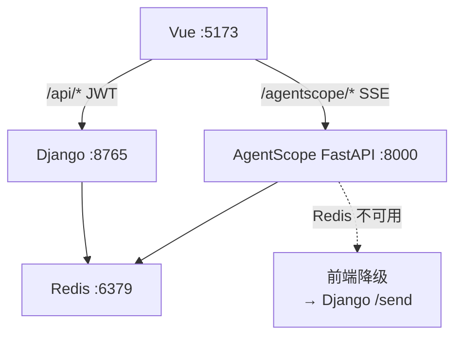

# 子PRD — AI 智能助手 (AI Assistant)

> 关联模块：`apps/ai_assistant/` · `agentscope_service/` · 前端：`frontend/src/modules/ai-assistant/`
> 关联全局：`../实际需求文档.md` · 关联架构：`../03-设计与架构/当前实现架构方案.md`
> 版本：v2.0 · 状态：已实现 · 日期：2026-07-01

---

## 1. 模块功能目标

AI 助手是平台的智能入口，承担以下核心职责：

1. **智能体配置与管理**：创建/编辑/删除 AI 智能体，配置模型提供商（百炼/OpenAI/Anthropic）、系统提示词、温度、最大 Token、记忆模式、压缩策略、MCP 工具服务器
2. **AgentScope ReAct 推理**：基于 AgentScope 2.0 的 ReAct 循环（思考→工具调用→观察→再思考），让智能体自主规划并调用平台各模块 API 完成任务
3. **多会话流式对话**：支持创建/切换/删除对话。消息通过 SSE 流式实时推送，AgentScope 不可用时自动降级到 Django 阻塞模式
4. **平台工具集成**：AgentScope `factory.py` 现网注册约 **24 个业务 Tool + 4 个 Plan 内置**（文档旧称「14」已过时），覆盖元素/用例/设备/执行/报告/RAG/PRD 导入/SOP/任务卡等
5. **知识库增强**：ChromaDB 向量库存储 32 篇项目文档，智能体在生成用例前自动检索 StepType 参考、API 文档、历史用例模板
6. **智能体编队**：Leader 智能体派发 5 种 Worker（元素检查员/用例编写员/设备操作员/测试执行员/报告撰写员）并行协作
7. **定时任务调度**：APScheduler cron 表达式驱动，支持"每天早上 8 点跑冒烟"等自动化场景

### 1.1 模块边界

```
用户 (ChatView SSE)
      │
      ▼ 自然语言 → AgentScope Agent
ai-assistant
      │
      ├─ AgentScope ReAct 循环 (思考 → Tool调用)
      │
      ├─ 14 自定义 Tool → Django ORM/API
      │     ├── element-locator (get_test_points, search_elements)
      │     ├── case-manager (save/get/list test cases)
      │     ├── device-pool (get/acquire/release devices)
      │     ├── test-runner (run/get/stop tests)
      │     └── report-generator (save/list reports)
      │
      ├─ ChromaDB 知识库 (32篇文档 · search_knowledge_base)
      │
      ├─ Agent Team (Leader + 5 Worker 模板)
      │
      └─ Django ORM (ai_agents/ai_conversations/ai_messages 持久化)
```

---

## 2. 功能清单与概述

| 编号 | 功能名称 | 优先级 | 一句话描述 |
|:--:|------|:--:|------|
| F-01 | 智能体配置管理 | P0 | 创建/编辑/删除智能体，配置 20+ 参数（模型/提示词/温度/记忆/压缩/MCP） |
| F-02 | 多会话对话 | P0 | 创建/切换/删除对话，消息持久化，审计回溯 |
| F-03 | SSE 流式对话 | P0 | AgentScope ReAct 推理 → 逐字实时推送，AgentScope 不可用时自动降级 |
| F-04 | 自然语言生成用例 | P1 | "给登录页创建冒烟用例" → 搜索元素 → 构造 14 种步骤 → 保存到 case-manager |
| F-05 | 设备查询与操控 | P1 | "查看在线设备" / "锁定设备 X" / "释放设备 Y" → AI 直接调用设备 API |
| F-06 | 测试执行控制 | P1 | "在设备 X 上跑用例 Y 循环 3 轮" → 锁定 → 执行 → 查询结果 |
| F-07 | 知识库增强检索 | P1 | ChromaDB 向量搜索 32 篇项目文档，自动注入上下文提升生成质量 |
| F-08 | 智能体编队 | P2 | Leader 派发 5 种 Worker 并行处理复杂任务 |
| F-09 | 定时任务 | P2 | cron 表达式定时触发，自动化回归/冒烟 |
| F-10 | 平台统一认证 | P0 | JWT 登录/注册/刷新/退出，Django + AgentScope 共享密钥 |
| F-11 | 动森视觉主题 | P2 | AI 模块独立风格：暖木色调、大圆角、AnimalCard/Button/Switch/Cursor/Footer |

---

## 3. 功能详细规格

---

### 3.1 F-01：智能体配置管理

#### 3.1.1 需求定义

提供智能体的完整生命周期管理。用户通过 5 步表单向导创建/编辑智能体，配置模型、提示词、记忆、MCP 工具、压缩策略。

#### 3.1.2 需求目标

| 目标 | 衡量方式 | 目标值 |
|------|----------|:--:|
| 模型提供商覆盖 | 支持的 provider 数量 | ≥3（百炼/OpenAI/Anthropic） |
| 配置字段完整性 | 可配置参数项 | ≥20 项 |
| 创建耗时 | 表单提交 → 可用 | ≤1s |

#### 3.1.3 配置项清单

| 步骤 | 配置项 | 类型 | 默认值 |
|:--:|------|------|------|
| 1-基本信息 | 名称、头像（上传/Emoji）、标签、描述 | string | — |
| 2-模型配置 | 模型服务(下拉)、模型名称、API Key、API 地址(自定义)、温度(滑块)、最大Token、Formatter | string/float/int | dashscope/qwen-max/0.7/4096 |
| 3-提示词 | 系统提示词(多行)、最大迭代次数、并行工具调用(开关)、打印提示消息(开关) | string/int/bool | 10/False/False |
| 4-记忆工具 | 记忆模式(短期/长期)、长期记忆模式、元工具(开关)、重写查询(开关)、MCP 服务器列表 | select/bool/array | inmemory |
| 5-高级 | TTS 语音(开关)、压缩启用(开关)、压缩阈值、保留最近 N 条、压缩提示词、摘要模板 | bool/int/string | False |

#### 3.1.4 MCP 服务器配置

每台 MCP 服务器支持三种传输方式：

| 传输方式 | 配置项 |
|---------|--------|
| stdio 本地 | 命令、参数、工作目录 |
| SSE 远程 | URL、有状态/无状态 |
| HTTP 远程 | URL、有状态/无状态 |

每台额外支持 Key-Value 环境变量和请求头配置。

---

### 3.2 F-02：多会话对话

#### 3.2.1 需求定义

一个智能体可拥有多个独立的对话会话。左侧边栏列出全部会话，点击切换。对话自动命名（取首条消息前 30 字）。消息持久化存储，支持完整审计回溯。

#### 3.2.2 需求目标

| 目标 | 衡量方式 | 目标值 |
|------|----------|:--:|
| 会话创建 | POST → 侧边栏即时出现 | ≤200ms |
| 消息加载 | 历史消息全部展示 | 不限量 |
| 审计完整性 | Django Admin 可见全部消息 | 100% |

---

### 3.3 F-03：SSE 流式对话

#### 3.3.1 需求定义

用户输入消息后，前端发起 SSE 连接到 AgentScope `/agentscope/chat`，响应逐字实时展示。当 AgentScope 不可用（Redis 未启动）时，自动降级到 Django `/api/ai/conversations/{id}/send` 阻塞模式。

#### 3.3.2 需求目标

| 目标 | 衡量方式 | 目标值 |
|------|----------|:--:|
| 首字延迟 | 发送 → 第一个 token 到达 | ≤3s |
| 降级切换 | AgentScope 不可用 → 自动切换 | ≤1s |
| 消息回存 | SSE 完成 → Django AIMessage 保存 | 100% |

#### 3.3.3 ReAct 调用链（以"生成用例"为例）

```
用户: "给登录页创建冒烟用例"
  │
  ▼ SSE
AgentScope Agent
  │
  ├─ [思考] 需要登录页有哪些可交互元素
  ├─ [Tool] search_elements("登录页")
  ├─ [观察] 返回: Button('登录') EditText('username') TextView('忘记密码')
  │
  ├─ [思考] 构造 3 步冒烟流程
  ├─ [Tool] save_test_case(case_id="uuid-xxx", title="登录冒烟测试", steps=[
  │     {type:"click", xpath:"//EditText[@resource-id='username']", description:"点击用户名框"},
  │     {type:"click", xpath:"//Button[@text='登录']", description:"点击登录按钮"},
  │     {type:"wait", xpath:"//TextView[@text='首页']", timeout:10, description:"等待首页加载"}
  │   ])
  ├─ [观察] 返回: "Test case '登录冒烟测试' saved successfully. id=uuid-xxx"
  │
  └─ [回复] "已创建登录冒烟用例（3 步），ID: uuid-xxx"
```

---

### 3.4 F-04：自然语言生成用例

#### 3.4.1 需求定义

用户通过自然语言描述测试场景，智能体自动完成：搜索元素 → 选择合适的 XPath → 构造 14 种步骤类型 → 调用 `save_test_case` 保存。生成的用例立即可在 case-manager 列表中看到，可直接执行。

#### 3.4.2 验收标准

- 输入"给 XX 页面创建冒烟用例"，智能体应自动搜索该页面元素
- 生成的步骤 type 必须是 14 种之一，xpath 不为空
- 用例保存后可在 `/cases` 页面看到
- 用例可直接在 test-runner 中选择执行

---

### 3.5 F-05：设备查询与操控

#### 3.5.1 需求定义

智能体可直接操作设备池：列出在线设备、锁定指定设备、释放设备。

#### 3.5.2 验收标准

| 输入 | 预期行为 |
|------|---------|
| "查看在线设备" | 调用 `get_online_devices` → 返回设备列表 |
| "锁定设备 RF8N21MSW7A" | 调用 `acquire_device("RF8N21MSW7A")` → 返回锁定确认 |
| "释放设备 RF8N21MSW7A" | 调用 `release_device("RF8N21MSW7A")` → 返回释放确认 |

---

### 3.6 F-06：测试执行控制

#### 3.6.1 需求定义

智能体编排完整的测试执行流程：锁定设备 → 执行指定用例 → 监控结果 → 生成报告。支持循环执行。

#### 3.6.2 验收标准

| 输入 | 预期行为 |
|------|---------|
| "在设备 X 上跑用例 Y" | ①acquire_device(X) → ②run_test(Y) → ③get_run_results → ④返回摘要 |
| "循环跑 3 轮" | run_test 传入 loop_count=3 |
| "生成本次报告" | save_report → 返回报告路径 |

---

### 3.7 F-07：知识库增强检索

#### 3.7.1 需求定义

智能体调用 `search_knowledge_base` 工具，在 ChromaDB 向量库中搜索项目文档，自动注入上下文。文档来源：

- `dev_docs/` 下全部 Markdown 文件
- 自动生成的 14 种 StepType 参考文档
- 架构方案和 API 文档

#### 3.7.2 验收标准

- 输入"怎么创建用例步骤"，智能体应首先调用 `search_knowledge_base` 检索 StepType 参考
- 回复中应引用项目文档的具体内容
- 32 篇文档可在 Django shell 中通过 `load_all_documents()` 验证

---

### 3.8 F-08：智能体编队 (Agent Team)

#### 3.8.1 需求定义

当任务复杂度超出单一智能体能力时，Leader 智能体自动派发 Worker 并行处理。5 种 Worker 类型：

| Worker | 持有工具 | 职责 |
|--------|---------|------|
| `element-inspector` | get_test_points, search_elements | 检查页面可测元素 |
| `case-writer` | save_test_case, get_test_case, search_elements | 编写测试用例 |
| `device-operator` | get_online_devices, acquire_device, release_device | 管理设备池 |
| `test-executor` | run_test, get_run_results | 执行用例并监控 |
| `report-writer` | get_run_results, save_report | 生成报告 |

#### 3.8.2 验收标准

- Leader 接到"给登录页生成用例并跑一轮"后，日志可见 spawn 了 case-writer、device-operator、test-executor
- 各 Worker 结果由 Leader 汇总后返回完整摘要

---

### 3.9 F-09：定时任务 (Cron Schedule)

#### 3.9.1 需求定义

用户可通过智能体对话创建定时任务，或通过 AgentScope API 直接注册 cron 表达式。APScheduler 负责触发。

#### 3.9.2 验收标准

- AgentScope Agent Service 启动后，SchedulerManager 恢复持久化任务
- Cron 触发时自动向目标会话推送执行结果
- 任务跨服务重启保留

---

### 3.10 F-10：平台统一认证

#### 3.10.1 需求定义

整个平台（含 AI 助手）使用统一登录页。JWT HS256 签名，Django 与 AgentScope FastAPI 共享 `SECRET_KEY`。

#### 3.10.2 验收标准

| 场景 | 预期 |
|------|------|
| 无 token 访问任意页面 | 自动跳转 `/login` |
| 登录成功 | 跳转 `/dashboard` |
| token 过期 | 自动用 refresh_token 刷新 |
| 刷新失败 | 跳转 `/login` |
| 点击退出 | 清除 token → 跳转 `/login` |

#### 3.10.3 端点

| URL | 方法 | 说明 |
|-----|------|------|
| `/api/ai/auth/login` | POST | 登录 → access + refresh token |
| `/api/ai/auth/register` | POST | 注册新用户 |
| `/api/ai/auth/refresh` | POST | 刷新 access token |
| `/api/ai/auth/logout` | POST | 退出（黑名单） |
| `/api/ai/auth/me` | GET | 当前用户信息 |

---

### 3.11 F-11：动森视觉主题

#### 3.11.1 需求定义

AI 助手模块使用 animal-island-vue 组件库，与业务模块（Element Plus 蓝白）形成视觉隔离：

#### 3.11.2 主题对照

| 元素 | 业务模块（Element Plus） | AI 模块（animal-island-vue） |
|------|------------------------|------------------------------|
| 主色调 | 蓝色系 `#409EFF` | 青绿暖木 `#19c8b9` / `#8B7355` |
| 按钮 | `el-button` 直角 | `AnimalButton` 圆角木纹 |
| 卡片 | `el-card` 白底阴影 | `AnimalCard` 羊皮纸纹理 |
| 开关 | `el-switch` | `AnimalSwitch` |
| 输入框 | `el-input` 方角 | `AnimalInput` 柔和大圆角 |
| 鼠标 | 系统默认 | `Cursor` 自定义动画光标 |
| 页脚 | 无 | `Footer type="tree"` |
| 字体 | Inter / Quicksand | Nunito / Noto Sans SC |

#### 3.11.3 生效范围

- `LoginView.vue` — 登录页（AnimalCard / Button / Input / Title / Icon）
- `index.vue` — 智能体列表（AnimalCard / Button）
- `AgentDetail.vue` — 智能体配置（AnimalButton / Switch / Divider）
- `ChatView.vue` — 聊天界面（AnimalButton）
- `App.vue` — 全局 Cursor + Footer

---

## 4. 数据模型

| 表 | 字段 | 说明 |
|----|------|------|
| `ai_agents` | name, avatar, tags, description, model_provider, model_name, api_key, base_url, system_prompt, temperature, max_tokens, formatter, max_iters, parallel_tool_calls, memory_mode, long_term_memory_mode, enable_meta_tool, enable_rewrite_query, compression_enabled/threshold/keep_recent/prompt/template, tts_enabled, status | 智能体配置 |
| `ai_tools` | agent(FK), name, tool_type(mcp), config_json, enabled | MCP 工具 |
| `ai_conversations` | agent(FK), title, status | 对话会话 |
| `ai_messages` | conversation(FK), role(user/assistant), content, tool_calls, tokens | 对话消息 |
| `ai_tasks` | agent(FK), title, description, status, result, scheduled_at/started_at/finished_at | 智能体任务 |
| `ai_execution_logs` | agent(FK), task(FK), level, message, metadata | 执行日志 |

---

## 5. AgentScope 工具清单（现网摘要）

> **真相来源**：`agentscope_service/tools/factory.py`。下列为核心子集；完整约 24 业务 + TaskCreate/Get/List/Update。全功能规格见 `html/子PRD-06-ai-assistant-全功能需求.html`。

| 工具名称 | 对应模块 | 只读 | 描述 |
|---------|---------|:--:|------|
| `get_test_points` / `search_elements` / `fetch_page_elements` | element-locator | ✅ | 测试点与元素搜索 |
| `save_test_case` / `get_test_case` / `list_test_cases` / `debug_test_case` | case-manager | 读写 | 用例 CRUD / 调试 |
| `get_online_devices` / `acquire_device` / `release_device` | device-pool | 读写 | 设备池 |
| `run_test` / `get_run_results` / `stop_run` / `create_runner_task`… | test-runner | 读写 | 执行与任务卡 |
| `save_report` / `list_reports` | report-generator | 读写 | 报告 |
| `search_knowledge_base` | ChromaDB | ✅ | RAG |
| `parse_prd` / `design_test_cases_from_prd` / `import_designed_cases` | PRD→用例 | 读写 | 需求驱动设计 |

---

## 6. 部署依赖



- **Redis 必需**：AgentScope Storage + MessageBus。未启动时 AI 对话降级到 Django 阻塞模式
- **启动命令**：`python run_agentscope.py`（独立进程）或 `python run.py start`（一键）

---

## 变更记录

| 版本 | 日期 | 变更摘要 |
|------|------|----------|
| v1.0 | 2026-06-30 | 原始版本：Dify API 集成，2 个用户故事 |
| v2.0 | 2026-07-01 | 完全重写：Dify→AgentScope 2.0.3；新增 F-03~F-11；14 Tool 清单；5 Worker 模板；JWT 统一认证；动森主题 |
| v2.1 | 2026-07-10 | 现网对齐：Tool 数量改为 factory≈24+4；补充全功能 HTML；标注 HITL / dashboard_views DEPRECATED |
