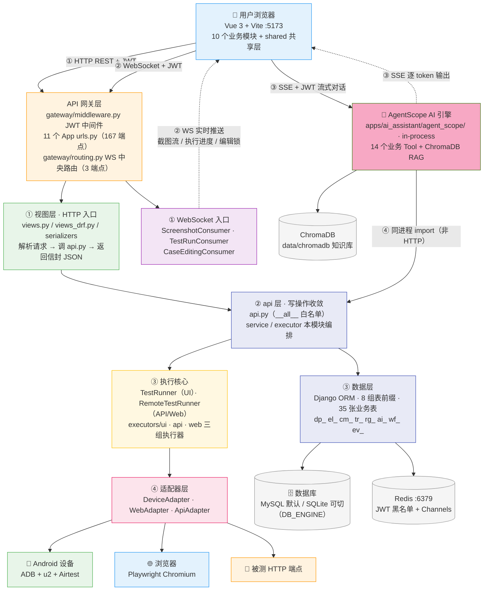
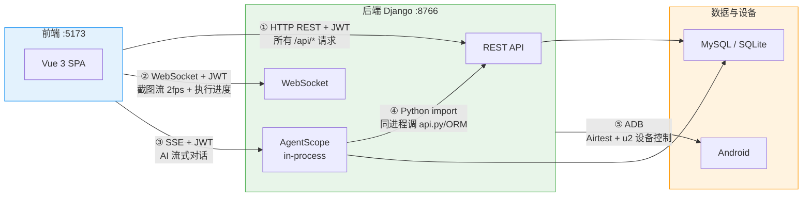
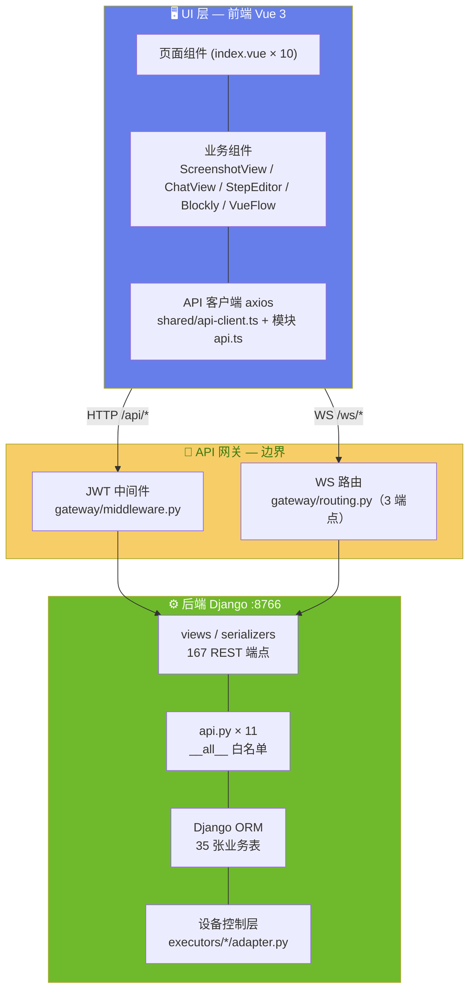
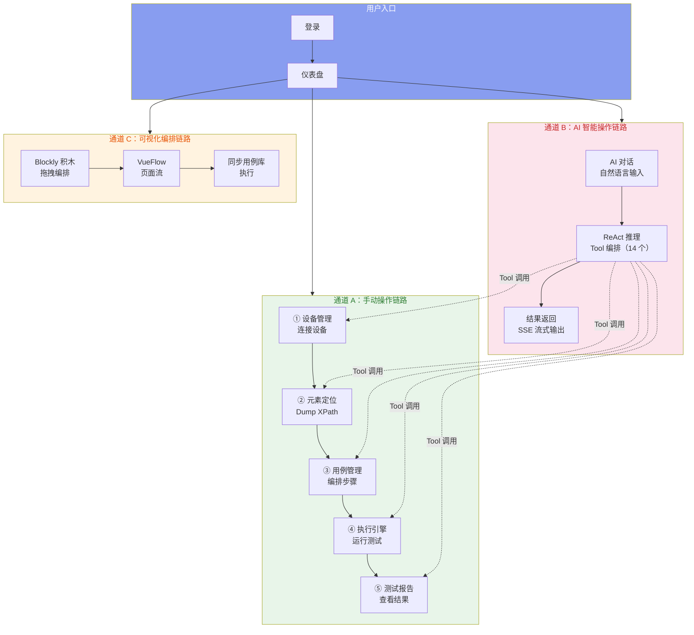

# ARCH-00 — 平台总体架构

> **版本**：v2.0 · **日期**：2026-08-13 · **状态**：现行（取代 `架构大纲.md` v1.4）

## 文档内容简述

本文档是 Android-AutoTests 平台的**架构总纲**，覆盖平台全貌而非单一模块：

- **三层分离**：前端 / 后端 / AI 引擎三层的职责边界与架构全景图（§一）
- **交互边界**：五条通信通道的协议、鉴权与边界规则（§二）
- **模块架构**：11 个后端 App + 10 个前端模块的依赖关系与防火墙规则（§三）
- **模块速览**：每个模块的职责 / 边界 / 数据表 / API / Tool（§四）
- **落地信息**：代码目录地图、关键设计决策、部署形态（§五、§六、§八）
- **权威统计**：表 / 端点 / Tool / 步骤类型的统计与统一定义（§附录A、§九）

## 文档职责边界（ARCH vs PRD）

- **ARCH（架构）只描述**：分层、依赖方向、数据流、API 端点、边界/防火墙、数据模型。
- **组件用抽象角色命名**（如「统计卡片」「趋势图」），不写 `.vue` 文件名、不写数量。
- **具体组件清单 / 规格 / 验收 → 只进 PRD**。功能变更只改 PRD，架构变更才改 ARCH。

## 你能从文档获取什么信息

- **全局架构认知**：理解「前端 / 后端 / AI 引擎」三层如何分层、11 个后端 App 与 10 个前端模块如何协作、五条通道的数据如何流动
- **模块边界与依赖规则**：谁能 import 谁、写操作如何收敛到 api.py、哪些是防火墙红线——指导安全地新增或修改模块
- **权威统计基准**：11 个 App、35 张表、167 端点、14 个 Tool、45 种步骤——作为「文档是否落后代码」的核对依据
- **技术落地方式**：部署形态（Daphne + in-process AgentScope + Redis）与关键设计决策的取舍理由

## 关联文档

- **需求规格**：[`需求大纲`](../02-PRD需求/需求大纲.md)（项目定位 · 用户故事 · 状态机 · 模块职责）
- **子模块架构**：[`ARCH-01-仪表盘`](ARCH-01-仪表盘.md) ～ [`ARCH-09-工作流工作台`](ARCH-09-工作流工作台.md)

---

## 一、三层分离的设计意图

### 1.1 三层职责划分

平台按计算职责分为三层：

| 层 | 核心职责 | 计算特征 |
|---|---------|---------|
| **前端层** | 用户界面、交互体验、数据展示 | 事件驱动、DOM 渲染、实时流消费 |
| **后端层** | 业务逻辑、数据持久化、设备控制 | 请求-响应、ORM 事务、ADB 通信 |
| **AI 引擎层** | 自然语言理解、推理循环、Tool 编排 | 长连接 SSE、LLM 推理、向量检索 |

三层通过明确协议（HTTP / WebSocket / SSE / 同进程 import / ADB）通信，互不侵入。

### 1.2 架构全景图

> 从上到下四层：前端 → API 网关 → 业务核心 → 外部目标。叠加五条通信通道。



### 1.3 三层职责边界

| 层 | ✅ 负责 | ❌ 不管 |
|---|---|---|
| **前端层** `:5173` | Vue 组件渲染与交互、SPA 路由与 JWT 守卫、WebSocket 截图流消费（2fps）、SSE 流式对话消费、Blockly 积木 + VueFlow 流程图 | 数据库直连、AI 推理与 Tool 调用、ADB 设备通信、文件系统 I/O |
| **后端层** `:8766` | JWT 签发与验证、业务逻辑、ORM 持久化、Airtest+u2 设备控制、WebSocket 实时推送、文件 I/O（报告/截图） | 前端渲染、AI 推理 |
| **AI 引擎层**（in-process） | ReAct 推理循环、14 个 Tool 编排、ChromaDB 知识库检索、SSE 逐 token 输出 | 数据库直写（只经 Tool 调 api.py）、JWT 签发、设备直连（经 Tool 调设备 api）、前端渲染 |

---

## 二、前端 ↔ 后端 ↔ AI 交互方式与边界

### 2.1 五条通信通道



### 2.2 交互协议与鉴权矩阵

| # | 通道 | 方向 | 协议 | 鉴权方式 | 用途 | 带宽特征 |
|:--:|------|------|------|------|------|------|
| ① | 前端 → Django | 双向 | HTTP REST | JWT Bearer Header | 业务 CRUD（167 REST 端点） | 低带宽，请求-响应 |
| ② | Django → 前端 | 单向推送 | WebSocket | JWT query string | 截图流 (2fps) + 测试进度 | 高带宽，持续推送 |
| ③ | 前端 → AI | 单向流 | SSE | JWT (共享 SECRET_KEY) | AI 流式对话 | 中带宽，逐 token |
| ④ | AgentScope → Django | 单向调用 | Python import | 上下文注入 | Tool 执行业务逻辑 | 零网络开销 |
| ⑤ | Django → 设备 | 双向 | ADB | — | 截屏/dump/手势操作 | 取决于操作类型 |

### 2.3 前端与后端的边界设定



**边界规则**：

| 规则 | 说明 |
|------|------|
| 前端永远不直连数据库 | 所有数据来自 REST API 或 WebSocket |
| 前端不处理文件 I/O | 报告生成、日志写入全由后端完成 |
| 前端不做 AI 推理 | 流式对话通过 SSE 消费 AgentScope 输出 |
| 所有 /api/* 必经 JWT 中间件 | 公开路径白名单：auth/admin/static/avatars |
| Django 不渲染 HTML | 纯 JSON API，无 Django Template |
| AgentScope 不走 HTTP 调 Django | 同进程 import，零序列化开销 |

### 2.4 API 实现与统一管理（DRF + api.py）

后端 HTTP 层由 **DRF 与裸 Django View 两种范式并存**，通过四个统一机制收敛为一致的 API 风格：

| 统一机制 | 实现 | 作用 |
|---|---|---|
| 统一信封 | `EnvelopeJSONRenderer`（DRF）/ 手写 `JsonResponse`（裸 view） | 响应统一 `{status, data}` / `{status, message}` |
| 统一鉴权 | `JWTAuthenticationMiddleware`（裸 view）+ DRF `JWTAuthentication` | 都委托 `jwt_auth.verify_token()`，注入 `request.user_id` |
| 写操作收敛 | 各 App `api.py`（`__all__` 白名单） | 所有 INSERT/UPDATE/DELETE 走 api.py，视图层/serializer 禁直写 ORM |
| 统一路由 | 各 App `urls.py` → `config/urls.py` include | 统一前缀 `/api/{app}/` |

**DRF 的作用**：DRF 提供 ViewSet（`ModelViewSet`）+ Serializer（`ModelSerializer`）范式，把 CRUD 接口标准化、减少样板代码。`settings.py` 的 `REST_FRAMEWORK` 统一配置：

- `DEFAULT_RENDERER_CLASSES` = `EnvelopeJSONRenderer` —— 统一响应信封
- `DEFAULT_AUTHENTICATION_CLASSES` = `JWTAuthentication` —— 统一 JWT 鉴权
- `DEFAULT_PERMISSION_CLASSES` = `IsAuthenticated` —— 默认需登录
- `drf_spectacular` 自动生成 OpenAPI 文档（`/api/docs`、`/api/schema/`、`/api/swagger/`）

**两种范式现状**：

| 范式 | App | 特点 |
|---|---|---|
| DRF ViewSet / Serializer | case_manager、element_locator、evaluator、workflow | `views_drf.py` / `views_api.py`，写收敛改造逐步迁移 |
| DRF APIView | accounts | 认证接口 |
| DRF 函数视图 | device_pool | `views.py`（`@api_view` + `Response`）+ `service.py` 写收敛 |
| 裸 Django View | dashboard、test_runner、ai_assistant、device_inspector、report_generator | `views.py`，`@csrf_exempt` + 手写 `JsonResponse`，旧端点稳定运行 |

### 2.5 AI 引擎的边界设定

```
AgentScope（in-process，apps/ai_assistant/agent_scope/）的职责边界
═══════════════════════════════════════════════

✅ 负责：
  · 接收用户自然语言消息
  · ReAct 推理循环（思考 → 行动 → 观察）
  · 决定调用哪些 Tool、以什么参数
  · 流式输出推理过程和结果
  · ChromaDB 知识库检索

❌ 不管：
  · 数据库直写 — 所有持久化通过 Tool → Django api.py
  · JWT 签发 — 仅验证（共享 SECRET_KEY）
  · 设备物理连接 — 通过 Tool → Django Device API
  · 前端渲染 — 只输出结构化事件流

Tool 调用链路：
  InProcessPlatformTool.call()
    → tool_registry.resolve(module, action)
    → 各模块 api.py（同进程）
    → Django ORM / 业务函数
    → 返回结构化结果
```

---

## 三、平台模块架构

### 3.1 模块依赖关系图

> 箭头方向 = import 方向。实线 = 跨 App 读 Model/api（合法），点线 = dashboard 只读聚合。

```mermaid
flowchart TD
    subgraph FRONTEND["前端 (Vue 3 + Vite)"]
        F_DP["device-pool"]
        F_EL["element-locator"]
        F_CM["case-manager"]
        F_TR["test-runner"]
        F_RG["report-generator"]
        F_AI["ai-assistant"]
        F_OTH["dashboard · device-inspector<br/>workflow · digital-human(占位)"]
    end

    subgraph BACKEND["后端 (Django :8766 · 11 App)"]
        B_ACC["accounts<br/>认证（无自有表）"]
        B_DI["device_inspector<br/>无表（瞬态）"]
        B_DP["device_pool<br/>dp_ · 底层"]
        B_EL["element_locator<br/>el_"]
        B_CM["case_manager<br/>cm_"]
        B_TR["test_runner<br/>tr_"]
        B_RG["report_generator<br/>rg_"]
        B_WF["workflow<br/>wf_"]
        B_EV["evaluator<br/>ev_"]
        B_AI["ai_assistant<br/>ai_ + agent_scope/"]
        B_DASH["dashboard<br/>无表 · 纯只读聚合"]
    end

    subgraph EXTERNAL["外部目标"]
        EX_DEV["📱 Android 设备"]
        EX_WEB["🌐 浏览器"]
        EX_API["🔗 被测 HTTP API"]
    end

    %% 前端 → 后端
    F_DP -->|"HTTP"| B_DP
    F_EL -->|"HTTP / WS"| B_EL
    F_CM -->|"HTTP / WS"| B_CM
    F_TR -->|"HTTP / WS"| B_TR
    F_RG -->|"HTTP"| B_RG
    F_AI -->|"HTTP / SSE"| B_AI

    %% 后端依赖方向（import，仅列出存在的跨 App 边）
    B_DI -->|"api.device / models.Device"| B_DP
    B_CM -->|"api.simple_yaml_dump / models"| B_EL
    B_TR -->|"api.acquire/release"| B_DP
    B_TR -->|"models 只读"| B_CM
    B_TR -->|"api.ReportGenerator"| B_RG
    B_RG -->|"api.resolve_creator / models"| B_TR
    B_EV -->|"api / models"| B_AI
    B_AI -->|"api（经 tool_registry）"| B_DP
    B_AI -->|"api / models"| B_EL
    B_AI -->|"api"| B_CM
    B_AI -->|"api.get_run_results / runner⚠️"| B_TR

    B_DASH -.->|"只读聚合"| B_DP
    B_DASH -.->|"只读聚合"| B_EL
    B_DASH -.->|"只读聚合"| B_CM
    B_DASH -.->|"只读聚合"| B_TR
    B_DASH -.->|"只读聚合"| B_RG
    B_DASH -.->|"只读聚合"| B_AI
    B_DASH -.->|"只读聚合"| B_WF

    %% 后端 → 外部
    B_TR -->|"⑤ ADB + u2"| EX_DEV
    B_TR -->|"Playwright"| EX_WEB
    B_TR -->|"requests"| EX_API

    style FRONTEND fill:#e3f2fd,stroke:#2196f3
    style BACKEND fill:#e8f5e9,stroke:#4caf50
    style EXTERNAL fill:#fff3e0,stroke:#ff9800
    style B_DASH fill:#f7cd67,stroke:#3a7a10
    style B_DP fill:#6fba2c,color:#fff
    style B_AI fill:#f7a8c4,color:#3a7a10
```



> ⚠️ 标注：`evaluator → ai_assistant.decorators`、`dashboard → ai_assistant.permissions / case_manager.views_helpers` 属跨 App import 内部实现（TD-03 等）。

### 防火墙规则

```
前端 ──❌ import──→ 后端任何模块（只经 HTTP/WS/SSE）

视图层 ──✅ import──→ 本 App api.py / models
视图层 ──❌ import──→ 其他 App 内部实现（service/runner/callbacks/state_machine）

api 层 ──✅ import──→ 本 App models + 其他 App api.py / models（读）
api 层 ──❌ import──→ 其他 App views / 内部实现

执行核心 ──✅ import──→ 外部设备库（u2/Playwright/requests）+ 其他 App api.py
执行核心 ──❌ 不 import──→ 上层视图 / 服务层（单向依赖）

数据层 ──✅ 被所有层 import（只读查询）
数据层 ──❌ 写操作必须走 api.py（写收敛）

dashboard ──✅ 跨 App 只读 ORM 聚合
dashboard ──❌ 任何写操作（无自有表）
```

### 3.2 模块交互链路全景



### 3.3 模块与三层架构的映射

```mermaid
flowchart TB
    subgraph Frontend["🖥️ 前端层 :5173 — frontend/src/modules/"]
        F_DB["dashboard/"]
        F_DP["device-pool/"]
        F_DI["device-inspector/"]
        F_EL["element-locator/"]
        F_CM["case-manager/"]
        F_TR["test-runner/"]
        F_RG["report-generator/"]
        F_AI["ai-assistant/"]
        F_WF["workflow/"]
    end

    subgraph Backend["⚙️ 后端层 :8766 — apps/（11 App）"]
        B_DB["dashboard/ (0表 4API)"]
        B_DP["device_pool/ (3表 13API)"]
        B_DI["device_inspector/ (0表 4API)"]
        B_EL["element_locator/ (8表 28API)"]
        B_CM["case_manager/ (5表 29API)"]
        B_TR["test_runner/ (4表 12API)"]
        B_RG["report_generator/ (2表 6API)"]
        B_AI["ai_assistant/ (7表 44API)"]
        B_WF["workflow/ (2表 10API)"]
        B_ACC["accounts/ (0表 5API)"]
        B_EV["evaluator/ (4表 14API)"]
    end

    subgraph AgentScope["🤖 AI 引擎层（in-process）— agent_scope/tool_registry.py（14 Tool）"]
        A_DP["devices (3)"]
        A_EL["elements (3)"]
        A_CM["cases (4)"]
        A_TR["runner (3)"]
        A_KB["knowledge (1)"]
    end

    F_DB --- B_DB
    F_DP --- B_DP --- A_DP
    F_EL --- B_EL --- A_EL
    F_CM --- B_CM --- A_CM
    F_TR --- B_TR --- A_TR
    F_RG --- B_RG
    F_AI --- B_AI
    F_WF --- B_WF
    F_DI --- B_DI

    style Frontend fill:#667eea,color:#fff
    style Backend fill:#6fba2c,color:#fff
    style AgentScope fill:#f7a8c4,color:#3a7a10
```



---

## 四、模块架构概览

### 4.1 仪表盘 (dashboard)

**定位**：平台首页聚合层，跨模块只读统计与导航入口。

| 维度 | 说明 |
|------|------|
| **模块职责** | KPI 统计卡片 × 6 → 执行趋势图 → 快捷入口 → 活动时间线 |
| **核心边界** | 纯聚合查询，不拥有业务写操作，无自有数据表 |
| **上游依赖** | 全部业务模块（只读聚合） |
| **下游消费** | 无 |
| **AI Tool** | 无 |
| **数据表** | 无（纯聚合层） |
| **API** | 4 REST |

### 4.2 设备管理 (device-pool)

**定位**：平台设备基础设施，Android 设备的全生命周期管理中心。

| 维度 | 说明 |
|------|------|
| **模块职责** | ADB 设备发现 → 注册 → 状态监控(30s心跳) → 锁定/公开 → 强制释放 |
| **核心边界** | 仅管理设备连接与锁状态，不关心设备上跑什么用例 |
| **上游依赖** | 无（基础设施层） |
| **下游消费** | element-locator (截图/Dump)、test-runner (占用执行) |
| **AI Tool** | `get_online_devices`、`acquire_device`、`release_device` (3个) |
| **数据表** | `dp_devices` · `dp_device_locks` |
| **API** | 10 REST |
| **核心组件** | `DevicePool` 单例 (pool.py) — 线程安全的 Airtest + u2 双连接管理 |

### 4.3 元素定位 (element-locator)

**定位**：UI 可视化中枢，将 Android 屏幕转化为可操作的测试元素。

| 维度 | 说明 |
|------|------|
| **模块职责** | 实时截图流 → Dump UI 层级 → 8 种 XPath 生成 → 元素资产库管理（含 Web/API 元素） |
| **核心边界** | 只做元素发现与定位表达式生成，不执行测试 |
| **上游依赖** | device-pool (u2 截屏/Dump) |
| **下游消费** | case-manager (XPath 填入步骤)、AI 助手 (元素搜索) |
| **AI Tool** | `search_elements`、`list_pages`、`fetch_page_elements` (3个) |
| **数据表** | `el_pages` · `el_elements` · `el_page_flows` · `el_web_groups` · `el_web_elements` · `el_api_groups` · `el_api_endpoints` · `el_web_page_flows` |
| **API** | 28 REST + 1 WebSocket |
| **8 种 XPath** | resource-id → text → content-desc → 类名 → 索引 → 组合 → 通配+rid → 通配+text |

### 4.4 用例管理 (case-manager)

**定位**：测试资产管理中枢，创建、编排、管理可重用的测试用例定义。

| 维度 | 说明 |
|------|------|
| **模块职责** | 二级目录树 → 用例 CRUD → 步骤编排 → YAML 导入导出 |
| **核心边界** | 只管理用例定义（JSON），不执行用例 |
| **上游依赖** | element-locator (XPath 选取) |
| **下游消费** | test-runner (读取用例执行)、workflow (积木导入) |
| **AI Tool** | `save_case`、`get_case`、`save_api_test_case`、`debug_case` (4个) |
| **数据表** | `cm_case_directories` · `cm_test_definitions` · `cm_api_testcases` · `cm_web_testcases` · `cm_storage_testcases` |
| **API** | 29 REST |

### 4.5 执行引擎 (test-runner)

**定位**：任务调度与用例执行中枢，将 JSON 步骤转化为设备端原子操作。

| 维度 | 说明 |
|------|------|
| **模块职责** | 任务卡片 → 设备调度(空闲/排队) → StepExecutor 分发 → DeviceAdapter 驱动 u2 |
| **核心边界** | 只负责执行调度，不管理用例定义和报告展示 |
| **上游依赖** | device-pool (设备锁)、case-manager (用例定义) |
| **下游消费** | report-generator (执行结果) |
| **AI Tool** | `run_test`、`get_run_results`、`stop_run` (3个) |
| **数据表** | `tr_test_sop` · `tr_test_runs` · `tr_test_results` · `tr_task_cards` |
| **API** | 12 REST + 1 WebSocket |
| **核心组件** | `state_machine.py` → `runner.py`/`remote_runner.py` → `executors/ui|api|web/` |

### 4.6 测试报告 (report-generator)

**定位**：执行结果收口与质量可视化中枢。

| 维度 | 说明 |
|------|------|
| **模块职责** | 自动生成 CSV/MD/LOG/JSON → 报告列表 → 在线详情 → 文件下载 |
| **核心边界** | 只读消费执行结果，不做数据写入（报告由执行引擎触发生成） |
| **上游依赖** | test-runner (执行结果) |
| **下游消费** | dashboard (趋势统计) |
| **AI Tool** | 无 |
| **数据表** | `rg_reports` · `rg_report_templates` |
| **API** | 6 REST |

### 4.7 AI 助手 (ai-assistant)

**定位**：平台 AI 入口，自然语言驱动全流程测试。

| 维度 | 说明 |
|------|------|
| **模块职责** | 智能体管理 → SSE 流式对话 → ReAct 推理 → Tool 编排 → 知识库增强 |
| **核心边界** | AI 引擎不做设备直连和数据库直写，一切通过 Tool 调用 Django |
| **上游依赖** | 全部业务模块（通过 Tool） |
| **下游消费** | 无（AI 是顶层调用者） |
| **AI Tool** | 全部 14 个 Tool（AI 模块自身是 Tool 宿主） |
| **数据表** | `ai_agents` · `ai_tools` · `ai_shared_tools` · `ai_conversations` · `ai_messages` · `ai_tasks` · `ai_execution_logs` |
| **API** | 44 REST + SSE |
| **核心组件** | `agent_scope/`（tool_registry · agent_factory · rag_service · in_process_tool） |

### 4.8 工作流工作台 (workflow)

**定位**：可视化测试工作流编排工具，降低非技术人员使用门槛。

| 维度 | 说明 |
|------|------|
| **模块职责** | Blockly 积木式编辑 → VueFlow 页面流程图 → 双向同步用例库 |
| **核心边界** | 编排工具，本身不执行测试 |
| **上游依赖** | case-manager (用例导入/同步) |
| **下游消费** | case-manager (积木→用例)、test-runner (同步后执行) |
| **AI Tool** | 无 |
| **数据表** | `wf_directories` · `wf_documents` |
| **API** | 10 REST |

### 4.9 登录 (accounts)

**定位**：平台唯一登录入口，JWT 签发与用户管理。

| 维度 | 说明 |
|------|------|
| **模块职责** | 登录/注册/登出/刷新 → JWT 签发 → 黑名单 |
| **核心边界** | 只负责认证，不承担业务数据 |
| **上游依赖** | 无（用 `django.contrib.auth.User`） |
| **下游消费** | 全部模块（提供 `request.user_id`） |
| **AI Tool** | 无 |
| **数据表** | 无自有表（用 `auth_user`） |
| **API** | 5 REST |

### 4.10 设备检查器 (device-inspector)

**定位**：设备屏幕实时截图流 + UI 层级抓取的瞬态服务。

| 维度 | 说明 |
|------|------|
| **模块职责** | 实时截图（2fps）→ WS 推送 → Dump UI 层级 |
| **核心边界** | 瞬态服务，无持久化数据表 |
| **上游依赖** | device-pool (设备连接) |
| **下游消费** | element-locator (截图流/Dump) |
| **AI Tool** | 无 |
| **数据表** | 无（瞬态） |
| **API** | 4 REST + 1 WebSocket |
| **核心组件** | `ScreenshotConsumer` (consumers.py) |

### 4.11 评估器 (evaluator)

**定位**：LLM 评测框架，题库管理 + 评测运行 + 结果打分。

| 维度 | 说明 |
|------|------|
| **模块职责** | 题库/题目管理 → 评测运行 → 结果汇总/人工打分 |
| **核心边界** | 只做 AI 输出质量评测，不参与业务测试 |
| **上游依赖** | ai-assistant (解密/检索/模型配置) |
| **下游消费** | 无 |
| **AI Tool** | 无 |
| **数据表** | `ev_question_banks` · `ev_questions` · `ev_runs` · `ev_results` |
| **API** | 14 REST |

---

## 五、文件地图

### 5.1 架构文档索引

```
dev_docs/03-设计与架构/
│
├── ARCH-00-平台总体架构.md              ← 本文档（架构总纲）
│
├── ARCH-01-仪表盘.md                     ← 仪表盘模块架构
├── ARCH-02-设备管理.md                   ← 设备管理模块架构
├── ARCH-04-元素定位.md                   ← 元素定位模块架构
├── ARCH-05-用例管理.md                   ← 用例管理模块架构
├── ARCH-06-执行引擎.md                   ← 执行引擎模块架构
├── ARCH-07-测试报告.md                   ← 测试报告模块架构
├── ARCH-08-AI助手.md                    ← AI 助手模块架构
├── ARCH-09-工作流工作台.md               ← 工作流工作台模块架构
│
├── 技术栈参考.md                         ← 技术选型与命名统一
├── 工具-VUE_API_CONTRACT.md              ← 前后端接口契约
│
└── README.md                             ← 目录索引
```

### 5.2 代码层面文件地图

```
Android-AutoTests/
│
├── frontend/src/modules/          ← 前端 10 模块
│   ├── dashboard/                 · index.vue
│   ├── device-pool/               · index.vue
│   ├── device-inspector/          · index.vue / ScreenshotView.vue
│   ├── element-locator/           · index.vue / ElementManager.vue / WebElementManager.vue
│   ├── case-manager/              · index.vue / CaseEditor.vue / StepEditor.vue
│   ├── test-runner/               · index.vue / TaskDetail.vue
│   ├── report-generator/          · index.vue / ReportDetail.vue
│   ├── ai-assistant/              · index.vue / AgentDetail.vue / ChatView.vue
│   ├── workflow/                  · index.vue / TestCaseBlockly / PageFlowVueFlow
│   └── digital-human/             · index.vue（占位，待开发）
│
├── apps/                          ← Django 11 App
│   ├── accounts/                  · 认证（5 端点，无自有表）
│   ├── dashboard/                 · views.py (4 端点，纯聚合)
│   ├── device_pool/               · models.py(3表) / views/(13) / pool.py(单例)
│   ├── device_inspector/          · views.py(4) / service.py / consumers.py / stream.py
│   ├── element_locator/           · models.py(8表) / views.py + views_drf.py(28) / api.py / service.py
│   ├── case_manager/              · models*.py(5表) / views*.py(29) / api*.py
│   ├── test_runner/               · models.py(4表) / views/(12) / runner.py / remote_runner.py / executors/
│   ├── report_generator/          · models.py(2表) / views.py(6)
│   ├── ai_assistant/              · models.py(7表) / views/(44) / agent_scope/
│   ├── evaluator/                 · models.py(4表) / views.py + views_api.py(14) / frameworks/
│   └── workflow/                  · models.py(2表) / views.py + views_api.py(10)
│
├── gateway/                       ← Django 网关
│   ├── middleware.py              · JWT 中间件
│   ├── routing.py                 · WebSocket 路由（3 端点）
│   └── server.py                  · [DEPRECATED] 旧路由参考
│
├── shared/                        ← 共享层
│   ├── auth/jwt_auth.py           · JWT 签发/验证/黑名单
│   ├── auth/drf_auth.py           · DRF 认证桥
│   └── renderers.py               · EnvelopeJSONRenderer 信封
│
└── models/                        ← 领域模型（dataclass 非 ORM）
    ├── step_types.py              · StepType 枚举（45 种）+ TestStep
    ├── test_models.py             · TestCaseDef / TestRun / TestResult
    └── constants.py               · 跨模块状态枚举
```

---

## 六、关键设计决策

| 决策 | 理由 |
|------|------|
| **前端永远不直连数据库** | 所有数据来自 API，保证数据链路可控、可审计 |
| **AgentScope 同进程调 Django** | Tool 直接 import ORM/API，不走 HTTP，零网络开销 |
| **Django + AgentScope 共享 JWT 密钥** | 统一认证，避免双系统 Token 同步 |
| **裸 Django View + DRF 混用** | 写收敛改造逐步引入 DRF ViewSet，旧端点稳定运行 |
| **SSE + 阻塞 POST 兜底** | AgentScope/Redis 不可用时自动降级为同步模式 |
| **SQLite 开发 / MySQL 生产** | 环境变量 `DB_ENGINE` 一键切换 |
| **Redis 承载黑名单 + Channels** | 服务重启不丢失；Redis 不可用则降级放行验证 |
| **锁审计日志永不删除** | 通过 status 追踪生命周期，支持审计回溯 |
| **执行前保存用例快照** | `selected_cases` 完整复制步骤数据，确保历史可审计 |
| **WebSocket 截图 + REST 兜底** | 并行请求：WebSocket 建立前先用 REST 拿首帧 |

---

## 七、模块架构详细说明索引

> 以下子 ARCH 为各模块的完整架构设计（前端组件树、后端文件、API 列表、数据模型、交互时序、跨模块通信）。
> 需求与验收标准见 `02-PRD需求/` 下对应子 PRD。

| 模块 | 子 ARCH 文件 | 关键架构要素 |
|------|-----------|------------|
| 仪表盘 | [`ARCH-01-仪表盘.md`](ARCH-01-仪表盘.md) | 6 KPI 跨模块聚合 + 趋势图 + 活动时间线 |
| 设备管理 | [`ARCH-02-设备管理.md`](ARCH-02-设备管理.md) | DevicePool 单例 + 锁定/公开 + 锁审计 |
| 元素定位 | [`ARCH-04-元素定位.md`](ARCH-04-元素定位.md) | WebSocket 截图流 2fps + 8 XPath 策略 + 三列工作区 |
| 用例管理 | [`ARCH-05-用例管理.md`](ARCH-05-用例管理.md) | 步骤编排 + 二级目录树 + YAML 导入导出 |
| 执行引擎 | [`ARCH-06-执行引擎.md`](ARCH-06-执行引擎.md) | 状态机 + 三组执行器 + SOP 四阶段 |
| 测试报告 | [`ARCH-07-测试报告.md`](ARCH-07-测试报告.md) | CSV/MD/LOG/JSON 自动生成 + 在线详情 |
| AI 助手 | [`ARCH-08-AI助手.md`](ARCH-08-AI助手.md) | SSE 流式对话 + 14 Tool + ChromaDB |
| 工作流工作台 | [`ARCH-09-工作流工作台.md`](ARCH-09-工作流工作台.md) | Blockly + VueFlow + 双向同步用例库 |

### 相关文档

| 文档 | 路径 | 说明 |
|------|------|------|
| 需求大纲 | [`../02-PRD需求/需求大纲.md`](../02-PRD需求/需求大纲.md) | 项目定位 · 用户故事 · 状态机 · 模块职责 |
| 技术栈 | [`技术栈参考.md`](技术栈参考.md) | 技术选型与命名统一 |

---

## 八、部署架构

```
开发环境 (macOS / Windows)
─────────────────────────────

  Vue Dev Server    :5173    Vite HMR + proxy
  Django Daphne     :8766    ASGI HTTP + WebSocket（纯 ASGI，无 wsgi.py）
  AgentScope        in-process（运行于 Django 进程内，无独立端口）
  Redis             :6379    JWT 黑名单 + Channels

  一键启动: python run.py start
  一键停止: python run.py stop
  状态检查: python run.py status
```

---

## 附录A：架构事实统计

> 由 `tools/gen_arch_stats.py` 自动维护。此处数字为 2026-08-13 手工核对版（含 `models_*.py` 分表）。

### Django App 清单（11 个）

| App | 表 | 端点 | models | views | api | urls |
|-----|:--:|:--:|:--:|:--:|:--:|:--:|
| `accounts` | 0 | 5 | ❌ | ✅ | ✅ | ✅ |
| `ai_assistant` | 7 | 44 | ✅ | ✅ | ✅ | ✅ |
| `case_manager` | 5 | 29 | ✅ | ✅ | ✅ | ✅ |
| `dashboard` | 0 | 4 | ❌ | ✅ | ❌ | ✅ |
| `device_inspector` | 0 | 4 | ❌ | ✅ | ✅ | ✅ |
| `device_pool` | 3 | 13 | ✅ | ✅ | ✅ | ✅ |
| `element_locator` | 8 | 28 | ✅ | ✅ | ✅ | ✅ |
| `evaluator` | 4 | 14 | ✅ | ✅ | ✅ | ✅ |
| `report_generator` | 2 | 6 | ✅ | ✅ | ✅ | ✅ |
| `test_runner` | 4 | 12 | ✅ | ✅ | ✅ | ✅ |
| `workflow` | 2 | 10 | ✅ | ✅ | ✅ | ✅ |
| **合计** | **35** | **167** | — | — | — | — |

### 数据库表清单（8 组前缀 · 35 张业务表）

| 前缀 | App | 表名 |
|------|-----|------|
| `ai_` | ai_assistant | `ai_agents` · `ai_tools` · `ai_shared_tools` · `ai_conversations` · `ai_messages` · `ai_tasks` · `ai_execution_logs` |
| `cm_` | case_manager | `cm_case_directories` · `cm_test_definitions` · `cm_api_testcases` · `cm_web_testcases` · `cm_storage_testcases` |
| `dp_` | device_pool | `dp_devices` · `dp_device_locks` |
| `el_` | element_locator | `el_pages` · `el_elements` · `el_page_flows` · `el_web_groups` · `el_web_elements` · `el_api_groups` · `el_api_endpoints` · `el_web_page_flows` |
| `ev_` | evaluator | `ev_question_banks` · `ev_questions` · `ev_runs` · `ev_results` |
| `rg_` | report_generator | `rg_reports` · `rg_report_templates` |
| `tr_` | test_runner | `tr_test_sop` · `tr_test_runs` · `tr_test_results` · `tr_task_cards` |
| `wf_` | workflow | `wf_directories` · `wf_documents` |

### AgentScope Tool 清单（14 个）

| Tool | 模块 | 只读 |
|------|------|:--:|
| `get_online_devices` | devices | ✅ |
| `acquire_device` | devices | ❌ |
| `release_device` | devices | ❌ |
| `search_elements` | elements | ✅ |
| `list_pages` | elements | ✅ |
| `fetch_page_elements` | elements | ✅ |
| `save_case` | cases | ❌ |
| `get_case` | cases | ✅ |
| `save_api_test_case` | cases | ❌ |
| `debug_case` | cases | ✅ |
| `run_test` | runner | ❌ |
| `get_run_results` | runner | ✅ |
| `stop_run` | runner | ❌ |
| `search_knowledge_base` | knowledge | ✅ |

### 前端模块清单（10 个）

| 模块 | index.vue | Vue 行数 |
|------|:--:|:--:|
| `ai-assistant` | ✅ | 5658 |
| `case-manager` | ✅ | 4616 |
| `dashboard` | ✅ | 1216 |
| `device-inspector` | ✅ | 2343 |
| `device-pool` | ✅ | 881 |
| `digital-human` | ✅ | 450 |
| `element-locator` | ✅ | 2512 |
| `report-generator` | ✅ | 1891 |
| `test-runner` | ✅ | 2052 |
| `workflow` | ✅ | 4893 |

### 跨模块 import 关系

| 被依赖 App | 依赖来源 |
|------|------|
| `device_pool` | `device_inspector` · `test_runner` · `ai_assistant`（tool_registry）· `dashboard` |
| `element_locator` | `case_manager` · `ai_assistant`（tool_registry）· `dashboard` |
| `case_manager` | `test_runner` · `ai_assistant`（tool_registry）· `dashboard` |
| `test_runner` | `report_generator` · `ai_assistant`（tool_registry）· `dashboard` |
| `report_generator` | `test_runner`（api）· `dashboard` |
| `ai_assistant` | `evaluator` · `dashboard` |
| `workflow` | `dashboard` |

---

## 九、平台统一定义

### 步骤类型（来自 `models/step_types.py::StepType` 枚举，唯一真相源）

**45 种步骤类型** — `StepType` 枚举是唯一真相源，executor 分发、前端 step-utils、adapter 均基于这些值。其中活跃类型 17 种，其余为 deprecated 的 `adb_` 前缀别名 + API/Web 扩展类型：

| 分类 | 活跃枚举值 |
|------|------|
| 点击类 | `CLICK` · `LONG_CLICK` · `CLICK_INDEXED` · `RETRY_CLICK` |
| 手势类 | `SWIPE` · `DRAG` |
| 等待类 | `WAIT` · `WAIT_DISAPPEAR` · `WAIT_ANY` · `WAIT_TOAST` |
| 验证类 | `VERIFY_TEXT` · `POLL_TEXT` |
| 控制类 | `START_APP` · `KILL_APP` · `RESTART_APP` |
| 工具类 | `SLEEP` · `LOG` |

> 另有 deprecated 的 `adb_` 前缀类型（`ADB_START_APP` 等 9 个）、API 类型（`API_REQUEST`/`API_ASSERT`/`API_SLEEP`/`API_LOG`）与 Web 类型（`WEB_NAVIGATE`/`WEB_CLICK`/`WEB_FILL`/`WEB_TYPE`/`WEB_WAIT`/`WEB_ASSERT`/`WEB_SCREENSHOT`/`WEB_STEP`）。

### 设备状态（来自 `apps/device_pool/models.py`）

**2 种设备状态**：`ONLINE` · `BUSY`

设备离线或断开即删除记录，不存在 `OFFLINE` / `DISCONNECTED` 持久状态。锁审计日志永不删除，通过 `status` 字段（active/released/expired）追踪生命周期。

---

## 变更记录

| 版本 | 日期 | 变更摘要 |
|------|------|----------|
| v2.0 | 2026-08-13 | 由 `架构大纲.md`（v1.4）全量校正后合并 `Mermaid-00` 三张图：App 9→11、表 31→35、端点 162→167、Tool 24/38→14、步骤 28→45、端口 :8765→:8766、AgentScope :8000→in-process、`agentscope_service/`→`apps/ai_assistant/agent_scope/` |
| v1.x | 2026-07-16 ~ 07-28 | 见原 `架构大纲.md` 变更记录 |
