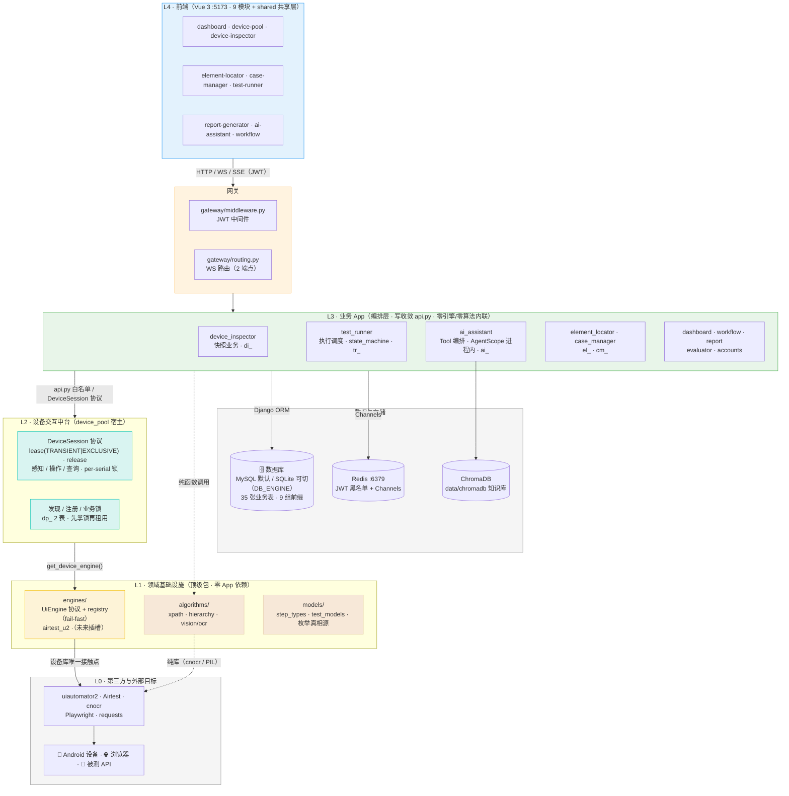
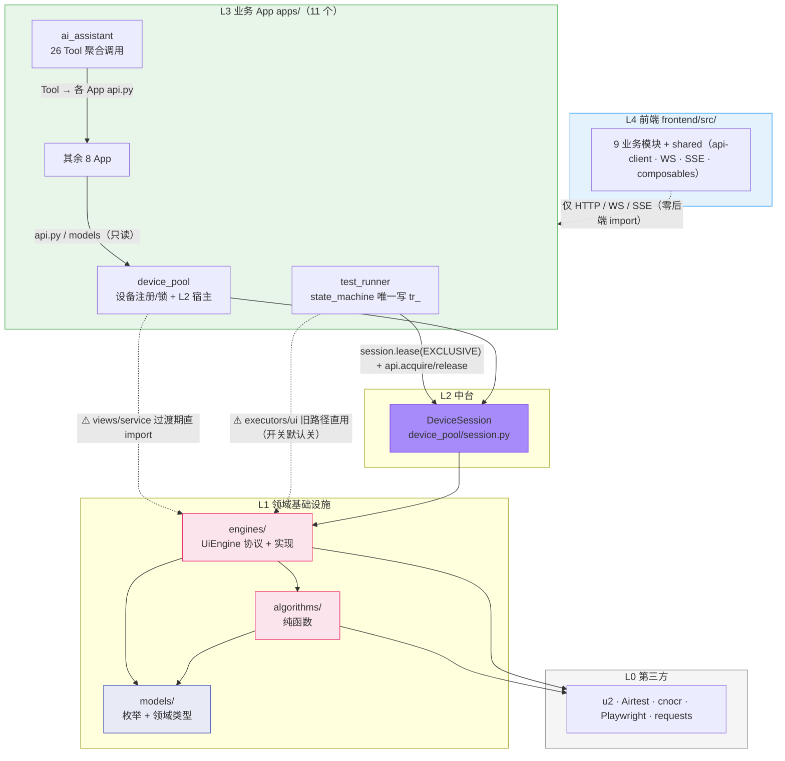
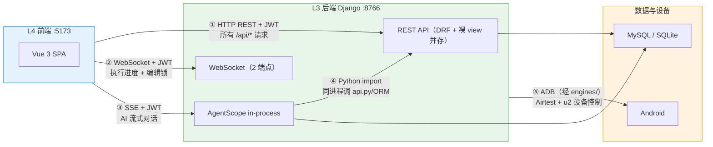
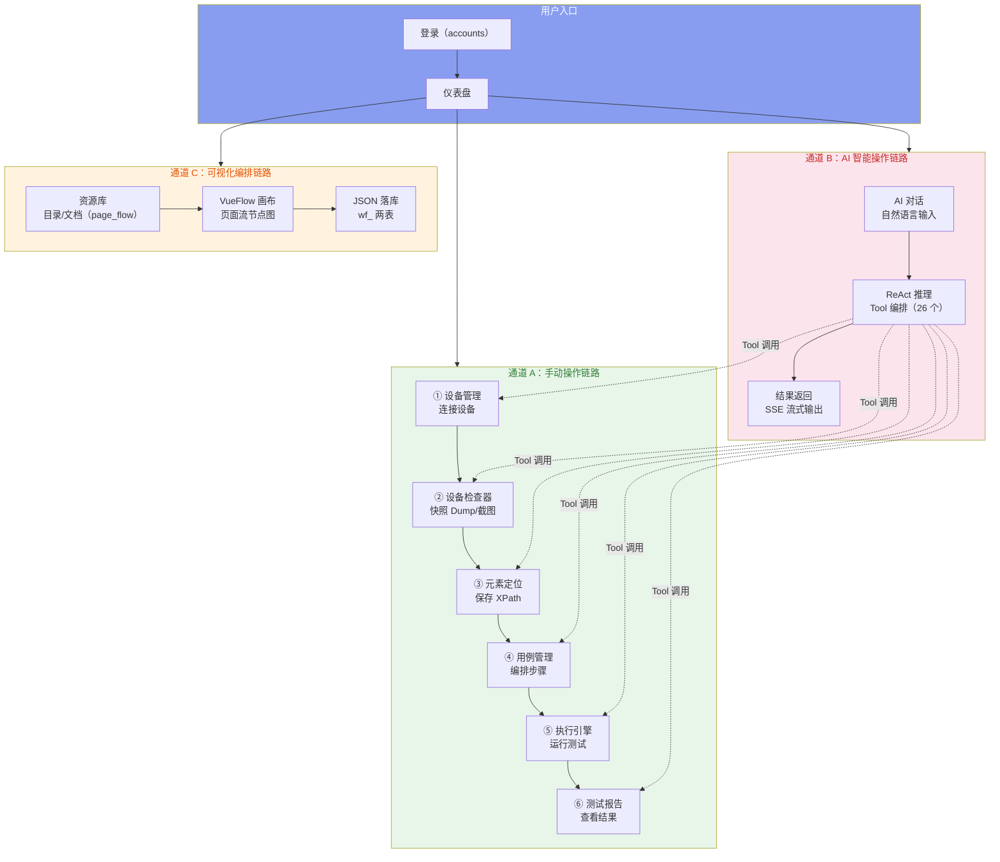
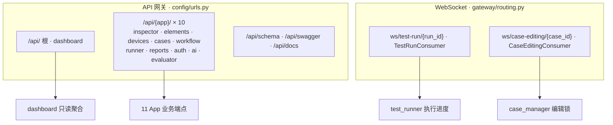
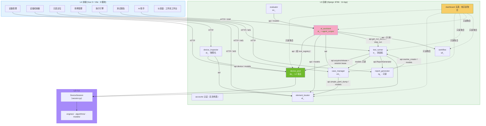

# ARCH-00 — 平台总体架构

> **版本**：v3.2 · **日期**：2026-08-21 · **状态**：现行（取代 v2.1 三层口径；v3.1：九份子 ARCH 五层口径回填 + `gen_arch_stats.py` 修复 + 统计对齐 143 路径端点；v3.2：设计-* 系列与迁移 Checklist 归档）
>
> ⚠️ 本文对应**仓库工作区当前代码**（含未提交的七步重构与 AI 助手 DRF 迁移；细节差异见 §1.6 偏差登记）。

## 文档内容简述

本文档是 Android-AutoTests 平台的**架构总纲**，覆盖平台全貌而非单一模块：

- **五层架构**：L0 第三方 → L1 领域基础设施（算法/模型/引擎）→ L2 设备交互中台 → L3 业务 App → L4 前端的职责与依赖方向（§一、§二）
- **通信通道**：五条通道的协议、鉴权与边界（§1.4）
- **模块架构**：11 个后端 App + 9 个前端模块的依赖关系与防火墙规则（§三）
- **关键机制**：写收敛 / 状态机 / 引擎注册表 / 会话租用 / AI Tool 编排（§四）
- **落地信息**：代码目录地图、设计决策、部署形态（§五、§六、§七）
- **统一定义与权威统计**：步骤类型、设备/任务状态、表 / 端点 / Tool 实测清单（§八、附录A）

## 文档职责边界（ARCH vs PRD）

- **ARCH（架构）只描述**：分层、依赖方向、数据流、API 端点概览、边界/防火墙、数据模型。
- **组件用抽象角色命名**（如「统计卡片」「截图展示」「步骤编排器」），不写 `.vue` 文件名、不写数量。
- **具体组件清单 / 规格 / 验收 → 只进 PRD**。功能变更只改 PRD，架构变更才改 ARCH。

## 你能从文档获取什么信息

- **全局架构认知**：五层如何分层、11 个后端 App 与 9 个前端模块如何协作、五条通道的数据如何流动
- **模块边界与依赖规则**：谁能 import 谁、写操作如何收敛到 api.py、哪些是防火墙红线——指导安全地新增或修改模块
- **权威统计基准**：11 个 App、35 张表（9 组前缀）、143 条路径端点（+ DRF 生成另计）、26 个 Tool、37 种步骤枚举（注册表 29）、2 个 WS 端点——作为「文档是否落后代码」的核对依据
- **技术落地方式**：部署形态（Daphne + in-process AgentScope + Redis）与关键设计决策的取舍理由

## 关联文档

- **需求规格**：[`需求大纲`](../02-PRD需求/需求大纲.md)（项目定位 · 用户故事 · 模块职责）
- **子模块架构**：[`ARCH-01-仪表盘`](ARCH-01-仪表盘.md) ～ [`ARCH-09-工作流工作台`](ARCH-09-工作流工作台.md)
- **目标架构详档**：设计-* 系列（五层目标总纲 · L0~L3 逐层详档 · 引擎可替换方案 · 重构落地实测）与迁移 Checklist **已于 2026-08-21 归档** → [`../_archive/`](../_archive/)（内容已吸收进本文与 `openspec/specs/`；剩余待办见 §1.6 #11/#12）
- **正式契约（OpenSpec）**：`openspec/specs/engine-protocol/spec.md` · `openspec/specs/device-session/spec.md`
- **迁移纪律**：原 [`迁移实施注意事项-Checklist`](../_archive/迁移实施注意事项-Checklist.md) 已闭环归档（2026-08-21）；剩余 2 项待办见 §1.6 #11/#12

---

## 一、平台架构概览

### 1.1 架构定位（五层）

平台按计算职责分为五层，依赖方向**严格单向向下**：`L4 → 网关 → L3 → L2 → L1 → L0`。

> 演进脉络：v2.1 的三层口径（前端 / 后端 / AI 引擎）经 2026-08-20 七步重构（OpenSpec 变更集）演化为五层——设备交互协议与引擎实现下沉 `engines/`、纯算法下沉 `algorithms/`、枚举与领域模型收敛 `models/`、设备会话租用协议落地 `DeviceSession`。旧「三层」描述由本节取代。

| 层 | 名称 | 一句话职责 |
|----|------|-----------|
| **L4** | 前端 | 渲染、交互、实时流消费（9 业务模块 + shared 共享层） |
| **L3** | 业务 App 编排层 | 请求解析、业务编排、状态机流转、信封封装（11 个 Django App + gateway/shared） |
| **L2** | 设备交互中台 | 设备会话租用协议（DeviceSession：租用/感知/操作/生命周期） |
| **L1c** | 引擎层 | 操作原语物理实现、连接生命周期、能力声明（UiEngine 协议 + 注册表） |
| **L1b** | 领域模型 | 枚举与领域类型的**唯一真相源** |
| **L1a** | 算法层 | 无状态纯函数（XPath 候选、层级解析、OCR） |
| **L0** | 第三方与外部目标 | u2 / Airtest / cnocr / Playwright / requests + Android 设备 / 浏览器 / 被测 API |

### 1.2 架构全景图

> 与已归档的目标总纲（`../_archive/设计-目标架构-设备交互协议与引擎分层.md`）§一 **总览图同构**；补充「数据与存储」节点与 algorithms 纯库依赖。端口/表数以附录A为准。



### 1.3 分层包图与防火墙

> 箭头 = import 方向。实线 = 合法依赖；虚线 = 特殊（⚠️ 过渡期残留，见 §1.6）。



**防火墙规则**：

```
L4 前端      ──❌ import──→ 后端任何模块（只经 HTTP / WS / SSE）
L4 前端      ──❌ 数据库直连 · 文件系统 I/O · AI 推理 · ADB 通信

L3 视图层    ──✅ import──→ 本 App api.py / models
L3 视图层    ──❌ import──→ 其他 App 内部实现（service / runner / consumer / state_machine / views_helpers）
L3 api 层    ──✅ import──→ 本 App models + 其他 App api.py / models（只读）
L3 api 层    ──❌ import──→ 其他 App views / 内部实现
L3 业务 App  ──✅ import──→ device_pool.session（L2 会话消费）· algorithms 纯函数 · models 枚举
L3 业务 App  ──❌ import──→ engines 实现（⚠️ device_pool views/service、executors/ui 为过渡期残留）

L2 会话层    ──✅ import──→ engines.registry（工厂）· 本 App 数据
L2 会话层    ──❌ import──→ 其他 App 内部实现

L1c engines  ──✅ import──→ 第三方库 + models.* + algorithms.*（纯函数，D-1 裁决）
L1c engines  ──❌ import──→ apps.* / django.*
L1a 算法     ──✅ import──→ 第三方纯库 + models.*（类型，D-2 裁决）
L1a 算法     ──❌ import──→ apps.* / engines.* / django.*

数据层       ──✅ 被各层只读查询
数据层       ──❌ 写操作必须走 api.py（写收敛；跨 App 写走目标 App api.py）

dashboard    ──✅ 跨 App 只读 ORM 聚合
dashboard    ──❌ 任何写操作（无自有表）
```

### 1.4 五条通信通道



| # | 通道 | 方向 | 协议 | 鉴权方式 | 用途 |
|:--:|------|------|------|------|------|
| ① | 前端 → Django | 双向 | HTTP REST | JWT Bearer Header | 业务 CRUD（11 App） |
| ② | Django → 前端 | 单向推送 | WebSocket | JWT query string | 执行进度（`ws/test-run/`）+ 用例编辑锁（`ws/case-editing/`） |
| ③ | 前端 → AI | 单向流 | SSE | JWT（共享 SECRET_KEY） | AI 流式对话（单请求 + asyncio.Queue） |
| ④ | AgentScope → Django | 单向调用 | Python import | 上下文注入 | Tool 执行业务逻辑（零网络开销） |
| ⑤ | Django → 设备 | 双向 | ADB | — | 截屏 / dump / 手势（仅经 engines 层） |

> v1.7 起设备检查器**无实时截图流**：截图/层级改为快照式抓取（REST → `di_snapshots`），原 ScreenshotConsumer 已删除，WS 通道仅剩 2 端点。

**平台主链路（数据流）**：



### 1.5 API 实现与统一管理（DRF + api.py）

后端 HTTP 层由 **DRF 与裸 Django View 两种范式并存**，通过四个统一机制收敛为一致的 API 风格：

| 统一机制 | 实现 | 作用 |
|---|---|---|
| 统一信封 | `EnvelopeJSONRenderer`（DRF）/ 手写 `JsonResponse`（裸 view） | 响应统一 `{status, data}` / `{status, message}` |
| 统一鉴权 | `JWTAuthenticationMiddleware`（裸 view）+ DRF `JWTAuthentication` | 都委托 `jwt_auth.verify_token()`，注入 `request.user_id` |
| 写操作收敛 | 各 App `api.py`（`__all__` 白名单） | 所有 INSERT/UPDATE/DELETE 走 api.py，视图层/serializer 禁直写 ORM |
| 统一路由 | 各 App `urls.py` → `config/urls.py` include | 统一前缀 `/api/{app}/` |



**范式分布（2026-08-20 工作区实测）**：

| 范式 | App |
|---|---|
| DRF ViewSet / Serializer | case_manager · element_locator · evaluator · workflow（`views_drf.py`/`views_api.py`） |
| DRF ViewSet 迁移中 | ai_assistant（Batch 1-3 已迁 DefaultRouter：agents/conversations/toolbox ViewSet + 知识库/上传 APIView；豁免 SSE 与工具网关） |
| DRF APIView / 函数视图 | accounts · dashboard（APIView）· device_pool（`@api_view` + service 写收敛） |
| 裸 Django View | test_runner · device_inspector · report_generator |

**DRF 统一配置**（`settings.REST_FRAMEWORK`）：信封渲染 `EnvelopeJSONRenderer` · 鉴权 `JWTAuthentication` · 权限 `IsAuthenticated` · OpenAPI 文档 drf_spectacular。

**统一响应信封**（所有端点，含 DRF 与裸 view；**例外**：test_runner / report_generator / workflow legacy 为平铺 `{status, ...}` 信封，⚠️ 登记见 §1.6 #9）：

```json
{ "status": true,  "data": { } }          // 2xx 成功
{ "status": false, "message": "..." }      // 4xx/5xx 失败（不暴露技术术语）
```

> 字段契约（snake_case）、逐端点字段与错误文案以各模块 PRD §5 为准。

### 1.6 同步方式与契约偏差登记

| 交互类型 | 数据同步方式 |
|------|------|
| 仪表盘 / 列表类 | 静态一次性加载 + 手动刷新（无轮询） |
| 执行进度 | WebSocket 推送（10 种下行消息 + `seq` 递增 + 5s 心跳，断线重连对账） |
| 设备检查器 | 快照式：REST capture → `di_snapshots` → 回看（无实时流） |
| AI 对话 | SSE 逐 token（Redis/AgentScope 不可用降级阻塞 POST） |
| 任务状态 | 后端权威 `state` 字段下发 + 前端 `running` 本地镜像 |

**契约偏差 / 违规登记（2026-08-20 实测）**：

| # | 项 | 现象 | 状态 |
|---|---|---|---|
| 1 | `test_runner.state_machine.recover_orphans()` | 跨 App 直写 `device_pool.Device`（status/occupied_by/occupied_at `.save()`） | ⚠️ 应改走 `device_pool.api` |
| 2 | `device_pool.views/service`、`executors/ui/connect·recovery` | L3 直 import `engines` 实现（旧路径）；`DEVICE_SESSION_ENABLED=True` 时 connect 改经 `DeviceSession.lease(EXCLUSIVE)`（**executor-session-toggle 已真机验证，2026-08-20**） | ⚠️ 过渡期保留（开关默认 False），删旧路径属后续清理 |
| 3 | `AirtestU2Engine.connect()` | 签名多 `on_log`、返回 `self`；暴露 `airtest/u2/device_info` 兼容属性 | ⚠️ 待 L1c 详档裁定 |
| 4 | `STEP_TYPE_META`(29) / `UI_LABELS`(28) | 两套标签并存；`screenshot` 键无对应枚举成员 | ⚠️ 待收敛 |
| 5 | `tr_test_runs.status` | 现库大小写混存；`0019_backfill_lowercase_run_status` 回填迁移已写未执行 | ⚠️ |
| 6 | 编号对照表 / README / 需求大纲 | 列 `dp_device_queue`（代码不存在）、漏 `di_snapshots`；README 写「17 Tool」实为 26；需求大纲 §5.9 仍提已下线的 Blockly（PRD-09 v5.2） | ⚠️ 文档待同步 |
| 7 | `gen_arch_stats.py` | 步骤类型计 45（枚举实测 37） | ⚠️ 残留待修；其余已修（2026-08-21：指向 ARCH-00、re_path/多行 path/空串路径计数、di_/ev_ 前缀识别、cm_ 分表 models_*.py） |
| 8 | 契约出入 4 处 | `display_info()` 补入、`swipe` 坐标制、`start_app` 落 Airtest、`press_key` 新增原语 | ⚠️ L1c 详档权威裁定 |
| 9 | 平铺信封 3 处 | test_runner / report_generator / workflow legacy 响应平铺 `{status, ...}`（非 `{status, data}`），前端已按各端点结构适配 | ⚠️ 已登记（ARCH-06/07/09 + PRD-06/07/09 §5 章首），与 §1.5 统一信封例外 |
| 10 | 子 ARCH 五层口径 | ARCH-01~09 曾用旧三层口径与 L2/L3 图标签（与本文 L0~L4 层义冲突，迁移 Checklist §一 已预警） | ✅ 已回填（2026-08-21，v3.1 配套；各子文档版本号同步递增） |
| 11 | e2e 真机 + 双设备并行专测 | DeviceSession 落地后 e2e/双设备并行专测未执行（沙箱无真机；`executor-session-toggle` 真机开关验证已完成） | ⏸ 待真机环境（自迁移 Checklist §一/§五 移交，2026-08-21） |
| 12 | P2 灰度切换 | 新旧引擎同用例集对比、serial 白名单全量放开未执行 | ⏸ 延后（§4.3 硬约束：第二个引擎出现前禁止新增引擎；自迁移 Checklist §五 移交，2026-08-21） |

---

## 二、五层架构逐层说明

| 层 | 代码位置 | 关键组件 / 协议 | 依赖方向（✅ 允许 / ❌ 禁止） |
|----|---------|----------------|------------------------------|
| **L0 第三方与外部目标** | 外部库 + 📱设备 / 🌐浏览器 / 🔗被测 API | uiautomator2（感知）、Airtest（操作）、cnocr/Pillow（OCR）、Playwright（浏览器）、requests（被测 API） | ❌ u2/Airtest 只能被 `engines/` 触碰（apps/ 内实测 **0 命中**）；Playwright/requests 仅 test_runner API/Web 执行器可用；cnocr 仅 `algorithms/` |
| **L1a 算法层** | `algorithms/`：`xpath.py` · `hierarchy.py` · `vision/ocr.py` | `gen_xpath_candidates`（8 类 XPath 候选 + O(1) 索引）、`parse_hierarchy_xml`（截断检测修复）、`recognize`（cnocr 惰性单例） | ✅ 第三方纯库 + `models.*`（仅类型，D-2）；❌ `apps.*` / `engines.*` / `django.*`（实测零命中） |
| **L1b 领域模型** | `models/`：`step_types.py` · `test_models.py` · `constants.py` · `ui_nodes.py` | `StepType`（37 枚举）、`TestRunStatus`（5 小写）、`TaskOutcome` / `TaskCardStatus`、`Node` dataclass、`STEP_TYPE_META`（29 注册表） | ✅ 仅标准库；❌ 一切外部模块（零 Django import） |
| **L1c 引擎层** | `engines/`：`base.py` · `registry.py` · `android/airtest_u2.py` | `UiEngine` Protocol：生命周期 4（connect/disconnect/is_alive/reconnect）+ 感知 3（screenshot/dump_hierarchy/app_current）+ 操作原语 8（click/long_click/swipe/input_text/press_key/shell/start_app/stop_app）+ `capabilities` 门控（xpath_locate/toast_wait/ocr）；`ENGINE_REGISTRY` + `get_device_engine()` fail-fast（未知引擎抛 `ConfigurationError`）；`AirtestU2Engine` 双栈实现 + `probe_u2/fetch_device_info` | ✅ 第三方 + `models.*` + `algorithms.*`（纯函数，D-1 裁决）；❌ `apps.*` / `django.*`（实测零命中） |
| **L2 设备交互中台** | `apps/device_pool/session.py`（宿主 device_pool）；契约见 `openspec/specs/device-session/spec.md` | `DeviceSession.lease(serial, mode, timeout)`：`LeaseMode`（TRANSIENT 检查器短租 / EXCLUSIVE 执行器独占）；同 serial 同时刻至多一个持有者；per-serial 进程锁（跨 serial 并行）；EXCLUSIVE 前置校验 `dp_device_locks` 业务锁；惰性连接；错误语义转换 `EngineConnectError→LeaseError`、冲突→`LeaseConflict`(409)。**已落地（2026-08-20，introduce-device-session；pool.py 收敛为协议消费壳，操作全委托）** | ✅ `engines.registry` + 本 App 数据；❌ 其他 App 内部实现 |
| **L3 业务 App** | `apps/` 11 App + `gateway/`（middleware/routing）+ `shared/`（auth/renderers/users） | 请求解析 → `api.py` 写收敛 → ORM；`test_runner.state_machine` 状态唯一流转；`ai_assistant.agent_scope` 26 Tool 编排 | ✅ 本 App + 他 App `api.py`/models（只读）+ `device_pool.session` + `algorithms`/`models`；❌ engines 实现直触（⚠️ 残留见 §1.6）、他 App 内部实现 |
| **L4 前端** | `frontend/src/`：`modules/`（9）+ `shared/` + `views/`（登录壳） | Vue 3 + Vite；`shared/`：api-client · JWT 拦截器 · WS/SSE 消费 · composables · patterns 组件 · design tokens；测试 `frontend/tests/`（vitest） | ✅ 仅 HTTP/WS/SSE；❌ 后端模块 / 数据库 / 文件 I/O / AI 推理 / ADB |

---

## 三、平台模块架构

### 3.1 模块依赖关系图

> 箭头方向 = import 方向。实线 = 跨 App 读 api.py/Model（合法），点线 = dashboard 只读聚合。



### 3.2 后端 App 速览（11 个）

> 端点 = `gen_arch_stats.py` 路径条目口径（DRF 生成路由另计；ai_assistant 迁移中，数字会变）。完整契约以各模块 ARCH + 同号 PRD §5 为准。

| App | 层 | 表 | 端点 | 范式 | 一句话职责 | AI Tool |
|-----|----|:--:|:--:|------|------|:--:|
| `accounts` | L3 | 0（用 `auth_user`） | 5 | DRF APIView | 平台唯一登录入口，JWT 签发/刷新/黑名单 | — |
| `dashboard` | L3 | 0（纯聚合） | 4 | DRF APIView | 首页只读聚合：统计卡片/趋势图/活动时间线 | — |
| `device_pool` | **L2 宿主** + L3 | `dp_`×2 | 10 | `@api_view` | 设备发现/注册/心跳/锁；DeviceSession 中台宿主 | 4 |
| `device_inspector` | L3 | `di_`×1（快照） | 6 | 裸 view | 快照式页面抓取（Dump/OCR）→ `di_snapshots` → 导入元素定位 | 2 |
| `element_locator` | L3 | `el_`×8 | 29 | 混合 | 元素资产仓库：页面树/元素 CRUD/跳转流（Web/API 域同构） | 7 |
| `case_manager` | L3 | `cm_`×5 | 31 | 混合 | 用例编排中枢：目录树/步骤编排/YAML 导入导出 | 6 |
| `test_runner` | L3 | `tr_`×4 | 13 + 1 WS | views 包（裸） | 任务调度 + 执行管线（UI/API/Web 三组执行器）+ 状态机 | 4 |
| `report_generator` | L3 | `rg_`×2 | 6 | 裸 view | 只读消费执行结果：在线详情/文件下载（实时读 `tr_`） | — |
| `ai_assistant` | L3 | `ai_`×7 | 15 路径 + DRF 生成 | **DRF 已迁（Batch 1-3 收官；SSE/工具网关豁免）** | AI 中枢：进程内 AgentScope + 26 Tool + SSE + HITL + 共享工具箱 | 宿主 26 |
| `workflow` | L3 | `wf_`×2 | 10 | 混合 | 页面流可视化编排：VueFlow 节点图（5 类节点）→ JSON 落库 `wf_`（Blockly 已下线，PRD-09 v5.2） | 2 |
| `evaluator` | L3 | `ev_`×4 | 14 | 混合 | LLM 评测：题库/评测运行/人工打分 | — |

### 3.3 前端模块清单（9 个 + shared）

| 模块 | 定位 | 主要交互（抽象角色） |
|------|------|---------------------|
| `dashboard` | 首页聚合 | 统计卡片 · 趋势图 · 任务面板 · 活动时间线 |
| `device-pool` | 设备管理 | 设备卡片 · 锁状态 · 连接表单 · 排队列表 |
| `device-inspector` | 快照检查器 | 抓取表单 · 截图展示 · 元素/OCR 表格 · 快照列表 |
| `element-locator` | 元素资产 | 页面树 · 候选面板 · 元素表 · Web/API 分组树 |
| `case-manager` | 用例编排 | 目录树 · 步骤编排器 · 用例编辑器 |
| `test-runner` | 执行监控 | 任务列表 · 进度面板 · 步骤卡片 · 日志面板 |
| `report-generator` | 报告查看 | 报告列表 · KPI/趋势 · 详情页 |
| `ai-assistant` | AI 对话 | 对话窗口 · 智能体看板 · 工具箱 · 知识库 · 评测页 |
| `workflow` | 页面流编排 | 目录树 · 节点图画布 · 文件浏览器 |
| `shared/`（共享层） | 平台公共能力 | api-client · JWT 拦截 · WS/SSE · composables · patterns 组件 · design tokens |

---

## 四、关键机制

### 4.1 写操作收敛（api.py）

所有 INSERT/UPDATE/DELETE 必须经**本 App `api.py`**（`__all__` 白名单导出）；跨 App 写走**目标 App 的 `api.py`**。视图层/serializer/consumers 禁止直写 ORM。AI Tool 与工作流同步同样只经 api.py。

### 4.2 状态机唯一入口 + 权威 state 下发

`test_runner/state_machine.py` 是 `tr_` 表状态**唯一流转入口**：合法迁移表 `idle→queued→running→done`（done 由 `TaskOutcome` 细分 completed/stopped/interrupted/error）、事务原子（`select_for_update`）、幂等、非法迁移抛 `InvalidTransition`。后端 REST 下发权威 `state` 字段（`display_state()` 四值：running/queued/done/idle），前端删除状态推导，仅维护 `running` 本地镜像（连 WS 前兜底）。

### 4.3 引擎注册表与可替换（DEVICE_ENGINE）

`engines/registry.py`：`ENGINE_REGISTRY` 白名单 + `get_device_engine(name)` 惰性 import + 进程内缓存 + 线程安全；未注册/构建失败抛 `ConfigurationError`（fail-fast，无静默回退）。换引擎 = 只改 `settings.DEVICE_ENGINE`。新引擎必须继承 `EngineContractTestBase` 通过同一套契约测试（连接/感知/操作/能力声明四组，零真机依赖）方可注册——契约见 `openspec/specs/engine-protocol/spec.md`。

> 硬约束（源自已归档的目标架构总纲 §八）：第二个引擎出现之前，禁止新增任何引擎实现（防止过度设计）。

### 4.4 DeviceSession 租用协议（L2）

设备交互的唯一编排入口：`DeviceSession.lease(serial, mode, timeout)` 返回 `SessionHandle`；同 serial 同时刻至多一个持有者（`LeaseConflict`→409）；EXCLUSIVE 执行前必须已持有 `acquire_device` 业务锁；per-serial 进程锁替代全局 `_op_lock`（跨 serial 并行）；释放顺序先会话后业务锁；`EngineConnectError→LeaseError` 业务语义转换（上层转 4xx 用户文案）。

> **已落地（2026-08-20，OpenSpec `introduce-device-session`）**：租用互斥 / per-serial 锁 / 惰性连接 / 错误转换 / EXCLUSIVE 业务锁前置全部就位；`pool.py` 收敛为协议消费壳（状态管理保留、操作全委托、dump→dict 兼容）；已被设备管理与检查器链路消费（原实测快照见 `../_archive/设计-现状架构-重构落地实测.md` §二）。契约测试基类化（`EngineContractTestBase`）后新引擎强制过同一套。
> 开关 `DEVICE_SESSION_ENABLED`（默认 **False**）：`True` 时 `executors/ui/connect` 走会话化路径（**executor-session-toggle 已真机开关验证，2026-08-20**）；默认保留旧路径（executor 直用引擎），旧路径删除属后续清理（见 §1.6 #2）。

### 4.5 AI 工具编排与 SSE

`ai_assistant/agent_scope/tool_registry.py` 是工具**单一真相源**：26 个平台 Tool / 7 组，`(module, action) → handler` 进程内直调，handler 内部只 import 各 App `api.py`/models。SSE 单请求 async view + `asyncio.Queue`，AgentScope `reply_stream` 逐 token 输出；HITL 确认线程安全；能力开关决定 Toolkit 组装；MCP/Skill 统一由共享工具箱（`ai_shared_tools`）导入，智能体禁止自配置。Tool 清单见附录 A.3。

### 4.6 枚举真相源（models/）

`models/` 是枚举与领域类型的**唯一真相源**：`StepType`（37）、`TestRunStatus`（5 小写）、`TaskOutcome`、`TaskCardStatus`、`DeviceStatus`（2 态）、`Node` 等。App 禁止重定义枚举、禁止字符串硬编码；前端经 `GET /cases/step-types` 拉取 `STEP_TYPE_META`（29 项注册表）。旧库大小写混存由 `0019_backfill_lowercase_run_status` 回填（待执行，见 §1.6 #5）。

---

## 五、文件地图

### 5.1 架构文档索引

```
dev_docs/03-设计与架构/
├── ARCH-00-平台总体架构.md              ← 本文档（总纲）
├── ARCH-01~09（9 份子模块架构）          ← 仪表盘/设备管理/设备检查器/元素定位/用例管理/执行引擎/测试报告/AI助手/工作流工作台
├── ../_archive/（dev_docs 级归档区）      ← 设计-* 目标架构系列 + 迁移 Checklist（2026-08-21 归档：内容已吸收进本文与 openspec/specs/）
├── 技术栈参考.md · 工具-VUE_API_CONTRACT.md
└── README.md                             ← 目录索引

openspec/specs/                           ← 正式契约
├── engine-protocol/spec.md
└── device-session/spec.md
```

### 5.2 代码文件地图

```
Android-AutoTests/
├── frontend/src/                ← L4：modules/(9 模块) · shared/ · views/(登录壳)
├── apps/                        ← L3：11 个 Django App + gateway 网关
│   ├── accounts/ dashboard/ device_pool/ device_inspector/
│   ├── element_locator/ case_manager/ test_runner/
│   ├── report_generator/ ai_assistant/ evaluator/ workflow/
│   └── device_pool/session.py  ← L2 DeviceSession
├── engines/                     ← L1c：base.py(协议) · registry.py(工厂) · android/airtest_u2.py
├── algorithms/                  ← L1a：xpath.py · hierarchy.py · vision/ocr.py
├── models/                      ← L1b：step_types.py · test_models.py · constants.py · ui_nodes.py
├── gateway/                     ← middleware.py(JWT) · routing.py(WS 2 端点) · normalize_slash.py
├── shared/                      ← auth/(jwt_auth·drf_auth·require_auth) · renderers.py · users.py
├── config/                      ← settings.py(开关) · urls.py(路由挂载) · asgi.py
├── tools/gen_arch_stats.py      ← 架构统计/边界检查
└── openspec/                    ← changes/archive(18) · specs/(2 份契约)
```

---

## 六、关键设计决策

| 决策 | 理由 |
|------|------|
| **五层分离 + 单向依赖** | 设备交互协议/算法/枚举/会话租用各归其层，App 层不直触第三方设备库 |
| **引擎可替换（DEVICE_ENGINE + fail-fast + 契约测试基类）** | 换引擎只改配置；未注册引擎启动即报错；新引擎强制过同一套契约 |
| **DeviceSession 租用式会话** | 同设备互斥 + per-serial 并行 + 业务锁先于物理会话；开关默认关，旧路径保留 |
| **算法纯函数下沉（原处 re-export 兼容）** | XPath/层级/OCR 零框架依赖，可独立测试；D-1/D-2 裁决 engines↔algorithms↔models 边界 |
| **枚举真相源唯一（models/）** | App 禁重定义、禁字符串硬编码；状态大小写回填由数据迁移收敛 |
| **状态权威后端下发** | 前端删状态推导，只镜像 running；断线重连无状态漂移 |
| **前端永远不直连数据库** | 所有数据来自 API/WS/SSE，链路可控、可审计 |
| **AgentScope 同进程调 Django** | Tool 直接 import api.py，不走 HTTP，零网络开销 |
| **DRF 双范式收敛** | 信封/JWT/写收敛/统一路由四机制统一风格；旧端点稳定运行，逐步迁移（ai_assistant Batch 1-3） |
| **SSE + 阻塞 POST 兜底** | AgentScope/Redis 不可用时自动降级为同步模式 |
| **检查器快照化** | 截图/层级抓完即走，无持续占用；快照落 `di_snapshots` 可回看 |
| **Redis 黑名单 + Channels** | 服务重启不丢失；Redis 不可用降级 InMemory/放行验证 |
| **锁审计日志永不删除** | 通过 status 追踪生命周期，支持审计回溯 |
| **执行前保存用例快照** | `selected_cases` 完整复制步骤数据，历史可审计 |
| **OpenSpec 规格化** | 引擎协议/会话协议以 spec.md 为正式契约，变更走 change 流程 |

---

## 七、部署架构

```
开发环境 (macOS / Windows)
─────────────────────────────

  Vue Dev Server    :5173    Vite HMR + proxy
  Django Daphne     :8766    ASGI HTTP + WebSocket（纯 ASGI，无 wsgi.py）
  AgentScope        in-process（运行于 Django 进程内，无独立端口）
  Redis             :6379    JWT 黑名单 + Channels（不可用降级 InMemory）
  数据库            MySQL 默认 / SQLite 可切（settings.DB_ENGINE）

  关键开关（环境变量）：
    DB_ENGINE              mysql（默认）/ sqlite
    DEVICE_ENGINE          airtest_u2（默认）——引擎白名单键
    DEVICE_SESSION_ENABLED False（默认）——会话化开关
    AIRTEST_ENABLED        True（默认）——设备控制总开关

  一键启动: python run.py start
  一键停止: python run.py stop
  状态检查: python run.py status
```

---

## 八、平台统一定义

### 8.1 步骤类型（`models/step_types.py::StepType`，唯一真相源）

**37 种枚举** = 8 基础 UI + 8 deprecated 旧名 + 9 `adb_` 新名 + 4 API + 8 Web：

| 分类 | 枚举值 |
|------|------|
| 基础 UI（8） | `CLICK` · `LONG_CLICK` · `SWIPE` · `WAIT` · `WAIT_DISAPPEAR` · `SLEEP` · `VERIFY_TEXT` · `POLL_TEXT` |
| deprecated 旧名（8） | `START_APP` · `KILL_APP` · `PERF_ELEMENT_TIME` · `WAIT_TOAST` · `IF_ELEMENT_APPEAR` · `IF_ELEMENT_DISAPPEAR` · `LOOP_N` · `LOOP_ELEMENTS` |
| adb_ 新名（9） | `ADB_START_APP` · `ADB_KILL_APP` · `ADB_WAIT_TOAST` · `ADB_PERF_ELEMENT_TIME` · `ADB_IF_APPEAR` · `ADB_IF_DISAPPEAR` · `ADB_LOOP_N` · `ADB_LOOP_ELEMENTS` · `ADB_POLL_TEXT` |
| API（4） | `API_REQUEST` · `API_ASSERT` · `API_SLEEP` · `API_LOG` |
| Web（8） | `WEB_NAVIGATE` · `WEB_CLICK` · `WEB_FILL` · `WEB_TYPE` · `WEB_WAIT` · `WEB_ASSERT` · `WEB_SCREENSHOT` · `WEB_STEP` |

> 前端编排器注册表 `STEP_TYPE_META` 为 **29 项**（不含 8 个 deprecated），供用例管理步骤编排器拉取。工作流工作台的 Blockly 积木已于 PRD-09 v5.2 下线（步骤编排归用例管理），现仅保留 VueFlow 页面流。

### 8.2 设备状态（`apps/device_pool/models.py`）

**2 种状态**：`ONLINE` · `BUSY`。设备离线或断开即删除记录，不存在 `OFFLINE`/`DISCONNECTED` 持久状态。锁审计日志永不删除，通过 `status`（active/released/expired）追踪生命周期。

### 8.3 任务状态（`models/test_models.py`）

| 枚举 | 值 | 用途 |
|------|----|------|
| `TestRunStatus` | `pending` · `running` · `completed` · `stopped` · `failed`（小写） | 单次执行状态（唯一真相源） |
| `TaskCardStatus` | `idle` · `queued` · `running` · `done` | 任务卡片状态机 |
| `TaskOutcome` | `completed` · `stopped` · `interrupted` · `error` | 终态细分 |

### 8.4 WebSocket 通道（`gateway/routing.py`，2 端点）

| 端点 | Consumer | 用途 |
|------|----------|------|
| `ws/test-run/{run_id}` | `TestRunConsumer`（test_runner） | 执行进度推送（10 种下行消息 + seq + 心跳） |
| `ws/case-editing/{case_id}` | `CaseEditingConsumer`（case_manager） | 用例编辑锁 |

---

## 附录A：架构事实统计（2026-08-20 代码实测）

> 端点口径：`tools/gen_arch_stats.py` 路径条目（DRF 生成路由另计）；ai_assistant DRF 迁移进行中，其端点数字会变化。

### A.1 Django App 清单（11 个）

| App | 表 | 端点 | 层 | Tool |
|-----|:--:|:--:|----|:--:|
| `accounts` | 0 | 5 | L3 | — |
| `ai_assistant` | 7 | 15 + DRF 生成 | L3 | 宿主 26 |
| `case_manager` | 5 | 31 | L3 | 6 |
| `dashboard` | 0 | 4 | L3 | — |
| `device_inspector` | 1 | 6 | L3 | 2 |
| `device_pool` | 2 | 10 | L2 宿主 + L3 | 4 |
| `element_locator` | 8 | 29 | L3 | 7 |
| `evaluator` | 4 | 14 | L3 | — |
| `report_generator` | 2 | 6 | L3 | — |
| `test_runner` | 4 | 13 + 1 WS | L3 | 4 |
| `workflow` | 2 | 10 | L3 | 2 |
| **合计** | **35** | **143 + DRF 另计** | — | 26 |

> 子文档端点口径（同源不同口径，无冲突）：ARCH-01 记 4 逻辑端点（含 `/devices/stats/`、`/cases/stats/`）✓ 与本文一致；ARCH-04 记 35 legacy 逻辑端点 = 本文 29 条 path；ARCH-05 记 31 条 path（26 legacy + 5 锁）；ARCH-08 记 41 REST 方法端点 = 本文 15 条 path + DRF 生成；ARCH-09 记 12 legacy 逻辑端点 = 本文 10 条 path。

### A.2 数据库表清单（35 张 · 9 组前缀）

| 前缀 | App | 表名 |
|------|-----|------|
| `ai_` | ai_assistant | `ai_agents` · `ai_shared_tools` · `ai_platform_tools` · `ai_conversations` · `ai_messages` · `ai_tasks` · `ai_execution_logs` |
| `cm_` | case_manager | `cm_case_directories` · `cm_test_definitions` · `cm_api_testcases` · `cm_web_testcases` · `cm_storage_testcases` |
| `di_` | device_inspector | `di_snapshots`（v1.7 快照化：dump/OCR 解析 JSON + 截图路径 + 统计） |
| `dp_` | device_pool | `dp_devices` · `dp_device_locks` |
| `el_` | element_locator | `el_pages` · `el_elements` · `el_page_flows` · `el_web_groups` · `el_web_elements` · `el_api_groups` · `el_api_endpoints` · `el_web_page_flows` |
| `ev_` | evaluator | `ev_question_banks` · `ev_questions` · `ev_runs` · `ev_results` |
| `rg_` | report_generator | `rg_reports` · `rg_report_templates` |
| `tr_` | test_runner | `tr_test_sop` · `tr_test_runs` · `tr_test_results` · `tr_task_cards` |
| `wf_` | workflow | `wf_directories` · `wf_documents` |

### A.3 AgentScope Tool 清单（26 个 · 7 组）

| 组 | Tool（module.action） | 只读 |
|----|----------------------|:--:|
| 设备 devices（4） | `list_online` · `list_all` · `acquire` · `release` | ✅✅❌❌ |
| 检查器 inspector（2） | `capture` · `save_elements` | ✅❌ |
| 元素 elements（7） | `search` · `list_pages` · `fetch_page_elements` · `list_web_groups` · `search_web` · `list_api_groups` · `search_endpoints` | ✅×7 |
| 用例 cases（6） | `save_definition` · `get_definition` · `save_api_config` · `get_case_detail` · `list_directories` · `search` | ❌✅❌✅✅✅ |
| 执行 runner（4） | `run_test` · `get_run_results` · `get_run_status` · `stop_run` | ❌✅✅❌ |
| 工作流 workflow（2） | `list_page_flows` · `get_page_flow` | ✅✅ |
| 知识库 knowledge（1） | `search` | ✅ |

### A.4 前端模块清单（9 个）

| 模块 | 代码位置 |
|------|---------|
| `ai-assistant` · `case-manager` · `dashboard` · `device-inspector` · `device-pool` | `frontend/src/modules/` |
| `element-locator` · `report-generator` · `test-runner` · `workflow` | 同上 |
| `shared/`（api-client · 拦截器 · WS/SSE · composables · patterns · tokens） | `frontend/src/shared/` |

### A.5 跨模块 import 实测（2026-08-20）

| 被依赖 App | 依赖来源（合法边） |
|------|------|
| `device_pool` | `device_inspector`（api.device/models）· `test_runner`（api.acquire/release + session.lease）· `ai_assistant`（tool_registry）· `dashboard`（models 只读） |
| `element_locator` | `case_manager`（api.simple_yaml_dump/models）· `device_inspector`（api.import_snapshot_page）· `ai_assistant`（tool_registry）· `dashboard`（models 只读） |
| `case_manager` | `test_runner`（models 只读）· `ai_assistant`（tool_registry）· `dashboard`（models 只读） |
| `test_runner` | `report_generator`（api.resolve_creator）· `ai_assistant`（tool_registry/views_drf 只读）· `dashboard`（models 只读） |
| `ai_assistant` | `evaluator`（api/models）· `dashboard`（api/models） |
| `workflow` | `ai_assistant`（api 只读）· `dashboard`（models 只读） |

**残留（⚠️，见 §1.6）**：`state_machine.recover_orphans` 直写 `device_pool.Device`；`device_pool.views/service`、`executors/ui/connect·recovery` 直 import `engines`（旧路径，开关默认关）。

### A.6 工具校验结论

| 检查 | 结果 |
|------|------|
| `gen_arch_stats.py --check-boundaries` | ✅ 零违规（未能识别 A.5 的 recover_orphans 直写，属工具盲区） |
| `gen_arch_stats.py --check-md` | ✅ 已修复指向本文（2026-08-21：re_path/多行 path/空串路径、di_/ev_ 前缀、cm_ 分表）；表 35 / 路径端点 143 与 A.1 一致（步骤类型 45 残留，见 §1.6 #7） |
| `apps/` 内 u2/Airtest import | ✅ 0 命中（红线达标） |
| `engines/` `algorithms/` 零 apps/django import | ✅ 实测达标 |

---

## 变更记录

| 版本 | 日期 | 变更摘要 |
|------|------|----------|
| v3.2 | 2026-08-21 | **设计-* 系列与迁移 Checklist 归档**：9 份目标架构/详档/实测文档 + Checklist 移入 `dev_docs/_archive/`（内容已吸收进本文与 `openspec/specs/`）；§1.6 新增 #11（e2e 真机+双设备专测待办）/ #12（P2 灰度切换延后，硬约束）；关联文档、§1.2 图注、§4.3 硬约束出处、§4.4 引用改指归档目录；§5.1 目录树修正（含原「设计-L0~L4 7 份」笔误） |
| v3.1 | 2026-08-21 | **子 ARCH 五层回填配套**：§1.5 信封例外（test_runner/report_generator/workflow legacy 平铺，登记 #9）；§1.6 增补 #9/#10、#2 补 executor-session-toggle 真机验证、#7 工具修复回写；§二 L0 触达口径修正（Playwright/requests 允许 test_runner API/Web 执行器）、L2 落地状态；§3.2/A.1 统计对齐修复后工具（dashboard 4、case_manager 31、test_runner 13+1 WS、ai_assistant 15，合计 143 + DRF 另计）+ 子文档端点口径对照注；§4.3 补硬约束（第二引擎前禁止新增引擎）；§4.4 DeviceSession 落地状态与开关真机验证；A.6 工具校验结论更新；关联文档补迁移 Checklist |
| v3.0 | 2026-08-20 | **五层架构现行化**：三层口径（前端/后端/AI）整体改为 L0~L4 五层（§一/§二）；§1.2 全景图与目标总纲 §一总览图同构（补充数据与存储节点）；新增 engines/algorithms/models/DeviceSession 分层说明与五层防火墙；WS 通道 3→2（检查器快照化移除 ScreenshotConsumer）；模块速览对齐工作区（di_snapshots、dp_ 2 表、范式列；**Blockly 下线修正**——workflow 仅 VueFlow 页面流）；统计对齐代码实测（35 表 9 前缀、26 Tool 7 组、37 枚举/29 注册表、138 路径端点 + DRF 另计）；新增 §1.6 契约偏差登记（8 项 ⚠️）；决策表并入五层决策与 OpenSpec 规格化；关联文档补目标架构详档与 OpenSpec specs |
| v2.1 | 2026-08-19 | 统计与口径回填：端点 167→163（路径条目口径）；表清单 dp_ 3→2；步骤类型 45→37 枚举；§3.2 通道 A 链路补设备检查器；模块速览校正元素定位/测试报告/设备检查器职责 |
| v2.0 | 2026-08-13 | 由 `架构大纲.md`（v1.4）全量校正后合并 `Mermaid-00` 三张图：App 9→11、表 31→35、端点 162→167、Tool 24/38→14、步骤 28→45、端口 :8765→:8766、AgentScope :8000→in-process |
| v1.x | 2026-07-16 ~ 07-28 | 见原 `架构大纲.md` 变更记录 |
