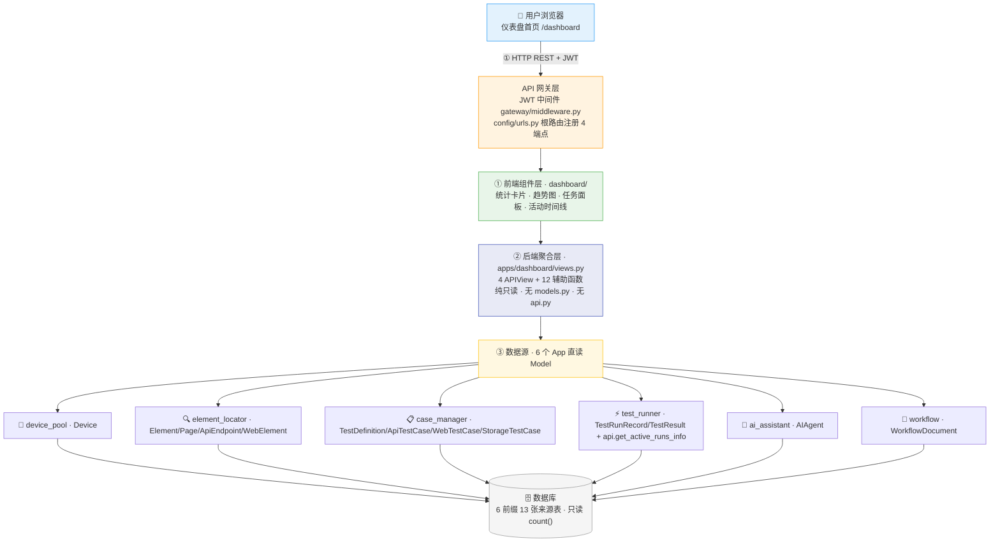
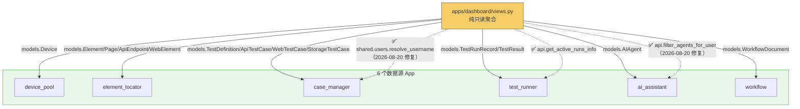
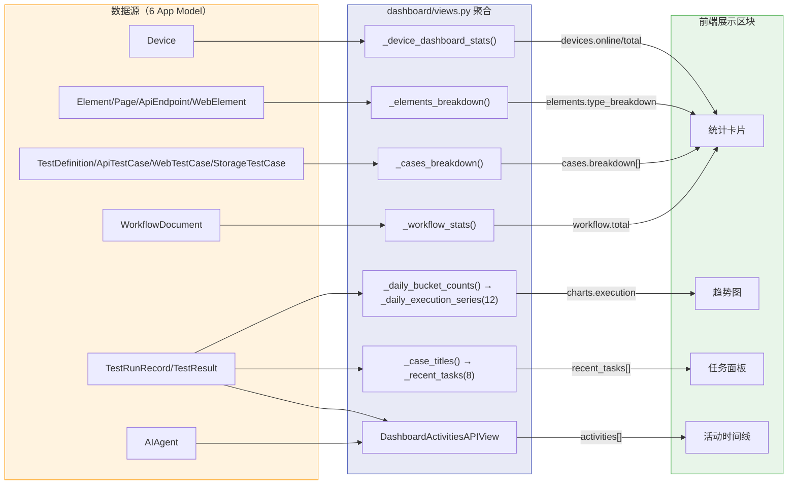
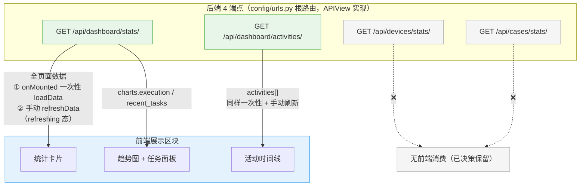

# ARCH-01 — 仪表盘 (Dashboard)

> **版本**：v1.7 · **日期**：2026-08-21 · **关联模块**：`apps/dashboard/` · 前端 `frontend/src/modules/dashboard/`

## 文档内容简述

本文档是**仪表盘模块**的架构设计，覆盖该模块而非平台全貌：

- **架构四图**：架构全景图 · 模块包图 · 数据流图 · API 关系图（§1.2~1.5）
- **后端架构**：文件结构 + 聚合查询设计（§3）
- **API 设计**：4 REST 端点 + 响应格式（§4）
- **模块边界**：只读规则 + 跨模块依赖（§5）

## 你能从文档获取什么信息

- **仪表盘如何聚合**：跨 6 个 App 只读查询，无自有表、无写操作
- **数据链路**：数据源 Model → 聚合函数 → 字段 → 前端组件的完整链路
- **端点消费与同步**：哪 2 个端点前端在用、哪 2 个后端-only，以及数据同步方式
- **边界与隐患**：历史 2 处跨模块内部 import 违规已于 2026-08-20 修复（fix-cross-app-firewall：`filter_agents_for_user→ai_assistant.api`、`resolve_username→shared/users.py`）；历史 4 处前后端契约不匹配已于 v1.6 全部修复

## 关联文档

- **架构总纲**：[`ARCH-00-平台总体架构`](./ARCH-00-平台总体架构.md) §3.2（dashboard 行）· §4.1 写收敛 · §二 L3
- **需求规格**：[`PRD-01-仪表盘`](../02-PRD需求/PRD-01-仪表盘.md) — **契约以 PRD §5~§6 为准**

---

## 1. 模块架构概览

### 1.1 架构定位

仪表盘是平台的 **首页聚合层**，负责跨 6 个 App 的只读统计与导航入口。仪表盘 **不拥有业务写操作，不创建数据库表**——它是一个纯聚合查询和展示模块。

### 1.2 架构全景图

> 四层：前端组件 → API 网关 → 后端聚合 → 数据源（6 App 直读 Model）→ 数据库。



> v1.6：数据源 7→6（`report_generator` 的 `reports.total` 字段已于契约清理中移除，仪表盘不再读取 `rg_reports`，详见 PRD §5.6 口径存档）。

### 1.3 模块包图

> 箭头 = import 方向。实线 = 跨 App 读 Model（✅ 合法）；虚线 = 特殊（api ✅ / 内部实现 ⚠️）。



**防火墙规则**：

```
dashboard ──✅ import──→ 各 App models（只读 Model 查询）
dashboard ──✅ import──→ 各 App api.py（test_runner.api.get_active_runs_info · ai_assistant.api.filter_agents_for_user）
dashboard ──✅ import──→ shared.users（resolve_username，2026-08-20 下沉）
dashboard ──❌ import──→ 各 App 内部实现（permissions / views_helpers）← 历史 2 处违规已于 2026-08-20 修复（fix-cross-app-firewall）
dashboard ──❌ 任何写操作（无 models.py · 无 api.py · 视图内无 save/create/update/delete）
```

### 1.4 数据流图

> 6 数据源 Model → 后端聚合函数 → 响应字段 → 前端组件。



### 1.5 API 关系图

> 4 端点 → 前端组件的映射，标注组件状态变化与数据同步方式。



**状态变化与数据同步**：

| 数据 | 同步方式 |
|------|------|
| 全部仪表盘数据 | **静态一次性加载**（`onMounted` 调 `loadData`）+ **手动「刷新」按钮**（`refreshData`）。无定时轮询、无 WebSocket、无 SSE。 |
| `recent_tasks` 中「执行中」任务 | 每次刷新实时调 `test_runner.api.get_active_runs_info()`（读内存 `_active_runs`） |
| `last_updated` / `system_status` | 每次响应由后端计算（`timezone.now()`），前端仅展示快照 |

**前后端契约不匹配（历史 4 处，v1.6 已全部修复）**：

| # | 字段 | 现象 | 状态 |
|---|---|---|---|
| 1 | `pass_rate` | 后端计算并返回，前端无组件渲染 | ✅ 已移除（PRD v5.3） |
| 2 | `charts.devices/cases/pass_rate` | 后端返回 3 组 12 天趋势，前端只声明/消费 `charts.execution` | ✅ 已移除（PRD v5.3） |
| 3 | `elements.breakdown` | 后端返回按页面分组，前端实际用 `type_breakdown` | ✅ 已移除（PRD v5.3） |
| 4 | `ActivityItem.type` | 后端返回 `run`/`agent`，前端类型定义为 `success/warning/error/info`，时间线着色失效 | ✅ 已修复（v1.6：前端类型与时间线样式对齐 run/agent） |

---

## 3. 后端架构

### 3.1 文件结构

```
apps/dashboard/
├── views.py            386 行 · 4 APIView + 12 辅助函数（纯聚合）
├── urls.py             路由注册（4 端点 → APIView.as_view()）
└── apps.py             verbose_name='仪表盘'

注意: 无 models.py — dashboard 不创建数据库表
```

> 行数说明：386 行 > views.py 300 行上限，处于 🟠 关注级（未超 1.5 倍 450），下个 PRD 评估拆分；聚合辅助函数亦可迁至 `service.py`。

### 3.2 聚合查询设计

```python
# dashboard/views.py — 核心结构（386 行）

class DashboardStatsAPIView(APIView):
    """GET /api/dashboard/stats/ — 平台级统计总览（实测 27 条 SQL · 进程内 ~30ms）"""
    def get(self, request):
        device_online, device_total = _device_dashboard_stats()  # 在线/总数
        cases_breakdown = _cases_breakdown(user_id)              # 4 类用例（8 条）
        case_total = sum(r["total"] for r in cases_breakdown)    # 总数由 breakdown 派生（单一数据源）
        charts = _daily_execution_series(12)                     # 近 12 天成功/失败（2 条分组查询）
        tasks = _recent_tasks(8)                                 # 最近 8 任务（批量，无 N+1）
        ...

class DashboardActivitiesAPIView(APIView):
    """GET /api/dashboard/activities/ — 最近动态（2 条 SQL）"""

class DeviceStatsAPIView(APIView):
    """GET /api/devices/stats/ — 设备池统计（前端未消费，已决策保留）"""

class CaseStatsAPIView(APIView):
    """GET /api/cases/stats/ — 用例统计（前端未消费，已决策保留）"""

# 关键辅助函数
_daily_bucket_counts(queryset, days)   # 自然日分组计数零填充（1 条 SQL 替代逐日循环）
_case_titles(case_ids)                 # 批量标题查询（消除 N+1）
_case_result_status(passed, failed)    # 任务状态派生（idle/success/failed/partial）
_safe_count(...)                       # 表缺失时计 0（降级规则）
```

**聚合查询性能实测**（2026-08-14，SQLite · 最大表 337 行）：

| 端点 | SQL 条数 | 进程内耗时 | 说明 |
|------|:--:|:--:|------|
| `stats` | 27 | ~30ms | 优化前 130 条/85ms（逐日循环 60 条 + N+1 25 条 + 冗余字段 40 条） |
| `activities` | 2 | ~6ms | 已最简 |
| `devices/stats` / `cases/stats` | 3 / 12 | — | 仅被请求时执行 |

> 端到端 HTTP 耗时 ≈ 固定开销（JWT 中间件等 ~240ms）+ 聚合耗时；PRD §7 目标 ≤1s 达标。
> 优化手段：逐日循环 → 自然日分组查询；N+1 → 批量查询；冗余字段 → 契约清理（口径存档见 PRD §5.6）。

---

## 4. API 设计

> 响应信封统一 `{status, data}` / `{status, message}`；字段 snake_case。**完整字段契约（字段表/约束/示例）以 PRD §5.2~5.5 为准**，本节只列概览。

### 4.1 REST 端点 (4 个)

| 方法 | 路径 | 说明 | 数据源 |
|------|------|------|------|
| `GET` | `/api/dashboard/stats/` | 统计概览 + 执行趋势 + 任务结果 + 页脚状态（27 条 SQL） | 6 个 App 聚合（`_cases_breakdown` + `_daily_execution_series` + `_recent_tasks` 等） |
| `GET` | `/api/dashboard/activities/` | 最近活动时间线（2 条 SQL） | test_runner + ai_assistant |
| `GET` | `/api/devices/stats/` | 设备池状态分布统计 | device_pool（前端未消费，已决策保留） |
| `GET` | `/api/cases/stats/` | 用例启用/禁用分布统计 | case_manager（前端未消费，已决策保留） |

### 4.2 响应格式

```json
{
  "status": true,
  "data": {
    "devices": { "online": 2, "total": 3 },
    "cases": { "total": 45, "enabled": 40, "breakdown": [ { "type": "ui_automation", "label": "Android", "total": 20, "enabled": 18 } ] },
    "elements": { "total": 120, "pages": 6, "type_breakdown": [ { "type": "android", "label": "Android元素", "total": 80 } ] },
    "workflow": { "total": 12 },
    "runs": { "total": 30, "active": 1 },
    "agents": { "total": 3, "active": 2 },
    "charts": { "execution": { "labels": ["08/02"], "success": [0], "failed": [0] } },
    "execution_summary": { "passed": 210, "failed": 32 },
    "recent_tasks": [],
    "last_updated": "2026-08-14 10:00",
    "system_status": "normal"
  }
}
```

> 完整字段表（必填/约束/枚举/分类）与子表见 PRD §5.2；`/activities/`、`/devices/stats/`、`/cases/stats/` 见 PRD §5.3~5.5。

---

## 5. 模块边界与跨模块交互

### 5.1 边界规则

| 规则 | 说明 |
|------|------|
| **纯只读** | 不对任何业务表执行 INSERT/UPDATE/DELETE |
| **无自有数据表** | 不创建 `models.py` |
| **不绕过 API** | 通过 Django ORM 查询（不是 HTTP 调用其他模块） |
| **跨模块 import** | `from apps.xxx.models import XXX` |

### 5.2 跨模块依赖

| 数据来源 | 查询内容 |
|------|------|
| `apps.device_pool.models.Device` | 在线设备数、设备总数、系统状态判定 |
| `apps.element_locator.models.Element / WebElement / ApiEndpoint / Page` | 三类元素计数、页面总数 |
| `apps.case_manager.models.TestDefinition / ApiTestCase / WebTestCase / StorageTestCase` | 4 类用例计数（按可见性过滤） |
| `apps.test_runner.models.TestRunRecord / TestResult` + `api.get_active_runs_info` | 运行中任务、执行趋势、执行摘要、任务结果列表、最近动态 |
| `apps.ai_assistant.models.AIAgent` | 智能体总数/活跃数、最近动态 |
| `apps.workflow.models.WorkflowDocument` | 工作流文档总数 |

> v1.6：`report_generator` 已不再被读取（`reports.total` 字段于契约清理中移除，口径存档见 PRD §5.6）。

---

## 6. 设计要点

| 要点 | 说明 |
|------|------|
| 无 AgentScope Tool | Dashboard 是纯前端功能，不需要 AI 调用 |
| 路由 `/dashboard` | 平台首页（登录后进入） |
| 聚合查询性能 | 分组查询 + 批量查询 + 单一数据源派生，实测 27 条 SQL/请求；PRD §7 目标 ≤1s 达标 |
| 数据刷新 | 前端 `onMounted` 一次性加载 + 手动刷新按钮；无轮询、无缓存、无 WebSocket/SSE |
| 契约治理 | 已移除字段口径存档于 PRD §5.6（重新启用无需考古代码） |

---

## 变更记录

| 版本 | 日期 | 变更摘要 |
|------|------|----------|
| v1.7 | 2026-08-21 | **五层口径回填 + 防火墙修复同步**：§1.2 图去旧 L2/L3 标签（AGG/SRC）；§1.3 包图 2 处 ⚠️ 改 ✅（2026-08-20 fix-cross-app-firewall：filter_agents_for_user→ai_assistant.api、resolve_username→shared/users.py）；防火墙 ASCII 同步；简述"边界与隐患"更新；关联指针改 §3.2/§4.1/§二 L3 |
| v1.0 | 2026-07-16 | 初始版本：基于 `项目架构.md` 和 `PRD-01-仪表盘.md` 重构 |
| v1.1 | 2026-07-16 | **代码对照审计**：API 路径修正为 `/api/dashboard/stats/` + `/api/devices/stats/` + `/api/cases/stats/`；函数名对齐实际 views.py |
| v1.3 | 2026-08-13 | 补绘架构四图（架构全景图/模块包图/数据流图/API关系图）；数据源 6→7 校正；标注 2 处跨模块 import 违规 + 4 处前后端契约不匹配 |
| v1.4 | 2026-08-13 | 移除「模块入口」（ModuleNavigator）；组件树校正为 3 区 11 卡；标题编号 ARCH-07 → ARCH-01 |
| v1.5 | 2026-08-13 | 抽象化：前端组件名 → 抽象角色（统计卡片/趋势图/任务面板/活动时间线）；移除前端组件树与 KPI 卡片表（归 PRD） |
| v1.6 | 2026-08-14 | **与 PRD v5.4 + 代码三方同步**：数据源 7→6（移除 report_generator）；函数视图 → APIView；聚合查询性能实测（130→27 条）；响应格式对齐实际契约；4 处契约不匹配全部修复；端点 3/4 标注已决策保留 |
