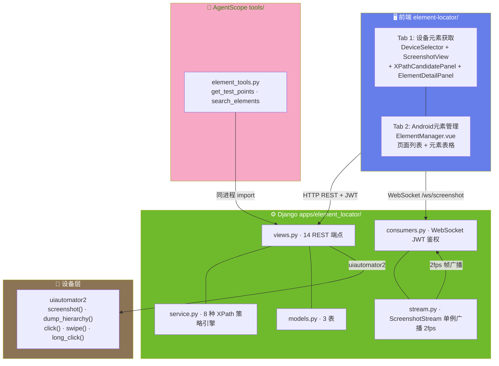
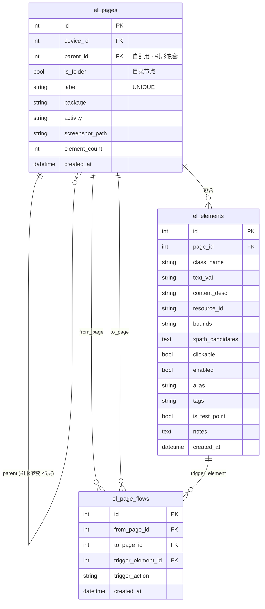
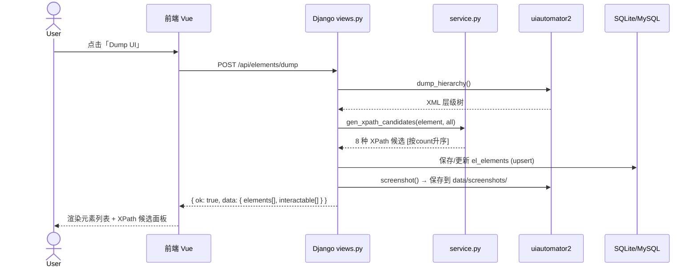
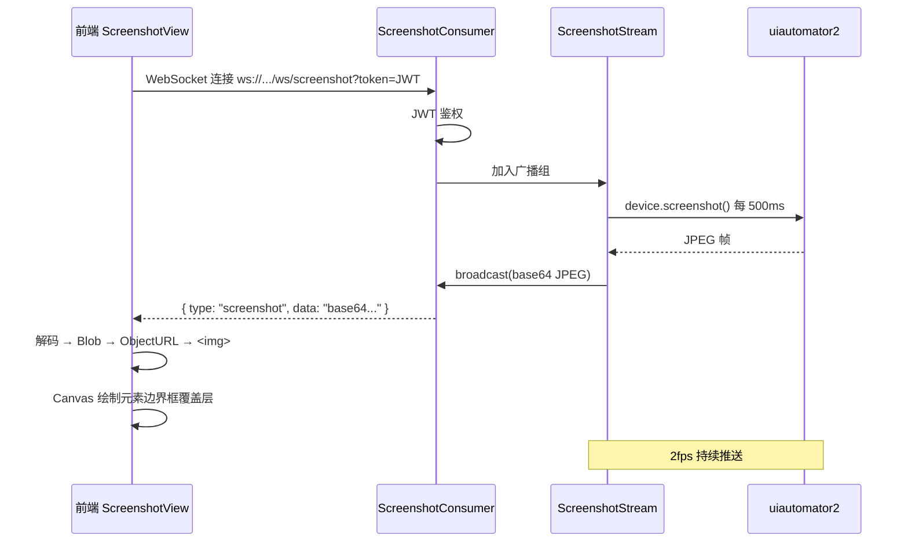

# ARCH-01 — 元素定位 (Element Locator)

> 关联模块：`apps/element_locator/` · 前端：`frontend/src/modules/element-locator/`
> 关联需求：[`PRD-01-元素定位`](../02-PRD需求/PRD-01-元素定位.md) · 关联架构：[`架构大纲`](./架构大纲.md) §4.2
> 版本：v1.0 · 日期：2026-07-16

---

## 1. 模块架构概览

### 1.1 架构定位

元素定位模块是平台的 **UI 元素发现与定位中枢**，在三层架构中位于后端层，是连接 Android 设备与自动化测试用例的桥梁。

```
设备层 (Android + uiautomator2)
      │
      ▼  截屏、Dump、点击、滑动
element-locator (本模块)
      │
      ▼  提供 Element (is_test_point=True) + XPath
case-manager (用例管理)
      │
      ▼  提供步骤 XPath
test-runner (执行引擎)
```

### 1.2 模块数据流架构图



---

## 2. 前端架构

### 2.1 组件树

```
frontend/src/modules/element-locator/
│
├── index.vue                     页面入口 · 双 Tab 布局
│   ├── Tab 1: 设备元素获取 (/elements)
│   │   ├── DeviceSelector.vue     设备下拉选择器 + Dump UI 按钮
│   │   ├── ScreenshotView.vue     截图画布 + 元素边界框覆盖层 (Canvas)
│   │   ├── XPathCandidatePanel.vue 8 种 XPath 候选列表 + 设备操作按钮
│   │   └── ElementDetailPanel.vue  元素属性详情面板
│   └── Tab 2: Android元素管理 (/element-mgr)
│       └── ElementManager.vue
│           ├── 页面列表 (左 300px)     页面 CRUD + 重命名 + 批量删除
│           └── 元素表格 (右)           别名编辑 + 测试点切换 + 筛选
│
├── api.js                        axios 请求封装
└── routes.js                     路由定义
```

### 2.2 关键前端组件

| 组件 | 行数 | 核心职责 |
|------|:--:|------|
| `ScreenshotView.vue` | ~300 | 实时截图渲染 + Canvas 覆盖层 + WebSocket 消费 + 点击命中测试 |
| `XPathCandidatePanel.vue` | ~250 | XPath 8 策略表格 + 复制 + 添加到用例 + 设备手势操作 |
| `ElementDetailPanel.vue` | ~150 | 6 个核心属性展示 + 空状态 |
| `ElementManager.vue` | ~350 | 页面列表 + 元素表格 + 筛选 Tab + 行内编辑 |
| `DeviceSelector.vue` | ~100 | 设备下拉选择 + Dump 按钮 + 30s 轮询 |

### 2.3 前端关键技术

| 技术点 | 实现方式 |
|------|------|
| **截图流渲染** | WebSocket 接收 base64 JPEG → Blob → ObjectURL → `` 显示，200ms 节流 |
| **元素覆盖层** | Canvas 随容器自适应缩放，三色绘制（蓝=普通/橙=悬停/红=选中） |
| **命中测试** | 点击截图时按最小面积包含算法匹配元素 bounds |
| **首帧兜底** | 挂载时并行：① REST `GET /api/elements/screenshot` ② WebSocket 连接 |
| **断连重连** | 3 秒间隔自动重连，显示倒计时 |
| **XPath 复制** | `navigator.clipboard.writeText` 优先，`execCommand('copy')` 降级 |
| **跨模块通信** | EventBus `add-step-to-case` → 一键发送 XPath 到用例编辑器 |

---

## 3. 后端架构

### 3.1 文件结构

```
apps/element_locator/
├── models.py           Page / Element / PageFlow 3 表（Page 支持树形嵌套，最多 5 层）
├── views.py            14 HTTP 端点 (510 行)
├── api.py              跨模块 __all__ 白名单
├── service.py           8 种 XPath 生成 + YAML dump
├── page_tree.py         页面目录树工具 — 嵌套层级校验（最多 5 层）
├── urls.py              路由注册
├── admin.py             Django Admin 注册
├── consumers.py         WebSocket JWT 鉴权 (ScreenshotConsumer)
├── stream.py            ScreenshotStream 单例 2fps 广播
├── apps.py              verbose_name='元素定位'
├── permissions.py       占位 (v2)
└── serializers.py       占位 (v2)
```

### 3.2 核心类设计

```
ScreenshotStream (单例)
  │
  ├── start(device)        启动截图线程
  │   └── while running:
  │         screenshot = device.screenshot()  ← u2
  │         broadcast(screenshot)              → 所有 Consumer
  │         sleep(0.5)  # 2fps
  │
  ├── broadcast(frame)     推送到所有连接的 Consumer
  ├── stop()              停止线程
  └── _instance (class)   全局唯一实例

ScreenshotConsumer (WebSocket)
  │
  ├── connect()            JWT 鉴权 → 加入 ScreenshotStream
  ├── receive()            接收前端消息 (切换设备)
  ├── disconnect()         离开 Stream
  └── send_frame()         推送截图帧 / device_changed / no_device / error
```

### 3.3 XPath 策略引擎

```
gen_xpath_candidates(element, all_elements) → List[{strategy, xpath, count}]

  输入: 单个 Element (16 属性) + 全量 Element 列表
  输出: 最多 8 个 XPath 候选，按匹配特异性 (count) 升序

  8 种策略:
  1. //{cls}[@resource-id='{rid}']           resource-id 唯一匹配
  2. //{cls}[@text='{txt}']                   text 匹配
  3. //{cls}[@content-desc='{desc}']          content-desc 匹配
  4. //{cls}                                  仅类名 (始终生成)
  5. (//{cls})[{pos}]                        索引定位 (标记 fragile)
  6. //{cls}[@resource-id='{rid}' and @text='{txt}']  组合定位
  7. //*[@resource-id='{rid}']               通配 + resource-id
  8. //*[@text='{txt}']                      通配 + text

  count = 在全量 all_elements 中匹配该 XPath 的元素数
  count=1 最优 (唯一定位)
```

---

## 4. API 设计

### 4.1 REST 端点 (14 个)

| 方法 | 路径 | 说明 | 请求体 |
|------|------|------|------|
| `POST` | `/api/elements/dump` | Dump 当前页面 UI 层级 | `{serial?}` |
| `POST` | `/api/elements/action` | 设备手势操作 | `{action, x, y, text?}` |
| `GET` | `/api/elements/device-info` | 获取设备信息 | — |
| `GET` | `/api/elements/screenshot` | REST 截图兜底 | — |
| | | **页面管理** | |
| `GET` | `/api/elements/pages` | 列出所有页面 | — |
| `POST` | `/api/elements/pages/create` | 创建新页面 | `{label, package?, activity?}` |
| `POST` | `/api/elements/pages/clear` | 清空所有页面和元素 | — |
| `POST` | `/api/elements/pages/batch-move` | 批量移动页面 | `{page_ids, target_id?}` |
| `GET` | `/api/elements/pages/{id}` | 页面详情 | — |
| `GET` | `/api/elements/pages/{id}/items` | 页面下元素列表 | `?filter=` |
| `POST` | `/api/elements/pages/{id}/elements` | 向页面添加/更新元素 | `{elements[]}` |
| `PUT` | `/api/elements/items/{id}` | 更新元素属性 | `{alias?, tags?, notes?, is_test_point?}` |
| | | **页面跳转流** | |
| `GET` | `/api/elements/flows` | 列出跳转流 | — |
| `POST` | `/api/elements/flows` | 创建跳转流 | `{from_page, to_page, trigger_element}` |
| `POST` | `/api/elements/flows/{id}` | 删除跳转流 | — |

### 4.2 WebSocket 端点 (1 个)

| 路径 | 协议 | 消息类型 |
|------|------|------|
| `/ws/screenshot?token=JWT` | WebSocket | `screenshot` (base64 JPEG) · `device_changed` · `no_device` · `screenshot_error` |

### 4.3 统一响应格式

```json
{ "ok": true, "data": { ... } }
{ "ok": false, "error": "错误描述" }
```

---

## 5. 数据模型

### 5.1 ER 图



### 5.2 表详情

#### el_pages (页面快照表)

| 字段 | 类型 | 约束 | 说明 |
|------|------|------|------|
| `id` | BigAutoField PK | AUTO | 自增 |
| `device` | FK→dp_devices | SET_NULL | Dump 时设备 |
| `parent` | FK→self | SET_NULL | 父页面（支持页面树，最多 5 层） |
| `is_folder` | BOOL | False | 是否为目录节点（非叶子页） |
| `label` | VARCHAR(500) | UNIQUE | 页面名称 |
| `package` | VARCHAR(500) | — | Android 包名 |
| `activity` | VARCHAR(500) | — | Activity 类名 |
| `screenshot_path` | VARCHAR(1000) | — | 截图文件路径 |
| `element_count` | INT | 0 | 元素数量 |
| `created_at` | DateTime | auto_now_add | 创建时间 |

#### el_elements (UI 元素表)

| 字段 | 类型 | 约束 | 说明 |
|------|------|------|------|
| `id` | BigAutoField PK | AUTO | 自增 |
| `page` | FK→el_pages | CASCADE | 所属页面 |
| `class_name` | VARCHAR(500) | — | 控件类名 (e.g. Button, TextView) |
| `text_val` | VARCHAR(2000) | — | 元素文本 |
| `content_desc` | VARCHAR(2000) | — | 无障碍描述 |
| `resource_id` | VARCHAR(500) | — | Android resource-id |
| `bounds` | VARCHAR(200) | — | `[x1,y1][x2,y2]` |
| `xpath_candidates` | TEXT | `'[]'` | 8 种 XPath JSON |
| `clickable` | BOOL | — | 可点击 |
| `enabled` | BOOL | — | 可用 |
| `alias` | VARCHAR(500) | — | 中文别名 |
| `tags` | VARCHAR(500) | — | 标签 |
| `is_test_point` | BOOL | False | 测试点标记 |
| `notes` | TEXT | — | 备注 |
| `created_at` | DateTime | auto_now_add | 创建时间 |

> **唯一约束**: `UNIQUE(page_id, resource_id, bounds)` — 同页面同 resource-id 同位置的元素视为重复，upsert 更新。

#### el_page_flows (页面跳转流表)

| 字段 | 类型 | 约束 | 说明 |
|------|------|------|------|
| `id` | BigAutoField PK | AUTO | 自增 |
| `from_page` | FK→el_pages | CASCADE | 起始页 |
| `to_page` | FK→el_pages | CASCADE | 目标页 |
| `trigger_element` | FK→el_elements | SET_NULL | 触发跳转的元素 |
| `trigger_action` | VARCHAR(50) | `'click'` | 触发动作 |
| `created_at` | DateTime | auto_now_add | 创建时间 |

---

## 6. 交互时序

### 6.1 Dump 流程



### 6.2 截图流推送



---

## 7. 模块边界与跨模块交互

### 7.1 边界规则

| 规则 | 说明 |
|------|------|
| 只通过 api.py 暴露接口 | `__all__` 白名单控制，防止内部实现泄露 |
| 设备操作委托 device_pool | 不直接管理 u2 连接，通过 `device_pool.pool.DevicePool` |
| XPath 生成幂等 | 同 page + resource-id + bounds 的 upsert 语义 |
| 截图最多保留 3 张 | Dump 时自动删除旧截图，防止磁盘膨胀 |

### 7.2 对外接口 (api.py)

```python
# 供 case-manager 使用
def get_test_points(page_ids=None) -> QuerySet[Element]
def get_elements_by_page(page_id) -> QuerySet[Element]

# 供 AgentScope element_tools.py 使用
def search_elements(query: str) -> list[dict]
def fetch_page_elements(page_id: int) -> list[dict]

# 供 dashboard 统计使用
def get_element_count() -> int
def get_page_count() -> int
```

### 7.3 跨模块交互

| 消费方 | 交互方式 | 数据流向 |
|------|------|------|
| **case-manager** | EventBus `add-step-to-case` + `is_test_point` 查询 | el_elements → cm_test_definitions.steps_json |
| **AI 助手** | AgentScope `get_test_points` / `search_elements` Tool | el_elements → AI 对话上下文 |
| **dashboard** | 聚合查询 | el_elements.count / el_pages.count → 统计卡片 |
| **device-pool** | 提供 u2 连接 | dp_devices.current_serial → u2.connect() |

---

## 8. 关键约束与故障处理

| 场景 | 处理策略 |
|------|------|
| WebSocket 断连 | 前端 3 秒自动重连，显示重连倒计时 |
| 截图失败 | WS 发送 `screenshot_error`，前端显示错误态 |
| 设备离线 | WS 发送 `no_device`，前端占位提示「请选择设备」 |
| Dump XML 截断 | `rfind(">")` 截断修复，失败抛 RuntimeError |
| 重复创建页面 | label 唯一性校验，返回 400 |
| 重复添加元素 | upsert 更新元数据（不创建重复记录） |
| 首帧加载慢 | REST 截图 GET /api/elements/screenshot 并行请求兜底 |
| 清空操作 | 二次确认弹窗，CASCADE 删除全部 |

---

## 变更记录

| 版本 | 日期 | 变更摘要 |
|------|------|----------|
| v1.0 | 2026-07-16 | 初始版本：基于 `项目架构.md` 和 `PRD-01-元素定位.md` 重构为独立架构文档 |
| v1.1 | 2026-07-16 | **代码对照审计**：el_pages 补全 `parent` FK + `is_folder`；新增 `page_tree.py` 目录树工具 |
