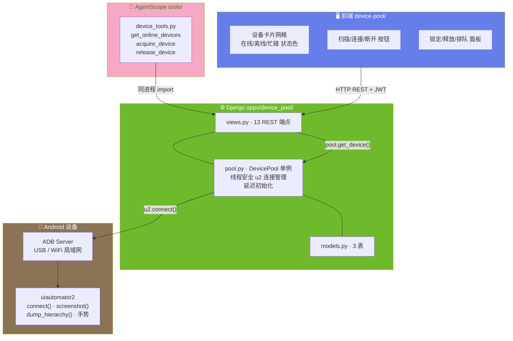
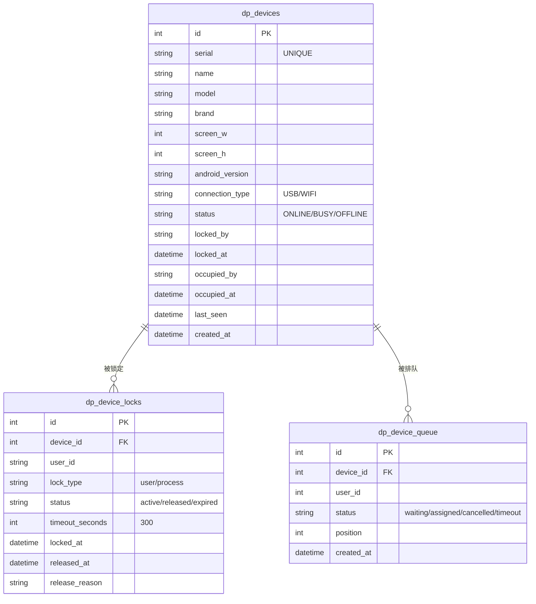
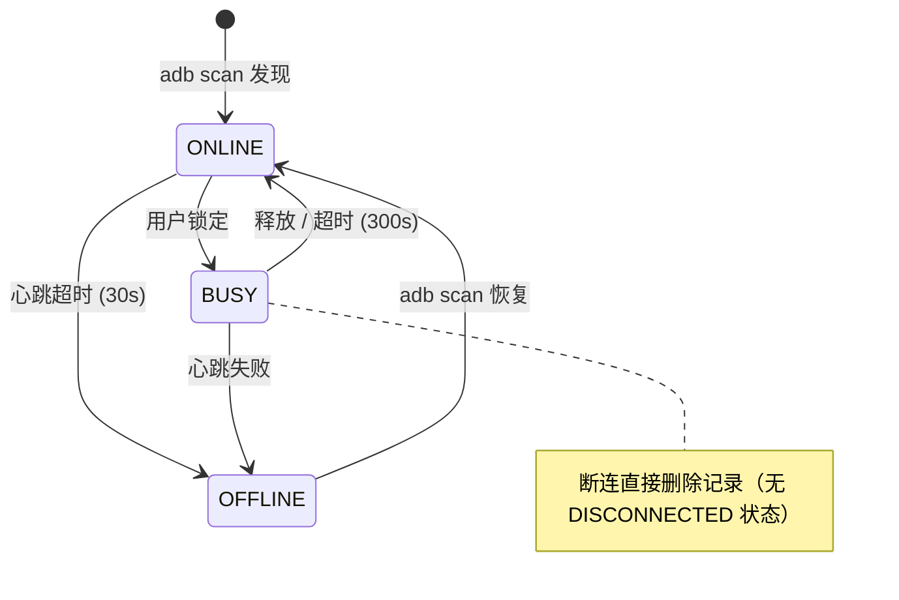
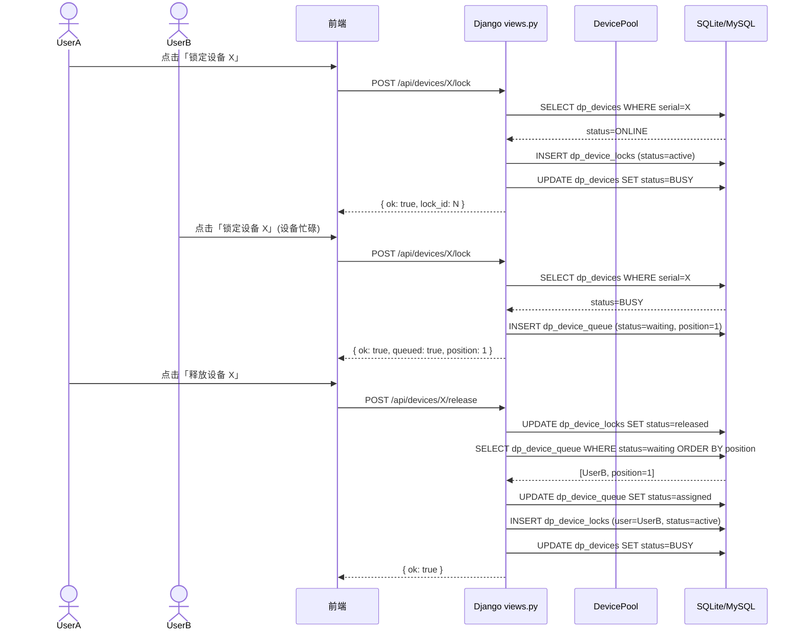
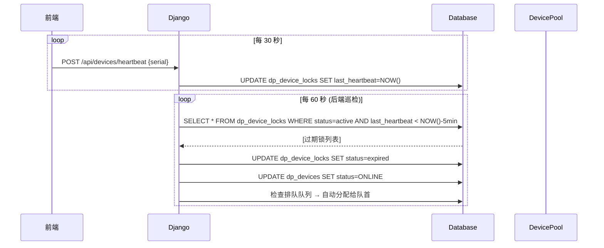

# ARCH-02 — 设备管理 (Device Pool)

> 关联模块：`apps/device_pool/` · 前端：`frontend/src/modules/device-pool/`
> 关联需求：[`PRD-02-设备管理`](../02-PRD需求/PRD-02-设备管理.md) · 关联架构：[`架构大纲`](./架构大纲.md) §4.1
> 版本：v1.0 · 日期：2026-07-16

---

## 1. 模块架构概览

### 1.1 架构定位

设备管理模块是平台的 **设备基础设施层**，在三层架构中处于后端层最底层——它是唯一直接与 Android 设备通信的模块。其他所有模块通过它获取设备能力。

```
device-pool (本模块 — 基础设施)
      │
      ├──→ element-locator    提供 u2 连接 (截屏/Dump/手势)
      ├──→ test-runner        提供设备锁 (独占执行)
      └──→ AI 助手            提供设备查询/锁定/释放 Tool
```

### 1.2 模块数据流架构图



---

## 2. 前端架构

### 2.1 组件树

```
frontend/src/modules/device-pool/
│
├── index.vue                     页面入口 · 设备卡片网格布局
│   ├── 设备卡片区
│   │   └── DeviceCard.vue (×N)   单设备卡片
│   │       ├── 设备状态标签        ONLINE(绿) / BUSY(黄) / OFFLINE(红)
│   │       ├── 设备信息            型号 · 序列号 · 分辨率 · Android 版本
│   │       ├── 锁状态与用户        当前锁定用户 + 倒计时
│   │       └── 操作按钮            锁定/释放/断开/连接/加入排队
│   ├── 顶部操作栏
│   │   ├── 扫描按钮               POST /api/devices/scan
│   │   └── 当前锁定设备面板        GET /api/devices/current
│   └── 排队面板
│       └── QueuePanel.vue         排队列表 · 取消排队
│
├── api.js                        axios 请求封装
└── routes.js                     路由定义
```

### 2.2 设备状态 UI

| 状态 | 颜色 | 卡片样式 | 可执行操作 |
|------|:--:|------|------|
| `ONLINE` | 🟢 绿 | 实线卡片 | 锁定、断开 |
| `BUSY` | 🟡 黄 | 实线卡片 | 加入排队、释放(锁定者) |
| `OFFLINE` | 🔴 红 | 虚线卡片 | 重新连接、移除 |

---

## 3. 后端架构

### 3.1 文件结构

```
apps/device_pool/
├── models.py           dp_devices / dp_device_locks / dp_device_queue 3 表
├── views.py            13 HTTP 端点
├── api.py              跨模块 __all__ 白名单
├── pool.py             DevicePool 单例 — 线程安全 u2 连接管理
├── urls.py             路由注册
├── admin.py            Django Admin 注册
└── apps.py             verbose_name='设备管理'
```

### 3.2 DevicePool 单例设计

```
DevicePool (线程安全单例)
  │
  ├── _devices: dict[str, DeviceWrapper]     serial → wrapper
  │   └── DeviceWrapper
  │       ├── serial: str
  │       ├── _device: u2.Device | None      ← 延迟初始化
  │       ├── .d (property)                   ← 首次访问时才 u2.connect()
  │       └── last_heartbeat: datetime
  │
  ├── get_device(serial) → DeviceWrapper     获取或创建 wrapper
  ├── remove_device(serial)                  断开并移除
  ├── scan() → list[str]                     adb devices 扫描
  └── connect(serial, addr?) → DeviceWrapper  USB 或 WiFi 连接
```

**延迟初始化机制**：`DeviceWrapper.d` 是 property，首次访问时才调用 `u2.connect()`。这样设备注册后不会立即连接，只有真正需要截屏/Dump 时才建立连接，避免浪费 ADB 资源。

---

## 4. API 设计

### 4.1 REST 端点 (13 个)

| 方法 | 路径 | 说明 | 关键参数 |
|------|------|------|------|
| `GET` | `/api/devices/` | 列出所有设备及状态 | — |
| `POST` | `/api/devices/scan` | 扫描 ADB 设备 | — |
| `POST` | `/api/devices/{serial}` | 连接设备（注册到设备池） | `{addr?}` WiFi 地址 |
| `POST` | `/api/devices/{serial}/disconnect` | 断开设备连接 | — |
| `POST` | `/api/devices/{serial}/activate` | 激活设备 | — |
| `POST` | `/api/devices/{serial}/lock` | 锁定设备（独占分配） | — |
| `POST` | `/api/devices/{serial}/release` | 释放设备锁 | — |
| `GET` | `/api/devices/current` | 当前用户锁定的设备 | — |
| `POST` | `/api/devices/heartbeat` | 心跳上报 | — |
| `GET` | `/api/devices/queue` | 查看排队状态 | — |
| `POST` | `/api/devices/{serial}/queue` | 加入排队 | — |
| `POST` | `/api/devices/{serial}/queue/leave` | 离开排队 | — |
| `POST` | `/api/devices/{serial}/disconnect-observe` | 断开观察 | — |

---

## 5. 数据模型

### 5.1 ER 图



### 5.2 设备状态机



### 5.3 排队调度逻辑

```
用户请求锁定设备
  │
  ├── 设备 ONLINE → 立即锁定 → 状态 BUSY
  │
  └── 设备 BUSY → 加入等待队列 → 状态 waiting
                    │
                    ▼
              设备释放时:
                检查队列中 waiting 用户
                  → FIFO 出队 → 状态 assigned
                  → 自动锁定 → 设备 BUSY
```

---

## 6. 交互时序

### 6.1 设备锁定与排队流程



### 6.2 心跳监控



---

## 7. 模块边界与跨模块交互

### 7.1 边界规则

| 规则 | 说明 |
|------|------|
| 仅管理连接与锁 | 不关心设备上跑什么用例、什么元素 |
| 锁审计日志永不删除 | 通过 `status` (active/released/expired) 追踪生命周期 |
| 同时最多 1 个活跃锁 | 数据库 UNIQUE 约束保证 |
| 超时 300s 自动释放 | 心跳 30s × 10 次无响应 → expired |
| 设备操作通过 api.py | 不直接 import pool.py |

### 7.2 对外接口 (api.py)

```python
def get_online_devices() -> QuerySet[Device]
def acquire_device(serial: str, user_id: int) -> dict
def release_device(serial: str, user_id: int) -> bool
def get_current_device(user_id: int) -> Device | None
def is_device_locked_by_user(serial: str, user_id: int) -> bool
```

### 7.3 跨模块消费者

| 消费方 | 调用方式 | 用途 |
|------|------|------|
| **element-locator** | `pool.DevicePool().get_device(serial)` | 截屏、Dump、手势操作 |
| **test-runner** | `api.acquire_device()` / `api.release_device()` | 执行前锁定、执行后释放 |
| **AI 助手** | `get_online_devices` / `acquire_device` / `release_device` (3 Tool) | 自然语言设备操控 |
| **dashboard** | `Device.objects.count()` | 设备在线数统计 |

---

## 8. 关键约束

| 约束 | 实施位置 | 说明 |
|------|:--:|------|
| serial 唯一 | `models.py` UNIQUE | 同一设备不能重复注册 |
| 同时仅 1 个活跃锁 | `dp_device_locks` UNIQUE(device, status=active) | 数据库级并发控制 |
| 心跳超时 300s | `views.py` + 巡检 | 断连自动恢复 |
| FIFO 队列 | `views.py` ORDER BY position | 公平分配 |
| 锁审计不删除 | 代码逻辑 | 只标记 status，不 DELETE |

---

## 变更记录

| 版本 | 日期 | 变更摘要 |
|------|------|----------|
| v1.0 | 2026-07-16 | 初始版本：基于 `项目架构.md` 和 `PRD-02-设备管理.md` 重构 |
| v1.1 | 2026-07-16 | **代码对照审计**：dp_devices 补全 name/brand/screen_w/h/locked_by/occupied_by 等字段；dp_device_locks 补全 lock_type/timeout_seconds/release_reason |
