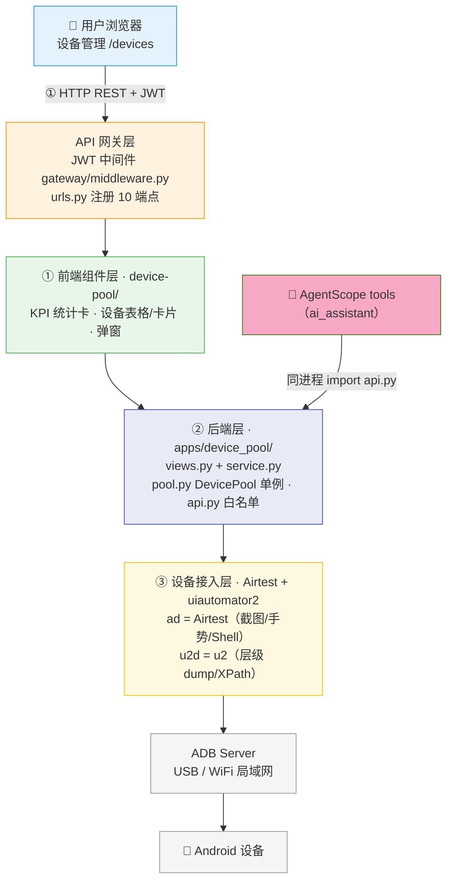
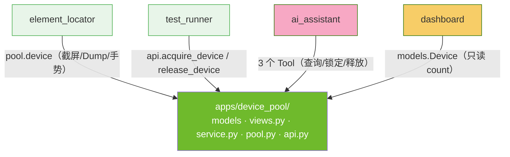
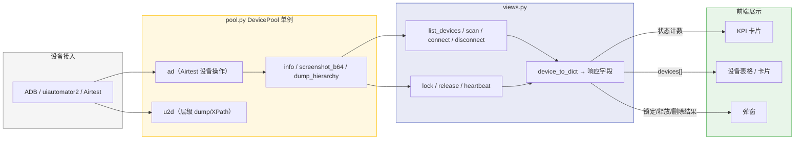
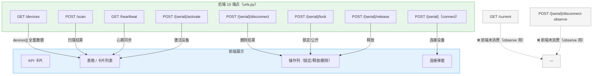
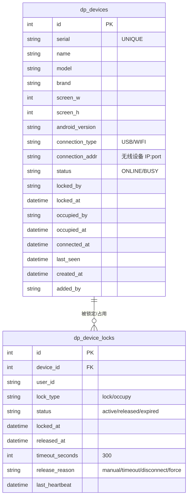
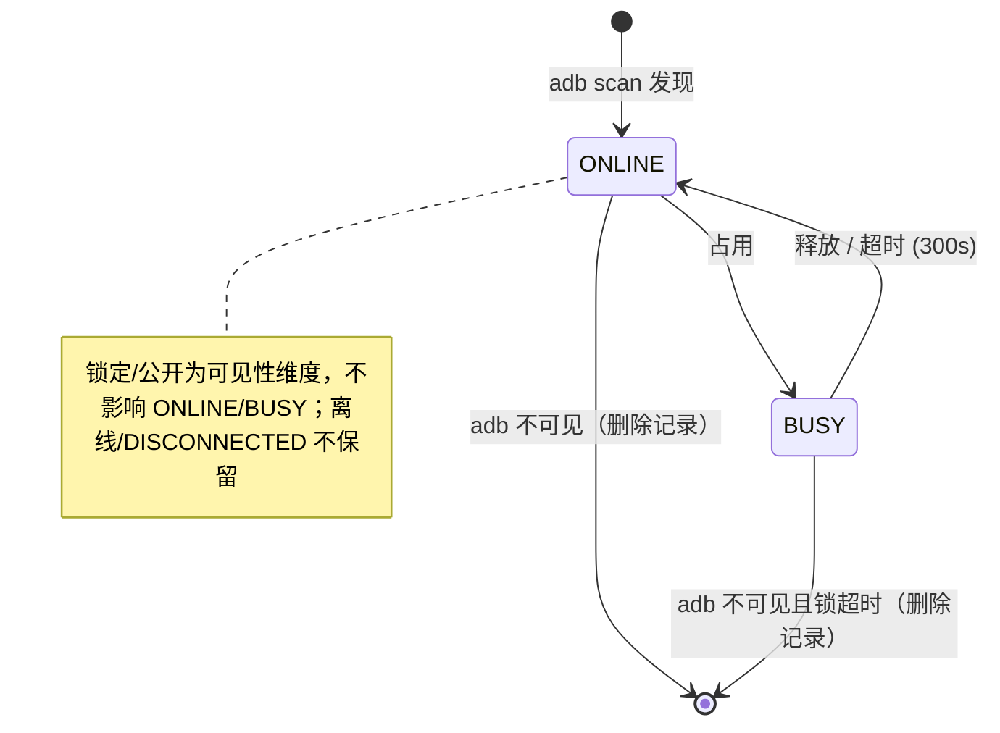

# ARCH-02 — 设备管理 (Device Pool)

> **版本**：v2.0 · **日期**：2026-08-14 · **关联模块**：`apps/device_pool/` · 前端 `frontend/src/modules/device-pool/`

## 文档内容简述

本文档是**设备管理模块**的架构设计，覆盖该模块而非平台全貌：

- **架构四图**：架构全景图 · 模块包图 · 数据流图 · API 关系图（§1.2~1.5）
- **后端架构**：views.py + service.py 结构 + DevicePool 单例双连接设计（§3）
- **API 设计**：10 REST 端点 + 响应格式（§4）
- **数据模型**：2 表 ER 图 + 设备状态机（§5）

## 你能从文档获取什么信息

- **设备管理如何接入设备**：DevicePool 单例（Airtest + uiautomator2 双连接）的职责划分
- **数据链路**：ADB 设备 → DevicePool → views → 前端组件的完整链路
- **端点消费**：10 端点中前端消费 8，`/current` 与 `/disconnect-observe` 供 observe 场景

## 关联文档

- **架构总纲**：[`ARCH-00-平台总体架构`](./ARCH-00-平台总体架构.md) §4.2
- **需求规格**：[`PRD-02-设备管理`](../02-PRD需求/PRD-02-设备管理.md) — **契约以 PRD §5 为准**

---

## 1. 模块架构概览

### 1.1 架构定位

设备管理是平台的 **设备基础设施层**，在三层架构中处于后端层最底层——它是唯一直接与 Android 设备通信的模块。其他模块（element-locator、test-runner、AI 助手）通过它获取设备能力。设备管理**拥有业务写操作**（扫描/连接/锁定/释放/断开），是平台仅有的两个 L4 全约束模块之一（与 workflow 并列）。

### 1.2 架构全景图

> 四层：前端组件 → API 网关 → 后端（views + DevicePool 单例）→ 设备接入（ADB/Airtest/u2）。



### 1.3 模块包图

> 箭头 = import 方向。device_pool 是唯一底层，**不 import 任何其他 App**；其他模块 import 它。



**防火墙规则**：

```
其他 App ──✅ import──→ device_pool.models（只读 Model 查询）
其他 App ──✅ import──→ device_pool.api.py（跨模块写操作白名单）
其他 App ──✅ import──→ device_pool.pool.device（设备操作单例）
device_pool ──❌ import──→ 任何其他 App（唯一底层）
```

### 1.4 数据流图

> ADB 设备 → DevicePool 单例 → views → 响应字段 → 前端组件。



### 1.5 API 关系图

> 10 端点 → 前端组件的映射，标注前端消费状态。



**数据同步方式**：

| 数据 | 同步方式 |
|------|------|
| 设备列表 | 首次 `loadDevices` + 手动「刷新」按钮 + **30s 心跳轮询**（`useHeartbeat`） |
| 状态同步 | 每次 list/heartbeat 触发 `update_device_status()`，同步 adb 真实状态到 DB |

**前后端契约（已对齐，2026-08-17）**：

设备离线即删除记录（后端 `update_device_status` 删除非 BUSY 离线设备），前端同步移除「离线」KPI 卡与筛选 tab——不存在 DISCONNECTED/离线持久态，此前登记的 DISCONNECTED 契约不匹配已消除。

---

## 3. 后端架构

### 3.1 文件结构

```
apps/device_pool/
├── models.py          2 表：Device / DeviceLock（dp_ 前缀）
├── views.py           DRF 入口（@api_view，10 端点，薄层只编排）
├── service.py         内部业务逻辑 + ORM 写操作（写收敛到此层）
├── api.py             跨模块写操作 __all__ 白名单（调 service）
├── pool.py            DevicePool 单例（线程安全 Airtest + u2 双连接）
├── urls.py            10 端点路由
├── admin.py           Django Admin
└── apps.py            verbose_name='设备管理'
```

### 3.2 DevicePool 单例设计（Airtest + u2 双连接）

```
DevicePool（线程安全单例）
  │
  ├── _airtest_instances: dict[str, Android]    serial → Airtest（设备操作）
  ├── _u2_instances: dict[str, u2.Device]       serial → uiautomator2（层级/XPath）
  ├── _connection_types: dict[str, str]         serial → USB/WIFI
  │
  ├── .ad  → Android(serialno=serial)    Airtest（截图/点击/滑动/App/Shell/文本）
  ├── .u2d → u2.connect(serial)          u2（dump_hierarchy/xpath）
  ├── .d   → 向后兼容，等同 .u2d
  │
  ├── info() → dict                       显示信息（2s 缓存）
  ├── screenshot_b64() → str              Airtest snapshot → PIL → base64 JPEG
  ├── screenshot_file(path)               保存截图到文件
  ├── dump_hierarchy() → list[dict]       u2 XML dump → 结构化节点（3 层降级 + 截断修复）
  ├── app_current() → dict                u2 获取当前 App
  │
  ├── action_click / longclick / swipe / drag / input   Airtest 手势/文本
  ├── switch_to(serial)                   切换当前设备
  └── remove_device(serial)               清理双连接缓存
```

**双连接架构**：Airtest 负责所有设备级操作（截图、点击、滑动、App 生命周期、Shell、文本输入），uiautomator2 仅保留 UI 层级 dump 和 XPath 查询。两者通过各自协议（ADB Minicap/Minitouch vs ATX Agent HTTP）独立工作。

**向后兼容**：`.d` 属性仍返回 u2 Device，所有通过 `device.d` 访问 u2 的旧代码无需修改。

---

## 4. API 设计

> 响应信封统一 `{status, data}` / `{status, message}`；字段 snake_case。**完整字段契约（字段表/约束/示例）以 PRD §5.2~5.14 为准**，本节只列概览。

### 4.1 REST 端点（10 个）

| 方法 | 路径 | 说明 | 前端消费 |
|------|------|------|:--:|
| `GET` | `/api/devices/` | 设备列表 + 当前设备 | ✅ |
| `POST` | `/api/devices/scan` | ADB 扫描注册 | ✅ |
| `GET` | `/api/devices/current` | 当前活动设备信息 | ❌ |
| `GET` | `/api/devices/heartbeat` | 心跳检测 + 状态同步 | ✅ |
| `POST` | `/api/devices/{serial}` | 连接设备 | ✅ |
| `POST` | `/api/devices/{serial}/disconnect` | 删除设备 | ✅ |
| `POST` | `/api/devices/{serial}/disconnect-observe` | 轻量断开（observe） | ❌ |
| `POST` | `/api/devices/{serial}/activate` | 激活设备 | ✅ |
| `POST` | `/api/devices/{serial}/lock` | 锁定 / 公开设备 | ✅ |
| `POST` | `/api/devices/{serial}/release` | 释放设备 | ✅ |

### 4.2 响应格式

```json
{
  "status": true,
  "devices": [
    {
      "id": 1,
      "serial": "emulator-5554",
      "model": "Pixel 8",
      "brand": "Google",
      "screen": "1080x2400",
      "status": "ONLINE",
      "connection_type": "USB",
      "locked_by": "",
      "occupied_by": "",
      "last_seen": "2026-08-14T10:00:00",
      "is_current": true,
      "remaining": 0
    }
  ],
  "current": "emulator-5554"
}
```

> 完整字段表（必填/约束/枚举）与子表见 PRD §5.2；其余端点见 PRD §5.3~5.11。

---

## 5. 数据模型

### 5.1 ER 图



### 5.2 设备状态机



---

## 6. 模块边界与跨模块交互

### 6.1 边界规则

| 规则 | 说明 |
|------|------|
| 仅管理连接与锁 | 不关心设备上跑什么用例、什么元素 |
| 锁定 / 公开 | 可见性维度（不改 status）；锁定 = 仅管理员 + 锁定者可见，公开 = 所有用户可见 |
| 锁审计永不删除 | 通过 `status`（active/released/expired）追踪生命周期 |
| 同时最多 1 个活跃锁 | 数据库 UNIQUE 约束保证 |
| 超时 300s 自动释放 | 心跳 30s 轮询，锁超时自动恢复 |
| 设备操作通过 DevicePool | 不直接 import u2/Airtest |
| 写操作走 api.py | 跨模块写不直接 ORM |

### 6.2 对外接口（api.py `__all__`）

```python
get_online_devices() -> list[Device]            # 只读查询
ensure_device(serial, name="") -> Device        # get_or_create
acquire_device(serial, user_id, timeout=300)    # 锁定（@transaction.atomic + select_for_update）
release_device(serial, reason="manual") -> bool # 释放
release_device_locks_for_device(device_obj, reason)  # 批量释放（崩溃恢复）
```

> `acquire_device` 使用 `@transaction.atomic` + `select_for_update()` 保证多进程并发安全。

### 6.3 跨模块消费者

| 消费方 | 调用方式 | 用途 |
|------|------|------|
| **element-locator** | `pool.device`（`get_device`） | 截屏、Dump、手势操作 |
| **test-runner** | `api.acquire_device()` / `api.release_device()` | 执行前锁定、执行后释放 |
| **AI 助手** | `get_online_devices` / `acquire_device` / `release_device`（3 Tool） | 自然语言设备操控 |
| **dashboard** | `Device.objects.count()` | 设备在线数统计（只读） |

---

## 7. 设计要点

| 要点 | 说明 |
|------|------|
| 双连接架构 | Airtest 负责设备操作，u2 仅做层级 dump/XPath，互不冲突 |
| 锁审计不删除 | DeviceLock 永不删除，通过 status 追踪，支持崩溃恢复 |
| 并发安全 | `select_for_update` + UNIQUE(device, active) 数据库级并发控制 |
| 状态同步 | list/heartbeat 触发 `update_device_status`，同步 adb 真实状态 |
| observe 模式 | connect/disconnect-observe 提供轻量连接，不锁定设备，供临时使用 |

---

## 变更记录

| 版本 | 日期 | 变更摘要 |
|------|------|----------|
| v1.0 | 2026-07-16 | 初始版本：基于 `项目架构.md` 和 `PRD-02-设备管理.md` 重构 |
| v1.1 | 2026-07-16 | 代码对照审计：dp_devices 补全字段；dp_device_locks 补全 lock_type/timeout_seconds/release_reason |
| v1.2 | 2026-07-17 | UI 重构：卡片网格 → 表格布局；JWT 一键锁定；新增锁定状态列 |
| v1.3 | 2026-07-17 | Airtest 迁移：DevicePool 双连接架构；acquire_device 加 @transaction.atomic |
| v2.0 | 2026-08-14 | 按仪表盘 ARCH 格式重构：补架构四图（全景/包图/数据流/API关系）；views.py → views/ 包；Pinia → composable；动森 → Doodle Craft；13 端点校正（前端消费 11）；状态机 DISCONNECTED 契约不匹配登记 |
| v2.1 | 2026-08-17 | DRF 化：views/ 包 → views.py（`@api_view` + `Response`）；写逻辑下沉 service.py；api.py 消除 api→views 倒挂；修 connect 用户锁误设 BUSY；信封统一 `{status,data}` |
| v2.2 | 2026-08-17 | 移除离线设备记录：设备离线即删除（BUSY 保护），前端移除「离线」KPI 卡与筛选 tab；状态机收敛为 ONLINE/BUSY 两态 |
| v2.3 | 2026-08-17 | 操作功能重构对齐 PRD：锁定改为「锁定/公开」可见性、释放改为「强制释放设备检查器占用」、断开改为「删除」；删除排队功能（端点 13→10、表 3→2）；设备唯一性改序列号（ro.serialno）+ 新增连接地址/连接时间点/添加人字段 |
