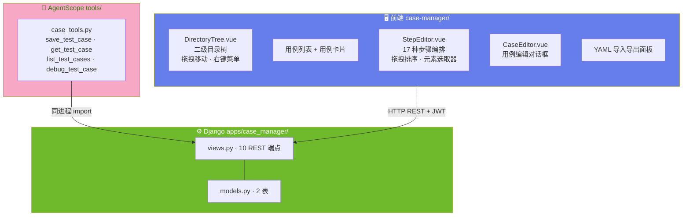
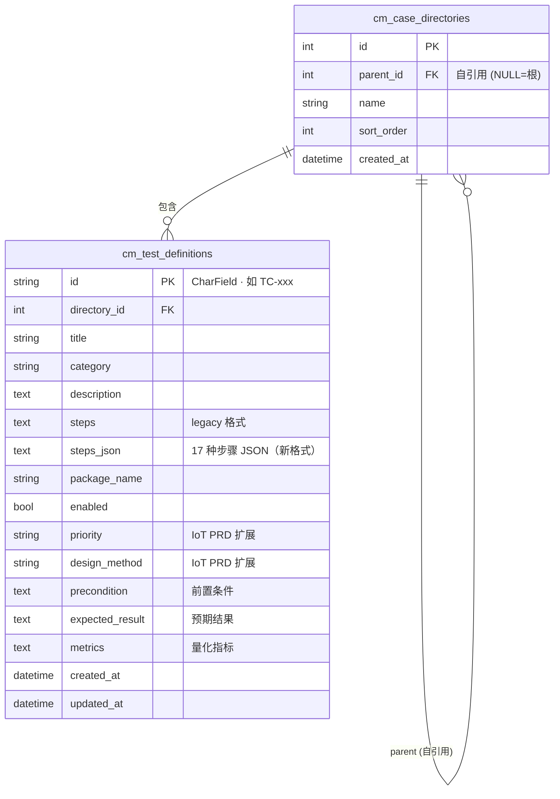

# ARCH-03 — 用例管理 (Case Manager)

> 关联模块：`apps/case_manager/` · 前端：`frontend/src/modules/case-manager/`
> 关联需求：[`PRD-03-用例管理`](../02-PRD需求/PRD-03-用例管理.md) · 关联架构：[`架构大纲`](./架构大纲.md) §4.3
> 版本：v1.0 · 日期：2026-07-16

---

## 1. 模块架构概览

### 1.1 架构定位

用例管理模块是平台的 **测试资产管理中枢**，负责测试用例的定义、编排、组织、导入导出。在三层架构中属于后端业务层，承上（接收元素定位的 XPath）启下（为执行引擎提供用例定义）。

```
element-locator → case-manager (本模块) → test-runner
                      ↑
                workflow (积木导入)
                AI 助手 (自然语言生成)
```

### 1.2 模块数据流架构图



---

## 2. 前端架构

### 2.1 组件树

```
frontend/src/modules/case-manager/
│
├── index.vue                           页面入口 · 左右分栏布局
│   ├── 左侧: 目录树 (300px)
│   │   └── DirectoryTree.vue (~929行)
│   │       ├── 二级目录层级             el-tree 组件
│   │       ├── 拖拽移动                 拖拽用例/子目录到目标目录
│   │       ├── 右键菜单                 新建/重命名/删除/移动/启用-禁用
│   │       └── 批量操作                 勾选 + 批量移动/删除
│   └── 右侧: 用例区
│       ├── 用例列表/卡片视图           搜索/筛选/排序
│       ├── 用例详情面板 (内联)         点击查看步骤，不跳转
│       ├── CaseEditor.vue              新建/编辑用例对话框
│       │   └── StepEditor.vue (~949行)
│       │       ├── 步骤类型选择器       17 种原子步骤
│       │       ├── 步骤参数配置         根据类型动态显示字段
│       │       ├── 拖拽排序             vuedraggable
│       │       ├── 元素选取器           加载 element-locator 的测试点元素
│       │       └── XPath 自动填入       EventBus 接收来自元素定位的数据
│       └── YAML 导入导出面板
│           ├── 导出测试点元素为 YAML
│           ├── YAML 文件批量导入 (≤500条)
│           └── 导出已生成文件列表
│
├── api.js                              axios 请求封装
└── routes.js                           路由定义
```

### 2.2 17 种步骤类型与 UI

| 类别 | 步骤类型 | 关键参数 | UI 控件 |
|------|------|------|------|
| **点击** | `click` | xpath, target_element | XPath 输入框 + 元素选取器 |
| | `click_indexed` | xpath, index | XPath + 索引输入 |
| | `retry_click` | xpath, max_retries, interval | XPath + 重试次数 + 间隔 |
| **等待** | `wait` | xpath, timeout | XPath + 超时时间 |
| | `wait_disappear` | xpath, timeout | XPath + 超时时间 |
| | `wait_any` | xpath_a, xpath_b, timeout | 两个 XPath + 超时 |
| | `wait_toast` | text, timeout | Toast 文本 + 超时 |
| **验证** | `verify_text` | xpath, expected_text | XPath + 期望文本 |
| | `poll_text` | xpath, interval, max_polls | XPath + 间隔 + 最大轮询 |
| **控制** | `start_app` | package_name | 包名输入框 |
| | `kill_app` | package_name | 包名输入框 |
| | `restart_app` | package_name | 包名输入框 |
| **工具** | `sleep` | duration | 时长输入 (秒) |
| | `log` | message | 消息输入框 |

---

## 3. 后端架构

### 3.1 文件结构

```
apps/case_manager/
├── models.py           cm_case_directories / cm_test_definitions 2 表
├── views.py            10 HTTP 端点
├── api.py              跨模块 __all__ 白名单
├── urls.py             路由注册
└── apps.py             verbose_name='用例管理'
```

---

## 4. API 设计

### 4.1 REST 端点 (10 个)

| 方法 | 路径 | 说明 |
|------|------|------|
| | **目录管理** | |
| `GET` | `/api/cases/directories` | 列出目录树 |
| `POST` | `/api/cases/directories/create` | 创建目录 |
| `POST` | `/api/cases/directories/batch-move` | 批量移动目录/用例 |
| `GET` | `/api/cases/directories/{id}` | 目录详情及子用例 |
| | **用例管理** | |
| `GET` | `/api/cases/definitions` | 列出用例（支持筛选） |
| `POST` | `/api/cases/definitions` | 创建/更新用例 |
| `POST` | `/api/cases/definitions/batch` | 批量操作（移动/删除/启禁） |
| `GET` | `/api/cases/definitions/{id}` | 单个用例详情 + 步骤 |
| | **导入导出** | |
| `POST` | `/api/cases/export/yaml` | 导出为 YAML |
| `GET` | `/api/cases/exports/{filename}` | 下载 YAML 文件 |

### 4.2 用例 JSON 结构 (steps_json)

```json
{
  "steps": [
    {
      "type": "click",
      "xpath": "//Button[@resource-id='com.app:id/login']",
      "target_element": { "id": 42, "alias": "登录按钮" },
      "description": "点击登录按钮"
    },
    {
      "type": "wait",
      "xpath": "//TextView[@text='首页']",
      "timeout": 10
    },
    {
      "type": "verify_text",
      "xpath": "//TextView[@resource-id='com.app:id/welcome']",
      "expected_text": "欢迎"
    }
  ]
}
```

---

## 5. 数据模型

### 5.1 ER 图


### 5.2 用例目录表 (cm_case_directories)

| 字段 | 类型 | 说明 |
|------|------|------|
| `id` | BigAutoField PK | 自增 |
| `parent` | FK→self | NULL=根目录，非NULL=子目录 |
| `name` | VARCHAR(255) | 目录名 |
| `sort_order` | INT | 排序 |
| `created_at` | DateTime | 创建时间 |

### 5.3 用例定义表 (cm_test_definitions)

| 字段 | 类型 | 说明 |
|------|------|------|
| `id` | VARCHAR(200) PK | 用例唯一 ID（如 `TC-xxx`） |
| `directory` | FK→cm_case_directories | 所属目录 |
| `title` | VARCHAR(500) | 用例标题 |
| `category` | VARCHAR(200) | 用例分类 |
| `description` | TEXT | 用例描述 |
| `steps` | TEXT | Legacy 步骤格式 |
| `steps_json` | TEXT | 17 种步骤 JSON 数组（新格式） |
| `package_name` | VARCHAR(200) | 目标 App 包名 |
| `enabled` | BOOL | 启用/禁用 |
| `priority` | VARCHAR(32) | IoT PRD 扩展 — 优先级（P0/P1/P2/P3） |
| `design_method` | VARCHAR(32) | IoT PRD 扩展 — 设计方法 |
| `precondition` | TEXT | 前置条件 |
| `expected_result` | TEXT | 预期结果 |
| `metrics` | TEXT | 量化指标 |
| `created_at` | DateTime | 创建时间 |
| `updated_at` | DateTime | 更新时间 |

> **ID 格式**：`id` 为 CharField 主键，支持自定义 ID（如 `TC-login-001`），非自增整数。

---

## 6. 模块边界与跨模块交互

### 6.1 边界规则

| 规则 | 说明 |
|------|------|
| 只管理用例定义 | 不执行用例，不管理设备 |
| 同目录名唯一 | `UNIQUE(directory_id, title)` |
| 不直接访问设备 | XPath 来自 element-locator |
| Element 只读引用 | 不管理 element 的 CRUD |

### 6.2 对外接口 (api.py)

```python
def get_test_case(case_id: int) -> dict
def list_enabled_cases(directory_id: int = None) -> QuerySet
def save_test_case(data: dict) -> TestDefinition
def get_test_points_for_export() -> QuerySet  # 从 element_locator 获取
```

### 6.3 跨模块交互

| 方向 | 模块 | 交互方式 |
|------|------|------|
| ← 上游 | element-locator | EventBus 接收 XPath / `is_test_point` 查询 |
| ← 上游 | workflow | Blockly → JSON → `save_test_case()` |
| → 下游 | test-runner | `steps_json` 作为执行输入 |
| ←→ | AI 助手 | 4 个 Tool（创建/查询/列表/调试） |

---

## 7. 关键约束

| 约束 | 实施位置 |
|------|:--:|
| 用例 ID 全局唯一 | `models.py` |
| 同目录标题唯一 | `views.py` 校验 |
| YAML 导入 ≤500 条 | `views.py` |
| 步骤 JSON 格式校验 | 前端 + 后端双重校验 |
| 软删除/禁用 | `enabled` 字段 |

---

## 变更记录

| 版本 | 日期 | 变更摘要 |
|------|------|----------|
| v1.0 | 2026-07-16 | 初始版本：基于 `项目架构.md` 和 `PRD-03-用例管理.md` 重构 |
| v1.1 | 2026-07-16 | **代码对照审计**：TestDefinition.id 修正为 CharField PK；补全 IoT PRD 字段（priority/design_method/precondition/expected_result/metrics）；新增 legacy `steps` 字段说明 |
