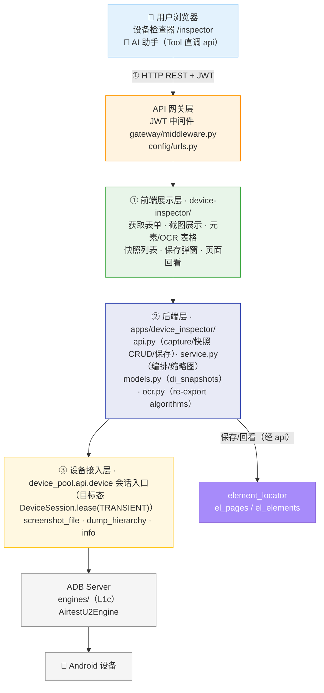
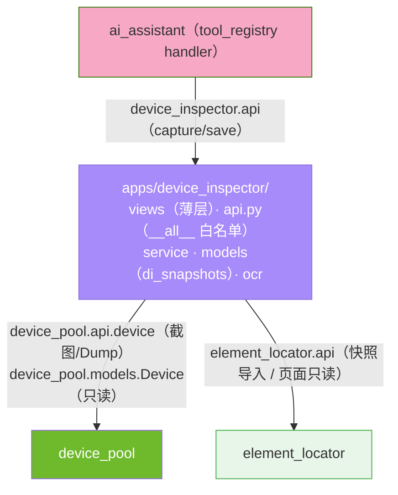
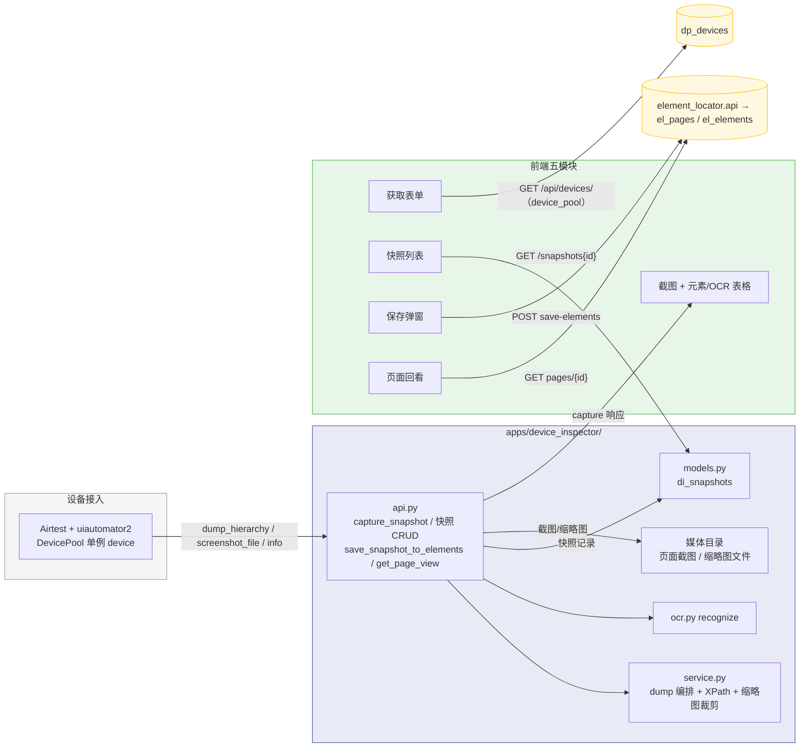
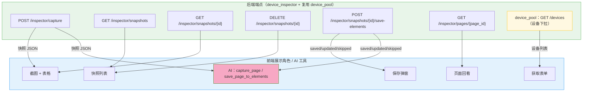
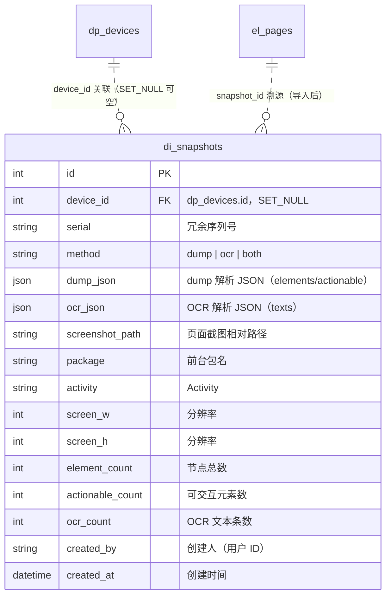

# ARCH-03 — 设备检查器 (Device Inspector)

> **版本**：v1.8 · **日期**：2026-08-21 · **关联模块**：`apps/device_inspector/` · 前端 `frontend/src/modules/device-inspector/`

## 文档内容简述

本文档是**设备检查器模块**的架构设计，覆盖该模块而非平台全貌：

- **架构四图**：架构全景图 · 模块包图 · 数据流图 · API 关系图（§1.2~1.5）
- **后端架构**：capture 编排 + 快照持久化 + XPath 生成 + 缩略图落盘（§3）
- **API 设计**：6 REST 端点（§4）
- **数据模型**：`di_snapshots` 快照表（§5）

## 你能从文档获取什么信息

- **设备检查器如何接入设备**：经 device_pool 单例（`device`）读取截图 / 层级，不直连 u2/Airtest；capture 快照式抓取，不改变设备占用状态
- **快照落库链路**：capture → dump/OCR 解析 JSON + 截图 + 缩略图落盘 → `di_snapshots` 的完整链路，含方法级降级
- **导入元素定位**：筛减保存经 element-locator api（自动建目录 + 页面 + 元素 upsert + 页面级 OCR JSON）
- **AI 复用**：`capture_page` / `save_page_to_elements` 工具经本模块 api 复用同一链路
- **XPath 生成策略**：`gen_xpath_candidates` 的 8 种策略 + O(1) 索引预建

## 关联文档

- **架构总纲**：[`ARCH-00-平台总体架构`](./ARCH-00-平台总体架构.md) §3.2（device_inspector 行）· §4.4 DeviceSession（TRANSIENT 短租）· §1.4 通道 · §二 L3
- **需求规格**：[`PRD-03-设备检查器`](../02-PRD需求/PRD-03-设备检查器.md) — **契约以 PRD §5 为准**

---

## 1. 模块架构概览

### 1.1 架构定位

设备检查器是平台的**快照式页面元素获取工具 + 快照查看器**，位于 **L3 业务 App 层**。它承接 device-pool（L2 DeviceSession 宿主）的设备能力，一键抓取设备当前页面（Dump UI / OCR，可同时）并落库为快照（`di_snapshots`），支持快照回看、删除、筛减后导入 element-locator，并可只读打开 element-locator 已保存页面。v1.7 起**无实时截图流、无 observe 持续占用**——capture 为快照式操作，抓完即走。设备取数目标态经 `DeviceSession.lease(TRANSIENT)` 短租（开关 `DEVICE_SESSION_ENABLED` 默认 False 时经 `device_pool.api.device` 旧入口）；XPath/OCR 已下沉 **L1a `algorithms/`**（原处 re-export 兼容，2026-08-20 extract-algorithms-package）。

### 1.2 架构全景图

> 四层：前端五模块 → API 网关 → 后端（api/service/models）→ 设备接入（DevicePool）。



### 1.3 模块包图

> 箭头 = import 方向。后端 device_inspector 依赖 device_pool（设备能力）与 element_locator.api（写入），AI 助手经本模块 api 复用链路。



**防火墙规则**：

```
device_inspector ──✅ import──→ device_pool.api（device 会话入口，截图 / Dump）
device_inspector ──✅ import──→ device_pool.models（Device 只读查询）
device_inspector ──✅ import──→ element_locator.api（跨模块写走 api，白名单函数）
device_inspector ──✅ import──→ algorithms.*（L1a 纯函数：xpath/hierarchy/vision·ocr）
device_inspector ──❌ import──→ element_locator.service / views / page_tree（内部实现）
device_inspector ──❌ import──→ case_manager / test_runner / ai_assistant
device_inspector ──❌ import──→ engines 实现（设备取数只经 device_pool 会话入口；L3 零引擎直触）
ai_assistant ──✅ import──→ device_inspector.api（capture / save，白名单函数）
ai_assistant ──❌ import──→ device_inspector.views / service / models（内部实现）
本模块写库 ──✅ 仅经自身 api.py / service.py（di_snapshots 归属本模块）
```

### 1.4 数据流图

> 设备 → DevicePool 单例 → api/service 编排 → 快照落库；导入/回看经 element-locator api。



### 1.5 API 关系图

> 6 REST 端点 → 前端展示角色 / AI 工具的映射。



**数据同步方式**：

| 数据 | 同步方式 |
|------|------|
| 设备列表 | 打开获取表单时拉取 `GET /api/devices/`（按需，无轮询） |
| 快照数据 | 手动「获取」触发 capture；回看 / 删除即时刷新列表 |
| 已保存页面 | 手动选择「已保存页面」入口时拉取 |

---

## 3. 后端架构

### 3.1 文件结构

```
apps/device_inspector/
├── views.py           6 端点薄层（解析 → 调 api → 封信封，DRF 或 JsonResponse 统一 {status, data}）
├── api.py             跨模块白名单：capture_snapshot / get_snapshot / list_snapshots /
│                      delete_snapshot / save_snapshot_to_elements / get_page_view
├── service.py         capture 编排（dump/OCR 方法级降级）· 缩略图裁剪落盘（XPath 已下沉 algorithms/xpath）
├── models.py          di_snapshots（快照表）
├── ocr.py             OCR re-export（recognize → algorithms/vision/ocr，cnocr 惰性单例）
├── urls.py            6 端点路由（app_name=inspector）
└── apps.py            verbose_name='设备检查器'
```

> v1.7 移除：`stream.py`（截图流广播）、`consumers.py`（WS 接入）——实时流与 observe 占用随快照化改造删除。

### 3.2 capture 编排（service.py）

```
capture_snapshot(user_id, serial, method) -> dict
  1. 可用性检查：Device 存在 + 非执行引擎占用（沿用 _check_device_available 前缀规则）
  2. method in (dump, ocr, both)：
     dump → device.dump_hierarchy() → gen_xpath_candidates → 裁剪元素缩略图落盘
     ocr  → device.screenshot_file() → ocr.recognize() → 裁剪 OCR 缩略图落盘
  3. 页面截图落盘（原分辨率 PNG）
  4. 方法级降级：both 时单方法失败仍以成功方法落库（method 记实际成功值）
  5. 写 di_snapshots（dump_json / ocr_json / screenshot_path / 统计 / created_by）
  6. 返回快照全量 JSON
```

**关键设计**：

| 项 | 说明 |
|------|------|
| 方法级降级 | both 时 dump 失败仅 OCR 入库（method=ocr），反之亦然；全部失败不落库 |
| 快照式无占用 | capture 不 observe、不修改 Device.status / occupied_by（对比 v1.6 前 observe 占用） |
| 缩略图落盘 | 元素按 bounds、OCR 按文本区域从截图裁剪为文件；JSON 仅存相对路径（禁 base64） |
| 执行引擎保护 | `_check_device_available` 前缀匹配（`runner-`/`ai_agent`/`task-`/`run-`），检查器不与执行引擎抢设备 |
| AI 复用 | AI 工具 handler 直调 `device_inspector.api.capture_snapshot`，与前端同一条落库链路 |

### 3.3 XPath 生成（algorithms/xpath）

> **v1.8 下沉状态**：`gen_xpath_candidates` 已下沉 **`algorithms/xpath.py`（L1a 纯函数）**，本模块 `service.py` 原处 re-export 兼容（2026-08-20，extract-algorithms-package）；层级解析下沉 `algorithms/hierarchy.py`、OCR 下沉 `algorithms/vision/ocr.py`。下述算法形态即 L1a 现状实现。

```
gen_xpath_candidates(el, all_els) -> list[dict]
  预建 8 个索引（一次遍历）：
    by_class / by_rid / by_text / by_class_rid / by_text_and_class / by_desc_and_class / by_rid_text_class
  生成 8 种候选（type → xpath → count）：
    resource-id · text · content-desc · class · index · combined · resource-id (any) · text (any)
  去重 + 按 count 升序排序
```

> 索引预建将匹配数统计从 O(n) 扫描降为 O(1) 查找；`index` 策略标记 `note: "fragile"`。该函数自 element_locator.service 迁入（PRD-04 §8 非目标），再下沉 algorithms/（L1a，唯一落点）。

---

## 4. API 设计

> 响应信封统一 `{status, data}` / `{status, message}`（v1.7 起新契约，不再平铺）；字段 snake_case。**完整字段契约以 PRD §5.2~5.8 为准**，本节只列概览。

### 4.1 端点概览

| 方法 | 路径 | 说明 | 前端消费 | AI 工具 |
|------|------|------|:--:|:--:|
| `POST` | `/api/inspector/capture` | 一键获取（dump/OCR/both）→ 快照落库 | ✅ | ✅ capture_page |
| `GET` | `/api/inspector/snapshots` | 快照列表（分页，倒序） | ✅ | — |
| `GET` | `/api/inspector/snapshots/{id}` | 快照详情 JSON | ✅ | ✅ |
| `DELETE` | `/api/inspector/snapshots/{id}` | 删除快照 + 文件清理 | ✅ | — |
| `POST` | `/api/inspector/snapshots/{id}/save-elements` | 筛减保存到元素定位 | ✅ | ✅ save_page_to_elements |
| `GET` | `/api/inspector/pages/{page_id}` | 打开元素定位已保存页面（只读） | ✅ | — |

### 4.2 响应格式（capture 骨架）

```json
{
  "status": true,
  "data": {
    "snapshot_id": 12,
    "serial": "R5CT62RH88F",
    "method": "both",
    "package": "com.example.app",
    "activity": ".MainActivity",
    "screen_w": 1080, "screen_h": 2340,
    "element_count": 128, "actionable_count": 23,
    "elements": [ { "class_name": "android.widget.Button", "resource_id": "com.example:id/login_btn", "text": "登录", "clickable": true, "bounds": "[0,100][1080,220]", "x": 0, "y": 100, "width": 1080, "height": 120, "thumbnail_path": "media/inspector/thumbs/12/el_0.png" } ],
    "actionable": [ { "...": "...", "xpaths": [ { "type": "resource-id", "xpath": "//android.widget.Button[@resource-id='com.example:id/login_btn']", "count": 1 } ] } ],
    "ocr_count": 12,
    "texts": [ { "text": "欢迎回来", "confidence": 0.9732, "x": 150, "y": 420, "width": 780, "height": 90, "thumbnail_path": "media/inspector/thumbs/12/ocr_0.png" } ],
    "screenshot_path": "media/inspector/shots/page_20260819_103000.png"
  }
}
```

> 完整字段表见 PRD §5.2；错误码（400/404/409/500）见 PRD §5.8。

---

## 5. 数据模型

### 5.1 `di_snapshots`（快照表，di_ 前缀）



> 缩略图不入库：文件按快照分目录落盘（页面截图区 / 缩略图区），JSON 存相对路径；删除快照连带清理文件。

### 5.2 数据来源

| 数据 | 来源 | 生命周期 |
|------|------|---------|
| 设备列表 / 元信息 / 占用状态 | `dp_devices`（device_pool，只读） | 由 device_pool 管理 |
| 快照记录 | `di_snapshots`（本模块自有） | 随快照删除清理 |
| 页面截图 / 缩略图文件 | 媒体目录（按快照分目录） | 随快照删除清理 |
| 元素 / 页面 / OCR JSON | `el_pages` / `el_elements`（element-locator，经其 api 写入） | 由 element-locator 管理 |

---

## 6. 模块边界与跨模块交互

### 6.1 边界规则

| 规则 | 说明 |
|------|------|
| 快照持久化归本模块 | `di_snapshots` 写库收敛 api.py / service.py |
| 设备初始化归 device_pool | 设备连接（adb/u2）与信息采集由设备管理完成；本模块**不二次初始化**（不 import u2/Airtest），仅在 capture 前检查可用性 |
| 设备能力经 device_pool | 截图 / Dump 统一走 `device` 单例 |
| capture 不占设备 | 快照式操作，不修改 Device.status / occupied_by（无 observe） |
| 执行引擎占用保护 | `_check_device_available` 拦截 `runner-/ai_agent/task-/run-` 前缀占用 |
| 元素保存走 element-locator api | 跨模块写只调 `element_locator.api` 白名单函数，禁止 ORM 直写 `el_` 表 |
| 对外白名单 | `api.py __all__` 暴露 capture / 快照 CRUD / save / page_view，供 AI 助手 Tool 直调 |

### 6.2 对外接口（api.py `__all__`）

```python
__all__ = [
    "capture_snapshot",          # (user_id, serial, method) -> dict  快照式抓取 + 落库
    "list_snapshots",            # (user_id, offset, limit) -> dict   快照列表
    "get_snapshot",              # (snapshot_id) -> dict              快照详情 JSON
    "delete_snapshot",           # (snapshot_id) -> bool              删除 + 文件清理
    "save_snapshot_to_elements", # (snapshot_id, page_label, folder_path, element_ids, include_ocr) -> dict
    "get_page_view",             # (page_id) -> dict                  元素定位页面只读
]
```

### 6.3 跨模块交互

| 交互方 | 方向 | 调用方式 | 用途 |
|------|------|------|------|
| **device_pool** | 读 | `device_pool.api.device`（screenshot_file / dump_hierarchy / info） | 截图 / 层级 / 设备信息 |
| **device_pool** | 读 | `device_pool.models.Device`（get，只读） | 设备可用性 / 元信息 / 占用状态 |
| **element_locator** | 写 | `element_locator.api.import_snapshot_page(...)` | 自动建目录 + 页面 + 元素 upsert + OCR JSON + 截图 |
| **element_locator** | 读 | `element_locator.api.get_page_full(page_id)` | 已保存页面只读（元信息 + 元素 + OCR JSON） |
| **ai_assistant** | 被调 | `device_inspector.api.capture_snapshot / save_snapshot_to_elements` | AI capture_page / save 工具复用链路 |

---

## 7. 设计要点

| 要点 | 说明 |
|------|------|
| 快照持久化 | v1.7 从瞬态转向落库：dump/OCR JSON + 截图 + 缩略图随快照持久化，回看/删除/导入都基于快照 |
| 快照式无占用 | capture 不 observe、不改设备状态，多用户并发抓取互不阻塞（执行引擎占用仍拦截） |
| 方法级降级 | both 时单方法失败不影响另一方法入库，可靠性优先 |
| 缩略图落盘 | JSON 禁 base64，文件按快照分目录，控制单快照 JSON 体积 |
| AI 复用链路 | AI 工具与前端共用 api 白名单，拉取即落库、保存基于快照，行为一致 |
| 执行引擎保护 | `_check_device_available` 前缀匹配，检查器不与执行引擎抢设备 |
| 索引优化 | XPath 匹配数统计预建 8 个索引，O(1) 查找 |
| 信封收敛 | v1.7 起统一 `{status, data}`，移除平铺信封偏差 |

---

## 变更记录

| 版本 | 日期 | 变更摘要 |
|------|------|----------|
| v1.8 | 2026-08-21 | **五层口径回填**：§1.1 去"三层架构"改 L3 业务 App 层 + DeviceSession.lease(TRANSIENT) 目标态与 algorithms 下沉状态；§1.2 图设备接入层改会话入口（B/D 标签，去旧 L2/L3）；防火墙补 algorithms ✅ 与 engines ❌；§3.1 ocr.py 改 re-export 口径、service.py 去 XPath 生成；§3.3 标注下沉 algorithms/xpath（L1a 唯一落点）；关联指针改 §3.2/§4.4/§1.4/§二 L3 |
| v1.0 | 2026-08-17 | 初始版本：从 ARCH-04-元素定位 迁出的实时检查能力（截图流/Dump/XPath 生成/元素操作）独立成模块；对齐代码真相（0 表 4 端点 + 1 WS；后端仅依赖 device_pool；元素保存走前端跨模块 api）；登记 2 处契约偏差（信封平铺 / page_id 缺失） |
| v1.1 | 2026-08-17 | 四图前端节点抽象化（对齐 ARCH-01）：ScreenshotView/XPathCandidatePanel/PageElementsPanel/DeviceSelector → 截图栏/候选面板/元素列表/设备选择区 |
| v1.2 | 2026-08-17 | §6.1 补「设备初始化归 device_pool，检查器不二次初始化」边界；登记 2 处边界偏差（OFFLINE 残留 / device-info 未走统一校验） |
| v1.5 | 2026-08-18 | 对齐 PRD v1.5：删「定位元素/候选面板」模块（三模块两栏）；删 `/action` 端点（3 REST + 1 WS）；唯一定位并入元素列表；删单个保存与 `add-step`（EventBus）；移除 `page_id` 契约偏差登记（本次代码同步修复筛选栏门控） |
| v1.6 | 2026-08-18 | 新增 OCR 文字识别：`ocr.py`（cnocr 懒加载 + recognize）+ `/ocr` 端点（4 REST + 1 WS）；瞬态不落库；前端页面元素面板加「元素 / OCR」Tab |
| v1.7 | 2026-08-19 | **快照化改造**（对齐 PRD v1.7）：移除实时截图流与 observe（删 stream.py/consumers.py、WS、/dump /ocr /screenshot /device-info）；新增 `di_snapshots` 表与 6 REST 端点（capture/快照 CRUD/save-elements/pages）；api.py 由空白名单转为 6 函数对外接口（AI 复用）；信封统一 `{status, data}`；新增 element_locator.api 依赖与 ai_assistant 被调关系；移除信封平铺偏差登记 |
