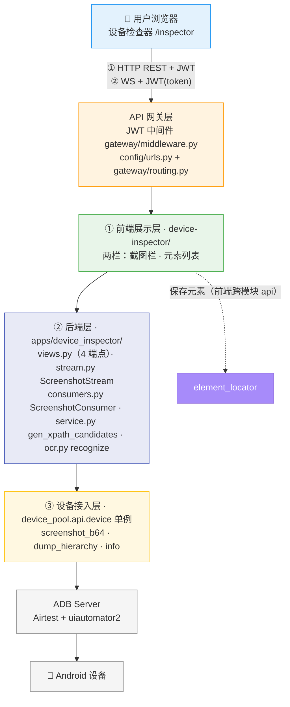
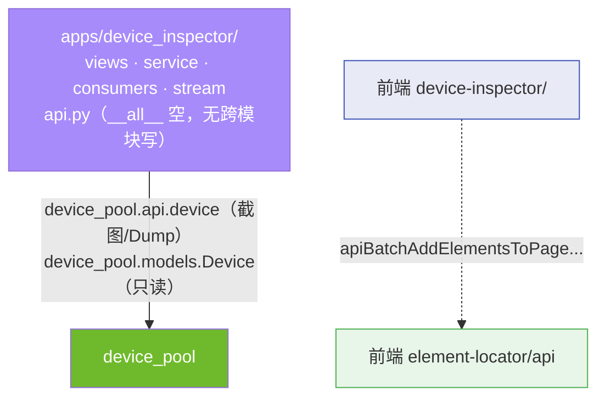
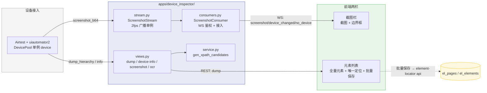
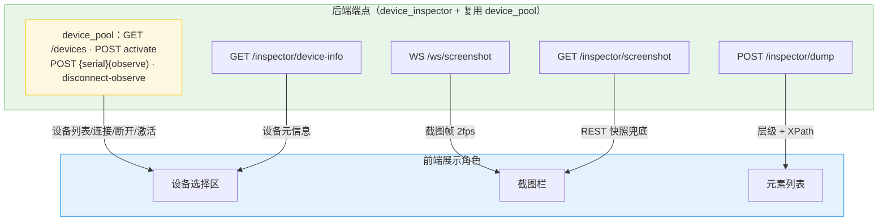

# ARCH-03 — 设备检查器 (Device Inspector)

> **版本**：v1.5 · **日期**：2026-08-18 · **关联模块**：`apps/device_inspector/` · 前端 `frontend/src/modules/device-inspector/`

## 文档内容简述

本文档是**设备检查器模块**的架构设计，覆盖该模块而非平台全貌：

- **架构四图**：架构全景图 · 模块包图 · 数据流图 · API 关系图（§1.2~1.5）
- **后端架构**：裸 JsonResponse views + 截图流单例 + XPath 生成（§3）
- **API 设计**：4 REST 端点 + 1 WebSocket（§4）
- **数据模型**：无表（瞬态服务）（§5）

## 你能从文档获取什么信息

- **设备检查器如何接入设备**：经 device_pool 单例（`device`）读取截图 / 层级，不直连 u2/Airtest
- **实时截图链路**：ScreenshotConsumer → ScreenshotStream（2fps 广播）→ device.screenshot_b64 的完整链路，含 REST 兜底降级
- **XPath 生成策略**：`gen_xpath_candidates` 的 8 种策略 + O(1) 索引预建
- **跨模块交互**：后端仅依赖 device_pool；元素保存走前端跨模块 api（element-locator）

## 关联文档

- **架构总纲**：[`ARCH-00-平台总体架构`](./ARCH-00-平台总体架构.md) §4.10
- **需求规格**：[`PRD-03-设备检查器`](../02-PRD需求/PRD-03-设备检查器.md) — **契约以 PRD §5 为准**

---

## 1. 模块架构概览

### 1.1 架构定位

设备检查器是平台的**实时设备检查瞬态服务**，在三层架构中位于后端层中层。它承接 device-pool（底层设备接入）的能力，向用户提供实时截图流、UI 层级抓取与 XPath 生成，并把检查结果（元素）交给 element-locator 持久化。本模块**无数据表**——所有数据（截图帧 / UI 树 / XPath）只在请求响应或 WebSocket 会话内流转，不落库。

### 1.2 架构全景图

> 四层：前端两栏 → API 网关 → 后端（views + stream 单例）→ 设备接入（DevicePool）。



### 1.3 模块包图

> 箭头 = import 方向。后端 device_inspector 仅依赖 device_pool（唯一底层）；元素保存走**前端**跨模块调用，后端不 import element_locator。



**防火墙规则**：

```
device_inspector ──✅ import──→ device_pool.api（device 单例，截图 / Dump）
device_inspector ──✅ import──→ device_pool.models（Device 只读查询）
device_inspector ──❌ import──→ 任何上层模块（element_locator / case_manager / test_runner / ai_assistant）
device_inspector ──❌ 直接 ORM 写（无 models.py，无 api.py 写函数）
其他 App ──✅ import──→ device_inspector？—— 无（api.py __all__ 为空，模块为纯瞬态服务，不被其他 App 引用）
```

### 1.4 数据流图

> 设备 → DevicePool 单例 → views/stream → 前端两栏；元素保存经前端跨模块 api。



### 1.5 API 关系图

> 4 REST 端点 + 1 WebSocket → 前端展示角色的映射。



**数据同步方式**：

| 数据 | 同步方式 |
|------|------|
| 设备列表 | 首次 `fetchDevices` + **30s 轮询**（检测离线） |
| 截图流 | WebSocket 推送（2fps），断开降级 REST 轮询（250ms） |
| UI 层级 | 手动「Dump UI」/「刷新屏幕」/「刷新元素」触发 |

**前后端契约不匹配（历史 1 处，已登记）**：

| # | 项 | 现象 | 状态 |
|---|---|---|---|
| 1 | 响应信封 | 本模块成功响应字段平铺（`{status, serial, ...}`），未包裹 `data`，与平台统一信封 `{status, data}` 不同（后端裸 `JsonResponse` 非 DRF 渲染器） | ⚠️ 已登记（前端按平铺读取） |

---

## 3. 后端架构

### 3.1 文件结构

```
apps/device_inspector/
├── views.py           4 端点：dump / device-info / screenshot / ocr（裸 JsonResponse）
├── service.py         XPath 生成：gen_xpath_candidates（8 策略 + O(1) 索引）
├── ocr.py             OCR 文字识别：cnocr 懒加载引擎 + recognize（裁剪缩略图）
├── consumers.py       ScreenshotConsumer（WS 鉴权 + 接入/移除）
├── stream.py          ScreenshotStream（进程内 2fps 广播单例）
├── api.py             空 __all__（无跨模块写操作）
├── urls.py            4 端点路由（app_name=inspector）
└── apps.py            verbose_name='设备检查器'
```

> 无 `models.py` —— 瞬态服务，无持久化数据表。

### 3.2 截图流设计（ScreenshotStream + ScreenshotConsumer）

```
ScreenshotConsumer（channels AsyncWebsocketConsumer）
  channel_layer_alias = None      # 截图广播走进程内 stream，不用 channel groups
  connect()                        query_string 提取 token → verify_token → accept
                                   → screenshot_stream.add(self)
  disconnect()                     screenshot_stream.remove(self)

ScreenshotStream（进程内单例）
  clients: set[Consumer]          已连接 WS 客户端
  _loop_task                       广播循环 task（首个客户端接入时创建）
  _last_device_msg / _last_screenshot_msg / _last_status_msg   缓存最近帧
  add(consumer)                    接入 + 立即推送 3 帧缓存（秒开）
  _broadcast_loop()                2fps 循环：截图 → send_all → sleep(SCREENSHOT_INTERVAL)
  _send_all(msg)                   广播 + dead 客户端清理
```

**关键设计**：

| 项 | 说明 |
|------|------|
| 缓存帧推送 | 新客户端接入立即收到最近设备 / 截图 / 状态帧，避免首帧等待 |
| 阻塞调用隔离 | `device.screenshot_b64` / `device.info` 经 `loop.run_in_executor` 抛到线程池，不阻塞事件循环 |
| 降级兜底 | 前端 WS 断开后重启 REST 轮询（250ms），3s 重连 WS |
| 异常隔离 | 截图异常发送 `screenshot_error`（截断 200 字符），循环不中断 |

### 3.3 XPath 生成（service.py）

```
gen_xpath_candidates(el, all_els) -> list[dict]
  预建 8 个索引（一次遍历）：
    by_class / by_rid / by_text / by_class_rid / by_text_and_class / by_desc_and_class / by_rid_text_class
  生成 8 种候选（type → xpath → count）：
    resource-id · text · content-desc · class · index · combined · resource-id (any) · text (any)
  去重 + 按 count 升序排序
```

> 索引预建将匹配数统计从 O(n) 扫描降为 O(1) 查找；`index` 策略标记 `note: "fragile"`。该函数自 element_locator.service 迁入（PRD-04 §8 非目标）。

---

## 4. API 设计

> 响应信封本模块为**平铺** `{status, fields...}`（非 `data` 包裹）；字段 snake_case。**完整字段契约（字段表/约束/示例）以 PRD §5.2~5.6 为准**，本节只列概览。

### 4.1 端点概览

| 方法 | 路径 | 说明 | 前端消费 |
|------|------|------|:--:|
| `POST` | `/api/inspector/dump` | Dump UI 层级 + XPath 候选 | ✅ |
| `GET` | `/api/inspector/device-info` | 当前设备信息 + 占用状态 | ✅ |
| `GET` | `/api/inspector/screenshot` | 单帧 JPEG 快照 | ✅ |
| `POST` | `/api/inspector/ocr` | OCR 文字识别（cnocr）→ 文字/坐标/置信度/缩略图 | ✅ |
| `WS` | `/ws/screenshot?token=` | 截图流（2fps） | ✅ |

### 4.2 响应格式

```json
{
  "status": true,
  "serial": "emulator-5554",
  "package": "com.example.app",
  "activity": ".MainActivity",
  "element_count": 128,
  "actionable_count": 23,
  "elements": [ { "class_name": "android.widget.Button", "resource_id": "com.example:id/login_btn", "text": "登录", "clickable": true, "bounds": "[0,100][1080,220]", "x": 0, "y": 100, "width": 1080, "height": 120 } ],
  "actionable": [ { "class_name": "android.widget.Button", "resource_id": "com.example:id/login_btn", "text": "登录", "clickable": true, "x": 0, "y": 100, "width": 1080, "height": 120, "xpaths": [ { "type": "resource-id", "xpath": "//android.widget.Button[@resource-id='com.example:id/login_btn']", "count": 1 } ] } ]
}
```

> 完整字段表（节点 / xpaths / 设备信息 / 截图 / WS 消息）见 PRD §5.2~5.5。

---

## 5. 数据模型

本模块**无自有数据表**（瞬态服务）。数据来源：

| 数据 | 来源 | 生命周期 |
|------|------|---------|
| 设备列表 / 设备信息 / 占用状态 | `dp_devices`（device_pool，只读） | 由 device_pool 管理 |
| 截图帧 | `device.screenshot_b64`（内存流转） | 会话内，仅保留最近 3 张 `page_*.png` 文件 |
| UI 层级 / XPath 候选 | `device.dump_hierarchy` + `gen_xpath_candidates` | 请求响应内，不落库 |
| 元素持久化 | `el_pages` / `el_elements`（element-locator，前端写入） | 由 element-locator 管理 |

```mermaid
erDiagram
    dp_devices ||..o{ "inspector 会话(瞬态)" : "只读提供截图/层级"
    "inspector 会话(瞬态)" ..o| el_pages : "前端保存元素"
    el_pages ||--o{ el_elements : "包含"
```

> 无 `dp_` / `el_` 之外的新表前缀；本模块不占用表前缀（对照表 §四 已注明「设备检查器（瞬态）」）。

---

## 6. 模块边界与跨模块交互

### 6.1 边界规则

| 规则 | 说明 |
|------|------|
| 仅实时检查，不持久化 | 无 models.py，无 api.py 写函数 |
| 设备初始化归 device_pool | 设备连接（adb/u2）与信息采集由设备管理完成；本模块**不二次初始化**（不 import u2/Airtest），仅在操作前检查可用性 |
| 设备能力经 device_pool | 截图 / Dump 不直接 import u2/Airtest，统一走 `device` 单例 |
| 执行引擎占用保护 | `_check_device_available` 拦截 `runner-/ai_agent/task-/run-` 前缀占用 |
| observe 连接不锁定 | 复用 device_pool `connect`（mode=observe）/`disconnect-observe` |
| 元素保存走 element-locator | 前端跨模块 api 调用，后端不直接写 `el_` 表 |
| 无对外写接口 | `api.py __all__ = []`，其他 App 无法 import 本模块写操作 |

**边界偏差（已登记）**：

| # | 项 | 现象 | 状态 |
|---|---|---|---|
| 1 | OFFLINE 残留 | `_check_device_available` 仍含 `if dev.status == "OFFLINE"` 分支返回「设备已离线」，与「仅 ONLINE/BUSY、离线即删」口径不符 | ⚠️ 技术债（PRD §5.7 已登记） |
| 2 | device-info 未走统一校验 | `device_info_view` 未调 `_check_device_available`，软查询（Device 不存在时返回部分信息，非 409） | ⚠️ 已登记 |

### 6.2 对外接口（api.py `__all__`）

```python
__all__: list = []   # 瞬态服务，无跨模块写操作
```

> 本模块是「消费方」而非「提供方」：它消费 device_pool 的设备能力，自身不向其他 App 暴露写函数。元素保存 / 步骤发送发生在**前端**（`element-locator/api`、EventBus），后端无对应 import。

### 6.3 跨模块交互

| 交互方 | 方向 | 调用方式 | 用途 |
|------|------|------|------|
| **device_pool** | 读 | `device_pool.api.device`（screenshot_b64 / dump_hierarchy / info） | 截图 / 层级 / 设备信息 |
| **device_pool** | 读 | `device_pool.models.Device`（get，只读） | 设备可用性 / 元信息 / 占用状态 |
| **element_locator** | 写（前端） | `element-locator/api`：apiGetPages / apiCreatePage / apiBatchAddElementsToPage | 批量保存元素 |

---

## 7. 设计要点

| 要点 | 说明 |
|------|------|
| 瞬态服务 | 无表无落库，截图流 / UI 树 / XPath 会话内流转，元素持久化下沉 element-locator |
| 缓存帧秒开 | ScreenshotStream 缓存最近帧，新 WS 客户端接入立即渲染 |
| 阻塞隔离 | 截图 / info 走 `run_in_executor`，不阻塞事件循环 |
| 降级兜底 | WS 断开 → REST 轮询（250ms）→ 3s 重连，链路不中断 |
| 执行引擎保护 | `_check_device_available` 前缀匹配，检查器不与执行引擎抢设备 |
| 索引优化 | XPath 匹配数统计预建 8 个索引，O(1) 查找 |
| 契约偏差 | 响应信封平铺（非 `data`），已登记 |

---

## 变更记录

| 版本 | 日期 | 变更摘要 |
|------|------|----------|
| v1.0 | 2026-08-17 | 初始版本：从 ARCH-04-元素定位 迁出的实时检查能力（截图流/Dump/XPath 生成/元素操作）独立成模块；对齐代码真相（0 表 4 端点 + 1 WS；后端仅依赖 device_pool；元素保存走前端跨模块 api）；登记 2 处契约偏差（信封平铺 / page_id 缺失） |
| v1.1 | 2026-08-17 | 四图前端节点抽象化（对齐 ARCH-01）：ScreenshotView/XPathCandidatePanel/PageElementsPanel/DeviceSelector → 截图栏/候选面板/元素列表/设备选择区 |
| v1.2 | 2026-08-17 | §6.1 补「设备初始化归 device_pool，检查器不二次初始化」边界；登记 2 处边界偏差（OFFLINE 残留 / device-info 未走统一校验） |
| v1.5 | 2026-08-18 | 对齐 PRD v1.5：删「定位元素/候选面板」模块（三模块两栏）；删 `/action` 端点（3 REST + 1 WS）；唯一定位并入元素列表；删单个保存与 `add-step`（EventBus）；移除 `page_id` 契约偏差登记（本次代码同步修复筛选栏门控） |
| v1.6 | 2026-08-18 | 新增 OCR 文字识别：`ocr.py`（cnocr 懒加载 + recognize）+ `/ocr` 端点（4 REST + 1 WS）；瞬态不落库；前端页面元素面板加「元素 / OCR」Tab |
