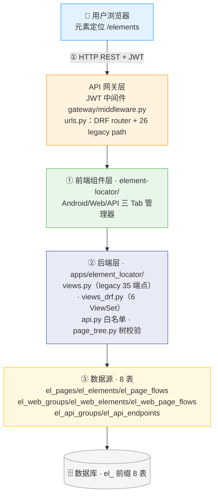
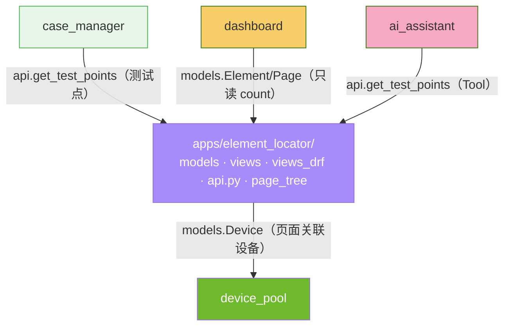
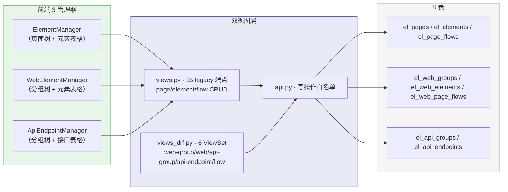
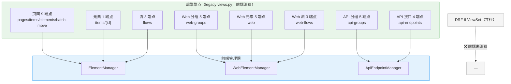
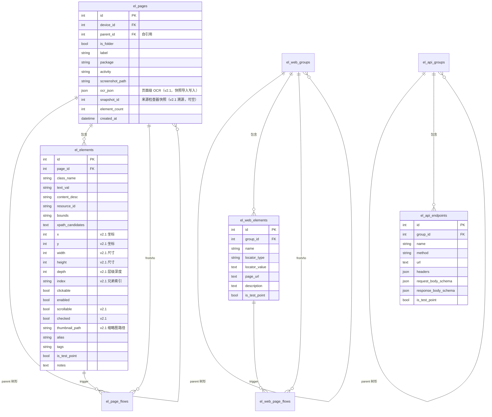

# ARCH-04 — 元素定位 (Element Locator)

> **版本**：v2.2 · **日期**：2026-08-21 · **关联模块**：`apps/element_locator/` · 前端 `frontend/src/modules/element-locator/`

## 文档内容简述

本文档是**元素定位模块**的架构设计，覆盖该模块而非平台全貌：

- **架构四图**：架构全景图 · 模块包图 · 数据流图 · API 关系图（§1.2~1.5）
- **后端架构**：双视图层（legacy + DRF）+ 8 表 + 页面树工具 + 快照导入（§3）
- **API 设计**：35 legacy 端点 + 6 DRF ViewSet + 快照导入端点共存（§4）
- **数据模型**：8 表 ER 图（页面携带 OCR JSON / 快照溯源，元素含完整 dump 字段）+ 三域对称结构（§5）

## 你能从文档获取什么信息

- **三域元素资产如何组织**：Android（页面树）/ Web（分组树）/ API（分组树）的对称 CRUD 架构
- **快照导入链路**：检查器 / AI 经 `api.import_snapshot_page` 自动建目录 + 页面（截图 + 页面级 OCR JSON）+ 元素 upsert（完整 dump 字段）
- **双视图层共存**：legacy `views.py`（前端消费 35 端点）与 DRF `views_drf.py`（6 ViewSet 并行）的关系
- **元素去重与树校验**：`(page, resource_id, bounds)` upsert + 页面树 5 层限制
- **边界与隐患**：旧文档已下线功能（设备获取/XPath 引擎）与 api.py 接口漂移

## 关联文档

- **架构总纲**：[`ARCH-00-平台总体架构`](./ARCH-00-平台总体架构.md) §3.2（element_locator 行）· §4.1 写收敛 · §二 L3
- **需求规格**：[`PRD-04-元素定位`](../02-PRD需求/PRD-04-元素定位.md) — **契约以 PRD §5 为准**

---

## 1. 模块架构概览

### 1.1 架构定位

元素定位是平台的**元素资产仓库**，位于 **L3 业务 App 层**，集中管理 Android UI 元素、Web 页面元素、API 接口定义三类定位资产，供用例管理与执行引擎引用。本模块**只做持久化 CRUD**——设备截屏/Dump/XPath 候选生成等实时交互能力已迁出到设备检查器（inspector），XPath/OCR 算法在 L1a `algorithms/`。

### 1.2 架构全景图

> 四层：前端 3 Tab → API 网关 → 后端双视图层 → 8 表数据源。



### 1.3 模块包图

> 箭头 = import 方向。element_locator 向 device_pool 读设备；被 case-manager/dashboard/ai_assistant 读取。



**防火墙规则**：

```
其他 App ──✅ import──→ element_locator.models（只读 Model 查询）
其他 App ──✅ import──→ element_locator.api.py（跨模块写操作白名单）
element_locator ──✅ import──→ device_pool.models/api（读设备，唯一向下依赖）
element_locator ──❌ import──→ 上层模块（case_manager/test_runner/ai_assistant）
```

### 1.4 数据流图

> 前端操作 → 双视图层 → api.py → 8 表。



### 1.5 API 关系图

> 35 legacy 端点 → 前端 3 管理器的映射。



**前后端契约不匹配（历史 3 处，已登记）**：

| # | 项 | 现象 | 状态 |
|---|---|---|---|
| 1 | 模块范围 | 旧 PRD/ARCH 描述「4 Tab + 设备获取/Dump/截图流/8 种 XPath 策略」，当前代码已迁出，仅「3 Tab 元素仓库」 | ⚠️ 已登记（功能迁出 inspector） |
| 2 | api.py 接口 | 旧 ARCH 列 `get_elements_by_page`/`search_elements`/`fetch_page_elements`/`get_element_count`/`get_page_count`，当前 api.py `__all__` 无这些函数 | ⚠️ 已登记（接口漂移，需同步旧文档引用方） |
| 3 | 端点数量 | 旧文档「14 端点」，实际 legacy 35 + DRF 6 ViewSet | ✅ 已校正（PRD §5.1） |

---

## 3. 后端架构

### 3.1 文件结构

```
apps/element_locator/
├── models.py          8 表：Page/Element/PageFlow + WebGroup/WebElement/WebPageFlow + ApiGroup/ApiEndpoint
├── views.py           legacy Django views（35 端点，前端消费）
├── views_drf.py       6 个 DRF ViewSet（web-group/web/api-group/api-endpoint/flow/web-flow）
├── serializers.py     6 个 DRF 序列化器
├── api.py             跨模块写操作 __all__ 白名单（~40 函数 + 3 Model re-export）
├── page_tree.py       页面树工具：5 层校验 + 移动校验 + 批量移动
├── service.py         YAML 序列化（simple_yaml_dump，无 PyYAML 依赖）
├── urls.py            DRF router + 26 legacy path
├── admin.py           Django Admin
└── apps.py            verbose_name='元素定位'
```

### 3.2 双视图层设计

| 层 | 文件 | 用途 | 前端消费 |
|----|------|------|:--:|
| legacy | `views.py` | 页面/元素/流/Web/API 全量 CRUD（35 端点） | ✅ |
| DRF | `views_drf.py` | 6 个 ModelViewSet（CRUD + batch-move/batch action） | ❌（并行，备用） |

> legacy 视图负责前端实际消费的路径（含 `/create`、`/batch`、`/batch-move` 子路径）；DRF ViewSet 注册在 router 中（`urlpatterns = router.urls + urlpatterns`，优先匹配），两者 URL 前缀不冲突。

### 3.3 页面树工具（page_tree.py）

```
page_tree.py — 页面目录树校验
  MAX_PAGE_TREE_DEPTH = 5          目录最多嵌套 5 层
  build_page_maps()                 单查询 parent_map/children_map（避免 N+1）
  compute_depth / page_depth        深度计算（根=1）
  validate_parent_and_depth         新建目录深度校验
  sibling_label_exists              同级 label 唯一
  validate_move                     移动校验（自身/子级/非目录/超深）
  batch_move_pages                  批量移动（过滤祖先在列表的节点）
```

---

## 4. API 设计

> 响应信封统一 `{status, data}` / `{status, message}`；字段 snake_case。**完整字段契约以 PRD §5.2~5.7 为准**，本节只列概览。

### 4.1 端点概览（35 legacy 逻辑端点 + 6 DRF ViewSet）

> **端点口径**：35 legacy 逻辑端点 = ARCH-00 路径条目口径的 **29 条 path**（如 `pages`/`pages/{id}/items`/`elements/batch` 按方法拆分计数）；DRF 6 ViewSet 另计（ARCH-00 A.1 同口径）。

**legacy（前端消费，按资源域）**：

| 域 | 端点数 | 路径前缀 |
|------|:--:|------|
| 页面 | 9 | `/api/elements/pages` + `/api/elements/items/{id}` |
| Android 流 | 3 | `/api/elements/flows` |
| Web 元素 | 5 | `/api/elements/web` |
| Web 分组 | 5 | `/api/elements/web-groups` |
| Web 流 | 3 | `/api/elements/web-flows` |
| API 分组 | 5 | `/api/elements/api-groups` |
| API 接口 | 4 | `/api/elements/api-endpoints` |

**DRF ViewSet（并行，6 个）**：WebGroup / WebElement / ApiGroup / ApiEndpoint / PageFlow / WebPageFlow。

### 4.2 响应格式

```json
{
  "status": true,
  "pages": [
    { "id": 1, "parent_id": null, "is_folder": false, "depth": 1, "label": "登录页", "element_count": 12 }
  ],
  "max_depth": 5
}
```

> 完整字段表（页面/元素/分组/接口/流）见 PRD §5.2~5.7。

---

## 5. 数据模型

### 5.1 ER 图



### 5.2 三域对称结构

| 域 | 分组树 | 元素/接口 | 跳转流 | 唯一约束 |
|------|------|------|------|------|
| Android | Page（含 device） | Element | PageFlow | `(page, resource_id, bounds)` |
| Web | WebGroup | WebElement（12 定位方式） | WebPageFlow | — |
| API | ApiGroup | ApiEndpoint（5 方法） | — | — |

---

## 6. 模块边界与跨模块交互

### 6.1 边界规则

| 规则 | 说明 |
|------|------|
| 写操作走 api.py | View/Tool → api.py → ORM，禁止跨模块直接 ORM 写 |
| 只读跨模块 | 跨 App 读 Model 放开（get_test_points 等） |
| 树层级约束 | 目录最多 5 层，`page_tree.py` 统一校验 |
| 元素去重 | upsert 语义（page+resource_id+bounds） |

### 6.2 对外接口（api.py `__all__` 摘要）

```python
# 只读查询（跨模块）
get_test_points(page_ids=None)      # 测试点元素
get_flows()                         # Android 跳转流
get_web_elements(locator_type, is_test_point)
get_web_groups()
get_page_full(page_id)              # 页面只读视图（元信息 + 元素 + OCR JSON，供检查器回看）

# 写操作（跨模块收敛）
create_page / rename_page / delete_page / update_page_parent
upsert_element / update_element
import_snapshot_page(...)           # 快照导入：自动建目录+页面+元素+OCR JSON+截图
create_flow / delete_flow / clear_all
create_web_group / ... / create_api_endpoint / ... （三域对称）
```

### 6.3 跨模块消费者

| 消费方 | 调用方式 | 用途 |
|------|------|------|
| **case-manager** | `api.get_test_points()` | 测试点元素供用例步骤引用 |
| **AI 助手** | AgentScope Tool `get_test_points` / `save_page_to_elements` | 自然语言查询元素 / 快照保存到元素定位 |
| **device-inspector** | `api.import_snapshot_page`（写）/ `api.get_page_full`（读） | 筛减导入快照 / 已保存页面只读回看 |
| **dashboard** | `models.Element/Page` 只读 count | 元素/页面统计 |
| **device-pool** | 提供设备（Page.device FK） | 页面关联设备 |

---

## 7. 设计要点

| 要点 | 说明 |
|------|------|
| 三域对称 | Android/Web/API 分组树 + 元素 CRUD 结构对称，前端共享 GroupTreePanel |
| 双视图层 | legacy（前端消费）+ DRF（并行备用）共存，URL 前缀不冲突 |
| 树校验 | page_tree.py 单查询 parent_map 避免 N+1，5 层目录限制 |
| 元素去重 | UNIQUE(page, resource_id, bounds) + upsert，防重复 |
| 快照导入 | import_snapshot_page 收敛写库：自动建目录（≤5 层）+ 页面 + 元素 upsert + 页面级 OCR JSON + 截图；检查器与 AI 共用 |
| 功能收敛 | 设备获取/XPath 引擎已迁出，本模块专注持久化资产 CRUD 与快照导入 |

---

## 变更记录

| 版本 | 日期 | 变更摘要 |
|------|------|----------|
| v2.2 | 2026-08-21 | **五层口径回填**：§1.1 去"三层架构"改 L3 业务 App 层；§1.2 图去旧 L2/L3 标签（B/D）；§4.1 补端点口径说明（35 逻辑端点 = ARCH-00 29 条 path）；关联指针改 §3.2/§4.1/§二 L3 |
| v1.0 | 2026-07-16 | 初始版本 |
| v1.1 | 2026-07-16 | 代码对照审计：补 parent FK + is_folder；新增 page_tree.py |
| v2.0 | 2026-08-14 | 按仪表盘 ARCH 格式重构：补四图；校正 8 表 + 双视图层 + 35 端点；功能收敛（设备获取/XPath 引擎迁出）；标题 ARCH-01→ARCH-04；api.py 接口漂移登记 |
| v2.1 | 2026-08-19 | 承接设备检查器快照化（PRD v7.2 / ARCH-03 v1.7）：`el_pages` 增加 `ocr_json`（页面级 OCR）与 `snapshot_id`（快照溯源）；`el_elements` 补完整 dump 字段（x/y/width/height/depth/index/scrollable/checked/thumbnail_path）；api.py 白名单新增 `import_snapshot_page`（快照导入）与 `get_page_full`（页面只读视图）；跨模块消费者新增 device-inspector 与 AI 保存工具 |
