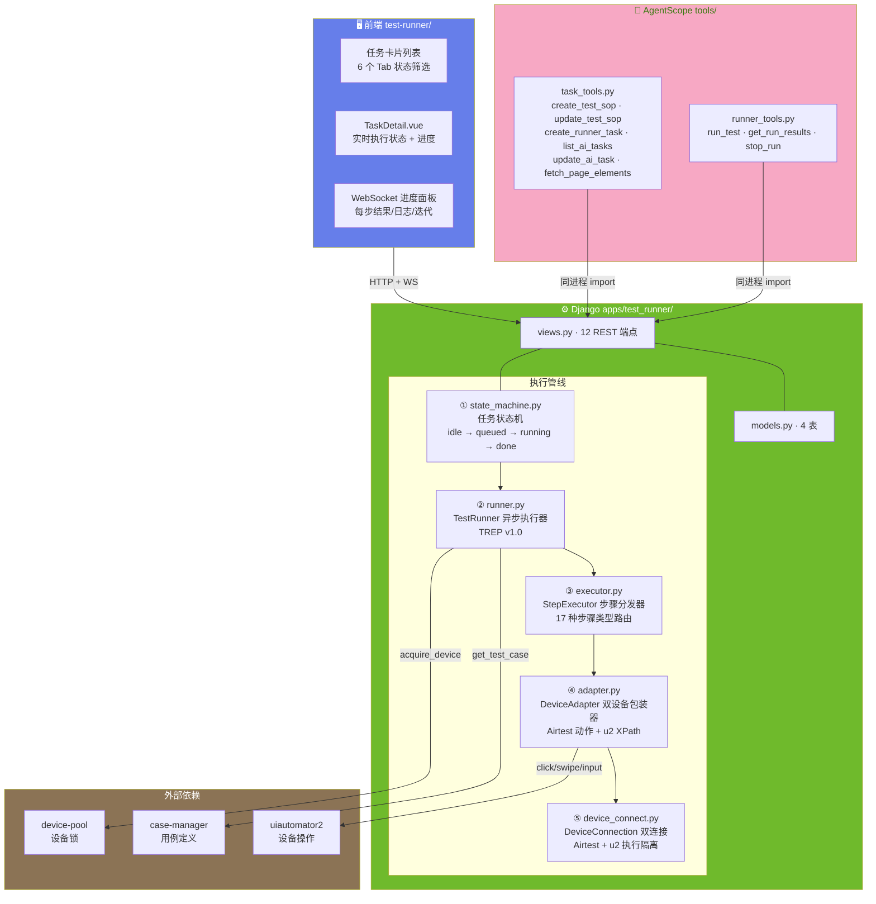
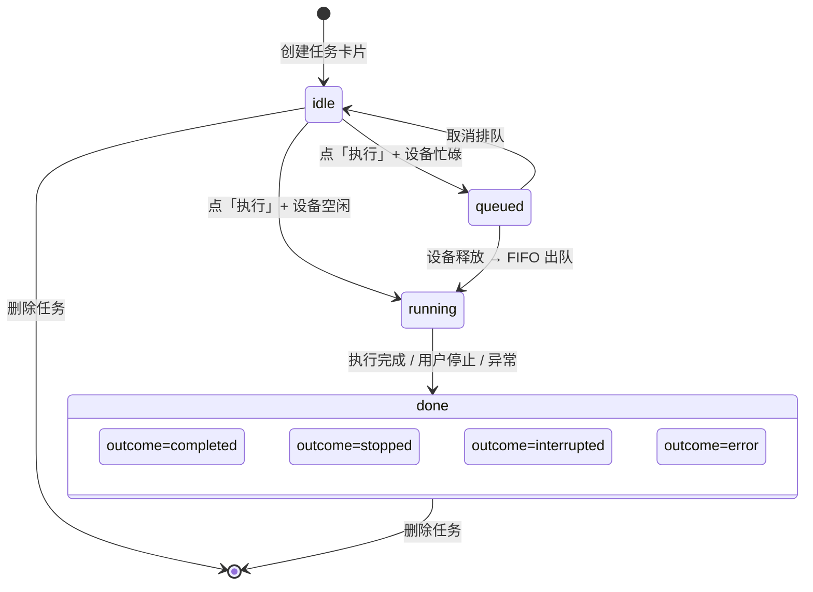
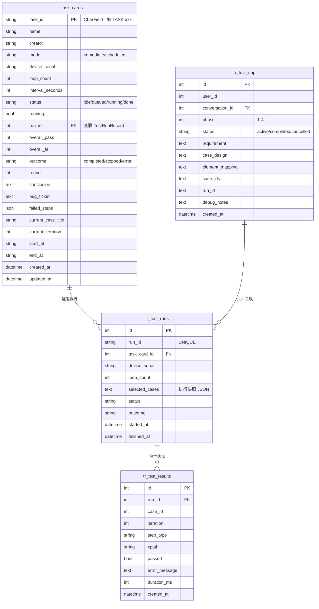

# ARCH-04 — 执行引擎 (Test Runner)

> 关联模块：`apps/test_runner/` · 前端：`frontend/src/modules/test-runner/`
> 关联需求：[`PRD-04-执行引擎`](../02-PRD需求/PRD-04-执行引擎.md) · 关联架构：[`架构大纲`](./架构大纲.md) §4.4
> 版本：v1.2 · 日期：2026-07-17

---

## 1. 模块架构概览

### 1.1 架构定位

执行引擎是平台的 **任务调度与用例执行中枢**，负责将 JSON 步骤定义转化为 Android 设备上的原子操作序列。在三层架构中位于后端核心——它串联设备管理、用例管理、测试报告三大模块。

```
device-pool ──→ test-runner (本模块) ──→ report-generator
case-manager ──→                          dashboard
```

### 1.2 执行管线架构图



---

## 2. 前端架构

### 2.1 组件树

```
frontend/src/modules/test-runner/
│
├── index.vue (~1098行)               页面入口 · 任务卡片列表
│   ├── 6 Tab 筛选栏                   全部/执行中/等待中/已完成/未完成/未执行
│   ├── 新建任务卡片对话框
│   │   ├── 设备选择器                 在线设备下拉
│   │   ├── 用例多选                   勾选用例 + 循环次数
│   │   └── 循环次数设置
│   ├── 任务卡片列表
│   │   └── TaskCard.vue (×N)          设备 · 用例数 · 状态 · 操作按钮
│   └── WebSocket 进度面板             实时日志 + 步骤结果
│
├── TaskDetail.vue (~886行)            任务详情视图
│   ├── 执行进度条                     completed / total
│   ├── 实时日志面板                   WebSocket 推送逐行日志
│   ├── 迭代结果表格                   每轮迭代的用例通过/失败
│   └── 操作按钮                       停止 / 重新执行 / 取消排队
│
├── api.js                             axios 请求封装
└── routes.js                          路由定义
```

### 2.2 任务状态 UI

| 状态 | Tab | 卡片样式 | 操作 |
|------|-----|------|------|
| `idle` | 未执行 | 灰色边框 | 执行 / 编辑 / 删除 |
| `queued` | 等待中 | 黄色边框 + 排队序号 | 取消排队 |
| `running` | 执行中 | 绿色脉冲动画 + 进度条 | 停止 / 查看 |
| `done (completed)` | 已完成 | 绿色标签 | 查看报告 / 重新执行 |
| `done (stopped)` | 未完成 | 橙色标签 | 重新执行 / 查看报告 |
| `done (error)` | 未完成 | 红色标签 | 重新执行 / 查看日志 |

> 📐 前端架构基线 v1.0（2026-07-27）— 组件树 + 6 种任务状态 UI 文档完整。路由定义见 `routes.js`，WebSocket 6 种事件已由 `useTaskWebSocket.js` 处理。

---

## 3. 后端架构

### 3.1 文件结构

```
apps/test_runner/
├── models.py            tr_test_sop / tr_test_runs / tr_test_results / tr_task_cards 4 表
├── views/               视图目录（按职责拆分）
│   ├── __init__.py
│   ├── execution.py     执行控制端点
│   ├── executor.py      单步执行端点
│   ├── run_views.py     运行历史查询
│   ├── task_views.py    任务卡片 CRUD
│   └── helpers.py       内部辅助函数
├── urls.py              12 REST 路由
├── api.py               跨模块 __all__ 白名单
├── state_machine.py     任务状态机
├── runner.py            TestRunner 异步执行器 (TREP v1.0)
├── executor.py          StepExecutor 步骤分发器 (14 种类型)
├── adapter.py           DeviceAdapter 双设备包装器（Airtest 动作 + u2 XPath）
├── device_connect.py    DeviceConnection 双连接管理（Airtest + u2）
├── callbacks.py          WebSocket 回调广播（17 种事件类型）
├── consumers.py         WebSocket Consumer (TestRunConsumer)
├── recovery_helpers.py  任务卡片恢复（stale 检测）
├── u2_recovery.py        Airtest + u2 崩溃检测与重连
├── apps.py              verbose_name='执行引擎'
├── permissions.py       占位
└── serializers.py       占位
```

### 3.2 执行管线详解

```
TestRunner (runner.py)
  │
  │  ① 加载用例
  │     case = CaseManager.api.get_test_case(case_id)
  │     steps = json.loads(case.steps_json)["steps"]
  │
  │  ② 获取设备锁
  │     lock = DevicePool.api.acquire_device(serial, user_id)
  │     if not lock → 加入排队队列
  │
  │  ③ 创建执行记录
  │     run = TestRun.objects.create(...)
  │     快照 selected_cases (完整复制步骤，确保历史可审计)
  │
  │  ④ 迭代执行 (for i in range(loop_count))
  │     for step in steps:
  │       StepExecutor.dispatch(step, device)
  │         ├── click        → adapter.click(xpath)
  │         ├── wait         → adapter.wait_for_element(xpath, timeout)
  │         ├── verify_text  → adapter.get_text(xpath) == expected
  │         ├── start_app    → adapter.start_app(package)
  │         ├── sleep        → time.sleep(duration)
  │         └── log          → push_log(message)
  │       WebSocket 推送每步结果
  │
  │  ⑤ 完成
  │     release_device(serial)
  │     触发报告生成 → ReportGenerator.generate(run_id)
  │     检查排队队列 → 自动分配给队首
  │

StepExecutor (executor.py)
  │
  │  dispatch(step, device_adapter) → StepResult
  │    ├── click:          adapter.click(xpath)
  │    ├── click_indexed:  adapter.click_indexed(xpath, index)
  │    ├── retry_click:    adapter.retry_click(xpath, max_retries, interval)
  │    ├── wait:           adapter.wait_for_element(xpath, timeout)
  │    ├── wait_disappear: adapter.wait_disappear(xpath, timeout)
  │    ├── wait_any:    adapter.wait_any(xpath_a, xpath_b, timeout)
  │    ├── wait_toast:     adapter.wait_toast(text, timeout)
  │    ├── verify_text:    adapter.get_text(xpath) == expected
  │    ├── poll_text:      adapter.poll_text(xpath, interval, max_polls)
  │    ├── start_app:      adapter.start_app(package_name)
  │    ├── kill_app:       adapter.kill_app(package_name)
  │    ├── restart_app:    adapter.restart_app(package_name)
  │    ├── sleep:          time.sleep(duration)
  │    └── log:            (无设备操作，仅推送消息)

DeviceAdapter (adapter.py)
  │
  │  接收 DeviceConnection，双设备路由：
  │    self.d  → u2 Device（XPath 查询：exists/click/get_text/wait/toast）
  │    self.ad → Airtest Android（动作：swipe/drag/app_start/app_stop/shell）
  │
  │  ├── click(xpath)              → d.xpath(xpath).click()        [u2]
  │  ├── get_text(xpath)           → d.xpath(xpath).get_text()     [u2]
  │  ├── wait_for_element(xpath,t) → d.xpath(xpath).wait(timeout=t)[u2]
  │  ├── swipe(direction,dist)     → ad.swipe((x1,y1),(x2,y2))    [Airtest]
  │  ├── start_app(pkg)            → ad.start_app(pkg)             [Airtest]
  │  ├── kill_app(pkg)             → ad.stop_app(pkg)              [Airtest]
  │  └── drag(xpath,dir,dist)     → u2 获取坐标 + Airtest swipe    [混合]
```

### 3.3 任务状态机



### 3.4 SOP 四阶段工作流

```mermaid
stateDiagram-v2
    [*] --> Phase1: create_test_sop()

    Phase1: 阶段一 · 需求分析与用例设计
    Phase2: 阶段二 · 元素准备
    Phase3: 阶段三 · 用例创建与调试
    Phase4: 阶段四 · 任务执行

    Phase1 --> Phase2: update_test_sop (phase=1→2)
    Phase2 --> Phase3: update_test_sop (phase=2→3)
    Phase3 --> Phase4: update_test_sop (phase=3→4)
    Phase4 --> [*]: update_test_sop (status=completed)

    Phase1 --> [*]: 取消
    Phase2 --> [*]: 取消
    Phase3 --> [*]: 取消

    note right of Phase1: 产出: requirement + case_design
    note right of Phase2: 产出: element_mapping + element_gaps
    note right of Phase3: 产出: case_ids + debug_notes
    note right of Phase4: 产出: run_id + run_results
```

---

## 4. API 设计

### 4.1 REST 端点 (12 个)

| 方法 | 路径 | 说明 |
|------|------|------|
| | **执行控制** | |
| `POST` | `/api/runner/run` | 启动测试执行（异步） |
| `POST` | `/api/runner/run/{id}/stop` | 停止执行 |
| `GET` | `/api/runner/run/{id}/status` | 查询运行状态和结果 |
| `POST` | `/api/runner/run-step` | 执行单步（调试用） |
| `POST` | `/api/runner/queue/cancel` | 取消排队任务 |
| `GET` | `/api/runner/active` | 列出当前活跃运行 |
| | **历史记录** | |
| `GET` | `/api/runner/runs` | 列出历史运行记录 |
| | **任务卡片** | |
| `GET` | `/api/runner/tasks` | 任务卡片列表 |
| `POST` | `/api/runner/tasks/save` | 创建/更新任务卡片 |
| `POST` | `/api/runner/tasks/{id}` | 删除任务卡片 |
| | **监控** | |
| `GET` | `/api/runner/monitor/{id}` | 运行监控数据 |
| `GET` | `/api/runner/run/{id}/snapshot` | 运行快照 |

### 4.2 WebSocket 端点 (1 个)

| 路径 | 消息类型 |
|------|------|
| `/ws/runner?token=JWT` | `step_result` · `step_log` · `iteration_complete` · `run_complete` · `run_error` · `progress` |

---

## 5. 数据模型

### 5.1 ER 图



---

## 6. 模块边界与跨模块交互

### 6.1 边界规则

| 规则 | 说明 |
|------|------|
| 执行前快照用例 | `selected_cases` 完整复制步骤 JSON，确保历史不可变 |
| 独立 u2 连接 | `device_connect.py` 独立连接，与 DevicePool 隔离 |
| 不管理用例定义 | 只读消费 case-manager 的数据 |
| 不管理设备注册 | 通过 device-pool 获取锁 |

### 6.2 跨模块交互

| 方向 | 模块 | 交互方式 |
|------|------|------|
| ← 上游 | device-pool | `acquire_device()` / `release_device()` |
| ← 上游 | case-manager | `get_test_case()` → steps_json |
| → 下游 | report-generator | `generate_report(run_id)` 自动触发 |
| → 下游 | dashboard | 执行统计聚合 |
| ←→ | AI 助手 | 9 个 Tool (run/get/stop + SOP + task) |

---

## 7. AgentScope Tool 清单 (9 个)

| Tool | 文件 | 只读 | 说明 |
|------|------|:--:|------|
| `run_test` | runner_tools.py | ❌ | 执行测试（支持循环） |
| `get_run_results` | runner_tools.py | ✅ | 查询执行结果 |
| `stop_run` | runner_tools.py | ❌ | 停止执行 |
| `create_test_sop` | task_tools.py | ❌ | 创建 SOP 上下文 |
| `update_test_sop` | task_tools.py | ❌ | 更新 SOP 状态/产出 |
| `create_runner_task` | task_tools.py | ❌ | 创建执行任务卡片 |
| `list_ai_tasks` | task_tools.py | ✅ | 列出 AI 创建的任务 |
| `update_ai_task` | task_tools.py | ❌ | 更新任务卡片 |
| `fetch_page_elements` | task_tools.py | ✅ | 按页面批量拉取元素 |

---

## 8. 关键约束

| 约束 | 说明 |
|------|------|
| 每设备同时仅 1 个活跃执行 | 通过设备锁保证 |
| 执行快照不可变 | 启动前完整复制 steps_json |
| 排队 FIFO | `ORDER BY created_at` |
| 停止操作信号量 | 设置 stop_flag → 当前步骤完成后退出 |
| 重新执行 = 新卡片 | 保留历史记录对比 |

---

## 变更记录

| 版本 | 日期 | 变更摘要 |
|------|------|----------|
| v1.0 | 2026-07-16 | 初始版本：基于 `项目架构.md` 和 `PRD-04-执行引擎.md` 重构 |
| v1.1 | 2026-07-16 | **代码对照审计**：views 修正为目录结构（6 文件）；TaskCard 模型从 6 字段补全至 22 字段；新增 callbacks.py / consumers.py / recovery_helpers.py / u2_recovery.py |
| v1.2 | 2026-07-17 | **Airtest 迁移**：DeviceConnection 双连接数据类；DeviceAdapter 拆分为 Airtest 动作 + u2 XPath；u2_recovery 扩展 Airtest 崩溃检测；_u2_executor → _device_executor |
