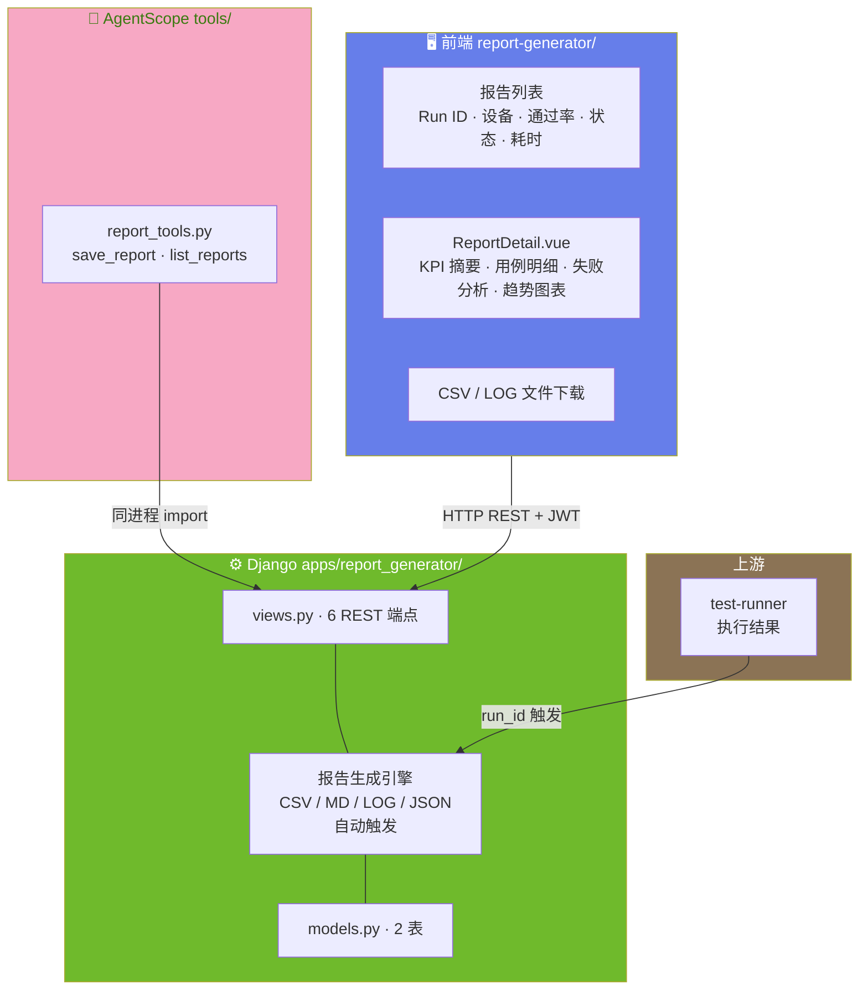
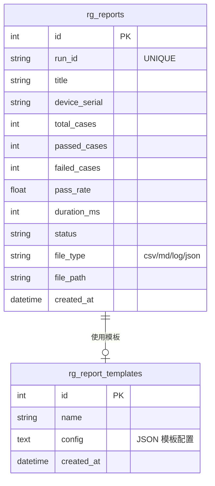

# ARCH-05 — 测试报告 (Report Generator)

> 关联模块：`apps/report_generator/` · 前端：`frontend/src/modules/report-generator/`
> 关联需求：[`PRD-05-测试报告`](../02-PRD需求/PRD-05-测试报告.md) · 关联架构：[`架构大纲`](./架构大纲.md) §4.5
> 版本：v1.0 · 日期：2026-07-16

---

## 1. 模块架构概览

### 1.1 架构定位

测试报告模块是平台的 **执行结果收口与质量可视化中枢**，负责汇总执行数据、自动生成多格式报告、提供在线预览和文件下载。在三层架构中位于后端消费层——它是执行引擎的下游，仪表盘的上游。

```
test-runner ──→ report-generator (本模块) ──→ dashboard (趋势统计)
```

### 1.2 模块数据流架构图



---

## 2. 前端架构

### 2.1 组件树

```
frontend/src/modules/report-generator/
│
├── index.vue                         报告列表页
│   └── 报告表格
│       ├── Run ID (可点击 → 详情)
│       ├── 设备序列号
│       ├── 用例数 / 通过 / 失败
│       ├── 通过率 (进度条)
│       ├── 执行状态 (标签)
│       └── 耗时
│
├── ReportDetail.vue (~793行)         在线报告详情
│   ├── KPI 摘要卡片
│   │   ├── 总用例数
│   │   ├── 通过数 / 失败数
│   │   ├── 通过率
│   │   └── 总耗时
│   ├── 用例执行明细表格
│   │   ├── 用例名 · 迭代 · 结果 · XPath · 耗时 · 错误信息
│   │   └── 折叠展开查看每步详情
│   ├── 失败分析面板
│   │   ├── 失败用例列表
│   │   ├── 失败步骤定位
│   │   └── 截图 (如果有)
│   └── 趋势图表
│       └── 通过率趋势 / 执行耗时趋势
│
├── api.js                             axios 请求封装
└── routes.js                          路由定义
```

### 2.2 路由与状态管理

| 路由 | 页面 | 关键 composable |
|------|------|------|
| `/reports` | `index.vue` — 报告列表 + KPI + 图表 | `usePagination` (shared) |
| `/reports/task/:id` | `TaskReport.vue` — 单任务报告详情 | — |
| `/reports/case/:id` | `CaseBreakdown.vue` — 用例维度拆解 | `useECharts` (shared) |

> 📐 前端架构基线 v1.0（2026-07-27）— 组件树完整，composables/ 已补建，Pinia store 未使用（纯 ref + composable 模式）。

---

## 3. 后端架构

### 3.1 文件结构

```
apps/report_generator/
├── models.py           rg_reports / rg_report_templates 2 表
├── views.py            6 HTTP 端点 (799 行)
├── api.py              跨模块 __all__ 白名单
├── service.py          报告自动生成（CSV/MD/LOG/JSON）
├── urls.py             路由注册
└── apps.py             verbose_name='测试报告'
```

### 3.2 报告生成流程

```
test-runner 执行完成
  │
  ▼
report_generator.service (save_csv / save_log / generate_json_report)(run_id)
  │
  ├── ① 收集数据
  │     run = TestRun.objects.get(run_id=run_id)
  │     results = TestResult.objects.filter(run=run)
  │     case_snapshots = run.selected_cases  (JSON 快照)
  │
  ├── ② 生成 CSV
  │     columns: case_title, iteration, step_type, xpath, passed, duration_ms, error
  │     save → data/reports/{run_id}/report.csv
  │
  ├── ③ 生成 MD (失败详情)
  │     # 测试报告 — {run_id}
  │     ## 失败用例
  │     ### {case_title} (迭代 {i})
  │     - 步骤: {step_type} {xpath}
  │     - 错误: {error_message}
  │     save → data/reports/{run_id}/failures.md
  │
  ├── ④ 生成 LOG
  │     完整执行日志
  │     save → data/reports/{run_id}/execution.log
  │
  ├── ⑤ 生成 JSON (结构化报告)
  │     { run_id, device, loop_count, summary: {total, passed, failed}, cases: [...] }
  │     save → data/reports/{run_id}/report.json
  │
  └── ⑥ 写入 DB
        Report.objects.create(run_id=run_id, title=..., file_type=..., file_path=...)
```

---

## 4. API 设计

### 4.1 REST 端点 (6 个)

| 方法 | 路径 | 说明 |
|------|------|------|
| `GET` | `/api/reports/` | 列出所有报告 |
| `GET` | `/api/reports/cases` | 用例维度分解统计 |
| `GET` | `/api/reports/run/{run_id}` | 按运行 ID 查询报告详情 |
| `GET` | `/api/reports/task/{task_id}` | 按任务 ID 查询报告 |
| `GET` | `/api/reports/{filename}` | 下载报告文件 |
| `GET` | `/api/reports/{filename}/content` | 在线查看报告内容 |

### 4.2 报告详情响应结构

```json
{
  "status": true,
  "data": {
    "run_id": "run_20260716_001",
    "device_serial": "abc123",
    "loop_count": 3,
    "summary": {
      "total": 15,
      "passed": 13,
      "failed": 2,
      "pass_rate": 86.7,
      "duration_ms": 45200
    },
    "cases": [
      {
        "case_id": 1,
        "title": "登录冒烟测试",
        "iterations": [
          {
            "iteration": 1,
            "passed": true,
            "duration_ms": 3200,
            "steps": [...]
          }
        ]
      }
    ],
    "files": {
      "csv": "/api/reports/report_xxx.csv",
      "log": "/api/reports/report_xxx.log",
      "md": "/api/reports/report_xxx.md",
      "json": "/api/reports/report_xxx.json"
    }
  }
}
```

---

## 5. 数据模型

### 5.1 ER 图



### 5.2 表详情

#### rg_reports (报告记录表)

| 字段 | 类型 | 说明 |
|------|------|------|
| `id` | BigAutoField PK | 自增 |
| `run_id` | VARCHAR(100) UNIQUE | 关联 test-runner 执行记录 |
| `title` | VARCHAR(500) | 报告标题 |
| `device_serial` | VARCHAR(100) | 执行设备 |
| `total_cases` | INT | 总用例数 |
| `passed_cases` | INT | 通过数 |
| `failed_cases` | INT | 失败数 |
| `pass_rate` | FLOAT | 通过率 (%) |
| `duration_ms` | INT | 总耗时 (毫秒) |
| `status` | VARCHAR(50) | 报告状态 |
| `file_type` | VARCHAR(50) | csv / md / log / json |
| `file_path` | VARCHAR(1000) | 文件存储路径 |
| `created_at` | DateTime | 创建时间 |

---

## 6. 模块边界与跨模块交互

### 6.1 边界规则

| 规则 | 说明 |
|------|------|
| 只读消费执行结果 | 不做测试执行或设备操作 |
| 自动触发生成 | 执行完成 → 自动生成报告，无需手动触发 |
| 文件存储本地 | `data/reports/{run_id}/` 目录结构 |

### 6.2 跨模块交互

| 方向 | 模块 | 交互方式 |
|------|------|------|
| ← 上游 | test-runner | `runner.py` 执行完成后调用 `service.save_csv(run_id)` |
| → 下游 | dashboard | 通过率趋势数据聚合 |
| ←→ | AI 助手 | `save_report` / `list_reports` (2 个 Tool) |

---

## 7. AgentScope Tool (2 个)

| Tool | 只读 | 说明 |
|------|:--:|------|
| `save_report` | ❌ | 保存报告记录 |
| `list_reports` | ✅ | 列出报告列表 |

---

## 变更记录

| 版本 | 日期 | 变更摘要 |
|------|------|----------|
| v1.0 | 2026-07-16 | 初始版本：基于 `项目架构.md` 和 `PRD-05-测试报告.md` 重构 |
| v1.1 | 2026-07-16 | **代码对照审计**：`generator.py` → `service.py` 文件名修正 |
