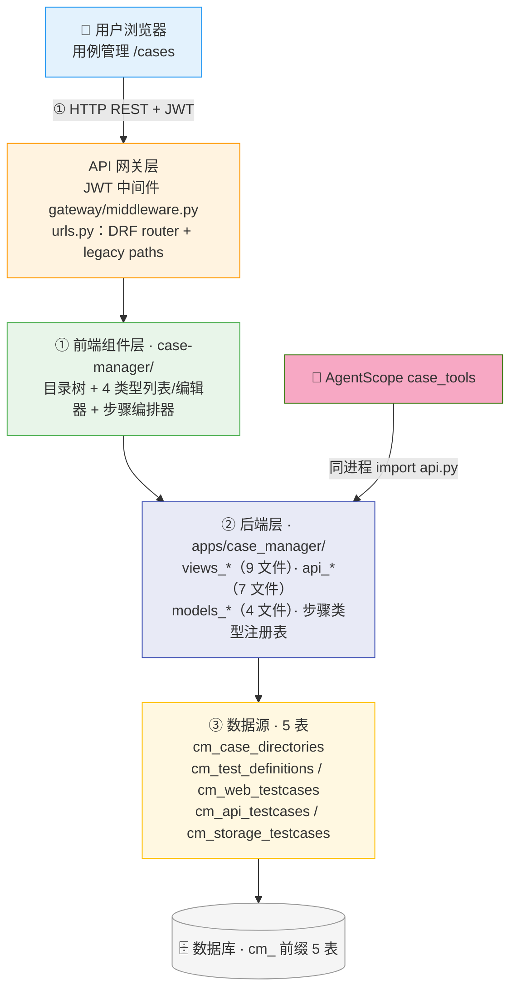
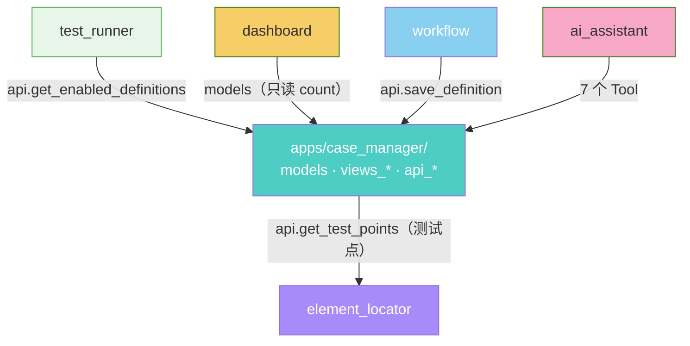
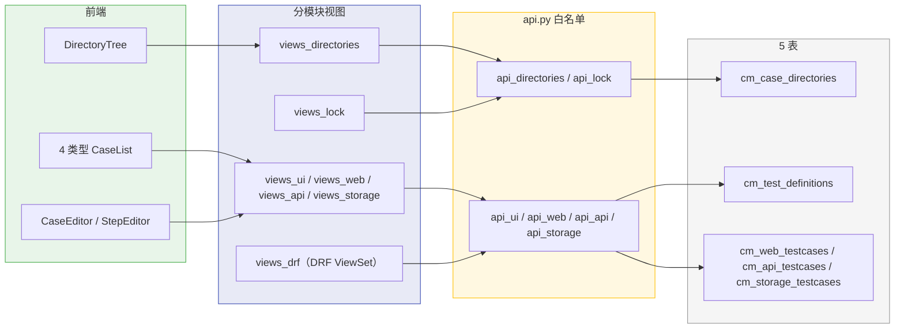
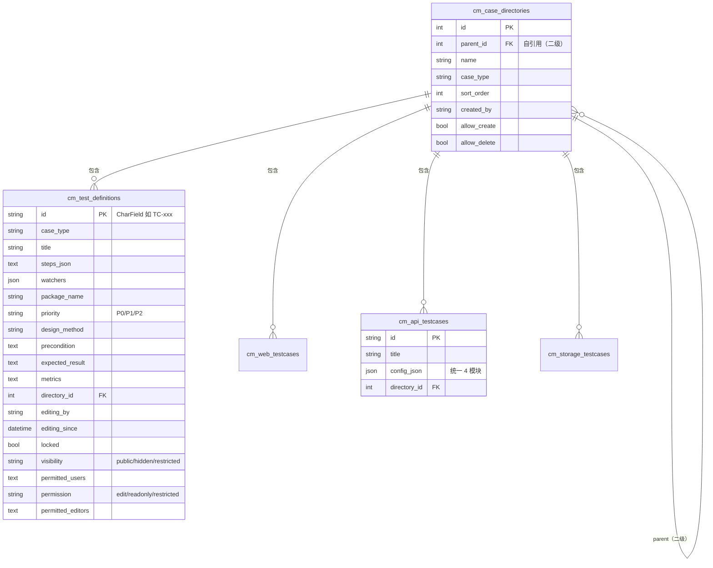

# ARCH-05 — 用例管理 (Case Manager)

> **版本**：v2.0 · **日期**：2026-08-14 · **关联模块**：`apps/case_manager/` · 前端 `frontend/src/modules/case-manager/`

## 文档内容简述

本文档是**用例管理模块**的架构设计，覆盖该模块而非平台全貌：

- **架构四图**：架构全景图 · 模块包图 · 数据流图 · API 关系图（§1.2~1.5）
- **后端架构**：分模块文件结构（9 view + 7 api + 4 model）+ 步骤类型注册表（§3）
- **API 设计**：DRF ViewSet（5）+ legacy（25）双视图层共存（§4）
- **数据模型**：5 表 ER 图 + 4 用例类型（§5）

## 你能从文档获取什么信息

- **4 类用例如何组织**：UI/Web/API/Storage 四表对称结构 + 二级目录树
- **步骤类型注册表**：`STEP_TYPE_META` 29 种（common 6 + android 11 + web 8 + api 4）单一真相源
- **协作机制**：编辑锁（30min）+ 持久锁 + 可见性/权限的数据模型
- **双视图层共存**：DRF ViewSet 与 legacy views 的关系

## 关联文档

- **架构总纲**：[`ARCH-00-平台总体架构`](./ARCH-00-平台总体架构.md) §4.4
- **需求规格**：[`PRD-05-用例管理`](../02-PRD需求/PRD-05-用例管理.md) — **契约以 PRD §5 为准**

---

## 1. 模块架构概览

### 1.1 架构定位

用例管理是平台的**测试资产管理中枢**，在三层架构中位于后端业务层，承上（接收元素定位的 XPath 测试点）启下（为执行引擎提供用例定义）。本模块**只做用例定义与编排**，不执行用例、不管理设备。

### 1.2 架构全景图

> 四层：前端 4 类型编辑器 → API 网关 → 后端分模块 → 5 表数据源。



### 1.3 模块包图

> 箭头 = import 方向。case_manager 读 element_locator 测试点；被 test_runner/dashboard/workflow/ai_assistant 读取。



**防火墙规则**：

```
其他 App ──✅ import──→ case_manager.models（只读 Model 查询）
其他 App ──✅ import──→ case_manager.api.py（跨模块写操作白名单）
case_manager ──✅ import──→ element_locator.api（读测试点）
case_manager ──✅ import──→ device_pool.api（编辑器加载设备列表）
case_manager ──❌ import──→ test_runner / workflow（下游，不可反向）
```

### 1.4 数据流图

> 前端操作 → 分模块视图 → api.py → 5 表。



### 1.5 API 关系图

> 端点 → 前端组件的映射。

```mermaid
flowchart TB
    subgraph API["后端端点"]
        DIR["目录 5 端点"]
        UI["UI 用例 8 端点"]
        WEB["Web 用例 3 端点"]
        API["API 用例 3 端点"]
        STG["Storage 用例 3 端点"]
        LOCK["锁/权限 5 端点"]
        YAML["步骤类型 + YAML 4 端点"]
    end

    subgraph FE["前端"]
        TREE["DirectoryTree"]
        LIST["4 CaseList"]
        EDIT["4 Editor + StepEditor"]
    end

    DIR --> TREE
    UI --> LIST
    WEB --> LIST
    API --> LIST
    STG --> LIST
    LOCK --> EDIT
    YAML --> LIST

    style API fill:#e8f5e9,stroke:#4caf50
    style FE fill:#e3f2fd,stroke:#2196f3
```

**前后端契约不匹配（历史 3 处，已登记）**：

| # | 项 | 现象 | 状态 |
|---|---|---|---|
| 1 | 步骤类型数量 | 旧 ARCH「17 种」，实际 `STEP_TYPE_META` 29 种（common 6 + android 11 + web 8 + api 4） | ✅ 已校正（PRD §2.3） |
| 2 | 数据表数量 | 旧 ARCH「models.py 2 表」，实际 5 表（目录 + 4 用例类型） | ✅ 已校正（§5） |
| 3 | 端点数量 | 旧 ARCH「10-14 端点」，实际 DRF 5 ViewSet + legacy 25 | ✅ 已校正（PRD §5.1） |

---

## 3. 后端架构

### 3.1 文件结构

```
apps/case_manager/
├── models.py            TestDefinition + CaseDirectory（UI + 目录）
├── models_web.py        WebTestCase（Playwright）
├── models_storage.py    StorageTestCase（表格式）
├── models_api.py        ApiTestCase（统一 config_json）
├── views.py             step-types 入口
├── views_base.py        基础视图
├── views_directories.py 目录 CRUD + 权限
├── views_ui.py          UI 用例 CRUD + YAML 导出
├── views_web.py         Web 用例 CRUD
├── views_api.py         API 用例 CRUD
├── views_storage.py     Storage 用例 CRUD
├── views_lock.py        编辑锁/持久锁/可见性
├── views_drf.py         5 个 DRF ViewSet
├── api.py               向后兼容 facade（re-export 6 子模块）
├── api_ui.py / api_web.py / api_api.py / api_storage.py
├── api_directories.py / api_lock.py
├── serializers.py / schema_config.py
├── consumers.py         WebSocket（协同编辑）
└── urls.py              DRF router + legacy
```

> 步骤类型注册表在共享模块 `models/step_types.py`（`StepType` 枚举 + `STEP_TYPE_META` + `TestStep` dataclass）。

### 3.2 步骤类型注册表

```
models/step_types.py
  StepType(Enum)          37 成员（含 8 个 deprecated）
  CaseType(Enum)          ui_automation / api_testing / web_automation / storage
  STEP_TYPE_META          29 种注册步骤（common 6 / android 11 / web 8 / api 4）
  TestStep(dataclass)     原子步骤结构（type/xpath/timeout/.../children）
  get_step_types_by_target(target)   按平台预计算缓存，O(1)
```

### 3.3 分模块设计

| 关注点 | 文件 | 职责 |
|------|------|------|
| 目录 | views_directories + api_directories | 二级树 CRUD + 权限 |
| UI 用例 | views_ui + api_ui | UI 用例 CRUD + YAML + 锁 |
| Web/API/Storage | views_web/api/storage + api_* | 其余三类型 CRUD |
| 锁/可见性 | views_lock + api_lock | 编辑锁/持久锁/可见性（跨类型共享） |

---

## 4. API 设计

> 响应信封统一 `{status, data}` / `{status, message}`；字段 snake_case。**完整字段契约以 PRD §5 为准**，本节只列概览。

### 4.1 端点概览

**DRF ViewSet（5 个）**：`directories`、`definitions`（UI）、`storage/definitions`、`api-testing/definitions`、`web/definitions`，各生成标准 CRUD 路由。

**DRF 锁/权限（5 个）**：`/definitions/{case_id}/lock|unlock|case-lock|case-unlock|visibility`（CaseActionsViewSet，跨类型共享）。

**legacy（25 个）**：目录 5 + UI 用例 8 + Web 3 + API 3 + Storage 3 + 步骤类型 1 + YAML 2。

### 4.2 用例 steps_json 结构

```json
{
  "steps": [
    { "type": "click", "xpath": "//Button[@resource-id='com.app:id/login']", "description": "点击登录" },
    { "type": "adb_wait_toast", "expected_text": "登录成功", "timeout": 10 },
    { "type": "verify_text", "xpath": "//TextView[@text='首页']", "expected_text": "首页" }
  ]
}
```

> 步骤结构以 `TestStep` dataclass 为准（含 children 嵌套支持 if/loop 容器）。

---

## 5. 数据模型

### 5.1 ER 图



### 5.2 四类用例对称结构

| 类型 | 表 | 差异化存储 |
|------|------|------|
| UI | cm_test_definitions | steps_json + watchers + package_name + IoT 字段 |
| Web | cm_web_testcases | url + custom_columns + rows（表格行） |
| API | cm_api_testcases | config_json（case_info/steps/test_data/validation 4 模块） |
| Storage | cm_storage_testcases | custom_columns + rows |

> 四表共享：目录 FK、协作字段（editing_by/editing_since/locked）、可见性/权限字段、`UNIQUE(directory, title)` 约束。

---

## 6. 模块边界与跨模块交互

### 6.1 边界规则

| 规则 | 说明 |
|------|------|
| 只管理用例定义 | 不执行用例、不管理设备、不管理元素 CRUD |
| 写操作走 api.py | View/Tool → api_*.py → ORM |
| 步骤类型单一真相源 | `models/step_types.py` `StepType` 枚举 |
| 同目录标题唯一 | `UNIQUE(directory, title)` |

### 6.2 对外接口（api.py `__all__` 摘要）

```python
# UI 自动化
get_definition / save_definition / get_enabled_definitions / batch_save_definitions
# Web / API / Storage
get_web_definition / save_web_definition / batch_save_web_definitions
get_api_definition / save_api_definition / batch_save_api_definitions
get_storage_definition / save_storage_definition / batch_save_storage_definitions
# 目录 / 锁
get_directory_tree / create_directory / update_directory / delete_directory / batch_move_items
find_case_across_types / get_case_for_lock
```

### 6.3 跨模块消费者

| 消费方 | 调用方式 | 用途 |
|------|------|------|
| **test-runner** | `api.get_enabled_definitions()` | 获取启用用例定义执行 |
| **dashboard** | `models` 只读 count | 用例统计 |
| **workflow** | `api.save_definition()` | Blockly → JSON 导入用例 |
| **AI 助手** | 7 个 Tool（save/get/list/debug + storage/api/web 专用） | 自然语言生成用例 |
| **element-locator** | EventBus `add-step-to-case` | 供 XPath 测试点 |

---

## 7. 设计要点

| 要点 | 说明 |
|------|------|
| 四表对称 | 4 类型用例表共享目录 FK + 协作字段 + 唯一约束 |
| 步骤类型注册表 | `STEP_TYPE_META` 单一真相源，前端动态拉取 |
| 协作机制 | 编辑锁 30min 超时 + 持久锁 + 可见性/权限四重控制 |
| API 用例统一 | `config_json` 4 模块替代扁平字段 |
| 双视图层 | DRF ViewSet（新标准）+ legacy（旧前端）共存 |

---

## 变更记录

| 版本 | 日期 | 变更摘要 |
|------|------|----------|
| v1.0 | 2026-07-16 | 初始版本 |
| v1.1 | 2026-07-16 | 代码对照审计：TestDefinition.id CharField PK；IoT 字段 |
| v1.2 | 2026-07-17 | 协作功能：+5 字段 +4 端点 |
| v1.3 | 2026-07-22 | 多类型用例：+3 分表；AI Tool 4→7 |
| v2.0 | 2026-08-14 | 按仪表盘 ARCH 格式重构：补四图；校正 5 表 + 29 步骤类型 + 双视图层；标题 ARCH-03→ARCH-05 |
