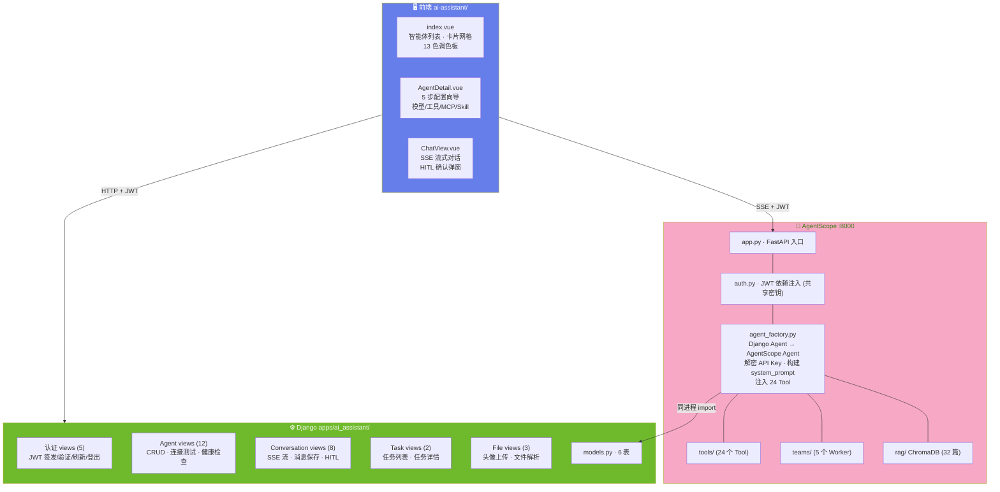
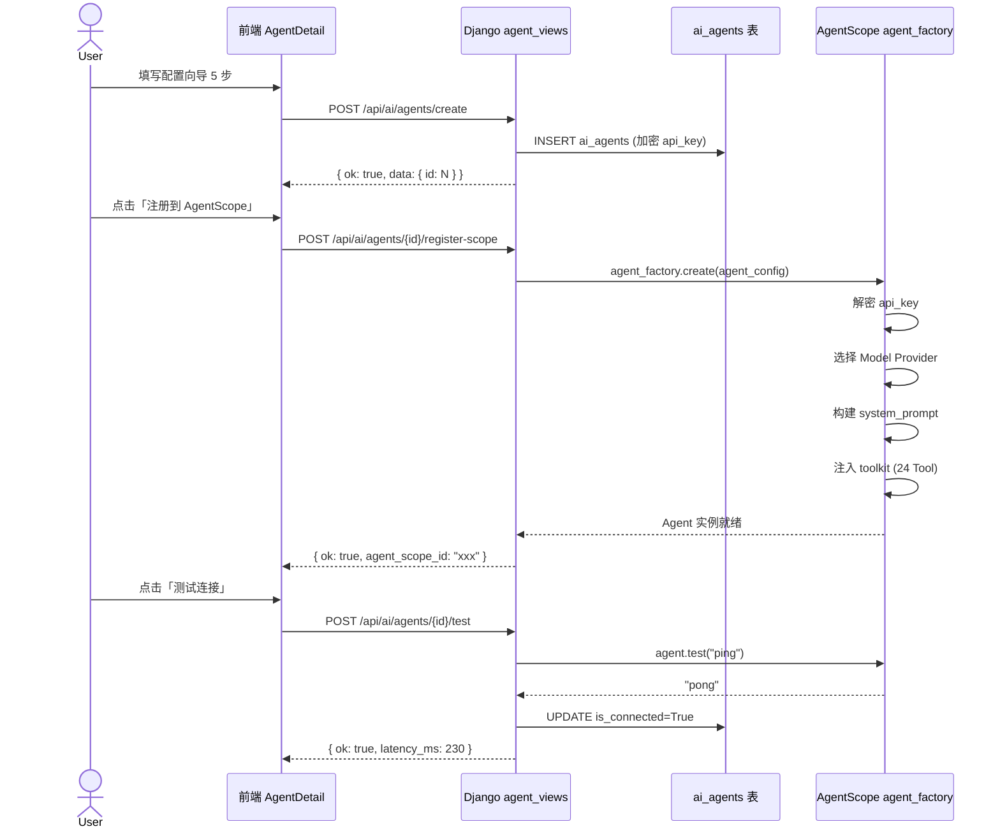
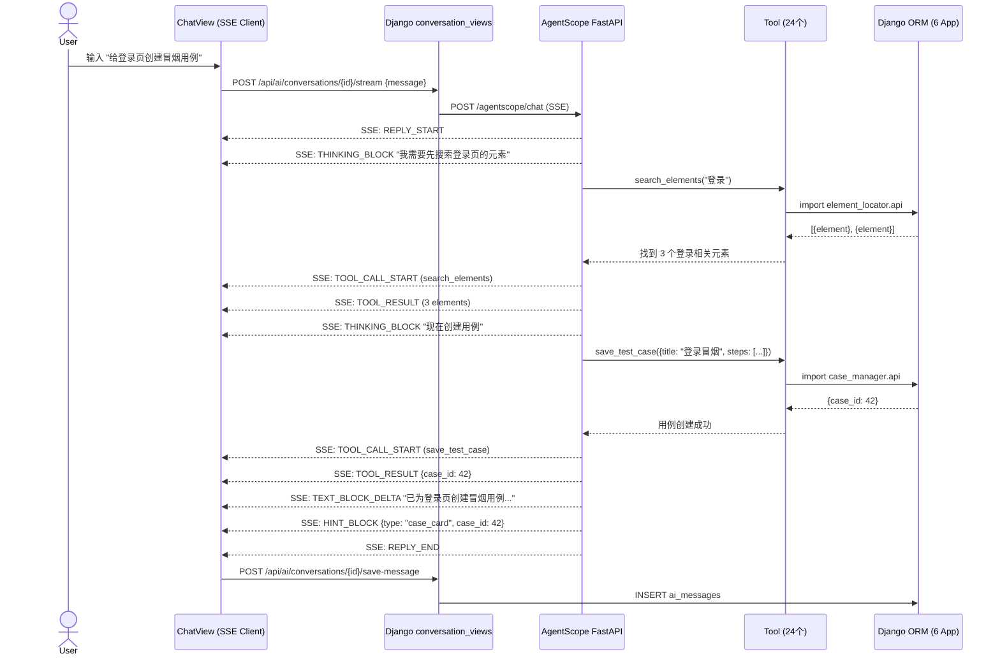
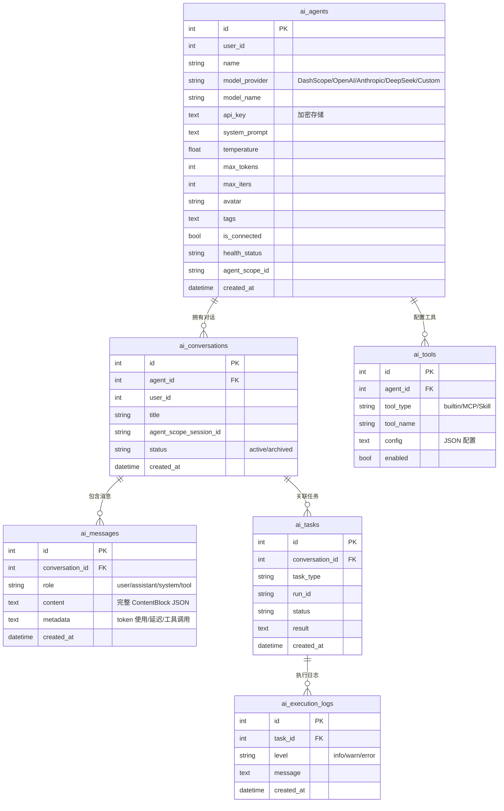

# ARCH-06 — AI 助手 (AI Assistant)

> 关联模块：`apps/ai_assistant/` · 前端：`frontend/src/modules/ai-assistant/`
> 关联需求：[`PRD-06-AI助手`](../02-PRD需求/PRD-06-AI助手.md) · 关联架构：[`架构大纲`](./架构大纲.md) §4.6
> 版本：v1.2 · 日期：2026-07-22

---

## 1. 模块架构概览

### 1.1 架构定位

AI 助手是平台的 **自然语言交互中枢**，通过 AgentScope ReAct 推理引擎，让用户以对话方式驱动全流程测试。在三层架构中横跨后端层和 AI 引擎层——Django 管理智能体配置和对话记录，AgentScope 执行推理和 Tool 编排。

支持 4 种用例类型的智能生成：Android UI 自动化 / Web 自动化 / 业务功能 / API 接口。AI 通过语义识别或主动询问确定类型后，按对应模板生成用例并写入用例管理模块。生成任务以卡片形式嵌入对话流，并同步到 AI 助手首页任务看板。

```
用户自然语言 → AI 助手 (本模块) → 28 个 Tool → 6 个业务模块
```

### 1.2 全栈架构图



---

## 2. 前端架构

### 2.1 组件树

```
frontend/src/modules/ai-assistant/
│
├── index.vue (~459行)                 智能体列表页
│   ├── Tabs 筛选栏                    全部 | 运行中 | 未连通 | 已暂停
│   ├── 智能体卡片网格
│   │   └── AgentCard.vue (×N)
│   │       ├── 头像 (上传/Emoji)
│   │       ├── 模型选择器             内置 + API检测 + 自定义合并去重
│   │       ├── 健康状态点              绿(运行中) / 红(未连通) / 黄(已暂停)
│   │       ├── 连接测试按钮            POST /test
│   │       └── 操作菜单                编辑/删除/注册到 AgentScope
│   └── 定时巡检                        setInterval(30min) → GET /health
│
├── AgentDetail.vue (~800行)           智能体配置页
│   └── 5 步配置向导 (v-if 按需渲染)
│       ├── 步骤1: 基本信息             名称 · 头像 · 标签 · 描述
│       ├── 步骤2: 模型配置             提供商(DashScope/OpenAI/Anthropic/DeepSeek/自定义)
│       │                               🔍 检测模型按钮 · API Key · 温度 · Token
│       ├── 步骤3: 工具配置             勾选可用 Tool · MCP 服务器配置
│       ├── 步骤4: 提示词              自定义 system_prompt
│       └── 步骤5: 预览与测试           摘要预览 · 连接测试
│
├── ChatView.vue (~1325行)             对话页
│   ├── 对话列表 (左)                   历史对话 · 新建对话
│   ├── 消息区 (中)                     SSE 流式渲染
│   │   ├── TEXT_BLOCK_DELTA           逐 token 打字机效果
│   │   ├── THINKING_BLOCK             折叠思考过程
│   │   ├── TOOL_CALL_START/DELTA      工具调用卡片
│   │   ├── TOOL_RESULT                工具结果折叠面板
│   │   ├── HINT_BLOCK                 SOP 状态卡片 / 任务卡片
│   │   └── REQUIRE_USER_CONFIRM       HITL 确认弹窗
│   └── 输入区 (下)                    消息输入 · 发送 · 停止生成
│
├── api.js                             axios + SSE 封装
└── routes.js                          路由定义
```

### 2.2 SSE 事件类型与前端渲染

| 事件 | 前端渲染 | 说明 |
|------|------|------|
| `REPLY_START` | 消息气泡出现 | 开始新回复 |
| `TEXT_BLOCK_DELTA` | 打字机效果追加文本 | 逐 token |
| `THINKING_BLOCK_START/DELTA/END` | 折叠面板 (默认折叠) | ReAct 推理过程 |
| `TOOL_CALL_START` | 工具调用卡片 (loading) | 工具名 + 参数 |
| `TOOL_CALL_DELTA` | 追加工具参数 | JSON 增量 |
| `TOOL_RESULT_START/DELTA/END` | 结果面板 (折叠) | 成功/失败 |
| `HINT_BLOCK` | SOP 卡片 / 任务卡片 | UI 结构化提示 |
| `REQUIRE_USER_CONFIRM` | ElMessageBox 确认弹窗 | HITL |
| `REPLY_END` | 标记完成，触发 `save-message` | 持久化 |

---

## 3. 后端架构

### 3.1 Django 文件结构

```
apps/ai_assistant/
├── models.py                         6 表
├── views/
│   ├── __init__.py
│   ├── auth_views.py                 5 认证端点
│   ├── agent_views.py                12 Agent 管理端点
│   ├── conversation_views.py         8 对话与消息端点
│   ├── task_views.py                 2 任务端点
│   ├── file_views.py                 3 文件端点
│   ├── knowledge_views.py            4 知识库端点
│   ├── model_views.py                模型检测端点
│   ├── hitl_views.py                 HITL 确认端点
│   └── common.py                     公共工具函数
├── api.py                            跨模块 __all__ 白名单
├── urls.py                           路由注册
└── apps.py
```

### 3.2 AgentScope 文件结构

```
agentscope_service/
├── app.py                            FastAPI 应用入口 (Uvicorn :8000)
├── auth.py                           JWT 依赖注入 (共享 SECRET_KEY)
├── agent_factory.py                  Django Agent → AgentScope Agent 转换
│   ├── 解密 api_key (Fernet)
│   ├── 选择 Model (DashScope/OpenAI/Anthropic/DeepSeek/Custom)
│   ├── 构建 system_prompt: 平台约束 + SOP 四阶段 + 用户自定义
│   └── 注入 toolkit (28 Tool + 4 Plan Tool)
│
├── tools/                            28 个自定义 Tool
│   ├── element_tools.py             (2)  get_test_points · search_elements
│   ├── case_tools.py                (7)  UI save/get/list/debug + save_storage/save_api/save_web
│   ├── device_tools.py              (3)  get_online/acquire/release_device
│   ├── runner_tools.py              (3)  run_test · get_run_results · stop_run
│   ├── task_tools.py                (8)  SOP · task_card · page_elements · case_gen_task · update_case_gen_task
│   ├── report_tools.py              (2)  save_report · list_reports
│   ├── prd_tools.py                 (3)  parse_prd · design_cases · import_cases
│   ├── rag_tool.py                  (1)  search_knowledge_base
│   └── factory.py                        工具注册工厂
│
├── teams/                            5 个 Agent Team 模板
│   ├── element-inspector            查找 UI 元素 Worker
│   ├── case-writer                  编写测试用例 Worker
│   ├── device-operator              管理设备锁 Worker
│   ├── test-executor                执行测试 Worker
│   └── report-writer                生成报告 Worker
│
└── rag/                              ChromaDB 知识库
    └── 32 篇项目文档 → 向量检索 → 上下文增强
```

### 3.3 Agent 创建流程



### 3.4 SSE 流式对话流程



---

## 4. API 设计

### 4.1 REST 端点 (37 个)

#### 认证 (5)

| 方法 | 路径 | 鉴权 | 说明 |
|------|------|:--:|------|
| `POST` | `/api/ai/auth/login` | ❌ | JWT 签发 |
| `POST` | `/api/ai/auth/register` | ❌ | 用户注册 |
| `POST` | `/api/ai/auth/refresh` | ✅ | 刷新 token |
| `POST` | `/api/ai/auth/logout` | ✅ | 登出（token 加黑名单） |
| `GET` | `/api/ai/auth/me` | ✅ | 当前用户信息 |

#### Agent 管理 (12)

| 方法 | 路径 | 说明 |
|------|------|------|
| `GET` | `/api/ai/agents` | 列出智能体 |
| `POST` | `/api/ai/agents/create` | 创建智能体 |
| `GET` | `/api/ai/agents/{id}` | 详情（含脱敏 api_key） |
| `POST` | `/api/ai/agents/{id}/update` | 更新配置 |
| `POST` | `/api/ai/agents/{id}/delete` | 删除 |
| `POST` | `/api/ai/agents/{id}/reveal-key` | 查看完整 Key（5s 有效） |
| `POST` | `/api/ai/agents/{id}/register-scope` | 注册到 AgentScope |
| `POST` | `/api/ai/agents/{id}/test` | 测试连接 |
| `GET` | `/api/ai/agents/{id}/models` | 可用模型列表 |
| `GET` | `/api/ai/agents/{id}/conversations` | 智能体的对话列表 |
| `POST` | `/api/ai/agents/{id}/conversations/create` | 创建新对话 |
| `GET` | `/api/ai/agents/health` | 全部智能体健康检查 |

#### 对话与消息 (8)

| 方法 | 路径 | 说明 |
|------|------|------|
| `GET` | `/api/ai/conversations/{id}/messages` | 获取消息列表 |
| `POST` | `/api/ai/conversations/{id}/send` | 发送消息（阻塞模式兜底） |
| `POST` | `/api/ai/conversations/{id}/stream` | 启动 SSE 流式对话 |
| `POST` | `/api/ai/conversations/{id}/save-message` | 保存消息到数据库 |
| `POST` | `/api/ai/conversations/{id}/confirm-result` | 用户确认结果 (HITL) |
| `POST` | `/api/ai/conversations/{id}/create-scope-session` | 创建 AgentScope 会话 |
| `POST` | `/api/ai/conversations/{id}/rename` | 重命名对话 |
| `POST` | `/api/ai/conversations/{id}/delete` | 删除对话 |

#### 其他 (12)

| 方法 | 路径 | 说明 |
|------|------|------|
| `GET` | `/api/ai/conversations/{id}/tasks` | 对话关联任务 |
| `GET` | `/api/ai/conversations/{id}/tasks/{run_id}` | 单个任务详情 |
| `POST` | `/api/ai/upload-avatar` | 上传智能体头像 |
| `POST` | `/api/ai/upload-file` | 上传并解析文件 |
| `GET` | `/api/ai/avatars/{name}` | 获取头像文件 |
| `POST` | `/api/ai/models/detect` | 检测所有模型连接 |
| `GET` | `/api/ai/health` | 平台健康检查 |
| `GET` | `/api/ai/tasks` | 全部 AI 任务列表 |
| `GET` | `/api/ai/knowledge/status` | 知识库状态 |
| `GET` | `/api/ai/knowledge/documents` | 知识库文档列表 |
| `POST` | `/api/ai/knowledge/reindex` | 重建知识库索引 |
| `POST` | `/api/ai/knowledge/documents/add` | 添加知识库文档 |

---

## 5. 数据模型

### 5.1 ER 图



---

## 6. 模块边界与跨模块交互

### 6.1 边界规则

| 规则 | 说明 |
|------|------|
| AgentScope 不走 HTTP 调 Django | 同进程 import ORM/API |
| Django 不管理 Agent 生命周期 | 只存配置；生命周期由 AgentScope 管理 |
| 共享 JWT 密钥 | `SECRET_KEY` 两边一致，Django 签发，AgentScope 验证 |
| SSE + 阻塞 POST 兜底 | AgentScope 不可用时自动降级 |
| API Key 加密存储 | Fernet 对称加密，前端脱敏展示 |

### 6.2 system_prompt 构建

```
agent_factory.py 构建的 system_prompt 结构:
═══════════════════════════════════════════

[平台上下文]
  你是 Android-AutoTests 平台的 AI 助手。
  你可以通过 Tool 调用以下模块：设备管理、元素定位、用例管理、执行引擎、测试报告。

[用例类型识别与分发]
  当用户要求创建测试用例时，先识别用例类型：
  - UI/Android/App → ui_automation（可执行，17 种步骤类型，需 XPath 定位）
  - Web/网页/浏览器 → web_automation（Playwright 风格，URL + 操作步骤 + 预期结果）
  - 功能/业务/流程 → storage（步骤描述 + 预期结果，不需要自动化执行）
  - API/接口/HTTP → api_testing（请求头 + 请求体 + 预期响应）
  
  若无法从输入中识别类型，主动询问：
  「您需要哪种类型的用例？Android UI / Web 自动化 / 业务功能 / API 接口」

[SOP 四阶段工作流]
  当用户要求创建和执行测试时，遵循四阶段流程：
  1. 需求分析与用例设计 (phase=1) → 确认类型 + 用例数 → 创建任务卡片
  2. 元素准备 (phase=2)（仅 ui_automation）
  3. 用例创建与调试 (phase=3) → 按类型调用对应 save 工具
  4. 任务执行 (phase=4)（仅 ui_automation 可执行）

[用例生成任务卡片]
  创建用例生成任务的标准流程：
  1. 调用 create_case_gen_task 创建任务卡片（status=PENDING）
     - task_type: case_generation
     - case_type: 用户选择的类型
     - total_count: 计划生成的用例数量
  2. 任务卡片同步出现在 AI 助手首页任务看板
  3. 开始生成用例 → 调用 update_case_gen_task 更新 status=RUNNING
  4. 每完成一个用例 → 更新 progress
  5. 全部完成 → 调用 update_case_gen_task 更新 status=COMPLETED

[约束]
  - 创建 UI 自动化用例前必须搜索/确认元素存在
  - 执行测试前必须锁定设备
  - 执行完成后必须释放设备
  - Android UI 和 Web 自动化用例写入 cm_test_definitions / cm_web_testcases
  - 业务功能用例写入 cm_storage_testcases（步骤 + 预期结果）
  - API 用例写入 cm_api_testcases（请求头 + 请求体 + 预期响应）

[用户自定义]
  {user's custom system_prompt}
```

### 6.3 跨模块交互

| 方向 | 模块 | Tool 数量 | 说明 |
|------|------|:--:|------|
| → | device-pool | 3 | get_online · acquire · release |
| → | element-locator | 2 | get_test_points · search_elements |
| → | case-manager | 7 | UI: save/get/list/debug + Storage/API/Web 专用 save |
| → | test-runner | 10 | run · results · stop · SOP · task · case_gen_task |
| → | report-generator | 2 | save · list |
| → | RAG (ChromaDB) | 1 | search_knowledge_base |
| → | PRD | 3 | parse · design · import |

---

### 6.4 用例生成任务卡片架构

任务卡片存在于两个位置，共享同一个后端记录（`TestRunRecord`，`run_id` 以 `case-gen-` 开头）：

```
CreateCaseGenTaskTool (AgentScope)
    │
    ├──→ TestRunRecord (tr_test_runs)
    │      run_id: case-gen-xxxxxxxx
    │      status: PENDING → RUNNING → COMPLETED
    │      summary: { task_type, case_type, case_titles, progress, ... }
    │
    ├──→ HintBlock (type: task_card) → 对话内嵌卡片
    │      ChatView 解析 SSE 流，渲染 TaskCard 组件
    │
    └──→ GET /api/ai/tasks → 任务看板
           list_ai_tasks() 同时查询 ai-task-* 和 case-gen-*
           TaskStickyNote 渲染便签卡片
```

**任务卡片状态流转：**
```
PENDING (等待中) → RUNNING (进行中) → COMPLETED (已完成)
                                      → FAILED (失败)
```

**TaskStickyNote 适配：**
- 用例生成任务：显示用例类型标签 + 用例数量，无设备信息
- 执行任务：显示设备序列号 + 用例数量（现有行为）

---

## 7. Agent Team 架构

```
Leader Agent (AI 助手主智能体)
  │
  │  根据任务类型派发
  │
  ├── element-inspector    查找 UI 元素 Worker
  │     Tools: search_elements, get_test_points, fetch_page_elements
  │
  ├── case-writer          编写测试用例 Worker
  │     Tools: save_test_case, get_test_case, list_test_cases
  │
  ├── device-operator      管理设备锁 Worker
  │     Tools: get_online_devices, acquire_device, release_device
  │
  ├── test-executor        执行测试 Worker
  │     Tools: run_test, get_run_results, stop_run, create_runner_task
  │
  └── report-writer        生成报告 Worker
        Tools: save_report, list_reports
```

---

## 8. 关键约束

| 约束 | 实施位置 |
|------|:--:|
| API Key 加密存储 | `models.py` Fernet |
| 前端不获取完整 Key | `reveal-key` 仅 5s 有效期 |
| Tool 不直写数据库 | 全部通过 Django api.py |
| 对话消息完整持久化 | `save-message` 在 REPLY_END 后触发 |
| 知识库文档只读 | ChromaDB 向量检索 |

---

## 变更记录

| 版本 | 日期 | 变更摘要 |
|------|------|----------|
| v1.0 | 2026-07-16 | 初始版本：基于 `项目架构.md`、`模块-AI助手-技术架构与功能设计.md` 和 `PRD-06-AI助手.md` 重构 |
| v1.1 | 2026-07-16 | **代码对照审计**：API 端点 32→37（补齐 knowledge/health/tasks 端点），views 文件 5→9（补齐 common/hitl/knowledge/model_views） |
| v1.2 | 2026-07-22 | **多类型用例生成**：Tool 24→28（新增 save_storage/save_api/save_web + case_gen_task/update_case_gen_task）；system_prompt 增加用例类型识别分发 + 任务卡片工作流；任务卡片双位置同步架构（对话内嵌 + 任务看板） |
