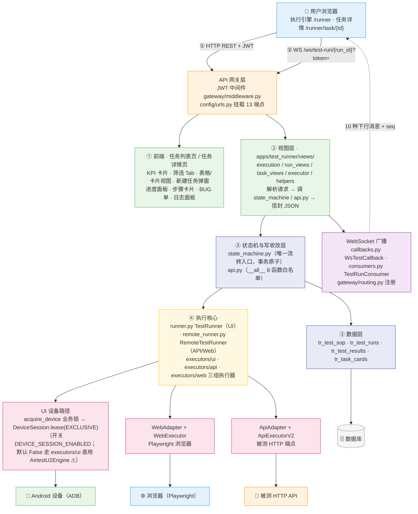
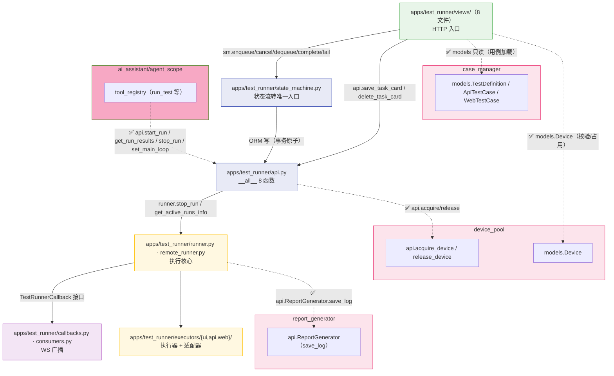
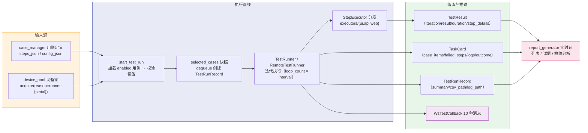
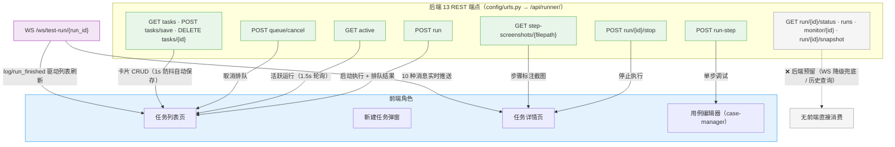
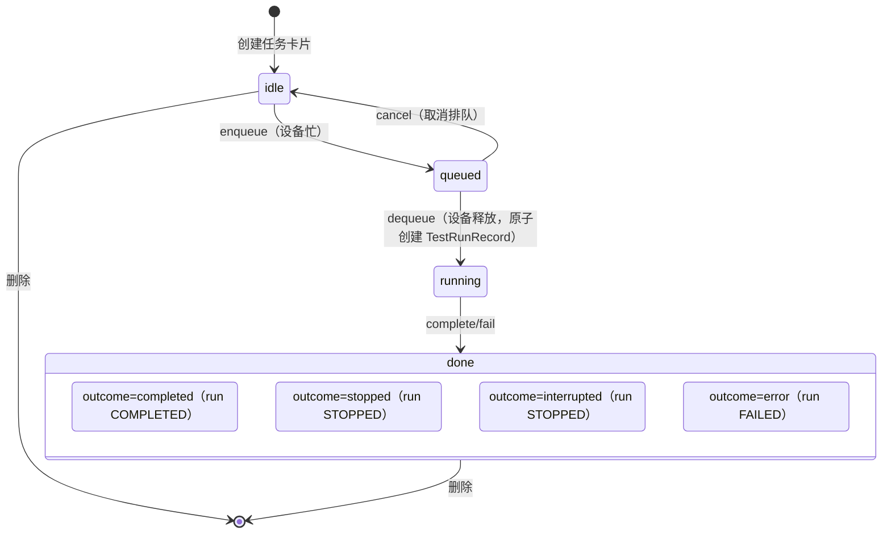

# ARCH-06 — 执行引擎 (Test Runner)

> **版本**：v2.1 · **日期**：2026-08-21 · **关联模块**：`apps/test_runner/` · 前端 `frontend/src/modules/test-runner/`

## 文档内容简述

本文档是**执行引擎模块**的架构设计，覆盖该模块而非平台全貌：

- **架构四图**：架构全景图 · 模块包图 · 数据流图 · API 关系图（§1.2~1.5）
- **后端架构**：文件结构 + 状态机 / 执行管线 / 队列恢复 / WS 广播设计（§3）
- **API 设计**：13 REST 端点 + 1 WebSocket（§4）
- **数据模型**：4 张 `tr_` 表 ER 与状态机（§5）
- **模块边界**：api 白名单 + 跨模块依赖（§6）

## 你能从文档获取什么信息

- **执行管线怎么拼**：TaskCard 状态机唯一流转入口 → TestRunner/RemoteTestRunner → executors/{ui,api,web} 三组执行器 → 设备/浏览器/被测 API
- **实时进度怎么推**：WS 10 种下行消息 + `seq` 递增序号 + 5s 心跳，断线重连与 seq 断档对账
- **队列怎么恢复**：进程内 FIFO + DB `queued` 任务卡片，启动恢复 + 懒恢复双保险
- **边界与隐患**：状态大小写双轨、信封平铺、`/tasks` camelCase、mode 取值漂移等已登记偏差

## 关联文档

- **架构总纲**：[`ARCH-00-平台总体架构`](./ARCH-00-平台总体架构.md) §3.2（test_runner 行）· §4.2 状态机 · §4.4 DeviceSession（EXCLUSIVE）· §1.6 #2
- **需求规格**：[`PRD-06-执行引擎`](../02-PRD需求/PRD-06-执行引擎.md) — **契约以 PRD §5 为准**

---

## 1. 模块架构概览

### 1.1 架构定位

执行引擎是平台的**任务调度与用例执行中枢**：将用例管理产出的 JSON 步骤定义转化为 Android 设备 / 浏览器 / 被测 API 上的原子操作序列，并通过 WebSocket 实时推送进度。模块**有写操作**（4 张 `tr_` 表），状态流转收敛于 `state_machine.py`，跨模块写收敛于 `api.py`。

### 1.2 架构全景图

> 四层：前端（任务列表/详情）→ API 网关（13 REST + 1 WS）→ 后端执行管线 → 数据层与外部目标。



### 1.3 模块包图

> 箭头 = import 方向。实线 = 本 App 内部 / 跨 App 读 Model（✅ 合法）；虚线 = 特殊（api ✅ / 内部实现 ⚠️）。



**防火墙规则**：

```
test_runner views ──✅ import──→ 本 App api.py / state_machine.py / models
test_runner views ──❌ import──→ 其他 App 内部实现（service/runner/consumer/state_machine）
test_runner api   ──✅ import──→ device_pool.api · case_manager.models（只读）· report_generator.api
test_runner 执行核心 ──✅ import──→ 本 App api / callbacks · device_pool.api · Playwright/requests（API/Web 执行器，L0 第三方合法）
test_runner 执行核心 ──⚠️ executors/ui 直用 AirtestU2Engine（旧路径；`DEVICE_SESSION_ENABLED=True` 时改经 `DeviceSession.lease(EXCLUSIVE)`，2026-08-20 真机验证——见 ARCH-00 §1.6 #2）
test_runner 执行核心 ──❌ import──→ 上层视图（单向依赖，禁止回环）
数据层（models）──✅ 被所有层 import（只读查询）──❌ 写操作必须走 api.py / state_machine.py
```

### 1.4 数据流图

> 用例定义 → 启动执行 → 快照与执行 → 结果落库 → 报告模块读取。



### 1.5 API 关系图

> 13 REST 端点 + 1 WS → 前端角色映射，标注消费方与同步方式。



**状态变化与数据同步**：

| 数据 | 同步方式 |
|------|------|
| 执行进度（步骤/迭代/用例） | WS `/ws/test-run/{run_id}` 实时推送（每条带递增 `seq`）；前端 15s 无心跳判连接丢失，指数退避重连（1s→16s，最多 5 次） |
| seq 断档 | 前端检测 gap → 触发 `_ws_reconnected` 对账（重拉任务状态） |
| WS 断开降级 | `GET /monitor/{run_id}`（健康 + 日志尾部）/ `GET /run/{run_id}/snapshot`（用例汇总）轮询兜底 |
| 排队出队 | 前端 1.5s 轮询 `GET /active`（后端附带懒恢复副作用） |
| 任务卡片 | `GET /tasks` 载入 + 变更 1s 防抖 `POST /tasks/save` |

**契约偏差登记**：

| # | 偏差 | 状态 |
|---|------|------|
| 1 | 响应信封平铺 `{status, runs, queued, ...}`，非 `{status, data}`（裸 JsonResponse，前端已按平铺读取） | ⚠️ 已登记（PRD-06 §5 章首） |
| 2 | `GET /tasks` 任务对象内字段 camelCase（前端直读），与平台 snake_case 惯例不同 | ⚠️ 已登记（PRD-06 §4.5） |
| 3 | 状态大小写双轨：TaskCard 小写 idle/queued/running/done + outcome，TestRunRecord 大写 PENDING/RUNNING/COMPLETED/STOPPED/FAILED | ⚠️ 已登记（PRD-06 §4.1） |
| 4 | `mode` 取值漂移：前端存 `now`/`scheduled`，模型默认与注释 `immediate`（无 choices 约束） | ⚠️ 已登记（PRD-06 §4.5） |
| 5 | WS `run_started` 后端推送、前端未消费（保留为协议扩展点） | ⚠️ 已登记（PRD-06 §4.5） |

---

## 3. 后端架构

### 3.1 文件结构

```
apps/test_runner/
├── urls.py                 13 端点路由（/api/runner/）
├── models.py               4 表：TestSOP / TestRunRecord / TestResult / TaskCard
├── state_machine.py        状态流转唯一入口 + 重启恢复（recover_orphans）
├── api.py                  __all__ 8 函数（save/delete_task_card、start_run、stop_run、get_run_results、
│                           get_active_runs_info、resolve_creator、set_main_loop）
├── runner.py               TestRunner（UI 执行器）+ 设备 busy 标记 + stop_run
├── remote_runner.py        RemoteTestRunner（API/Web 统一管线宿主）
├── callbacks.py            WsTestCallback（WS 广播 + seq + 心跳）
├── consumers.py            TestRunConsumer（WS 鉴权 + 注册/注销）
├── recovery_helpers.py     任务卡片恢复（stale 检测 + 队列 payload 重建）
├── views/                  8 文件：execution / run_views / task_views / executor /
│                           helpers / execution_steps / ai_execution / __init__
└── executors/              三组执行器
    ├── interface.py        执行器接口
    ├── ui/                 adapter.py · connect.py · executor.py · recovery.py（u2 + Airtest）
    ├── api/                adapter.py · executor.py · executor_v2.py（被测 HTTP）
    └── web/                adapter.py · executor.py · annotator.py（Playwright + PIL 标注）
```

### 3.2 核心设计

**① 状态机（唯一流转入口）**：`state_machine.py` 的 `enqueue/cancel/dequeue/complete/fail/record_iteration` 是 TaskCard/TestRunRecord 状态写入的**唯一入口**，TaskCard + TestRunRecord 同一事务原子更新（`select_for_update`），非法流转抛 `InvalidTransition`，重复流转幂等。任何代码不得直接改状态字段（`views` 中仅 `recover_orphans` 例外，属启动修复路径）。

**② 执行快照**：`sm.dequeue` 原子创建 `TestRunRecord(status="RUNNING")` 并写入 `selected_cases`（执行时刻的用例步骤完整副本）——用例后续被修改不影响进行中/历史任务，历史可审计。

**③ 三类型管线**：UI 走 `check_and_connect_async`（预检：检测在线 → 连接 → 验证可跑）→ `TestRunner`；API/Web **无需设备**，`_execute_unified_remote` 组装 `ApiAdapter`/`WebAdapter` + `RemoteTestRunner` 走同一 `_execute_tests` 管线（run_id 前缀 `API-RUN-*` / `WEB-RUN-*`）。预检阶段与延迟阶段被停止 → `_abort_run_before_execute` 善后，设备锁在 `delayed_execute` finally 幂等兜底释放。**设备会话化**（ARCH-00 §4.4）：`DEVICE_SESSION_ENABLED=True` 时 UI 连接改经 `DeviceSession.lease(EXCLUSIVE)`（executor-session-toggle 已真机验证 2026-08-20）；默认 False 保留旧路径（executors/ui 直用 `AirtestU2Engine`），旧路径删除属后续清理。

**④ 队列与恢复**：设备忙时任务入进程内 FIFO（`_device_queue`），TaskCard 同步置 `queued`；`_start_next_queued` 先标记占用再原子出队防竞态。恢复双保险：启动时 `recover_orphans`（孤儿 running → interrupted、stale RUNNING → FAILED、释放 `runner-*` 残留设备锁）；`GET /active`/`GET /tasks` 懒恢复（从 DB `status=queued` 重建内存队列 + 修复 queued/终态漂移）。

**⑤ WS 广播**：`WsTestCallback` 注册于 `test_callbacks` 单例，按 run_id 维护客户端集合；每条消息带 run 内递增 `seq`（前端断档检测），`gather + 2s 超时` 并发广播（慢客户端剔除不拖垮他人），`heartbeat` 每 5s，`run_finished` 后清理 seq 与客户端集合。

**⑥ AI 投递**：`api.start_run` 供 AgentScope `run_test` 工具跨线程投递——经 `set_main_loop` 缓存的 Daphne 主循环 `run_coroutine_threadsafe` 执行，避免 worker 线程直跑 asyncio。

---

## 4. API 设计

> 响应信封为**平铺 `{status, ...}`（非 `{status, data}`）**，裸 JsonResponse 实现，前端已按平铺读取（原因与适配见 PRD-06 §5 章首警告块）；`GET /tasks` 列表内字段 camelCase。**完整字段契约（字段表/错误码/契约变更）以 PRD §5 为准**，本节只列概览。

### 4.1 REST 端点 (13 个)

| 方法 | 路径 | 说明 | 消费方 |
|------|------|------|------|
| `POST` | `/api/runner/run` | 启动执行（多设备并行 + 忙时入队 + 定时参数 + API/Web 免设备） | 前端任务列表 |
| `GET` | `/api/runner/active` | 活跃运行列表（附带懒恢复副作用） | 前端任务列表（1.5s 轮询） |
| `POST` | `/api/runner/queue/cancel` | 取消排队（内存/DB 双兜底，TaskCard queued→idle） | 前端任务列表 |
| `POST` | `/api/runner/run/{run_id}/stop` | 优雅停止（检查点收尾）/ 预检停止标记 | 前端任务详情 |
| `GET` | `/api/runner/run/{run_id}/status` | 单次 run 状态（内存态或 DB 兜底） | ❌ 后端预留 |
| `GET` | `/api/runner/runs` | run 历史（最近 50 条，聚合 total/passed） | ❌ 后端预留 |
| `POST` | `/api/runner/run-step` | 单步调试（16 种步骤类型白名单） | 用例编辑器（case-manager） |
| `GET` | `/api/runner/tasks` | 任务卡片列表（最近 200 条，含 perfStats/step_details） | 前端任务列表 |
| `POST` | `/api/runner/tasks/save` | 任务卡片 upsert（写库走 api.save_task_card） | 前端任务列表 |
| `DELETE` | `/api/runner/tasks/{task_id}` | 删除任务卡片 | 前端任务列表 |
| `GET` | `/api/runner/monitor/{run_id}` | 运行健康监控（log_tail + 设备信息，WS 降级轮询） | ❌ 后端预留 |
| `GET` | `/api/runner/run/{run_id}/snapshot` | 状态快照（cases 汇总 + client_task_id，WS 降级兜底） | ❌ 后端预留 |
| `GET` | `/api/runner/step-screenshots/{filepath}` | 步骤标注截图服务（PNG，路径越界 403） | 前端任务详情（共享截图面板直链） |

### 4.2 WebSocket (1 个)

| 路径 | 鉴权 | 下行消息 |
|------|------|------|
| `/ws/test-run/{run_id}?token={JWT}` | query token 校验失败 close（4001） | `log` · `run_started` · `case_started` · `iteration_result` · `case_finished` · `step_started` · `step_result` · `run_finished` · `device_error` · `heartbeat`（每 5s），每条带 `seq` |

### 4.3 响应格式（骨架）

```json
{
  "status": true,
  "runs": [{ "run_id": "run_emulator-5554_20260819_101500", "serial": "emulator-5554" }],
  "queued": ["emulator-5556"],
  "case_count": 3,
  "loop_count": 5,
  "parallel": 1
}
```

> 完整字段契约与错误码见 PRD §5.2~5.8；WS 消息字段表见 PRD §5.9；契约变更见 PRD §5.10。

---

## 5. 数据模型

### 5.1 ER 图

```mermaid
erDiagram
    tr_task_cards ||--o{ tr_test_runs : "run FK（SET_NULL）"
    tr_test_runs ||--o{ tr_test_results : "run FK（CASCADE）"
    tr_test_sop ||--o{ tr_test_runs : "run_id 关联（AI SOP）"

    tr_task_cards {
        string task_id PK
        string task_type "ui_automation/api_testing/web_automation"
        string mode "immediate（默认，前端存 now/scheduled）"
        string status "idle/queued/running/done"
        string outcome "completed/stopped/interrupted/error"
        boolean running
        json case_ids / case_items / step_states / failed_steps / logs
        int overall_pass / overall_fail / round / current_iteration
        string device_serial / current_case_title / start_at / end_at / conclusion / bug_ticket
    }
    tr_test_runs {
        string run_id UK "run_{serial}_{ts} / API-RUN-* / WEB-RUN-*"
        string client_task_id "任务卡片关联"
        string status "PENDING/RUNNING/COMPLETED/STOPPED/FAILED（大写）"
        json selected_cases "执行快照"
        json summary
        int loop_count
        string started_at / finished_at / csv_path / log_path
    }
    tr_test_results {
        string case_id "非 FK（多态：TC-/API-/WEB-/ST-）"
        string case_type
        int iteration
        string result "pass/fail/stopped"
        float duration_ms
        text detail
        json step_details "步骤截图标注路径"
    }
    tr_test_sop {
        string sop_id UK
        int conv_id
        int phase "1-4"
        string status "active/completed/cancelled"
        json case_design / element_mapping / case_ids / run_results
    }
```

### 5.2 状态机



> 双轨口径：TaskCard 小写 `status`+`outcome`；TestRunRecord `status`（PENDING→RUNNING→COMPLETED/STOPPED/FAILED，0019 回填迁移收敛小写，见 ARCH-00 §1.6 #5）。**权威状态下发（2026-08-20 已落地）**：后端 `display_state()` 唯一判定四值（running/queued/done/idle）+ REST 下发 `state` 字段；前端已删除状态推导（`deriveTaskStatus` 判定分支删除），仅维护 `running` 本地镜像（连 WS 前兜底）。恢复路径：孤儿 running → interrupted；stale RUNNING（无活跃进程）→ FAILED。

---

## 6. 模块边界与跨模块交互

### 6.1 边界规则

| 规则 | 说明 |
|------|------|
| **状态流转唯一入口** | 禁止绕过 `state_machine.py` 直接改 `TaskCard.status` / `TestRunRecord.status` |
| **执行前快照** | `selected_cases` 完整复制步骤，历史不可变 |
| **设备锁走 device_pool api** | 占用前缀 `runner-{serial}`，timeout 3600s；执行结束/异常 finally 幂等释放；目标态物理会话经 `DeviceSession.lease(EXCLUSIVE)`（开关 `DEVICE_SESSION_ENABLED`） |
| **不管理用例定义** | 只读消费 case-manager（enabled 过滤） |
| **不管理设备注册** | 设备连接初始化由 device-pool 承担 |

### 6.2 跨模块写白名单（api.py `__all__`）

| 函数 | 用途 | 调用方 |
|------|------|------|
| `save_task_card` / `delete_task_card` | 任务卡片写（受状态机字段保护：done/running 态禁止前端覆盖 status/outcome/case_items/overall_*） | 本模块 views |
| `start_run` | UI 执行投递（主循环线程安全） | AI 助手 `run_test` 工具 |
| `stop_run` / `get_active_runs_info` / `get_run_results` | 停止 / 活跃查询 / 结果查询 | AI 工具 · dashboard 只读 |
| `set_main_loop` | 缓存 Daphne 主循环（跨线程投递） | AI 助手 chat 流 bootstrap |
| `resolve_creator` | 数字 user_id → 用户名（历史数据自愈） | 本模块 · report_generator |

### 6.3 跨模块依赖

| 方向 | 模块 | 交互 |
|------|------|------|
| ← 上游 | `device_pool` | `api.acquire_device / release_device`（设备锁）+ `models.Device`（校验/占用） |
| ← 上游 | `case_manager` | `models.TestDefinition / ApiTestCase / WebTestCase`（enabled 用例只读） |
| → 下游 | `report_generator` | `api.ReportGenerator.save_log`（日志落盘）；报告模块实时读 tr_ 三表 |
| → 下游 | `dashboard` | `api.get_active_runs_info`（活跃运行） |
| ←→ | `ai_assistant/agent_scope` | `tool_registry` 调 `api.start_run / get_run_results / stop_run` |

---

## 7. 设计要点

| 要点 | 说明 |
|------|------|
| 状态机单入口 | 所有流转经 `state_machine.py` 事务原子更新，非法流转拒绝（技术债登记见 PRD-06 §4.5） |
| 快照不可变 | `selected_cases` 执行时刻副本，用例修改不影响历史 |
| FIFO + DB 兜底 | 进程内队列 + `queued` 任务卡片，启动/懒恢复双保险，不引入消息队列中间件 |
| 优雅停止 | 检查点自然收尾 + 预检停止标记，设备锁 finally 幂等释放 |
| WS seq 对账 | 递增序号 + 断档检测 + 5s 心跳 + 指数退避重连；REST monitor/snapshot 降级兜底 |
| API/Web 免设备管线 | 统一 `_execute_tests` 管线，RemoteTestRunner 承载，run_id 前缀区分 |
| 信封平铺登记 | `{status,...}` 平铺 + `/tasks` camelCase，前端已适配（PRD-06 §5 章首） |
| AI 跨线程投递 | 主循环缓存 + `run_coroutine_threadsafe`，worker 线程不直跑 asyncio |

---

## 变更记录

| 版本 | 日期 | 变更摘要 |
|------|------|----------|
| v2.1 | 2026-08-21 | **五层口径回填 + 权威状态同步**：§1.2 图去旧 L1/L2/L3 标签（VW/SM/EXE），A1 设备路径改「业务锁 → lease(EXCLUSIVE)（开关；默认旧路径 ⚠）」；防火墙执行核心 u2/Airtest 直触改为 ⚠️ 过渡期登记（Playwright/requests 合法）；§3.2 ③ 补会话化开关与真机验证；§5.2 状态口径改权威 state 下发（display_state 四值 + 前端删推导、running 本地镜像，2026-08-20）；§6.1 设备锁行补 lease；关联指针改 §3.2/§4.2/§4.4/§1.6 #2 |
| v2.0 | 2026-08-19 | **按 ARCH-01 标杆整篇重写**（旧 v1.2 为旧风格：§2 前端组件树、类级伪代码、无防火墙 ASCII）；标题编号修正 ARCH-04 → ARCH-06；补架构四图 + 同步方式表 + 契约偏差表；同步代码真相：13 端点（+step-screenshots）、WS 10 种消息 + seq/心跳、状态机双轨大小写、executors/{ui,api,web} + remote_runner.py、api.py `__all__` 8 函数、AI 工具经 api 投递；删除已不存在的 executor.py/adapter.py/device_connect.py/u2_recovery.py/runner_tools.py/task_tools.py 旧文件清单 |
| v1.2 | 2026-07-17 | Airtest 迁移：DeviceConnection 双连接数据类；DeviceAdapter 拆分为 Airtest 动作 + u2 XPath |
| v1.0~v1.1 | 2026-07-16 | 初始版本 + 代码对照审计（TaskCard 22 字段补全） |
