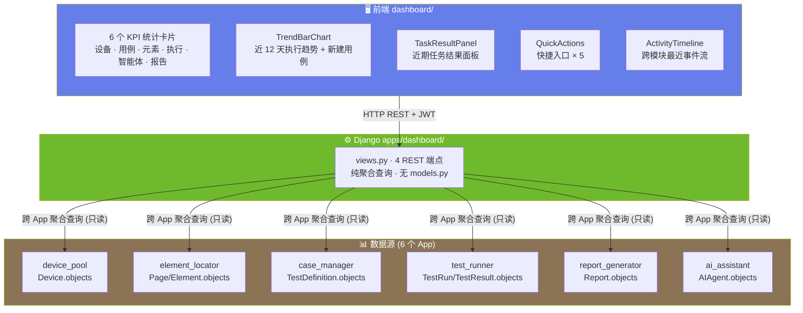

# ARCH-07 — 仪表盘 (Dashboard)

> 关联模块：`apps/dashboard/` · 前端：`frontend/src/modules/dashboard/`
> 关联需求：[`PRD-00-仪表盘`](../02-PRD需求/PRD-00-仪表盘.md) · 关联架构：[`架构大纲`](./架构大纲.md) §4.8
> 版本：v1.2 · 日期：2026-07-28

---

## 1. 模块架构概览

### 1.1 架构定位

仪表盘是平台的 **首页聚合层**，负责跨 6 个业务模块的只读统计与导航入口。与其他模块不同，仪表盘 **不拥有业务写操作，不创建数据库表**——它是一个纯聚合查询和展示模块。

```
                   dashboard (本模块 — 纯聚合)
                        │
         只读统计 ┌──────┼──────┬──────┬──────┐
                 ▼      ▼      ▼      ▼      ▼
           device-pool  element  case   test   report   ai
```

### 1.2 模块数据流架构图



---

## 2. 前端架构

### 2.1 组件树

```
frontend/src/modules/dashboard/
│
├── index.vue (~1412行)               仪表盘首页
│   ├── StatsCard × 6                  统计卡片行
│   │   ├── 设备在线数                  device_pool 聚合
│   │   ├── 用例总数                    case_manager 聚合
│   │   ├── 元素总数                    element_locator 聚合
│   │   ├── 执行总数                    test_runner 聚合
│   │   ├── 智能体数                    ai_assistant 聚合
│   │   └── 报告总数                    report_generator 聚合
│   │
│   ├── TrendBarChart                  近 12 天执行趋势图
│   │   ├── 成功执行 (绿色柱)
│   │   ├── 失败执行 (红色柱)
│   │   └── 新建用例 (蓝色线)
│   │
│   ├── TaskResultPanel                近期任务面板
│   │   └── 最近 N 个任务卡片 (状态 + 通过率)
│   │
│   ├── QuickActions                   快捷入口
│   │   ├── 新建用例 → /case-manager
│   │   ├── 执行测试 → /test-runner
│   │   ├── 元素截图 → /elements
│   │   ├── AI 对话 → /ai-assistant
│   │   └── 查看报告 → /report-generator
│   │
│   ├── ModuleNavigator                模块导航
│   │
│   └── ActivityTimeline               活动时间线
│       └── 跨模块最近事件 (设备连接/用例创建/执行完成/报告生成)
│
├── api.js                             axios 请求封装
└── routes.js                          路由定义 (首页 "/")
```

### 2.2 统计数据卡片设计

| 卡片 | 图标 | 颜色 | 数据源 |
|------|:--:|:--:|------|
| 设备在线 | 📱 | 绿 | `dp_devices WHERE status='ONLINE' COUNT` |
| 用例总数 | 📋 | 蓝绿 | `cm_test_definitions COUNT` |
| 元素总数 | 🔍 | 紫 | `el_elements COUNT` |
| 执行次数 | ⚡ | 粉 | `tr_test_runs COUNT` |
| 智能体数 | 🤖 | 粉红 | `ai_agents COUNT` |
| 报告总数 | 📈 | 棕 | `rg_reports COUNT` |

> 📐 前端架构基线 v1.0（2026-07-27）— 组件树 + 6 张 KPI 卡片规格完整。路由 `/`（重定向至 `/dashboard`）。纯只读模块，禁止写操作。

---

## 3. 后端架构

### 3.1 文件结构

```
apps/dashboard/
├── views.py            4 REST 端点 (纯聚合)
├── urls.py             路由注册
└── apps.py             verbose_name='仪表盘'

注意: 无 models.py — dashboard 不创建数据库表
```

### 3.2 聚合查询设计

```python
# dashboard/views.py 核心逻辑 (339 行)

def dashboard_stats(request):
    """核心聚合：KPI + 执行趋势 + 近期任务"""
    stats = _device_dashboard_stats()   # 设备在线/忙碌/离线/总数
    chart = _daily_execution_series(12) # 近 12 天成功/失败/新建用例
    tasks = _recent_tasks(8)            # 最近 8 个任务

def dashboard_activities(request):
    """跨模块最近活动时间线"""

def device_stats(request):
    """设备维度统计"""

def case_stats(request):
    """用例维度统计 (used by dashboard)"""

# 内部辅助函数
_daily_counts(queryset, date_field, days=12)
_case_result_status(passed, failed)
_safe_pct(part, total)
```

---

## 4. API 设计

### 4.1 REST 端点 (4 个)

| 方法 | 路径 | 说明 | 数据源 |
|------|------|------|------|
| `GET` | `/api/dashboard/stats/` | KPI 统计数据 + 执行趋势 + 近期任务 | 6 个 App 聚合（_daily_counts + _recent_tasks） |
| `GET` | `/api/dashboard/activities/` | 最近活动时间线 | 6 个 App 聚合 |
| `GET` | `/api/devices/stats/` | 设备维度统计 | device_pool |
| `GET` | `/api/cases/stats/` | 用例维度统计 | case_manager |

> **代码对照**：实际 API 采用按模块拆分统计端点（`devices/stats/`、`cases/stats/`），而非文档早期描述的单一趋势/任务端点。核心聚合逻辑均在 `dashboard_stats()` 一个函数内完成。

### 4.2 响应格式

```json
{
  "status": true,
  "data": {
    "stats": {
      "devices": 3,
      "cases": 42,
      "elements": 156,
      "runs": 89,
      "agents": 5,
      "reports": 67
    },
    "passRate": 87.5,
    "executionChart": [
      { "date": "2026-07-16", "success": 12, "failed": 2, "newCases": 5 },
      ...
    ],
    "recentTasks": [
      { "task_id": 1, "device": "abc123", "status": "done", "passRate": 90, ... }
    ],
    "activities": [
      { "type": "run_completed", "module": "test-runner", "time": "...", "detail": "..." },
      ...
    ]
  }
}
```

---

## 5. 模块边界与跨模块交互

### 5.1 边界规则

| 规则 | 说明 |
|------|------|
| **纯只读** | 不对任何业务表执行 INSERT/UPDATE/DELETE |
| **无自有数据表** | 不创建 `models.py` |
| **不绕过 API** | 通过 Django ORM 查询（不是 HTTP 调用其他模块） |
| **跨模块 import** | `from apps.xxx.models import XXX` |

### 5.2 跨模块依赖

| 数据来源 | 查询内容 |
|------|------|
| `apps.device_pool.models.Device` | 在线设备数 |
| `apps.element_locator.models.Page, Element` | 页面/元素总数 |
| `apps.case_manager.models.TestDefinition` | 用例总数、新建趋势 |
| `apps.test_runner.models.TestRun, TestResult` | 执行次数、趋势、最近任务 |
| `apps.report_generator.models.Report` | 报告数 |
| `apps.ai_assistant.models.AIAgent` | 智能体数 |

---

## 6. 设计要点

| 要点 | 说明 |
|------|------|
| 无 AgentScope Tool | Dashboard 是纯前端功能，不需要 AI 调用 |
| 首页路由 `/` | router 中设为默认路由 |
| 聚合查询性能 | 使用 Django ORM `count()` 和 `filter().count()`，避免全表扫描 |
| 趋势图缓存 | 前端 `onMounted` 时一次性加载，不轮询 |

---

## 变更记录

| 版本 | 日期 | 变更摘要 |
|------|------|----------|
| v1.0 | 2026-07-16 | 初始版本：基于 `项目架构.md` 和 `PRD-00-仪表盘.md` 重构 |
| v1.1 | 2026-07-16 | **代码对照审计**：API 路径修正为 `/api/dashboard/stats/` + `/api/devices/stats/` + `/api/cases/stats/`；函数名对齐实际 views.py |
