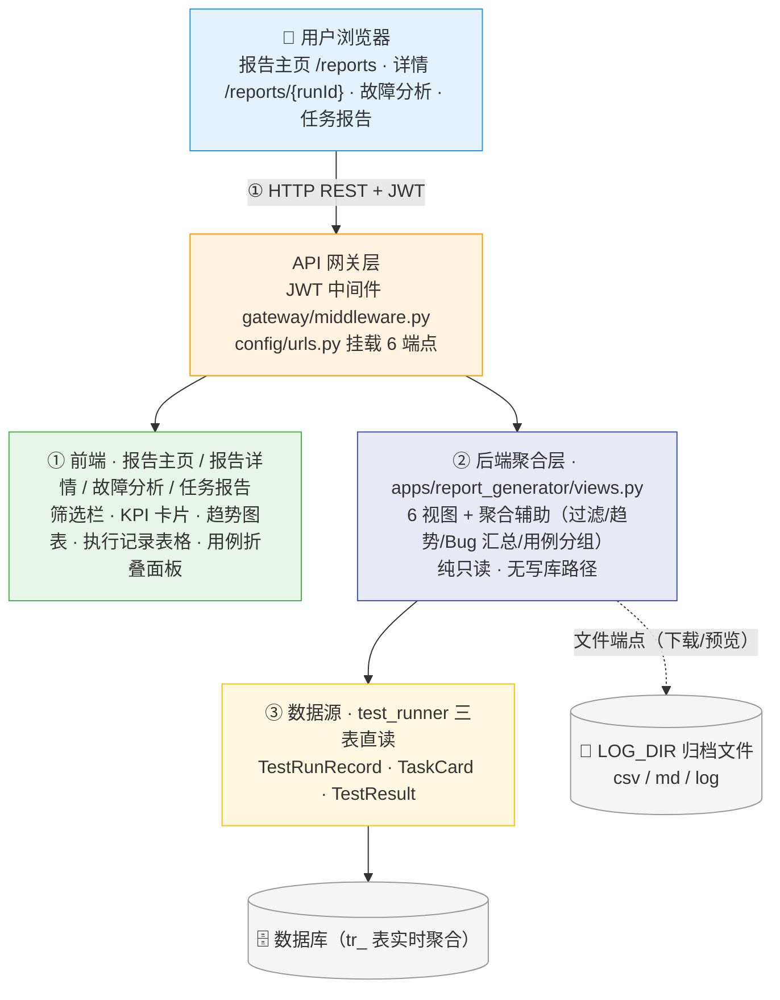
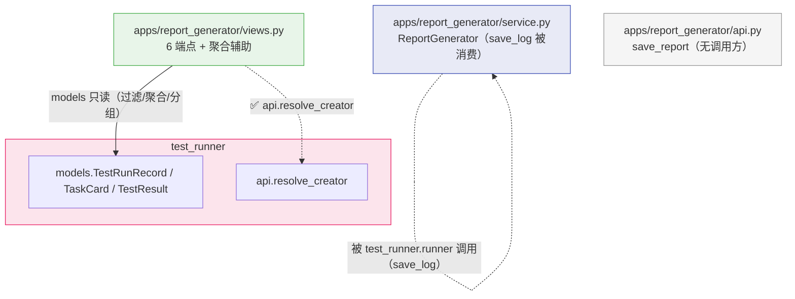
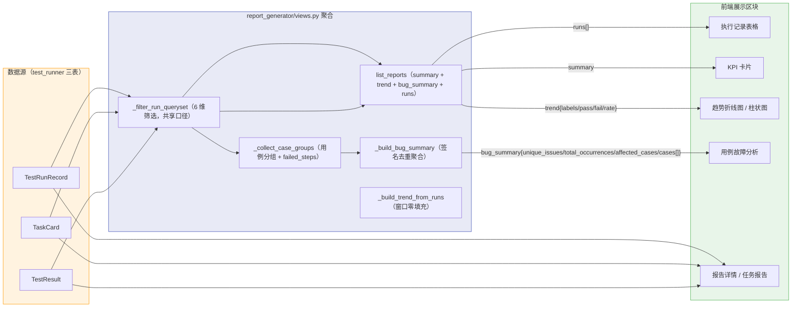
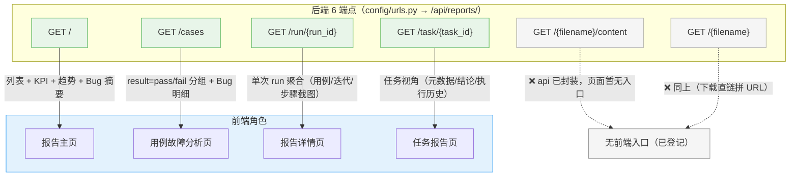
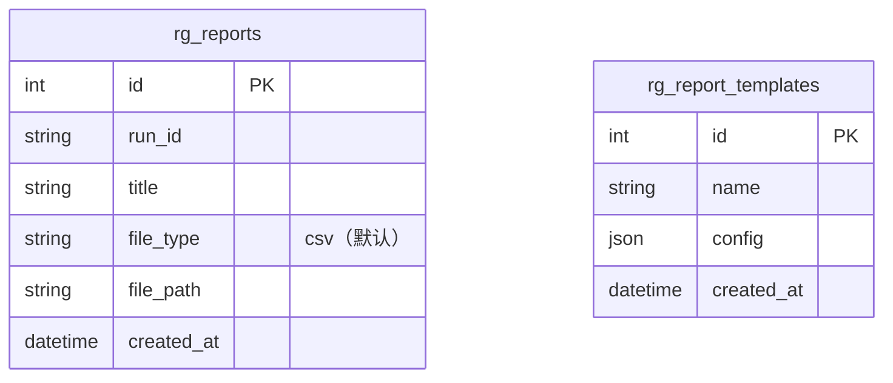

# ARCH-07 — 测试报告 (Report Generator)

> **版本**：v2.1 · **日期**：2026-08-21 · **关联模块**：`apps/report_generator/` · 前端 `frontend/src/modules/report-generator/`

## 文档内容简述

本文档是**测试报告模块**的架构设计，覆盖该模块而非平台全貌：

- **架构四图**：架构全景图 · 模块包图 · 数据流图 · API 关系图（§1.2~1.5）
- **后端架构**：文件结构 + 实时聚合 / Bug 聚合 / 趋势零填充设计（§3）
- **API 设计**：6 REST 端点（§4）
- **数据模型**：`rg_` 2 表（当前零读写）+ 依赖表生命周期（§5）
- **模块边界**：只读规则 + 跨模块依赖（§6）

## 你能从文档获取什么信息

- **报告数据从哪来**：不落 `rg_` 表，列表/详情/故障分析全部**实时读执行引擎 tr_ 表**（TestRunRecord + TaskCard + TestResult）
- **聚合口径**：列表行、KPI summary、趋势零填充、Bug 签名去重的计算链路
- **端点消费与同步**：哪 4 个端点前端在用、哪 2 个仅 api 封装无入口，以及数据同步方式
- **边界与隐患**：`rg_` 两表零读写、`save_report`/`save_csv` 等死代码、信封平铺

## 关联文档

- **架构总纲**：[`ARCH-00-平台总体架构`](./ARCH-00-平台总体架构.md) §3.2（report_generator 行）· §4.1 写收敛（本模块只读例外）· §二 L3
- **需求规格**：[`PRD-07-测试报告`](../02-PRD需求/PRD-07-测试报告.md) — **契约以 PRD §5 为准**

---

## 1. 模块架构概览

### 1.1 架构定位

测试报告是平台的**执行结果收口**：只读聚合执行引擎产生的执行记录、任务卡片与迭代结果，提供筛选、KPI 摘要、趋势图表、故障分析与文件下载。模块**无写入路径**——自有 `rg_` 两张表（报告文件记录 / 报告模板）当前零读写，报告数据全部实时取自 `tr_` 表。

### 1.2 架构全景图

> 四层：前端（报告主页/三个子页）→ API 网关（6 端点）→ 后端聚合 → 数据源（test_runner 三表直读）→ 数据库/日志目录。



### 1.3 模块包图

> 箭头 = import 方向。实线 = 跨 App 读 Model（✅ 合法）；虚线 = api 调用（✅）。



**防火墙规则**：

```
report_generator views ──✅ import──→ test_runner.models（只读查询）
report_generator views ──✅ import──→ test_runner.api.resolve_creator
report_generator views ──❌ import──→ 其他 App 内部实现（service/runner/consumer/state_machine）
report_generator ──❌ 任何写库路径（views 无 save/create/update/delete；save_report 无调用方）
```

### 1.4 数据流图

> 执行引擎三表 → 过滤 → 聚合函数 → 响应字段 → 前端区块。



### 1.5 API 关系图

> 6 端点 → 前端角色映射，标注同步方式。



**状态变化与数据同步**：

| 数据 | 同步方式 |
|------|------|
| 全部报告数据 | **静态一次性加载**（进入页面请求）+ 筛选条件变更时重新请求（`chart_range`/6 维筛选均走 query 参数，后端统一过滤口径）。无轮询、无 WebSocket。 |
| 列表 / KPI / 趋势 / 故障分析 | 共用同一过滤条件（`_filter_run_queryset`），同一次请求或同一组参数下口径一致 |
| 文件下载 / 预览 | `GET /{filename}`（FileResponse）/ `/{filename}/content`（CSV 结构化解析）；文件名 `Path(filename).name` 防目录穿越 |

**契约偏差登记**：

| # | 偏差 | 状态 |
|---|------|------|
| 1 | 响应信封平铺 `{status, summary, trend, runs}` / `{status, run:{}}` / `{status, task:{}}`，非统一 `{status, data}`（裸 JsonResponse，前端已按各端点结构读取） | ⚠️ 已登记（PRD-07 §4.3） |
| 2 | `rg_reports` / `rg_report_templates` 两表零读写（仅 Model + admin 注册） | ⚠️ 已登记（PRD-07 §4.3） |
| 3 | 状态枚举不自有：列表 Tab 直接透传执行引擎 `TestRunRecord.status`（大写） | ⚠️ 已登记（PRD-07 §4.1） |

---

## 3. 后端架构

### 3.1 文件结构

```
apps/report_generator/
├── urls.py             6 端点路由（/api/reports/）
├── views.py            905 行 · 6 视图 + 聚合辅助（🟠 超 300 行上限，待拆分）
├── models.py           2 表：Report（rg_reports）· ReportTemplate（rg_report_templates）——当前零读写
├── service.py          ReportGenerator：save_log（被 test_runner 消费）；
│                       save_csv / generate_json_report / save_json_report（无调用方，死代码）
├── api.py              __all__ = [Report, ReportTemplate, ReportGenerator, save_report]（save_report 无调用方）
└── admin.py            2 表 admin 注册
```

> 行数说明：views.py 905 行严重超标（300 上限 ×3），聚合辅助函数（过滤/趋势/Bug 汇总/用例分组）应拆至 `service.py`；PRD-07 §4.3 已登记死代码，待清理或补齐。

### 3.2 聚合查询设计

```python
# report_generator/views.py — 核心结构

def list_reports(request):
    qs = _filter_run_queryset(request)                    # 6 维筛选（start/end/run_id/task_name/device_serial/creator）
    annotated = qs.annotate(total=Count("results"),
                            passed=Count("results", filter=PASS_Q))
    rows = list(annotated.order_by("-id"))                # 列表行
    task_map = {tc.task_id: tc for tc in TaskCard.objects.filter(
        task_id__in=[...]).only(...)}                     # 批量单查询，无 N+1
    runs = [_resolve_run_row(r, task_map) for r in rows]  # 有卡片以卡片聚合为准，无卡片 TestResult 兜底
    trend = _build_trend_from_runs(runs, range_days)      # 窗口零填充（7/30/90，非法回落 30）
    return JsonResponse({"status": True, "summary": {...},
                         "bug_summary": {...}, "trend": trend, "runs": runs})

# 关键辅助函数
_filter_run_queryset(request)   # 列表/KPI/趋势/故障分析共用过滤口径
_build_trend_from_runs(runs, n) # 逐日零填充序列（dates/labels/pass/fail/rate）
_build_bug_summary(groups)      # 失败按「步骤类型+描述+结果」签名去重聚合
_collect_case_groups(request, result_type)  # 用例分层分组（TaskCard.case_items 优先，TestResult 兜底）
```

**口径要点**：

- **列表行**：以 `TestRunRecord` 为主，按 `client_task_id` 关联 `TaskCard`；有卡片时 pass/fail 取卡片聚合，无卡片时取 TestResult 计数兜底
- **KPI summary**：展示行聚合（total_runs / total_iterations / total_pass / total_fail / pass_rate），不落库
- **Bug 聚合**：签名去重（step_type + description + result）；无步骤明细的迭代失败归「iteration / 执行失败（无步骤明细）」占位；列表端点只回 3 个汇总字段，`/cases`（fail）回含 `cases[]` 的完整结构
- **性能**：TaskCard 批量 `only()` 单查询，消除 N+1（本模块无性能实测，待测）

---

## 4. API 设计

> 响应信封为**平铺 `{status, ...}`（非 `{status, data}`）**，各端点结构不同，前端已按端点结构读取（原因与适配见 PRD-07 §5 章首）。**完整字段契约（字段表/错误码/契约变更）以 PRD §5 为准**，本节只列概览。

### 4.1 REST 端点 (6 个)

| 方法 | 路径 | 说明 | 消费方 |
|------|------|------|------|
| `GET` | `/api/reports/` | 执行记录列表 + KPI 摘要 + 日趋势 + Bug 摘要（筛选 query 同源） | 前端报告主页 |
| `GET` | `/api/reports/cases` | 用例通过/失败分层分组 + Bug 明细（`result=pass\|fail` 必填） | 前端故障分析页 |
| `GET` | `/api/reports/run/{run_id}` | 单次 run 聚合报告（用例明细/迭代/步骤截图/最近趋势） | 前端报告详情页 |
| `GET` | `/api/reports/task/{task_id}` | 任务视角报告（元数据/结论/BUG 单/执行历史） | 前端任务报告页 |
| `GET` | `/api/reports/{filename}/content` | 文件在线预览（CSV 结构化解析 rows/headers） | ❌ api 已封装无入口 |
| `GET` | `/api/reports/{filename}` | 文件下载（FileResponse，MIME 按后缀） | ❌ api 已封装无入口 |

### 4.2 响应格式（骨架）

```json
{
  "status": true,
  "summary": { "total_runs": 12, "total_iterations": 96, "total_pass": 78, "total_fail": 18, "pass_rate": 81.2 },
  "bug_summary": { "unique_issues": 3, "total_occurrences": 9, "affected_cases": 2 },
  "trend": { "range_days": 30, "dates": ["2026-07-21"], "labels": ["07-21"], "pass": [5], "fail": [1], "rate": [83.3] },
  "runs": [{ "run_id": "run_emulator-5554_20260819_101500", "status": "COMPLETED", "total": 8, "passed": 8, "failed": 0, "rate": 100 }]
}
```

> 完整字段契约与错误码见 PRD §5.2~5.6；契约变更见 PRD §5.7。

---

## 5. 数据模型

### 5.1 ER 图



> ⚠️ **两张表当前零读写**：`views.py` 无任何 `Report`/`ReportTemplate` 读写路径，报告数据全部实时取自 test_runner 的 `tr_test_runs`/`tr_task_cards`/`tr_test_results`（主权 PRD-06 §6）。`save_report`（api.py）与 `save_csv`/`generate_json_report`/`save_json_report`（service.py）为死代码；仅 `ReportGenerator.save_log` 被执行引擎消费（日志落盘 LOG_DIR）。

### 5.2 依赖表生命周期

| 依赖表（只读） | 用途 | 主权 |
|------|------|------|
| `tr_test_runs` | 列表主数据（run_id/status/loop_count/selected_cases/summary/起止） | PRD-06 |
| `tr_task_cards` | 聚合计数/任务元数据/结论/BUG 单/failed_steps | PRD-06 |
| `tr_test_results` | 迭代明细/步骤截图 step_details | PRD-06 |

> 状态口径：本模块不定义状态枚举，`status` 透传 `TestRunRecord.status`（PENDING/RUNNING/COMPLETED/STOPPED/FAILED 大写），前端映射文案（PRD-07 §4.1）。

---

## 6. 模块边界与跨模块交互

### 6.1 边界规则

| 规则 | 说明 |
|------|------|
| **只读聚合** | 不对任何业务表执行 INSERT/UPDATE/DELETE（`save_report` 无调用方） |
| **实时读 tr_ 表** | 报告数据不落 `rg_` 表，每次请求实时聚合 |
| **筛选口径统一** | 列表/KPI/趋势/故障分析共用 `_filter_run_queryset` |
| **文件服务防穿越** | `Path(filename).name` 限定 LOG_DIR 内，越界/不存在 404 |

### 6.2 跨模块依赖

| 方向 | 模块 | 交互 |
|------|------|------|
| ← 上游 | `test_runner` | `models.TestRunRecord / TaskCard / TestResult`（只读聚合）+ `api.resolve_creator`（创建人解析） |
| → 下游 | `test_runner`（反向调用） | `service.ReportGenerator.save_log` 被执行引擎 runner 消费（日志文件落盘） |
| → 下游 | `dashboard` | 不再被读取（`reports.total` 字段已于契约清理移除，见 PRD-01 §5.6） |

---

## 7. 设计要点

| 要点 | 说明 |
|------|------|
| 无 AgentScope Tool | 报告模块纯前端功能，无 AI 调用 |
| 数据实时聚合 | 不落 rg_ 表，tr_ 三表实时读 + 卡片批量单查询无 N+1 |
| 口径单源 | `_filter_run_queryset` 统一筛选口径；卡片聚合优先、TestResult 兜底 |
| Bug 签名去重 | 步骤类型+描述+结果三元组签名，聚合独立问题数与出现次数 |
| 趋势零填充 | 窗口逐日零填充，chart_range 仅 7/30/90 |
| 死代码登记 | `save_report`/`save_csv`/`generate_json_report`/`save_json_report` 无调用方（PRD-07 §4.3 已登记） |
| 信封平铺登记 | `{status,...}` 平铺各端点结构不同，前端已适配（PRD-07 §5 章首） |

---

## 变更记录

| 版本 | 日期 | 变更摘要 |
|------|------|----------|
| v2.1 | 2026-08-21 | **五层口径回填**：§1.2 图去旧 L2/L3 标签（B/D）；关联指针改 §3.2/§4.1/§二 L3 |
| v2.0 | 2026-08-19 | **按 ARCH-01 标杆整篇重写**（旧 v1.0 为旧风格：§2 前端组件树、完整响应 JSON/字段表、AgentScope 工具表越界）；标题编号修正 ARCH-05 → ARCH-07；补架构四图 + 同步方式表 + 契约偏差表；同步代码真相：6 端点 `/api/reports/*`、报告数据实时读 tr_ 表（rg_ 两表零读写）、views.py 905 行、`save_report`/`save_csv` 等死代码、状态透传大写、下载/预览无前端入口；删除不存在的 `save_report`/`list_reports` AgentScope 工具描述 |
| v1.0 | 2026-07-16 | 初始版本：基于旧 PRD-07 与文件生成式报告机制（CSV/MD/LOG/JSON 自动生成写 rg_ 表——该机制已废弃） |
