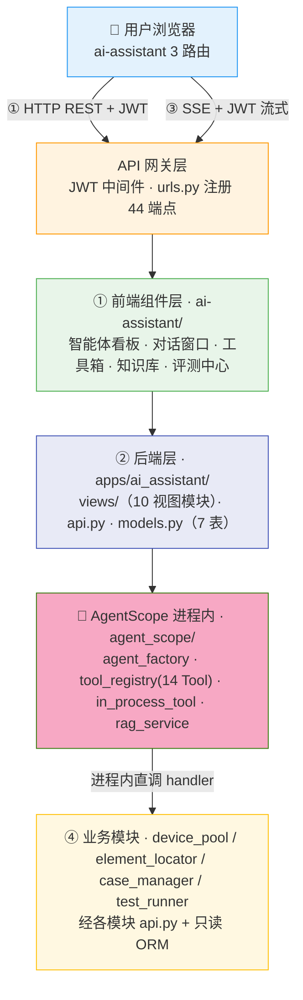
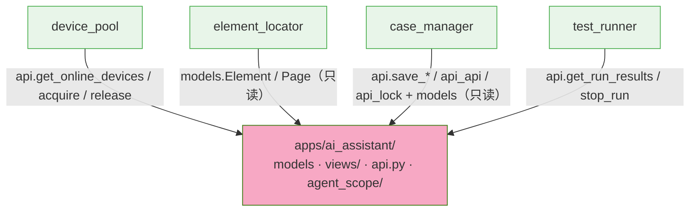
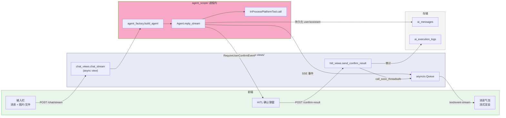
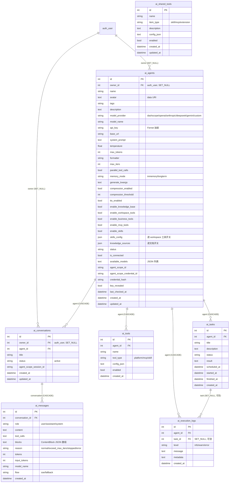

# ARCH-08 — AI 助手 (AI Assistant)

> **版本**：v2.0 · **日期**：2026-08-18 · **关联模块**：`apps/ai_assistant/` · 前端 `frontend/src/modules/ai-assistant/`

## 文档内容简述

本文档是 **AI 助手模块**的架构设计，覆盖该模块而非平台全貌：

- **架构四图**：架构全景图 · 模块包图（含防火墙）· 数据流图 · API 关系图（§1.2~1.5）
- **后端架构**：进程内 Agent 构建 + 单请求 SSE 流 + HITL 线程安全 + 工具双通道（§3）
- **API 设计**：44 REST 端点 + SSE（§4）
- **数据模型**：7 表 ER 图（§5）

## 你能从文档获取什么信息

- **AgentScope 如何集成**：`agent_scope/` 作为 Django 进程内模块，`agent_factory.build_agent()` 直接构建 Agent，不再经 HTTP 注册
- **工具如何编排**：`tool_registry.py` 的 14 平台工具单一真相源，`InProcessPlatformTool` 进程内直调 handler；能力开关决定 Toolkit 组装
- **SSE 流如何工作**：单请求 async view + asyncio.Queue，AgentScope `reply_stream` 直接消费逐 token 流式返回
- **端点消费**：44 端点中前端消费 36，8 个后端保留（reveal-key / 任务历史 / 工具网关 / 手动加文档）

## 关联文档

- **架构总纲**：[`ARCH-00-平台总体架构`](./ARCH-00-平台总体架构.md) §4.7
- **需求规格**：[`PRD-08-AI助手`](../02-PRD需求/PRD-08-AI助手.md) — **契约以 PRD §5 为准**

---

## 1. 模块架构概览

### 1.1 架构定位

AI 助手是平台的**自然语言交互中枢**，通过 AgentScope ReAct 推理引擎，让用户以对话方式驱动全流程测试。AgentScope 已从独立 FastAPI 服务迁移为 Django 进程内模块（`apps/ai_assistant/agent_scope/`），Agent 在 Django 进程内构建、运行、流式返回，不再有独立 `agentscope_service/` 目录与 :8000 端口。

模块横跨后端层与 AI 引擎层——Django 管理智能体配置、对话记录与工具编排，AgentScope 执行推理与 Tool 调用。AI 引擎不直连设备、不直写数据库，一切通过 Tool 调用各业务模块。

### 1.2 架构全景图

> 四层：前端组件 → API 网关（JWT）→ Django 后端（views + agent_scope 进程内）→ 业务模块（Tool 编排）。



### 1.3 模块包图

> 箭头 = import 方向。ai_assistant 是聚合层，允许 import 任意下层；下层禁止 import 它（agent_scope 内部实现除外）。



> 注：箭头方向为「数据/依赖来源」视角。实际 `tool_registry.py` 与 `views/` 反向 import 这些下层模块（见 §6.3）。聚合层消费方向：`evaluator` / `dashboard` import `ai_assistant.api` / `ai_assistant.permissions`。

**防火墙规则**：

```
ai_assistant ──✅ import──→ device_pool.api / element_locator.models / case_manager.api* / test_runner.api
ai_assistant ──✅ import──→ 各模块 models（只读查询）
ai_assistant ──❌ import──→ 下层内部实现（service / runner / consumer / state_machine）
下层模块     ──❌ import──→ ai_assistant.agent_scope（内部实现，仅 evaluator 经 api.py 白名单）
```

### 1.4 数据流图

> 用户消息 → SSE view → 进程内 Agent → reply_stream 事件 → SSE 推送 → 消息持久化。



### 1.5 API 关系图

> 44 端点 → 前端消费映射，标注前端消费状态（抽象角色）。

```mermaid
flowchart TB
    subgraph API["后端 44 端点（urls.py）"]
        A["agents CRUD + reveal-key + health"]
        C["conversations + messages + chat/stream"]
        T["tools / mcp / skill / available-*"]
        K["knowledge status/documents/reindex"]
        TB["toolbox + import"]
        U["upload-avatar / upload-file"]
        GW["tools/schemas + tools/{module}/{action}"]
        TASK["conversations/{id}/tasks + /ai/tasks"]
    end

    subgraph FE["前端抽象角色"]
        BOARD["智能体看板"]
        DETAIL["智能体配置"]
        CHAT["对话窗口"]
        TOOLBOX["AI 工具箱"]
        KB["知识库"]
        EVAL["评测中心"]
    end

    A -->|"列表/详情/创建/更新/删除"| BOARD
    A -->|"详情/创建/更新"| DETAIL
    C -->|"会话/消息/流式/HITL"| CHAT
    T -->|"工具/技能/MCP 配置"| DETAIL
    K -->|"状态/文档/重建"| KB
    TB -->|"列表/创建/导入"| TOOLBOX
    U -->|"头像/文件"| DETAIL

    GW -.->|"❌ 前端未消费（供外部 AgentScope）"| NO["—"]
    TASK -.->|"❌ 前端未消费（任务历史后端保留）"| NO
    REVEAL["reveal-key"] -.->|"❌ 前端未消费（一次性查看）"| NO
    MODELS["agents/{id}/models GET"] -.->|"❌ 前端未消费（详情内嵌缓存）"| NO

    style API fill:#e8f5e9,stroke:#4caf50
    style FE fill:#e3f2fd,stroke:#2196f3
    style GW fill:#f5f5f5,stroke:#999
    style TASK fill:#f5f5f5,stroke:#999
    style REVEAL fill:#f5f5f5,stroke:#999
    style MODELS fill:#f5f5f5,stroke:#999
    style NO fill:#f5f5f5,stroke:#999
```



**数据同步方式**：

| 数据 | 同步方式 |
|------|------|
| 智能体列表 | 首次 `loadAgents` + 手动刷新 + **30min 健康检查轮询**（`checkAgentsHealth`） |
| 对话消息 | 首次 `getMessages` + **SSE 流式增量** + 终端事件后端持久化 |
| 知识库状态 | 首次 `getKnowledgeStatus` + 手动「重建索引」 |

---

## 3. 后端架构

### 3.1 文件结构

```
apps/ai_assistant/
├── models.py              7 表（ai_ 前缀）：AIAgent/AITool/AISharedTool/AIConversation/AIMessage/AITask/AIExecutionLog
├── api.py                 跨模块 __all__ 白名单 + 加密工具（encrypt/decrypt/mask_key）+ evaluator 接口
├── serializers.py         输入校验（validate_agent_input / message / conversation / rename / model_detect）
├── permissions.py         所有权检查（check_agent_owner / check_conversation_access / filter_*_for_user）
├── decorators.py          require_auth（sync/async 双支持，未认证 401）
├── urls.py                44 端点路由（app_name="ai"）
├── views/                 10 视图模块
│   ├── agent_views.py       Agent CRUD · reveal-key · health · available-skills
│   ├── chat_views.py        SSE 流式对话（async，进程内 Agent）
│   ├── conversation_views.py 会话/消息/任务历史
│   ├── hitl_views.py        HITL 确认（in-memory session registry）
│   ├── model_views.py       模型检测 · 连接测试
│   ├── file_views.py        头像/文件上传解析
│   ├── knowledge_views.py   知识库状态/文档/重索引/加文档
│   ├── tool_views.py        平台工具列表 · MCP/Skill 管理
│   ├── toolbox_views.py     共享工具箱 CRUD · 上传 · 导入
│   ├── tool_gateway.py      HTTP 工具网关（schemas/agent-config/执行）
│   └── common.py            validation_error
├── agent_scope/            Django 进程内 AgentScope 模块
│   ├── agent_factory.py     进程内构建 AgentScope Agent
│   ├── tool_registry.py     14 平台工具单一真相源 + handler 注册
│   ├── in_process_tool.py   进程内工具封装（InProcessPlatformTool）
│   ├── provider_registry.py 模型提供商 → base_url/credential 映射
│   ├── rag_service.py       ChromaDB 知识库（唯一所有者）
│   └── skill_registry.py    workspace 技能（Bash/Edit/Glob/Grep/Read/Write）映射
├── management/commands/    init_knowledge_base · migrate_platform_tools · cleanup_uploads
├── migrations/             20 迁移（0001~0021）
├── admin.py                Django Admin 注册
└── apps.py                 verbose_name="AI 助手"
```

### 3.2 核心设计：进程内 Agent 构建

```
build_agent(agent_model, user_id)  → AgentScope Agent
  1. 解密 api_key（decrypt_key，失败返回 ""）
  2. provider = get_provider_config(provider, base_url)  → base_url + credential 类型
  3. model = dashscope ? DashScopeChatModel : OpenAIChatModel（其余 OpenAI 兼容）
  4. toolkit = _build_toolkit（按能力开关组装）
  5. ModelConfig / ContextConfig（压缩触发比）/ ReActConfig（max_iters / parallel_tool_calls）
  6. system_prompt = agent_model.system_prompt（无默认，纯对话模型）
```

**Toolkit 组装（能力开关）**：

```
_build_toolkit(agent_model, user_id)
  enable_workspace_tools → 6 内置文件工具（skills_config 逐工具过滤）
  enable_business_tools  → 14 平台工具（AITool tool_type="platform" 逐工具过滤，无配置默认只读子集）
  enable_mcp_tools       → MCP 客户端（AITool tool_type="mcp"）
  enable_skills          → skill 目录（AITool tool_type="skill" 的 dir_path）
```

### 3.3 核心设计：单请求 SSE 流

```
chat_stream（async Django view，运行在 Daphne 事件循环）
  ├─ require_auth + check_conversation_access
  ├─ save_message(user, flow="sse")
  ├─ asyncio.Queue + asyncio.Task(_agent_stream)
  │    ├─ build_agent（sync → thread pool，thread_sensitive=False）
  │    ├─ _restore_context（从 ai_messages 恢复历史到 agent.state.context）
  │    ├─ reply_stream 事件循环 → queue.put(SSE)
  │    ├─ RequireUserConfirmEvent → 等待 confirm_queue（120s）→ 续跑
  │    └─ ReplyEnd / ExceedMaxIters → save_message(assistant) + 附 _backend_msg_id
  └─ event_generator → StreamingHttpResponse（text/event-stream，2min 心跳）
```

- `_sta` = `sync_to_async(thread_sensitive=False)`，DB 操作在泛型线程池跑，响应发出后仍可写
- `_bg_agent_tasks` / `_active_agent_tasks` 持有 Task 引用防 GC + 取消 stale 任务

### 3.4 核心设计：HITL 线程安全投递

```
send_confirm_result（sync view，Daphne 线程池）
  → _agent_sessions[conv_id]（in-memory registry + threading.Lock）
  → _main_loop.call_soon_threadsafe(confirm_queue.put_nowait, data)
  → 审计写 AIExecutionLog
```

`chat_stream` 首次运行时 `set_main_loop()` 记录主事件循环引用，跨线程安全投递确认结果。

### 3.5 核心设计：工具双通道

| 通道 | 文件 | 场景 | 是否走 HTTP |
|------|------|------|:--:|
| 进程内 | `in_process_tool.py` | 当前 Agent 工具调用 | ❌（`asyncio.to_thread` 直调 handler） |
| HTTP | `tool_gateway.py` | `/api/tools/{module}/{action}` 供外部 AgentScope | ✅（httpx） |

两者共享 `tool_registry.py` 的 `TOOL_SCHEMAS` + `resolve()`，handler 签名统一 `handler(user_id, **kwargs)`。`tool_gateway` 的 `tool_schemas` / `agent_config` 端点返回工具定义与每智能体配置。

---

## 4. API 设计

> 响应信封统一 `{status, data}` / `{status, message}`；字段 snake_case。**完整字段契约以 PRD §5 为准**，本节只列概览。

### 4.1 REST 端点（44 个）+ SSE

| 组 | 方法 | 路径 | 前端消费 |
|------|------|------|:--:|
| Agent | GET | `/api/ai/agents` | ✅ |
| Agent | POST | `/api/ai/agents/create` | ✅ |
| Agent | GET | `/api/ai/agents/{id}` | ✅ |
| Agent | POST | `/api/ai/agents/{id}/update` | ✅ |
| Agent | POST | `/api/ai/agents/{id}/delete` | ✅ |
| Agent | POST | `/api/ai/agents/{id}/reveal-key` | ❌ |
| Agent | GET | `/api/ai/agents/{id}/conversations` | ✅ |
| Agent | POST | `/api/ai/agents/{id}/conversations/create` | ✅ |
| 对话 | GET | `/api/ai/conversations/{id}/messages` | ✅ |
| 对话 | POST | `/api/ai/conversations/{id}/save-message` | ✅ |
| 对话 | POST | `/api/ai/conversations/{id}/confirm-result` | ✅ |
| 对话 | POST | `/api/ai/conversations/{id}/rename` | ✅ |
| 对话 | POST | `/api/ai/conversations/{id}/delete` | ✅ |
| 对话 | POST | `/api/ai/conversations/{id}/chat/stream`（SSE） | ✅ |
| 模型 | POST | `/api/ai/models/detect` | ✅ |
| 模型 | POST | `/api/ai/agents/{id}/test` | ✅ |
| 模型 | GET | `/api/ai/agents/{id}/models` | ❌ |
| 模型 | GET | `/api/ai/agents/health` | ✅ |
| 工具 | GET | `/api/ai/available-tools` | ✅ |
| 工具 | GET | `/api/ai/available-skills` | ✅ |
| 工具 | GET | `/api/ai/agents/{id}/tools` | ✅ |
| 工具 | POST | `/api/ai/agents/{id}/tools/mcp/save` | ✅ |
| 工具 | POST | `/api/ai/agents/{id}/tools/mcp/test` | ✅ |
| 工具 | POST | `/api/ai/agents/{id}/tools/skill/upload` | ✅ |
| 工具 | POST | `/api/ai/agents/{id}/tools/{tid}/toggle` | ✅ |
| 工具 | POST | `/api/ai/agents/{id}/tools/{tid}/delete` | ✅ |
| 任务 | GET | `/api/ai/conversations/{id}/tasks` | ❌ |
| 任务 | GET | `/api/ai/conversations/{id}/tasks/{run_id}` | ❌ |
| 任务 | GET | `/api/ai/tasks` | ❌ |
| 上传 | POST | `/api/ai/upload-avatar` | ✅ |
| 上传 | POST | `/api/ai/upload-file` | ✅ |
| 知识库 | GET | `/api/ai/knowledge/status` | ✅ |
| 知识库 | GET | `/api/ai/knowledge/documents` | ✅ |
| 知识库 | POST | `/api/ai/knowledge/reindex` | ✅ |
| 知识库 | POST | `/api/ai/knowledge/documents/add` | ❌ |
| 工具网关 | GET | `/api/ai/tools/schemas` | ❌ |
| 工具网关 | GET | `/api/ai/tools/agent-config/{id}` | ❌ |
| 工具网关 | POST | `/api/ai/tools/{module}/{action}` | ❌ |
| 工具箱 | GET | `/api/ai/toolbox` | ✅ |
| 工具箱 | POST | `/api/ai/toolbox/create` | ✅ |
| 工具箱 | POST | `/api/ai/toolbox/{id}/update` | ✅ |
| 工具箱 | POST | `/api/ai/toolbox/{id}/delete` | ✅ |
| 工具箱 | POST | `/api/ai/toolbox/upload-skill` | ✅ |
| 工具箱 | POST | `/api/ai/agents/{id}/tools/import-from-toolbox` | ✅ |

### 4.2 响应格式（Agent 详情）

```json
{
  "status": true,
  "agent": {
    "id": 1,
    "name": "测试助手",
    "model_provider": "dashscope",
    "model_name": "qwen-max",
    "api_key": "sk-***abcd",
    "enable_workspace_tools": false,
    "enable_business_tools": true,
    "enable_mcp_tools": false,
    "enable_skills": false,
    "knowledge_sources": { "doc:02-PRD需求/PRD-02-设备管理.md": true },
    "is_connected": true,
    "tools": [
      { "id": 1, "name": "save_case", "tool_type": "platform", "config_json": "{}", "enabled": true }
    ]
  }
}
```

> 完整字段表（能力开关 / AgentScope 参数 / 工具列表）见 PRD §5.2。

---

## 5. 数据模型

### 5.1 ER 图



> `ai_tasks`（AITask）当前无视图使用；任务历史由 `test_runner.TestRunRecord`（`tr_test_runs`）以 `run_id` 前缀 `ai-task-*` / `case-gen-*` 支撑。

---

## 6. 模块边界与跨模块交互

### 6.1 边界规则

| 规则 | 说明 |
|------|------|
| AgentScope 进程内直连 | 构建 / 推理 / Tool 编排全在 Django 进程内，无独立服务 / 端口 |
| AI 不直连设备 / 数据库 | 一切通过 Tool 调用各模块 api.py / 只读 ORM |
| 工具单一真相源 | `tool_registry.py` `TOOL_SCHEMAS` 定义 14 平台工具 + handler 注册 |
| 写操作走 api.py | 跨模块写走目标 App 的 api.py，禁止直接 ORM 写 |
| 知识库唯一所有者 | ChromaDB 由 `rag_service.py` 独占，AgentScope 不直接接触 |
| API Key 安全 | Fernet 加密 + 脱敏 + 一次性 reveal + base_url 白名单防 SSRF |
| 所有权隔离 | Agent / 对话按 `owner_id` 过滤，非所有者 403 |

### 6.2 对外接口（api.py `__all__`）

```python
get_agent(agent_id) -> AIAgent | None               # 只读
get_agent_by_scope_id(scope_id) -> AIAgent | None   # 只读
list_active_agents() -> list[dict]                  # 只读
get_conversation(conv_id) -> AIConversation | None  # 只读
get_or_create_conversation(agent, title) -> tuple   # 写
save_message(conversation_id, role, content, ...)   # 写
encrypt_key(plain) -> str                           # 加密
decrypt_key(encrypted) -> str                       # 解密（失败返回 ""）
mask_key(key) -> str                                # 脱敏
# 跨模块接口（供 evaluator 等，避免直接 import agent_scope 内部）
get_provider_config(provider, base_url, model_name) -> dict
search_knowledge(query, top_k, sources) -> list[dict]
get_kb_doc_count() -> int
```

### 6.3 跨模块消费者

| 消费方 | 调用方式 | 用途 |
|------|------|------|
| **evaluator** | `api.get_provider_config` / `search_knowledge` / `get_kb_doc_count` | NL 用例生成 / 执行 |
| **dashboard** | `ai_assistant.permissions`（⚠️ 跨 App import 内部实现，见 TD-03） | 聚合层复用权限逻辑 |

---

## 7. 设计要点

| 要点 | 说明 |
|------|------|
| 进程内 Agent | `agent_factory.build_agent()` 直接构建，消除 HTTP 注册 / session 往返，Django 进程即 AgentScope 运行时 |
| 单请求 SSE | async view + asyncio.Queue 替换旧「create-session + subscribe + trigger」三请求流，真逐 token 流式 |
| 能力开关 | 四组 `enable_*` 开关决定 Toolkit 组装，新建默认纯对话模型，避免过度授权 |
| 工具双通道 | 进程内直调为主，HTTP `tool_gateway` 保留供外部 AgentScope；共享 `tool_registry` 单一真相源 |
| HITL 线程安全 | in-memory registry + `call_soon_threadsafe` 跨线程投递确认结果 |
| 安全闭环 | Key 加密 + 脱敏 + 一次性 reveal + base_url 白名单防 SSRF |
| 知识库隔离 | ChromaDB 由 `rag_service.py` 独占，`knowledge_sources` 逐智能体过滤文档 |

---

## 变更记录

| 版本 | 日期 | 变更摘要 |
|------|------|----------|
| v1.0 | 2026-07-16 | 初始版本：基于 `项目架构.md` 与旧 PRD 重构 |
| v1.1 | 2026-07-16 | 代码对照审计：端点 32→37，views 文件 5→9 |
| v1.2 | 2026-07-22 | 多类型用例生成：Tool 24→28，任务卡片双位置同步 |
| v2.0 | 2026-08-18 | 按 ARCH-02 格式重构：补架构四图 + 防火墙 + 契约偏差登记；同步代码真相——AgentScope 独立服务→进程内（`agent_scope/`，无 tools/ 目录、system_prompt.py、rag/ 目录）；Tool 28→14 平台工具 + 能力开关（workspace/business/mcp/skills）；端点校正 44（移除 register-scope/create-scope-session/send/avatars，新增 toolbox/available-tools/available-skills/tools 网关）；表 6→7（新增 `ai_shared_tools`）；登记 TD-04~TD-08 |
