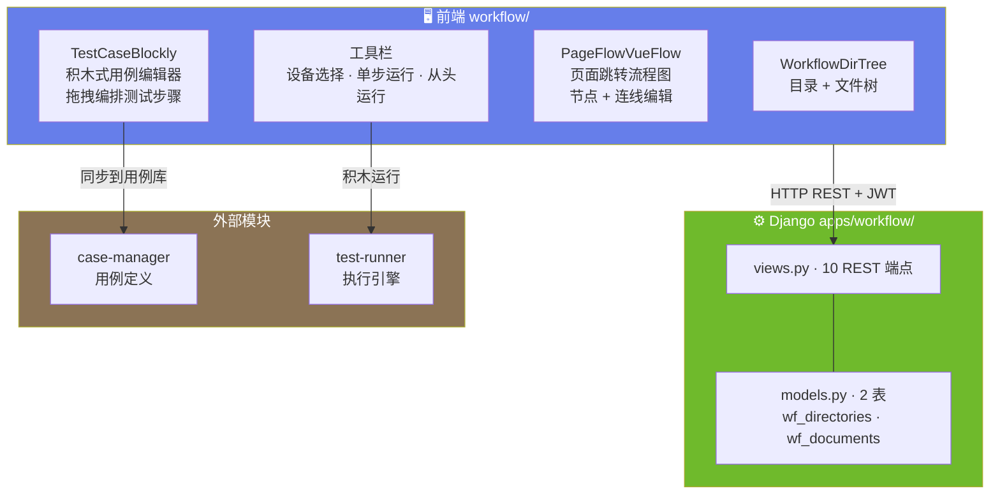
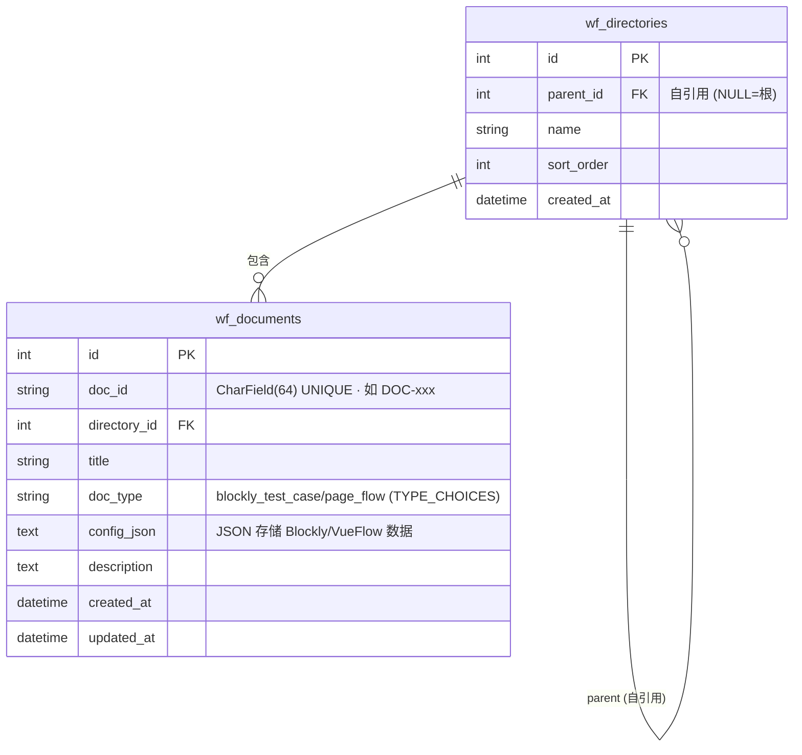

# ARCH-08 — 工作流工作台 (Workflow)

> 关联模块：`apps/workflow/` · 前端：`frontend/src/modules/workflow/`
> 关联需求：[`PRD-08-工作流工作台`](../02-PRD需求/PRD-08-工作流工作台.md) · 关联架构：[`架构大纲`](./架构大纲.md) §4.7
> 版本：v1.0 · 日期：2026-07-16

---

## 1. 模块架构概览

### 1.1 架构定位

工作流工作台是平台的 **可视化测试编排工具**，通过 Blockly 积木式编辑器和 VueFlow 页面流程图，降低非技术人员的测试用例创建门槛。与其他模块不同，工作流工作台是 **纯前端驱动的工具模块**——后端仅提供文档持久化，核心编辑逻辑全在前端。

```
workflow (本模块 — 可视化编排)
      │
      ├── Blockly 积木 → 测试用例 → case-manager (双向同步)
      └── VueFlow 页面流 → 页面拓扑图
```

### 1.2 模块数据流架构图



---

## 2. 前端架构

### 2.1 组件树

```
frontend/src/modules/workflow/
│
├── index.vue                           页面入口 · 左右分栏
│   ├── 左侧: 目录文件树 (280px)
│   │   └── WorkflowDirTree.vue
│   │       ├── 目录操作                 新建/重命名/移动/删除
│   │       └── 文件操作                 新建文档/导入/导出/重命名/删除
│   └── 右侧: 编辑器区域
│       ├── TestCaseBlockly/            Blockly 积木编辑器
│       │   ├── BlocklyWorkspace        积木工作区
│       │   ├── Toolbox                 步骤类型积木分类
│       │   │   ├── 点击类: click, click_indexed, retry_click
│       │   │   ├── 等待类: wait, wait_disappear, wait_any, wait_toast
│       │   │   ├── 验证类: verify_text, poll_text
│       │   │   ├── 控制类: start_app, kill_app, restart_app
│       │   │   └── 工具类: sleep, log
│       │   ├── 元素搜索面板             搜索 element-locator 元素
│       │   └── XPath 填入               拖入元素积木自动填入 XPath
│       │
│       ├── PageFlowVueFlow/            VueFlow 页面流程图
│       │   ├── 页面节点 (可拖拽)        自定义节点样式
│       │   ├── 跳转连线                 带标签的边 (触发元素/动作)
│       │   └── 自动布局                 dagre 自动排列
│       │
│       └── 工具栏
│           ├── 设备选择器               下拉选择在线设备
│           ├── 运行按钮                 单步运行 / 从头运行 / 从当前步运行
│           └── 同步到用例库按钮          Blockly → steps_json → case-manager
│
├── api.js                               axios 请求封装
└── routes.js                            路由定义
```

### 2.2 Blockly 积木与步骤映射

| Blockly 积木分类 | 积木块 | 对应步骤类型 |
|------|------|------|
| 🔵 点击操作 | 点击元素 | `click` |
| | 索引点击 | `click_indexed` |
| | 重试点击 | `retry_click` |
| 🟡 等待操作 | 等待出现 | `wait` |
| | 等待消失 | `wait_disappear` |
| | 等待任一 | `wait_any` |
| | 等待 Toast | `wait_toast` |
| 🟢 验证操作 | 验证文本 | `verify_text` |
| | 轮询文本 | `poll_text` |
| 🟣 应用控制 | 启动应用 | `start_app` |
| | 停止应用 | `kill_app` |
| | 重启应用 | `restart_app` |
| ⚪ 工具 | 等待固定时间 | `sleep` |
| | 输出日志 | `log` |

### 2.3 VueFlow 页面流设计

```
页面节点:
  ┌──────────────┐
  │  🔍 登录页    │
  │  com.app.Login │
  │  Activity      │
  └──────┬────────┘
         │ 点击「登录」按钮
         │ (el_42)
         ▼
  ┌──────────────┐
  │  📋 首页      │
  │  com.app.Home  │
  │  Activity      │
  └──────────────┘
```

### 2.4 状态管理与路由

**Pinia 3-Store 架构**:

| Store | 职责 | 文件 |
|------|------|------|
| `useWorkflowStore` | 页面流画布状态（nodes, links, 序列化） | `stores/workflowStore.ts` |
| `useTestCaseStore` | Blockly 用例编辑状态（blocks, 导入/导出） | `stores/testCaseStore.ts` |
| `useLibraryStore` | 资源库树 + 文件 CRUD + 持久化 | `stores/libraryStore.ts` |

**路由**:

| 路由 | 页面 |
|------|------|
| `/workflow` | `index.vue` — Blockly + VueFlow 双编辑器 |

> 📐 前端架构基线 v1.0（2026-07-27）— 组件树 + 状态管理 + 路由完整。已知违规：libraryStore 18 处 ElMessage（见 PRD-08 附录 C IMP-01）。

---

## 3. 后端架构

### 3.1 文件结构

```
apps/workflow/
├── models.py           wf_directories / wf_documents 2 表
├── views.py            10 HTTP 端点
├── api.py              跨模块 __all__ 白名单
├── urls.py             路由注册
└── apps.py             verbose_name='工作流工作台'
```

---

## 4. API 设计

### 4.1 REST 端点 (10 个)

| 方法 | 路径 | 说明 |
|------|------|------|
| | **目录管理** | |
| `GET` | `/api/workflow/directories` | 目录列表（flat + tree） |
| `POST` | `/api/workflow/directories/create` | 创建目录 |
| `POST` | `/api/workflow/directories/{id}` | 更新/删除目录 |
| `POST` | `/api/workflow/directories/{id}/move` | 移动目录 |
| | **文档管理** | |
| `GET` | `/api/workflow/documents` | 文档列表 |
| `POST` | `/api/workflow/documents/create` | 创建文档 |
| `POST` | `/api/workflow/documents/import` | 导入文档 |
| `GET` | `/api/workflow/documents/{id}` | 文档详情 |
| `POST` | `/api/workflow/documents/{id}` | 更新/删除文档 |
| `POST` | `/api/workflow/documents/{id}/move` | 移动文档 |
| `POST` | `/api/workflow/documents/{id}/export` | 导出文档 |

### 4.2 文档 JSON 结构

```json
{
  "type": "blockly_test_case",
  "title": "登录冒烟测试",
  "data": {
    "blockly_xml": "<xml>...</xml>",
    "steps_json": [
      { "type": "click", "xpath": "//Button[@resource-id='com.app:id/login']" },
      { "type": "wait", "xpath": "//TextView[@text='首页']", "timeout": 10 },
      { "type": "verify_text", "xpath": "//TextView", "expected_text": "欢迎" }
    ]
  }
}
```

---

## 5. 数据模型

### 5.1 ER 图



### 5.2 表详情

#### wf_directories (工作流目录表)

| 字段 | 类型 | 说明 |
|------|------|------|
| `id` | BigAutoField PK | 自增 |
| `parent` | FK→self | NULL=根目录 |
| `name` | VARCHAR(255) | 目录名 |
| `sort_order` | INT | 排序 |
| `created_at` | DateTime | 创建时间 |

#### wf_documents (工作流文档表)

| 字段 | 类型 | 说明 |
|------|------|------|
| `id` | BigAutoField PK | 自增 |
| `doc_id` | VARCHAR(64) UNIQUE | 文档唯一标识（如 `DOC-xxx`） |
| `directory` | FK→wf_directories | 所属目录 |
| `title` | VARCHAR(500) | 文档标题 |
| `doc_type` | VARCHAR(32) | `blockly_test_case` / `page_flow`（TYPE_CHOICES） |
| `config_json` | TEXT | JSON: Blockly XML 或 VueFlow 数据 |
| `description` | TEXT | 文档描述 |
| `created_at` | DateTime | 创建时间 |
| `updated_at` | DateTime | 更新时间 |

> **注意**：`api.py` (428 行) 无 `__all__` 导出，workflow 模块不使用白名单机制。

---

## 6. 模块边界与跨模块交互

### 6.1 边界规则

| 规则 | 说明 |
|------|------|
| 后端仅持久化 | Blockly/VueFlow 编辑逻辑全在前端 |
| 不管理用例定义 | 同步时调用 case-manager API |
| 不直接执行测试 | 通过 test-runner API |
| 无 AgentScope Tool | 纯前端工具模块 |

### 6.2 跨模块交互

| 方向 | 模块 | 交互方式 |
|------|------|------|
| → | case-manager | Blockly → JSON → `POST /api/cases/definitions` 同步用例 |
| → | test-runner | 工具栏运行 → `POST /api/runner/run-step` 单步执行 |
| ← | case-manager | 导入用例 → `GET /api/cases/definitions/{id}` → 转 Blockly XML |
| ← | element-locator | 元素搜索面板 → `GET /api/elements/pages/{id}/items` |

### 6.3 同步机制

```
Blockly 积木 ↔ 用例定义 双向同步
═══════════════════════════════════════

同步到用例库 (Blockly → case-manager):
  1. Blockly workspace → XML
  2. XML 解析 → steps_json
  3. POST /api/cases/definitions → case-manager

从用例库导入 (case-manager → Blockly):
  1. GET /api/cases/definitions/{id} → steps_json
  2. steps_json → Blockly 积木块
  3. 加载到 workspace
```

---

## 7. 关键约束

| 约束 | 说明 |
|------|------|
| 编辑逻辑全前端 | Blockly + VueFlow 的编辑器状态不依赖后端 |
| 后端仅 JSON 存储 | 不解析 Blockly XML 或 VueFlow 数据结构 |
| 同步时需用户确认 | 防止覆盖已有用例 |
| 运行需设备在线 | 工具栏的运行功能依赖设备连接 |

---

## 变更记录

| 版本 | 日期 | 变更摘要 |
|------|------|----------|
| v1.0 | 2026-07-16 | 初始版本：基于 `项目架构.md` 和 `PRD-08-工作流工作台.md` 重构 |
| v1.1 | 2026-07-16 | **代码对照审计**：wf_documents 补全 `doc_id` CharField PK + `config_json` + `description` 字段；注明 api.py 无 `__all__` 导出 |
