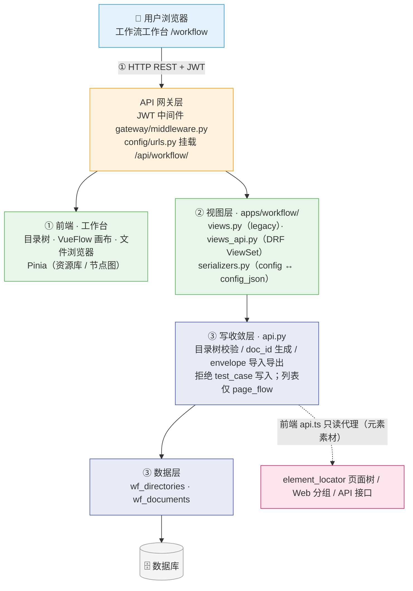
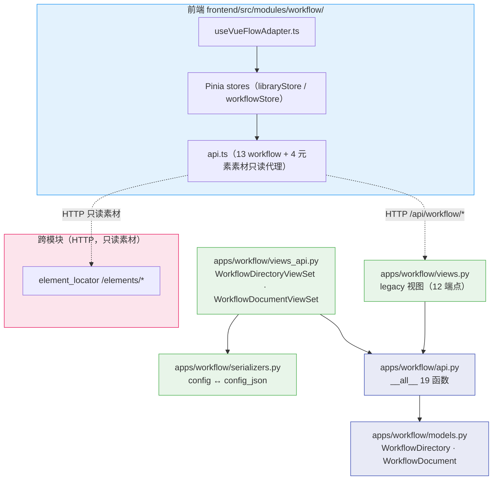
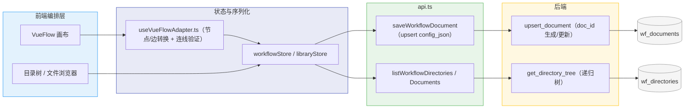
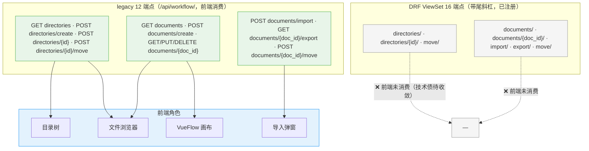
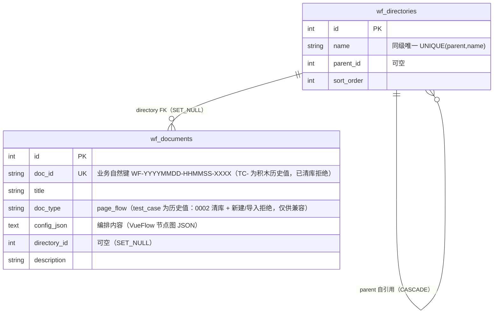

# ARCH-09 — 工作流工作台 (Workflow Workbench)

> **版本**：v2.3 · **日期**：2026-08-21 · **关联模块**：`apps/workflow/` · 前端 `frontend/src/modules/workflow/`

## 文档内容简述

本文档是**工作流工作台模块**的架构设计，覆盖该模块而非平台全貌：

- **架构四图**：架构全景图 · 模块包图 · 数据流图 · API 关系图（§1.2~1.5）
- **后端架构**：文件结构 + 双路由体系 / doc_id 自然键 / envelope 导入导出设计（§3）
- **API 设计**：legacy 12 端点 + DRF ViewSet 16 端点（§4）
- **数据模型**：`wf_` 2 表 ER（§5）
- **模块边界**：api 白名单 + 跨模块依赖（§6）

## 你能从文档获取什么信息

- **编排资源怎么存**：`wf_directories`（目录树）+ `wf_documents`（JSON 文档，`doc_id` 业务自然键，`config_json` 存**页面流**编排内容；`doc_type` 仅 `page_flow`）
- **双路由体系**：legacy 视图（无尾斜杠，前端消费）+ DRF ViewSet（带尾斜杠，已注册未切换），信封差异已登记
- **前端状态层**：Pinia 两层 Store（资源库 / VueFlow 节点图）；**Blockly / test_case 已下线**
- **边界与隐患**：真实运行时未实现、`pageCatalog` 裸 api-client、DRF 未收敛

## 关联文档

- **架构总纲**：[`ARCH-00-平台总体架构`](./ARCH-00-平台总体架构.md) §3.2（workflow 行）· §4.1 写收敛 · §二 L3
- **需求规格**：[`PRD-09-工作流工作台`](../02-PRD需求/PRD-09-工作流工作台.md) — **契约以 PRD §5 为准**

---

## 1. 模块架构概览

### 1.1 架构定位

工作流工作台是平台的**页面流可视化编排中枢**（L3 业务 App 层）：用户以 VueFlow 节点图编排页面流，资源以 JSON 文档落库（`wf_` 两表，仅 `page_flow`）。模块**有写操作**（目录/文档 CRUD），写库全部经 `api.py`；前端 Pinia 用户之一（workflow 2 个 store + device-inspector 1 个，均模块内使用，全前端仅 3 个）。积木用例（`test_case` / Blockly）已下线，步骤编排归用例管理。

### 1.2 架构全景图

> 四层：前端（目录 + VueFlow）→ API 网关（双路由体系）→ 后端资源库 → 数据层。



### 1.3 模块包图

> 箭头 = import 方向。实线 = 本 App 内部；虚线 = 前端 HTTP 代理（跨模块，经本模块 api.ts）。



**防火墙规则**：

```
workflow views / views_api ──✅ import──→ 本 App api.py / serializers / models
workflow views / views_api ──❌ import──→ 其他 App 内部实现
workflow api ──✅ import──→ 本 App models
workflow api ──❌ import──→ 其他 App 任何模块（元素素材经前端 api.ts HTTP 只读代理；后端零跨 App import，实测）
前端组件 ──✅ import──→ 本模块 api.ts（含元素素材只读代理）──❌ 直连他模块 api（PRD-09 F-04-01）
```

### 1.4 数据流图

> 编排操作 → Store → 序列化 → api.ts → 后端 api.py → wf_ 表。



### 1.5 API 关系图

> legacy 12 端点 → 前端角色映射；DRF ViewSet 已注册未切换。



**状态变化与数据同步**：

| 数据 | 同步方式 |
|------|------|
| 编辑器内容 | 前端自动保存（防抖）经 `POST /documents/create` upsert `config_json`；载入经 `GET /documents/{doc_id}` |
| 目录树 | `GET /directories`（flat + 递归 tree 单请求）；展开折叠状态 localStorage 持久化 |
| 元素素材 | 编辑器按需经本模块 `api.ts` 只读代理拉取 element_locator（`/elements/*`），组件不直连他模块 api |

**契约偏差登记**：

| # | 偏差 | 状态 |
|---|------|------|
| 1 | 双路由体系并行：legacy 无尾斜杠 `{status,...}` 信封（前端消费）vs DRF 带尾斜杠**无 status 信封**（未消费） | ⚠️ 已登记（PRD-09 §4.1） |
| 2 | 真实运行时未实现：工具栏「运行」为前端模拟执行（随机 pass/fail），无后端 run 端点 | ⚠️ 已登记（PRD-09 §4.3） |
| 3 | `data/pageCatalog.ts` 仍动态裸 `import('@/shared/api-client')`，bypass 本模块 api.ts | ⚠️ 已登记（PRD-09 §4.3） |

---

## 3. 后端架构

### 3.1 文件结构

```
apps/workflow/
├── urls.py              双路由：DefaultRouter（directories/documents ViewSet）+ legacy 12 条 path
├── models.py            2 表：WorkflowDirectory（wf_directories）· WorkflowDocument（wf_documents）
├── views.py             legacy 视图（目录/文档 CRUD + import/export/move）
├── views_api.py         DRF ViewSet × 2（list 返回 flat+tree；move/import/export 为 @action）
├── serializers.py       列表/详情序列化器（详情做 config ↔ config_json 双向转换）
├── api.py               __all__ 19 函数：目录树校验/递归树、doc_id 生成、upsert、envelope 导入导出、移动（防自/防子孙、级联删除）、AI 只读数据出口再导出
└── admin.py             2 表 admin 注册
```

### 3.2 核心设计

```python
# apps/workflow/api.py — 核心结构

def gen_doc_id(doc_type: str) -> str:
    """WF-{ts}-{rand4} — 全局唯一业务自然键（TC- 积木前缀已随 test_case 下线）"""
    # 循环查重生成（doc_id 是导入导出与前端管理主键）

def upsert_document(doc_id, title, doc_type, config_json, directory_id, ...):
    # 无 doc_id → gen_doc_id 新建；带 doc_id → 查重（404/409）后更新
    # config_json 原样 TextField 存储（VueFlow 节点图 JSON）

def import_document_envelope(payload, *, overwrite=False):
    # envelope: workflow-doc-v1（兼容 testcase-scratch-v1 与裸页面流快照）
    # doc_id 为空自动生成；已存在且未 overwrite → 409；overwrite 覆盖同 doc_id

def move_directory(dir_id, parent_id):
    # 防移入自身/子孙；级联语义：删除目录时级联删除子目录与文档

def get_directory_tree() -> list[dict]:
    # 递归树（目录 + 文档挂载），单请求供前端渲染
```

**双路由体系**：`urls.py` 同时注册 DRF `DefaultRouter`（`directories`/`documents` 两个 ModelViewSet，带尾斜杠，`lookup_field=doc_id`）与 legacy 无尾斜杠路径。前端 `api.ts` 当前全部走 legacy；DRF 已注册但未切换（收敛为待办技术债，信封差异见 §1.5 偏差表）。

---

## 4. API 设计

> legacy 端点响应信封 `{status, ...}` + snake_case；DRF 路由**无 `status` 信封**（双信封并存已登记）。**完整字段契约（字段表/错误码/契约变更）以 PRD §5 为准**，本节只列概览。

### 4.1 REST 端点（legacy 12 个，前端消费）

| 方法 | 路径 | 说明 | 消费方 |
|------|------|------|------|
| `GET` | `/api/workflow/directories` | 目录列表（`directories` + 递归 `tree`） | 前端目录树 |
| `POST` | `/api/workflow/directories/create` | 新建目录 | 前端目录树 |
| `POST` | `/api/workflow/directories/{dir_id}` | 更新 / 删除（action=update\|delete） | 前端目录树 |
| `POST` | `/api/workflow/directories/{dir_id}/move` | 移动目录（防自/防子孙） | 前端目录树 |
| `GET` | `/api/workflow/documents` | 文档列表（`?directory_id=&doc_type=`） | 前端文件浏览器 |
| `POST` | `/api/workflow/documents/create` | 新建 / 更新文档（upsert） | 编辑器自动保存 |
| `GET` | `/api/workflow/documents/{doc_id}` | 文档详情（含 config） | 编辑器载入 |
| `PUT` | `/api/workflow/documents/{doc_id}` | 更新文档 | 编辑器 |
| `DELETE` | `/api/workflow/documents/{doc_id}` | 删除文档 | 文件浏览器 |
| `POST` | `/api/workflow/documents/import` | 导入 envelope（`?overwrite=`） | 导入弹窗 |
| `GET` | `/api/workflow/documents/{doc_id}/export` | 导出 envelope（`?download=`） | 导出/剪贴板 |
| `POST` | `/api/workflow/documents/{doc_id}/move` | 移动文档 | 文件浏览器 |

> DRF ViewSet 并行注册（16 端点，带尾斜杠，❌ 前端未消费）：目录 ModelViewSet + move = 7，文档 ModelViewSet + import/export/move = 9。**端点口径**：legacy 12 逻辑端点 = 10 条 path（`directories/{id}` 承载更新+删除、`documents/{doc_id}` 承载 GET/PUT/DELETE），与 ARCH-00 路径条目口径（10）一致。跨模块元素素材代理见 PRD §5.5。

### 4.2 响应格式（骨架）

```json
{
  "status": true,
  "directories": [{ "id": 1, "parent_id": null, "name": "默认目录", "sort_order": 0 }],
  "tree": [{ "id": 1, "name": "默认目录", "children": [], "documents": [
    { "doc_id": "WF-20260819-101500-A1B2", "title": "登录冒烟", "doc_type": "page_flow" } ] }]
}
```

> 完整字段契约与错误码见 PRD §5.2~5.4；envelope 格式见 PRD §5.4；契约变更见 PRD §5.6。

---

## 5. 数据模型

### 5.1 ER 图



> `doc_id` 是导入导出与前端管理主键（全局唯一，`gen_doc_id` 生成）；`config_json` 原样存 TextField，序列化器在详情接口做 `config` ↔ `config_json` 转换。删除目录级联删除子目录与文档。

---

## 6. 模块边界与跨模块交互

### 6.1 边界规则

| 规则 | 说明 |
|------|------|
| **写库收敛** | View / ViewSet 仅分发，全部写经 `api.py`（19 函数白名单） |
| **编排资源独立** | 目录/文档仅存工作流资源（wf_）；用例目录树（cm_）归 case-manager，不同步 |
| **前端跨模块代理** | 组件经本模块 `api.ts` 代理调用元素/用例端点，禁止直连他模块 api |
| **不执行测试** | 无真实运行时（仅前端模拟执行），真实执行经 PRD-06 |

### 6.2 跨模块写白名单（api.py `__all__`）

| 类别 | 函数 |
|------|------|
| 目录 | `create_directory` · `update_directory` · `delete_directory` · `move_directory` · `list_directories_flat` · `get_directory_tree` |
| 文档 | `upsert_document` · `delete_document` · `move_document` · `list_documents` · `get_document` |
| 序列化/导出 | `serialize_directory` · `serialize_document` · `build_export_envelope` · `export_document` |
| 导入/ID | `import_document_envelope` · `gen_doc_id` |
| AI 只读 | `get_document_digest` · `list_document_summaries`（`api_digest.py` 实现，`api.py` 再导出） |

### 6.3 跨模块依赖（前端 api.ts HTTP 代理）

| 方向 | 端点 | 用途 |
|------|------|------|
| ← 上游 | `GET /api/elements/pages` · `/pages/{id}/items` · `/web-groups` · `/web` · `/api-endpoints` | 页面树/元素/分组/API 目录（只读素材，供编辑器选取；经本模块前端 api.ts 代理） |
| → 下游 | `ai_assistant` 只读消费 `workflow.api`（`get_document_digest` / `list_document_summaries`） | AI 工具 `list_page_flows` / `get_page_flow` 查阅页面流语义摘要（digest 由 `semantics.py` 编译；AI 不写图） |

---

## 7. 设计要点

| 要点 | 说明 |
|------|------|
| doc_id 自然键 | 全局唯一业务主键（WF-/TC- 前缀），导入导出跨环境可识别，覆盖导入 409 拦截 |
| 双路由共存 | legacy（前端消费）+ DRF ViewSet（未切换），收敛为待办技术债（信封差异登记 PRD-09 §4.1） |
| envelope 版本兼容 | `workflow-doc-v1` 兼容 `testcase-scratch-v1` 与裸页面流快照，导入无损 |
| 前端状态层 | Pinia 两层 Store（libraryStore / workflowStore）+ useVueFlowAdapter 桥接；元素素材经 api.ts 只读代理（全前端 Pinia 现状见全局 `frontend/AGENTS.md` §1.2） |
| 目录树校验 | 移动防自身/防子孙，删除级联；同级名唯一 |
| 模拟执行 | 前端随机 pass/fail 演示块流；真实运行时未实现（PRD-09 §4.3 已登记） |
| AI 只读消费 | AI 助手经 `workflow.api` 的 `get_document_digest` / `list_document_summaries` 只读查阅页面流语义摘要（`semantics.py` 编译：节点/跳转 links/每页 navigation_entries 与 elements/路径；元素来源标注 snapshot/web_snapshot/builtin_pool/unknown）；AI 无写图工具 |

---

## 变更记录

| 版本 | 日期 | 变更摘要 |
|------|------|----------|
| v2.3 | 2026-08-21 | **五层口径回填 + 正文与 v2.1 changelog 对齐（修正内部矛盾）**：§1.1/§1.2 去旧层标签（VW/API）；§1.3 包图删 testCaseStore/caseBridge/blocklySerializer、跨模块代理收敛为元素素材只读（13+4）；§1.4/§1.5 删 Blockly workspace/编辑器与用例同步链路；§3.2/§5.1 config_json 与 doc_id 只保留 VueFlow/WF-；§4.2 响应示例 doc_type=page_flow；§4.1 补端点口径（12 逻辑端点 = 10 条 path）；§6.3 删用例同步行；Pinia 口径改为"用户之一"（workflow×2 + device-inspector×1）；关联指针改 §3.2/§4.1/§二 L3 |
| v2.2 | 2026-08-19 | **AI 只读消费**：新增 `semantics.py`（页面流图 → 语义摘要纯函数）+ `semantics_paths.py`（路径 DFS）+ `api_digest.py`（`get_document_digest` / `list_document_summaries` 只读数据出口，api.py 再导出进白名单）；ai_assistant 新增「工作流」分类与 `list_page_flows` / `get_page_flow` 2 只读工具；§6.2 白名单 17→19 函数 |
| v2.1 | 2026-08-19 | **下线积木用例**：`test_case` 清库 + API 拒绝写入；前端移除 Blockly / 用例桥接；仅保留 page_flow + VueFlow |
| v2.0 | 2026-08-19 | **按 ARCH-01 标杆整篇重写**（旧 v1.0 为旧风格：§2 前端组件树、积木映射、VueFlow ASCII、Store 表、完整字段表越界）；标题编号修正 ARCH-08 → ARCH-09；补架构四图 + 同步方式表 + 契约偏差表；同步代码真相：双路由体系（legacy 12 + DRF 16）、wf_ 两表 + doc_id 自然键（WF-/TC- 前缀）、api.py `__all__` 17 函数、envelope workflow-doc-v1、Blockly 18 块 8 分组、ImportCasesDialog 违规已修复、真实运行时未实现 |
| v1.0 | 2026-07-16 | 初始版本：基于旧 PRD-09（前端 JS 时代基线：api.js/routes.js/constants.js、17 块 6 分组、端口 element/boolean/text 体系——均已被代码演进替代） |
