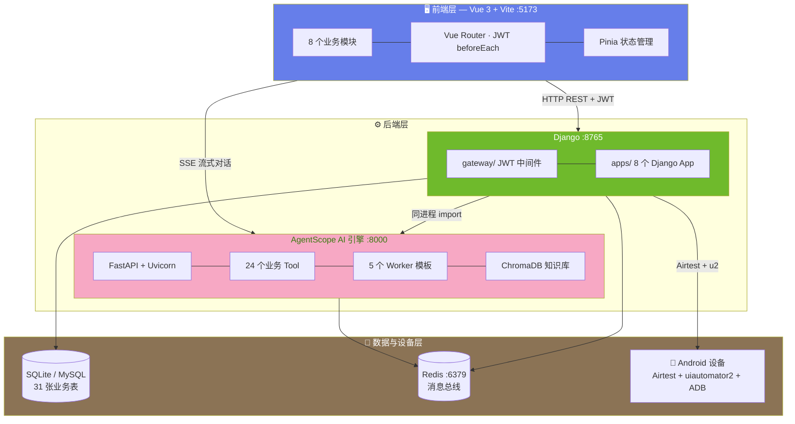
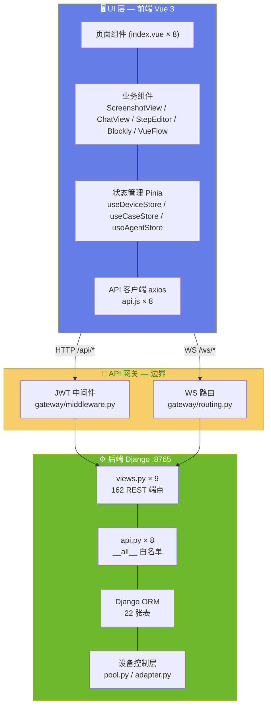
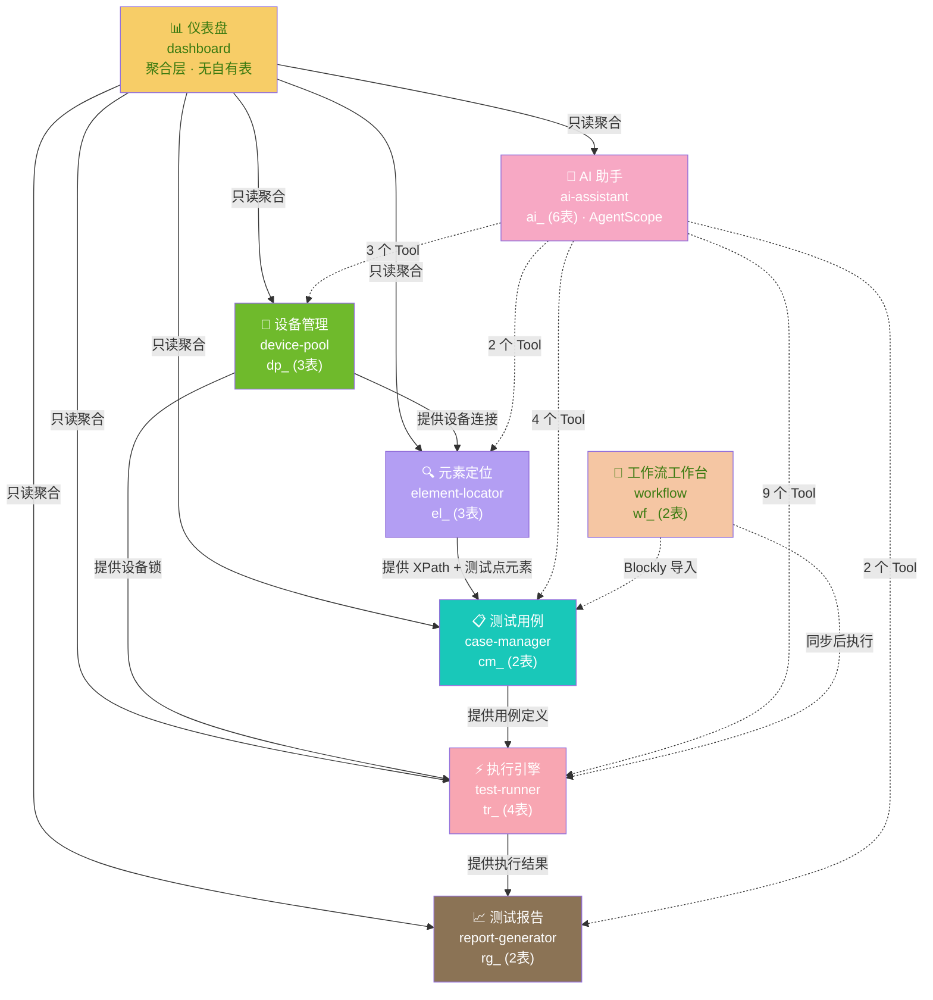
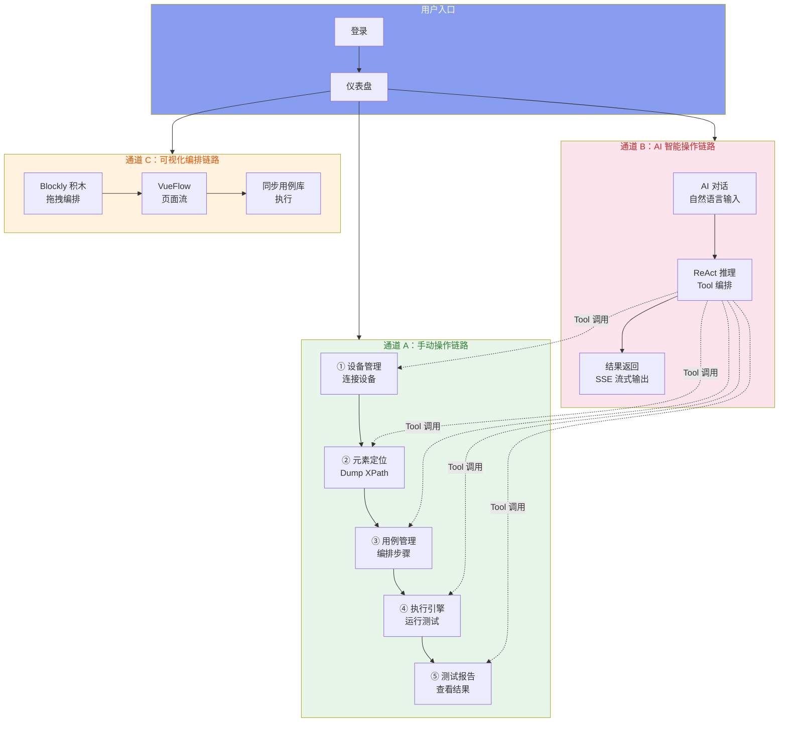
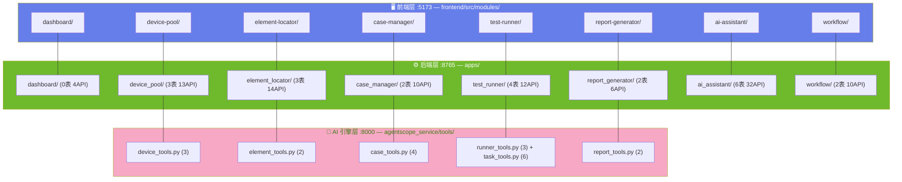

# 架构大纲 — Android-AutoTests

> 版本：v1.4 · 日期：2026-07-28
> 本文档是平台的**架构总纲**，定义三层分离设计意图、前后端与 AI 交互边界、九模块架构全景。
> 详细模块架构见各子 ARCH：[`ARCH-01-元素定位`](ARCH-01-元素定位.md) ~ [`ARCH-08-工作流工作台`](ARCH-08-工作流工作台.md)。
> 需求规格见：[`../02-PRD需求/需求大纲.md`](../02-PRD需求/需求大纲.md)

---

## 一、三层分离的设计意图

### 1.1 为什么三层分离

Android-AutoTests 是一个 **AI 驱动的 Android UI 自动化测试平台**。与传统 Web 应用不同，它有三个本质不同的计算职责：

| 层 | 核心职责 | 计算特征 |
|---|---------|---------|
| **前端层** | 用户界面、交互体验、数据展示 | 事件驱动、DOM 渲染、实时流消费 |
| **后端层** | 业务逻辑、数据持久化、设备控制 | 请求-响应、ORM 事务、ADB 通信 |
| **AI 引擎层** | 自然语言理解、推理循环、Tool 编排 | 长连接 SSE、LLM 推理、向量检索 |

三层分离的核心意图：**让每一层用最适合的技术栈解决它最擅长的问题，通过明确协议通信，互不侵入。**

### 1.2 三段交互结构图



### 1.3 三层职责边界

```
┌──────────────────────────────────────────────────────────────────┐
│                        🖥️ 前端层 (:5173)                          │
│                                                                  │
│  ✅ 负责：                                                        │
│  · Vue 组件渲染与用户交互                                          │
│  · SPA 路由与 JWT 登录守卫                                        │
│  · WebSocket 截图流消费 (2fps)                                    │
│  · SSE 流式对话消费                                               │
│  · Blockly 积木编辑器 + VueFlow 流程图                            │
│                                                                  │
│  ❌ 不管：                                                        │
│  · 数据库直连与 SQL 查询                                          │
│  · AI 模型推理与 Tool 调用                                        │
│  · ADB 设备通信                                                   │
│  · 文件系统 I/O（报告生成、日志写入）                               │
└────────────────────────────┬─────────────────────────────────────┘
                             │
              HTTP REST + JWT │ SSE 流式对话
                             │
┌────────────────────────────┼─────────────────────────────────────┐
│               ⚙️ 后端层                                             │
│                                                                  │
│  ┌─────────────────────────┴──┐  ┌──────────────────────────────┐│
│  │  Django (:8765)             │  │  AgentScope AI 引擎 (:8000)   ││
│  │                             │  │                              ││
│  │  ✅ 负责：                  │  │  ✅ 负责：                   ││
│  │  · JWT 签发与验证           │  │  · ReAct 推理循环            ││
│  │  · 业务逻辑 (views.py)      │  │  · 38 个 Tool 调用编排       ││
│  │  · ORM 数据持久化           │  │  · ChromaDB 知识库检索       ││
│  │  · Airtest + u2 设备控制    │  │  · Agent Team 并行协作       ││
│  │  · WebSocket 实时推送       │  │  · SSE 流式逐 token 输出     ││
│  │  · 文件 I/O（报告/截图）     │  │                              ││
│  │                             │  │  ❌ 不管：                   ││
│  │  ❌ 不管：                  │  │  · 数据库直写（只通过 Tool   ││
│  │  · 前端渲染                 │  │    调用 Django ORM）         ││
│  │  · AI 推理                  │  │  · JWT 签发                 ││
│  │  · Agent 生命周期管理        │  │  · 设备直连（通过 Tool 调   ││
│  │                             │  │    Django 设备 API）         ││
│  └─────────────┬───────────────┘  └──────────────┬───────────────┘│
│                │                                  │                │
│    同进程 import (不走 HTTP)                        │                │
│    Tool → Django ORM / api.py                     │                │
│                │                                  │                │
└────────────────┼──────────────────────────────────┼────────────────┘
                 │                                  │
                 ▼                                  ▼
┌────────────────────────────────────────────────────────────────────┐
│                     💾 数据与设备层                                  │
│                                                                    │
│  ┌─────────────────────┐  ┌──────────────┐  ┌──────────────────┐  │
│  │  SQLite / MySQL      │  │  Redis :6379 │  │  Android 设备     │  │
│  │  31 张业务表          │  │  消息总线     │  │  Airtest + u2    │  │
│  │  Django ORM 统一访问  │  │  Agent 状态   │  │  ADB USB/WiFi    │  │
│  └─────────────────────┘  └──────────────┘  └──────────────────┘  │
└────────────────────────────────────────────────────────────────────┘
```

---

## 二、前端 ↔ 后端 ↔ AI 交互方式与边界

### 2.1 五条通信通道

```mermaid
flowchart LR
    subgraph Frontend["前端 :5173"]
        Vue["Vue 3 SPA"]
    end

    subgraph Django["Django :8765"]
        API["REST API"]
        WS["WebSocket"]
    end

    subgraph AS["AgentScope :8000"]
        SSE["SSE 流"]
        Tool["Tool 调用"]
    end

    subgraph Data["数据与设备"]
        DB["MySQL"]
        Dev["Android"]
    end

    Frontend -->|"① HTTP REST + JWT<br/>所有 /api/* 请求"| API
    Frontend -->|"② WebSocket + JWT<br/>截图流 2fps + 执行进度"| WS
    Frontend -->|"③ SSE + JWT<br/>AI 流式对话"| SSE
    AS -->|"④ Python import<br/>同进程调用 ORM/API"| Django
    Django -->|"⑤ ADB<br/>Airtest + u2 设备控制"| Dev
    API --> DB
    Tool --> DB

    style ① stroke:#6fba2c,stroke-width:3px
    style ② stroke:#b39ef3,stroke-width:2px
    style ③ stroke:#f7a8c4,stroke-width:2px
    style ④ stroke:#f8a6b2,stroke-width:3px
    style ⑤ stroke:#8b7355,stroke-width:2px
```

### 2.2 交互协议与鉴权矩阵

| # | 通道 | 方向 | 协议 | 鉴权方式 | 用途 | 带宽特征 |
|:--:|------|------|------|------|------|------|
| ① | 前端 → Django | 双向 | HTTP REST | JWT Bearer Header | 业务 CRUD（162 REST 端点） | 低带宽，请求-响应 |
| ② | Django → 前端 | 单向推送 | WebSocket | JWT query string | 截图流 (2fps) + 测试进度 | 高带宽，持续推送 |
| ③ | 前端 → AgentScope | 单向流 | SSE | JWT (共享 SECRET_KEY) | AI 流式对话 | 中带宽，逐 token |
| ④ | AgentScope → Django | 单向调用 | Python import | 上下文注入 | Tool 执行业务逻辑 | 零网络开销 |
| ⑤ | Django → 设备 | 双向 | ADB | — | 截屏/dump/手势操作 | 取决于操作类型 |

### 2.3 前端与后端的边界设定



**边界规则**：

| 规则 | 说明 |
|------|------|
| 前端永不远直连数据库 | 所有数据来自 REST API 或 WebSocket |
| 前端不处理文件 I/O | 报告生成、日志写入全由后端完成 |
| 前端不做 AI 推理 | 流式对话通过 SSE 消费 AgentScope 输出 |
| 所有 /api/* 必经 JWT 中间件 | 公开路径白名单：auth/admin/static/avatars |
| Django 不渲染 HTML | 纯 JSON API，无 Django Template |
| AgentScope 不走 HTTP 调 Django | 同进程 `import`，零序列化开销 |

### 2.4 AI 引擎的边界设定

```
AgentScope (:8000) 的职责边界
═══════════════════════════════════════════

✅ 负责：
  · 接收用户自然语言消息
  · ReAct 推理循环（思考 → 行动 → 观察）
  · 决定调用哪些 Tool、以什么参数
  · 流式输出推理过程和结果
  · ChromaDB 知识库检索
  · Agent Team 并行协作编排

❌ 不管：
  · 数据库直写 — 所有持久化通过 Tool → Django ORM
  · JWT 签发 — 仅验证（共享 SECRET_KEY）
  · 设备物理连接 — 通过 Tool → Django Device API
  · 前端渲染 — 只输出结构化事件流

Tool 调用链路：
  AgentScope Tool.__call__()
    → import apps.xxx.api  (同进程)
    → Django ORM / 业务函数
    → 返回结构化结果
```

---

## 三、九模块平台架构

### 3.1 模块依赖关系图



**图例**：实线 = 数据依赖（上游为下游提供数据） · 虚线 = AI Tool 调用 · 点线 = 工作流同步

### 3.2 模块交互链路全景



### 3.3 模块与三层架构的映射



---

## 四、模块架构概览

### 4.1 设备管理 (device-pool)

**定位**：平台设备基础设施，Android 设备的全生命周期管理中心。

| 维度 | 说明 |
|------|------|
| **模块职责** | ADB 设备发现 → 注册 → 状态监控(30s心跳) → 锁定(FIFO排队) → 释放 |
| **核心边界** | 仅管理设备连接与锁状态，不关心设备上跑什么用例 |
| **上游依赖** | 无（基础设施层） |
| **下游消费** | element-locator (截图/Dump)、test-runner (锁定执行) |
| **AI Tool** | `get_online_devices`、`acquire_device`、`release_device` (3个) |
| **数据表** | `dp_devices` · `dp_device_locks` · `dp_device_queue` |
| **API** | 13 REST |
| **核心组件** | `DevicePool` 单例 (pool.py) — 线程安全的 Airtest + u2 双连接管理 |

### 4.2 元素定位 (element-locator)

**定位**：UI 可视化中枢，将 Android 屏幕转化为可操作的测试元素。

| 维度 | 说明 |
|------|------|
| **模块职责** | 实时截图流 → Dump UI 层级 → 8 种 XPath 生成 → 元素资产库管理 |
| **核心边界** | 只做元素发现与定位表达式生成，不执行测试 |
| **上游依赖** | device-pool (u2 截屏/Dump) |
| **下游消费** | case-manager (XPath 填入步骤)、AI 助手 (元素搜索) |
| **AI Tool** | `get_test_points`、`search_elements` (2个) |
| **数据表** | `el_pages` · `el_elements` · `el_page_flows` |
| **API** | 14 REST + 1 WebSocket |
| **8 种 XPath** | resource-id → text → content-desc → 类名 → 索引 → 组合 → 通配+rid → 通配+text |

### 4.3 用例管理 (case-manager)

**定位**：测试资产管理中枢，创建、编排、管理可重用的测试用例定义。

| 维度 | 说明 |
|------|------|
| **模块职责** | 二级目录树 → 用例 CRUD → 28 种步骤编排 → YAML 导入导出 |
| **核心边界** | 只管理用例定义（JSON），不执行用例 |
| **上游依赖** | element-locator (XPath 选取) |
| **下游消费** | test-runner (读取用例执行)、workflow (积木导入) |
| **AI Tool** | `save_test_case`、`get_test_case`、`list_test_cases`、`debug_test_case` (4个) |
| **数据表** | `cm_case_directories` · `cm_test_definitions` |
| **API** | 10 REST |

### 4.4 执行引擎 (test-runner)

**定位**：任务调度与用例执行中枢，将 JSON 步骤转化为设备端原子操作。

| 维度 | 说明 |
|------|------|
| **模块职责** | 任务卡片 → 设备调度(空闲/排队) → StepExecutor 分发 → DeviceAdapter 驱动 u2 |
| **核心边界** | 只负责执行调度，不管理用例定义和报告展示 |
| **上游依赖** | device-pool (设备锁)、case-manager (用例定义) |
| **下游消费** | report-generator (执行结果) |
| **AI Tool** | `run_test`、`get_run_results`、`stop_run` + `create_test_sop` 等 (9个) |
| **数据表** | `tr_test_sop` · `tr_test_runs` · `tr_test_results` · `tr_task_cards` |
| **API** | 12 REST + 1 WebSocket |
| **核心组件** | `state_machine.py` → `runner.py` → `executor.py` → `adapter.py` |

### 4.5 测试报告 (report-generator)

**定位**：执行结果收口与质量可视化中枢。

| 维度 | 说明 |
|------|------|
| **模块职责** | 自动生成 CSV/MD/LOG/JSON → 报告列表 → 在线详情 → 文件下载 |
| **核心边界** | 只读消费执行结果，不做数据写入（报告由执行引擎触发生成） |
| **上游依赖** | test-runner (执行结果) |
| **下游消费** | dashboard (趋势统计) |
| **AI Tool** | `save_report`、`list_reports` (2个) |
| **数据表** | `rg_reports` · `rg_report_templates` |
| **API** | 6 REST |

### 4.6 AI 助手 (ai-assistant)

**定位**：平台 AI 入口，自然语言驱动全流程测试。

| 维度 | 说明 |
|------|------|
| **模块职责** | 智能体管理 → SSE 流式对话 → ReAct 推理 → Tool 编排 → 知识库增强 |
| **核心边界** | AI 引擎不做设备直连和数据库直写，一切通过 Tool 调用 Django |
| **上游依赖** | 全部 6 个业务模块（通过 Tool） |
| **下游消费** | 无（AI 是顶层调用者） |
| **AI Tool** | 全部 38 个 Tool（AI 模块自身也是 Tool 的宿主） |
| **数据表** | `ai_agents` · `ai_tools` · `ai_conversations` · `ai_messages` · `ai_tasks` · `ai_execution_logs` |
| **API** | 37 REST + SSE |
| **核心组件** | `agent_factory.py` → `tools/` (24个) → `teams/` (5个Worker) → `rag/` (ChromaDB) |

### 4.7 工作流工作台 (workflow)

**定位**：可视化测试工作流编排工具，降低非技术人员使用门槛。

| 维度 | 说明 |
|------|------|
| **模块职责** | Blockly 积木式编辑 → VueFlow 页面流程图 → 双向同步用例库 |
| **核心边界** | 编排工具，本身不执行测试 |
| **上游依赖** | case-manager (用例导入/同步) |
| **下游消费** | case-manager (积木→用例)、test-runner (同步后执行) |
| **AI Tool** | 无（独立前端工具） |
| **数据表** | `wf_directories` · `wf_documents` |
| **API** | 10 REST |

### 4.8 仪表盘 (dashboard)

**定位**：平台首页聚合层，跨模块只读统计与导航入口。

| 维度 | 说明 |
|------|------|
| **模块职责** | KPI 统计卡片 × 6 → 执行趋势图 → 快捷入口 → 活动时间线 |
| **核心边界** | 纯聚合查询，不拥有业务写操作，无自有数据表 |
| **上游依赖** | 全部 6 个业务模块（只读聚合） |
| **下游消费** | 无 |
| **AI Tool** | 无 |
| **数据表** | 无（纯聚合层） |
| **API** | 4 REST |

---

## 五、文件地图

### 5.1 架构文档索引

```
dev_docs/03-设计与架构/
│
├── 架构大纲.md                          ← 本文档（架构总纲）
│
├── ARCH-01-元素定位.md                   ← 元素定位模块架构
├── ARCH-02-设备管理.md                   ← 设备管理模块架构
├── ARCH-03-用例管理.md                   ← 用例管理模块架构
├── ARCH-04-执行引擎.md                   ← 执行引擎模块架构
├── ARCH-05-测试报告.md                   ← 测试报告模块架构
├── ARCH-06-AI助手.md                    ← AI 助手模块架构
├── ARCH-07-仪表盘.md                     ← 仪表盘模块架构
├── ARCH-08-工作流工作台.md               ← 工作流工作台模块架构
│
├── 技术栈参考.md                         ← 技术选型与命名统一（已合并技术栈-* 四份文档）
├── 工具-VUE_API_CONTRACT.md              ← 前后端接口契约
├── 平台架构全览报告.html                  ← 架构统计实时报告 (v2.0)
│
└── README.md                             ← 目录索引
```

### 5.2 代码层面文件地图

```
Android-AutoTests/
│
├── frontend/src/modules/          ← 前端 8 模块（+ evaluator 仅后端）
│   ├── dashboard/                 · index.vue / api.js / routes.js
│   ├── device-pool/               · index.vue / api.js / routes.js
│   ├── element-locator/           · index.vue / ElementManager.vue / ScreenshotView.vue
│   ├── case-manager/              · index.vue / CaseEditor.vue / StepEditor.vue
│   ├── test-runner/               · index.vue / TaskDetail.vue
│   ├── report-generator/          · index.vue / ReportDetail.vue
│   ├── ai-assistant/              · index.vue / AgentDetail.vue / ChatView.vue
│   └── workflow/                  · index.vue / TestCaseBlockly / PageFlowVueFlow
│
├── apps/                          ← Django 9 App
│   ├── dashboard/                 · views.py (4 端点，纯聚合)
│   ├── device_pool/               · models.py(3表) / views.py(13) / pool.py(单例)
│   ├── element_locator/           · models.py(3表) / views.py(14) / service.py / consumers.py
│   ├── case_manager/              · models.py(2表) / views.py(10)
│   ├── test_runner/               · models.py(4表) / views.py(12) / runner.py / executor.py
│   ├── report_generator/          · models.py(2表) / views.py(6)
│   ├── ai_assistant/              · models.py(6表) / views/(32端点)
│   └── workflow/                  · models.py(2表) / views.py(10)
│
├── agentscope_service/            ← AI 引擎
│   ├── app.py                     · FastAPI 入口
│   ├── auth.py                    · JWT 依赖注入
│   ├── agent_factory.py           · Django Agent → AgentScope Agent
│   ├── tools/                     · 24 个业务 Tool
│   │   ├── element_tools.py       · (2)
│   │   ├── case_tools.py          · (4)
│   │   ├── device_tools.py        · (3)
│   │   ├── runner_tools.py        · (3)
│   │   ├── task_tools.py          · (6)
│   │   ├── report_tools.py        · (2)
│   │   ├── prd_tools.py           · (3)
│   │   └── rag_tool.py            · (1)
│   ├── teams/                     · 5 个 Agent Team 模板
│   └── rag/                       · ChromaDB 知识库 (32 篇)
│
├── gateway/                       ← Django 网关
│   ├── middleware.py              · JWT 中间件
│   ├── routing.py                 · WebSocket 路由
│   └── urls.py                    · URL 配置
│
└── shared/auth/                   ← 共享认证
    └── jwt_auth.py                · JWT 签发/验证
```

---

## 六、关键设计决策

| 决策 | 理由 |
|------|------|
| **前端永远不直连数据库** | 所有数据来自 API，保证数据链路可控、可审计 |
| **AgentScope 同进程调 Django** | Tool 直接 import ORM/API，不走 HTTP，零网络开销 |
| **Django + AgentScope 共享 JWT 密钥** | 统一认证，避免双系统 Token 同步 |
| **裸 Django View 而非 DRF** | 55+ 端点稳定运行，JSON 格式统一，AI Tool 同进程调用无帮助 |
| **SSE + 阻塞 POST 兜底** | AgentScope 不可用时自动降级为同步模式 |
| **SQLite 开发 / MySQL 生产** | 环境变量 `DB_ENGINE` 一键切换 |
| **APScheduler 替代 Celery** | AgentScope 内置调度，减少运维依赖 |
| **锁审计日志永不删除** | 通过 status 追踪生命周期，支持审计回溯 |
| **执行前保存用例快照** | `selected_cases` 完整复制步骤数据，确保历史可审计 |
| **WebSocket 截图 + REST 兜底** | 并行请求：WebSocket 建立前先用 REST 拿首帧 |

---

## 七、模块架构详细说明索引

> 以下子 ARCH 为各模块的完整架构设计（前端组件树、后端文件、API 列表、数据模型、交互时序、跨模块通信）。
> 需求与验收标准见 `02-PRD需求/` 下对应子 PRD。

| 模块 | 子 ARCH 文件 | 关键架构要素 |
|------|-----------|------------|
| 元素定位 | [`ARCH-01-元素定位.md`](ARCH-01-元素定位.md) | WebSocket 截图流 2fps + 8 XPath 策略 + 三列工作区 |
| 设备管理 | [`ARCH-02-设备管理.md`](ARCH-02-设备管理.md) | DevicePool 单例 + FIFO 排队 + 锁审计 |
| 用例管理 | [`ARCH-03-用例管理.md`](ARCH-03-用例管理.md) | 28 种步骤编排 + 二级目录树 + YAML 导入导出 |
| 执行引擎 | [`ARCH-04-执行引擎.md`](ARCH-04-执行引擎.md) | 状态机 + StepExecutor + DeviceAdapter + SOP 四阶段 |
| 测试报告 | [`ARCH-05-测试报告.md`](ARCH-05-测试报告.md) | CSV/MD/LOG/JSON 自动生成 + 在线详情 |
| AI 助手 | [`ARCH-06-AI助手.md`](ARCH-06-AI助手.md) | SSE 流式对话 + 24 Tool + 5 Worker Team + ChromaDB |
| 仪表盘 | [`ARCH-07-仪表盘.md`](ARCH-07-仪表盘.md) | 6 KPI 跨模块聚合 + 趋势图 + 活动时间线 |
| 工作流工作台 | [`ARCH-08-工作流工作台.md`](ARCH-08-工作流工作台.md) | Blockly + VueFlow + 双向同步用例库 |

### 相关文档

| 文档 | 路径 | 说明 |
|------|------|------|
| 需求大纲 | [`../02-PRD需求/需求大纲.md`](../02-PRD需求/需求大纲.md) | 项目定位 · 用户故事 · 状态机 · 模块职责 |
| AI 编程速查 | [`../02-PRD需求/AI编程参考手册.md`](../02-PRD需求/AI编程参考手册.md) | 数据契约 · 约束清单 · 错误模板 |
| 原始架构 | [`项目架构.md`](项目架构.md) | 架构事实基线（代码自动统计） |
| 技术栈 | [`技术栈-README.md`](技术栈-README.md) | 技术选型与素材约定 |

---

---

## 八、部署架构

```
开发环境 (macOS / Windows)
─────────────────────────────

  Vue Dev Server    :5173    Vite HMR + proxy
  Django Daphne     :8765    ASGI HTTP + WebSocket
  AgentScope Uvicorn :8000   FastAPI + SSE
  Redis             :6379    消息总线 + 状态存储

  一键启动: python run.py start
  一键停止: python run.py stop
  状态检查: python run.py status
```

---

## 附录A：架构事实统计（自动生成）

> 由 `tools/gen_arch_stats.py` 自动维护，Architect Agent 每次被调用时同步。
> 最后更新见 git log。

### Django App 清单

| App | 表 | 端点 | 代码行数 | models | views | api | urls |
|-----|:--:|:--:|:--:|:--:|:--:|:--:|:--:|
| `ai_assistant` | 6 | 37 | 2232 | ✅ | ✅ | ✅ | ✅ |
| `case_manager` | 2 | 10 | 848 | ✅ | ✅ | ✅ | ✅ |
| `dashboard` | 0 | 4 | 357 | ❌ | ✅ | ❌ | ✅ |
| `device_pool` | 3 | 13 | 1839 | ✅ | ✅ | ✅ | ✅ |
| `element_locator` | 8 | 33 | 1102 | ✅ | ✅ | ✅ | ✅ |
| `report_generator` | 2 | 6 | 982 | ✅ | ✅ | ✅ | ✅ |
| `test_runner` | 4 | 12 | 3621 | ✅ | ✅ | ✅ | ✅ |
| `workflow` | 2 | 10 | 733 | ✅ | ✅ | ✅ | ✅ |
| `evaluator` | 4 | 14 | — | ✅ | — | — | — |
| **合计** | **31** | **162** | — | — | — | — | — |

### 数据库表清单

| 前缀 | App | 表名 |
|------|-----|------|
| `ai_` | `ai_assistant` | `ai_agents` · `ai_tools` · `ai_conversations` · `ai_messages` · `ai_tasks` · `ai_execution_logs` |
| `cm_` | `case_manager` | `cm_case_directories` · `cm_test_definitions` |
| `dp_` | `device_pool` | `dp_devices` · `dp_device_locks` · `dp_device_queue` |
| `el_` | `element_locator` | `el_pages` · `el_elements` · `el_page_flows` · `el_web_groups` · `el_web_elements` · `el_web_page_flows` · `el_api_groups` · `el_api_endpoints` |
| `ev_` | `evaluator` | `ev_question_banks` · `ev_questions` · `ev_runs` · `ev_results` |
| `rg_` | `report_generator` | `rg_reports` · `rg_report_templates` |
| `tr_` | `test_runner` | `tr_test_sop` · `tr_test_runs` · `tr_test_results` · `tr_task_cards` |
| `wf_` | `workflow` | `wf_directories` · `wf_documents` |

### AgentScope Tool 清单（38 个）

| Tool | 类名 | 文件 | 只读 |
|------|------|------|:--:|
| `save_test_case` | `SaveTestCaseTool` | `case_tools.py` | ❌ |
| `get_test_case` | `GetTestCaseTool` | `case_tools.py` | ✅ |
| `debug_test_case` | `DebugTestCaseTool` | `case_tools.py` | ✅ |
| `list_test_cases` | `ListTestCasesTool` | `case_tools.py` | ✅ |
| `get_online_devices` | `GetOnlineDevicesTool` | `device_tools.py` | ✅ |
| `acquire_device` | `AcquireDeviceTool` | `device_tools.py` | ❌ |
| `release_device` | `ReleaseDeviceTool` | `device_tools.py` | ❌ |
| `get_test_points` | `GetTestPointsTool` | `element_tools.py` | ✅ |
| `search_elements` | `SearchElementsTool` | `element_tools.py` | ❌ |
| `parse_prd` | `ParsePRDTool` | `prd_tools.py` | ✅ |
| `design_test_cases_from_prd` | `DesignTestCasesFromPRDTool` | `prd_tools.py` | ❌ |
| `import_designed_cases` | `ImportDesignedCasesTool` | `prd_tools.py` | ❌ |
| `search_knowledge_base` | `KnowledgeBaseSearchTool` | `rag_tool.py` | ✅ |
| `save_report` | `SaveReportTool` | `report_tools.py` | ❌ |
| `list_reports` | `ListReportsTool` | `report_tools.py` | ✅ |
| `run_test` | `RunTestTool` | `runner_tools.py` | ❌ |
| `get_run_results` | `GetRunResultsTool` | `runner_tools.py` | ✅ |
| `stop_run` | `StopRunTool` | `runner_tools.py` | ❌ |
| `fetch_page_elements` | `FetchPageElementsTool` | `task_tools.py` | ✅ |
| `create_test_sop` | `CreateTestSOPTool` | `task_tools.py` | ❌ |
| `update_test_sop` | `UpdateTestSOPTool` | `task_tools.py` | ❌ |
| `create_runner_task` | `CreateRunnerTaskTool` | `task_tools.py` | ❌ |
| `list_ai_tasks` | `ListAITasksTool` | `task_tools.py` | ✅ |
| `update_ai_task` | `UpdateAITaskTool` | `task_tools.py` | ❌ |

### 前端模块清单

| 模块 | index.vue | api.js | routes.js | Vue 行数 |
|------|:--:|:--:|:--:|:--:|
| `ai-assistant` | ✅ | ✅ | ✅ | 4290 |
| `case-manager` | ✅ | ✅ | ✅ | 3373 |
| `dashboard` | ✅ | ✅ | ✅ | 1412 |
| `device-pool` | ✅ | ✅ | ✅ | 1397 |
| `element-locator` | ✅ | ✅ | ✅ | 1822 |
| `report-generator` | ✅ | ✅ | ✅ | 2499 |
| `test-runner` | ✅ | ✅ | ✅ | 1984 |
| `workflow` | ✅ | ✅ | ✅ | 4568 |

### 跨模块 import 关系

| 被依赖 App | 依赖来源 |
|------|------|
| `ai_assistant` | `agent_factory.py` · `tools/factory.py` · `tools/task_tools.py` · `dashboard/views.py` |
| `case_manager` | `adapters/case_adapter.py` · `tools/case_tools.py` · `tools/prd_tools.py` · `tools/runner_tools.py` · `tools/task_tools.py` |
| `device_pool` | `adapters/device_adapter.py` · `tools/case_tools.py` · `tools/runner_tools.py` · `tools/task_tools.py` · `dashboard/views.py` |
| `element_locator` | `adapters/element_adapter.py` · `tools/case_tools.py` · `tools/element_tools.py` · `tools/task_tools.py` · `case_manager/views.py` |
| `report_generator` | `tools/report_tools.py` · `dashboard/views.py` · `test_runner/runner.py` |
| `test_runner` | `adapters/runner_adapter.py` · `tools/runner_tools.py` · `tools/task_tools.py` · `ai_assistant/views/` · `dashboard/views.py` |

### 文件体积违规 TOP 10

| 文件 | 行数 | 上限 | 超出 | 类型 |
|------|:--:|:--:|:--:|------|
| `test-runner/index.vue` | 1098 | 500 | +598 | vue |
| `case-manager/StepEditor.vue` | 949 | 500 | +449 | vue |
| `case-manager/DirectoryTree.vue` | 929 | 500 | +429 | vue |
| `report_generator/views.py` | 799 | 400 | +399 | python |
| `test-runner/TaskDetail.vue` | 886 | 500 | +386 | vue |
| `device-pool/index.vue` | 885 | 500 | +385 | vue |
| `prd_tools.py` | 701 | 400 | +301 | python |
| `ai-assistant/AgentDetail.vue` | 800 | 500 | +300 | vue |
| `report-generator/ReportDetail.vue` | 793 | 500 | +293 | vue |
| `workflow/PageFlowVueFlow.vue` | 723 | 500 | +223 | vue |

---

## 九、平台统一定义

### 步骤类型（来自 `models/step_types.py::StepType` 枚举，自动统计）

**28 种步骤类型** — `StepType` 枚举是唯一真相源，executor dispatch、前端 step-utils、adapter 均基于这些值：

| 分类 | 枚举值 |
|------|------|
| 点击类 | `CLICK` · `LONG_CLICK` · `CLICK_INDEXED` · `RETRY_CLICK` |
| 手势类 | `SWIPE` · `DRAG` |
| 等待类 | `WAIT` · `WAIT_DISAPPEAR` · `WAIT_ANY` · `WAIT_TOAST` |
| 验证类 | `VERIFY_TEXT` · `POLL_TEXT` |
| 控制类 | `START_APP` · `KILL_APP` · `RESTART_APP` |
| 工具类 | `SLEEP` · `LOG` |

> 向后兼容：`wait_either` 自动映射到 `WAIT_ANY`（`STEP_TYPE_MAP["wait_either"] = StepType.WAIT_ANY`）。

### 设备状态（来自 `apps/device_pool/models.py`，自动统计）

**3 种设备状态**：`ONLINE` · `BUSY` · `OFFLINE`

断连操作直接删除设备记录（模型注释：`disconnect removes the row`），不存在 `DISCONNECTED` 持久状态。锁审计日志永不删除，通过 `status` 字段（active/released/expired）追踪生命周期。

---

## 变更记录

| 版本 | 日期 | 变更摘要 |
|------|------|----------|
| v1.0 | 2026-07-16 | 初始版本：从 `项目架构.md` 重构为架构大纲 |
| v1.1 | 2026-07-16 | 合并 `项目架构.md` 独有内容（部署 §八、统计附录 §A） |
| v1.2 | 2026-07-16 | **代码对照审计**：AI API 33→37、合计 102→106 |
| v1.3 | 2026-07-16 | **统一真相源**：StepType 枚举 14→17（补 LONG_CLICK/SWIPE/DRAG，WAIT_EITHER→WAIT_ANY）；设备状态确认为 3 种（移除 DISCONNECTED）；新增 §九「平台统一定义」 |
