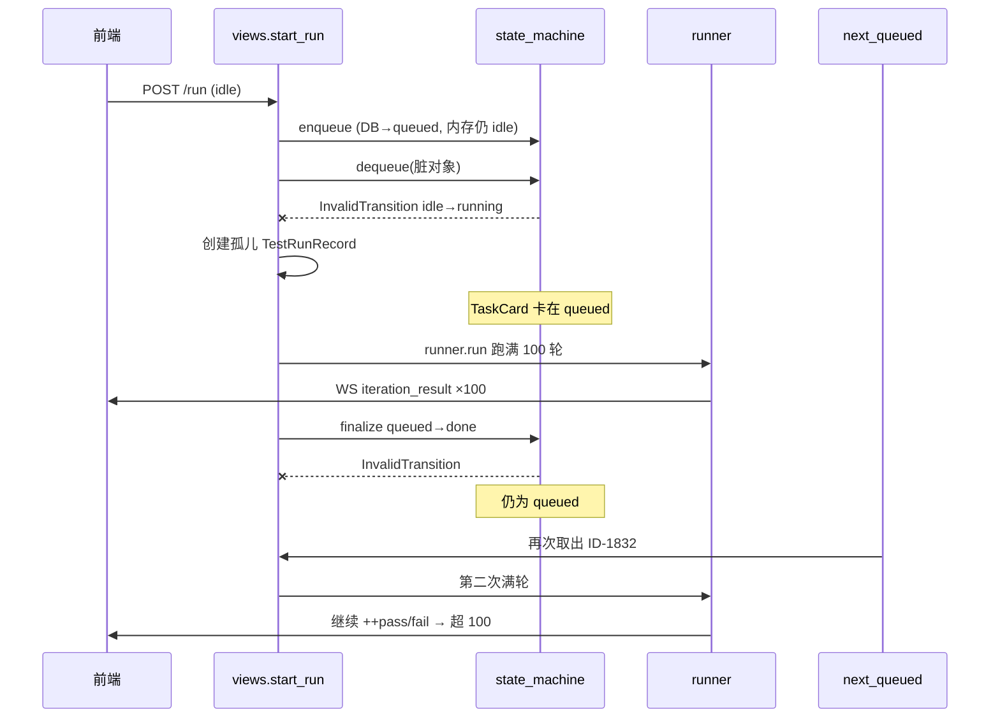

# 执行引擎：任务进度超上限（102/100）与二次执行

> 状态：🔴 待修复 · 日期：2026-07-15 · 模块：test_runner + frontend/test-runner  
> 实证任务：`ID-1832`（H6020 详情页开关测试）· 设备 `10.162.92.83:40449`  
> 标签：状态机 · 脏对象 · 孤儿 Run · 前端累加计数

---

## 现象

执行引擎任务卡片（运行中）出现：

| 展示项 | 异常表现 | 正常预期 |
|--------|----------|----------|
| 已执行次数 | `已执行 102/100 次`（可继续涨到 105+） | ≤ `loopCount`（本例 100） |
| 进度条 | `102%` / `105%` | ≤ 100% |
| 当前轮次 | `（第 5 轮循环）` 等，远小于已执行数 | 与 `pass+fail` 大致同尺度 |
| 任务状态 | 仍显示「执行中」 | 首轮 100 次结束后应进入终态 |

用户侧感知：**超过了任务执行上限**，并可能实际被完整再跑一轮。

---

## 问题原因

核心不是「单次 run 的 `for` 循环越界」，而是 **状态机变迁失败 → 卡片卡在 `queued` → 被二次调度 → 前端计数跨 run 累加**。

### 1. 主因：`enqueue` 后内存对象未刷新（后端）

`views.py` `_execute_tests` → `start_run()` 对 idle 卡片：

```python
if tc_card.status == "idle":
    sm.enqueue(tc_card, dev_serial)          # DB → queued
    return sm.dequeue(tc_card, ...)          # 仍拿旧对象校验
```

`_save_transition` 内部 `select_for_update()` 重取并写库，**不会回写调用方手里的 `tc_card.status`**。调用方对象仍为 `idle`。

随后 `dequeue()` 用脏对象做 `_validate(task_card, "running", "")`：

```
idle → running   ← 非法（合法路径必须是 queued → running）
```

抛出 `InvalidTransition` 后走回退：创建**孤儿** `TestRunRecord`（未把 TaskCard 升到 `running`）。TaskCard 停留在 **`queued`**。

### 2. finalize 无法收口（后端）

跑完后 `finalize` 尝试：

```
queued → done/completed   ← 非法（合法路径必须是 running → done）
```

结果：

- `TestResult` 可能已 `bulk_create`（首轮 100 条齐全）
- `TestRunRecord.status` 仍为 `RUNNING`
- `TaskCard` 仍为 `queued`，可被启动恢复 / 设备队列再次取出

### 3. 二次满轮执行（后端调度）

设备释放后 `_schedule_next_queued` / 恢复逻辑把仍为 `queued` 的同卡片再次拉起 → **第二轮完整 `loop_count` 执行**。

### 4. 前端跨 run 累加（放大显示）

- 进度：`taskCompletedCount = Σ(pass+fail)`，分母为 `total(=loopCount)`，无按 iteration 封顶
- 排队接管（`pollQueuedTasks`）只设 `running/runId`，**不调用 `initTaskProgress`**
- `case_started` 若迟到/漏收，旧 `pass/fail` 上继续 `++` → 出现 `102/100`
- `currentIteration` 来自当前 WS 轮次 → 与历史累计脱节（「第 5 轮」+「已执行 102」并存）

---

## 定位过程

### 1. UI 字段语义

- 文案：`frontend/src/modules/test-runner/index.vue` → `已执行 {{ taskCompletedCount }}/{{ taskTotalCount }}`
- 计数：`composables/taskUtils.js` → `pass+fail` / `caseItems[].total`
- WS 累加：`composables/useTaskWebSocket.js` → `iteration_result` 分支

### 2. 后端单次循环是否越界

`apps/test_runner/runner.py`：

```python
for i in range(1, loop_count + 1):
```

单次 run **不会**执行超过 `loop_count` 次。

### 3. DB 实证（ID-1832）

| 对象 | 观察 |
|------|------|
| TaskCard | `loop_count=100`；某时刻 `overall_pass=102`、`overall_fail=3`、`current_iteration=8`、进度 >100% |
| Run #93（11:02） | `TestResult` **恰好 100 条**（96 pass + 4 fail），`status` 仍 `RUNNING` |
| Run #95（12:09） | 同 `client_task_id=ID-1832` 的第二次执行 |

→ 超限来自 **多次 run + 前端累加**，非单次循环突破。

### 4. 日志铁证

```
2026-07-15 11:02:35 WARNING  start_run transition ID-1832: idle/ → running/ is not a valid transition
2026-07-15 11:53:07 WARNING  finalize transition ID-1832: queued/ → done/completed is not a valid transition
2026-07-15 12:09:36 INFO     _execute_tests 开始: ... client_tid=ID-1832   # 第二次
```

同类日志历史出现：`ID-1819` / `1823` / `1826` / `1828` / `1833` 等 → **系统性问题**，非单卡偶发。

### 5. 因果时序



---

## 解决方案

### A. 后端必改（根治状态机）

1. **`enqueue` 后刷新调用方对象**，或在 `start_run` 中：

```python
sm.enqueue(tc_card, dev_serial)
tc_card.refresh_from_db(fields=["status", "outcome", "running"])
return sm.dequeue(tc_card, ...)
```

2. **`dequeue` 防御**：对 `select_for_update()` 之后的**新实例**再 `_validate`，禁止仅校验入参脏对象；非法时不要静默建孤儿 run。

3. **`finalize` 兜底**：
   - 若 TaskCard 为 `queued` 且本 run 已产出结果：先补 `queued→running`（或专用 recovery），再 `→done`
   - 无论 TaskCard 是否变迁成功，都将对应 `TestRunRecord` 更新为 `COMPLETED/STOPPED/FAILED` + `finished_at`
   - 避免留下「结果已入库、status 仍 RUNNING」的孤儿 run

### B. 前端加固（防止超限展示与二次误导）

1. 排队转入 running / 新 `runId` 绑定时强制 `initTaskProgress`（清零 `pass/fail/overall*`）
2. `case_started` 同时清零 `overallPass` / `overallFail`
3. 展示层：`completed = min(pass+fail, total)`，进度 `Math.min(100, …)`（防御性，不替代后端修复）

### C. 数据修复（线上现场）

对已卡住的卡片：

1. 查 `TaskCard.status='queued'` 且关联 run 已有满额 `TestResult` 的记录
2. 将 orphan `TestRunRecord` 标终态；TaskCard 按结果迁到 `done` + 正确 `outcome`
3. 若当前正误跑第二轮：可停止任务，避免再叠加一轮

### D. 验收用例

| # | 场景 | 期望 |
|---|------|------|
| 1 | idle 任务立即启动（设备空闲） | 日志无 `idle→running`；DB：`idle→queued→running→done` |
| 2 | 跑完 `loop_count=N` | `TestResult` 条数 ≤ N；卡片终态 done；进度 ≤100% |
| 3 | 同设备再启动其他任务 | 已完成任务**不会**被 next_queued 再次执行 |
| 4 | 排队任务被接管时前端 | `pass/fail` 从 0 起计；不出现「第 3 轮 + 已执行 103」 |

---

## 涉及文件

| 层 | 路径 | 角色 |
|----|------|------|
| 后端 | `apps/test_runner/views.py` | `start_run` / `finalize` / `_start_next_queued` |
| 后端 | `apps/test_runner/state_machine.py` | `enqueue` / `dequeue` / `_validate` / `_save_transition` |
| 后端 | `apps/test_runner/runner.py` | 单轮循环（非越界源） |
| 前端 | `frontend/src/modules/test-runner/composables/useTaskWebSocket.js` | WS 累加 |
| 前端 | `frontend/src/modules/test-runner/composables/taskUtils.js` | 进度计算 |
| 前端 | `frontend/src/modules/test-runner/index.vue` | 排队接管 / 展示 |

---

## 参考

- Memory：`memory/project_runner_stale_enqueue_overcount.md`
- 关联历史问题集：`联调功能-执行引擎模块问题记录.md`（状态机 / 恢复同类）
