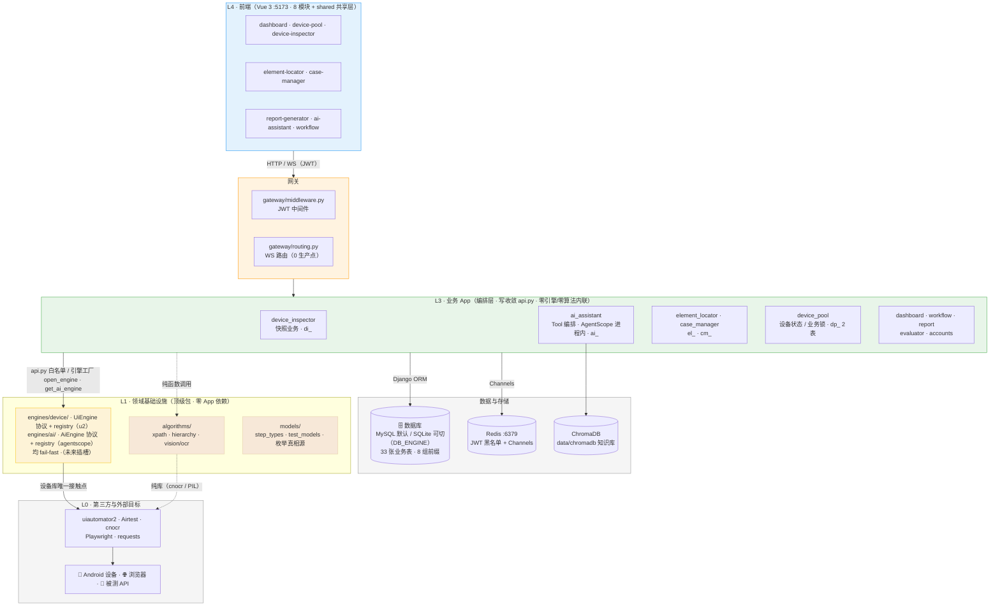
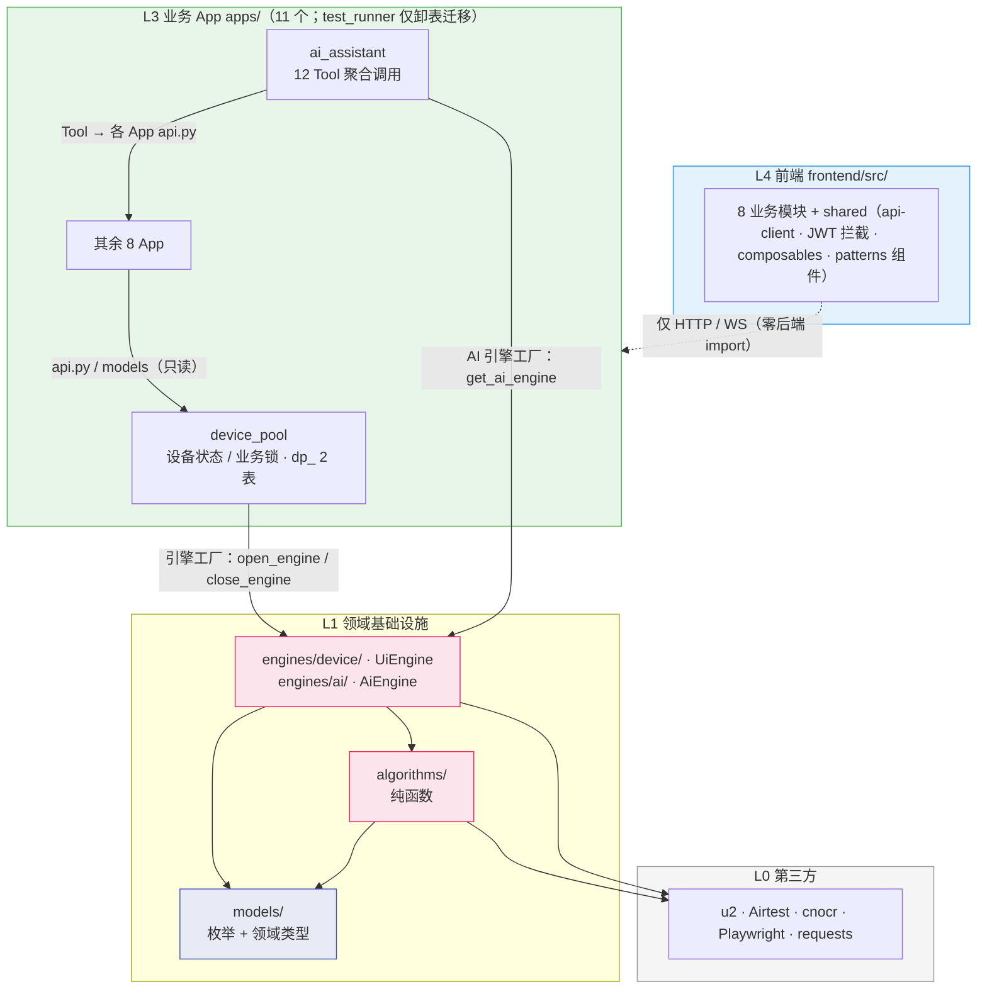
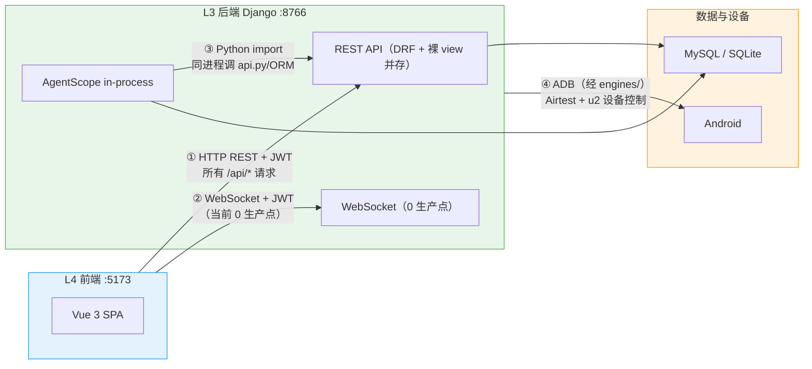
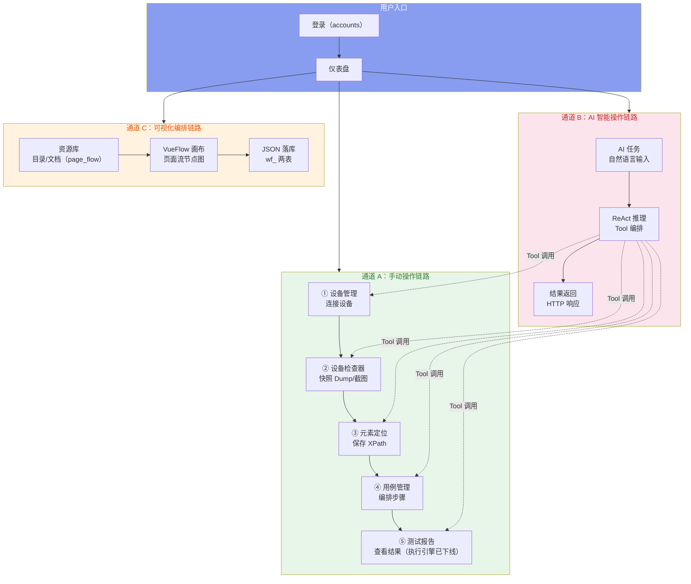
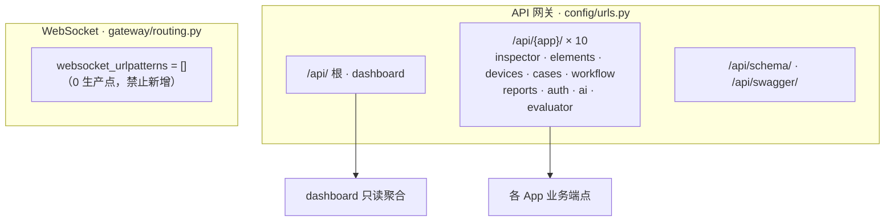

# ARCH-00 — 平台总体架构

> **版本**：v3.5 · **日期**：2026-09-16 · **状态**：现行（取代 v2.1 三层口径；v3.3 设备域与 test_runner 域同步；v3.5 对齐 HEAD——SSE 下线为四条通道、补 `engines/ai` 与 `algorithms/layout`、§1.5 范式表与主链路同步）
>
> ⚠️ 本文对应 **HEAD 代码**（`300471d6`，2026-09-16）；工作区未提交改动不在本文口径内。遗留差异见 §1.6 偏差登记。

## 文档职责边界（ARCH vs PRD）

- **ARCH（架构）只描述**：分层、依赖方向、数据流、API 端点概览、边界/防火墙、数据模型。
- **组件用抽象角色命名**（如「统计卡片」「截图展示」「步骤编排器」），不写 `.vue` 文件名、不写数量。
- **具体组件清单 / 规格 / 验收 → 只进 PRD**。功能变更只改 PRD，架构变更才改 ARCH。

## 你能从文档获取什么信息

- **全局架构**：平台如何分层，后端 App 与前端模块如何协作，通信通道上的数据如何流动。
- **模块边界与依赖规则**：谁能 import 谁、写操作如何收敛到 `api.py`、哪些是防火墙红线——指导安全地新增或修改模块。

## 关联文档

- **需求规格**：[`需求大纲`](PRD-00-需求总纲.md)（项目定位 · 用户故事 · 模块职责）

---

## 一、平台架构概览

### 1.1 架构定位（分层）

平台按计算职责分层，依赖方向**严格单向向下**：`L4 → 网关 → L3 → L1 → L0`（原 L2 设备交互中台已扁平化，见下）。

> 演进脉络：v2.1 的三层口径（前端 / 后端 / AI 引擎）经 2026-08-20 七步重构（OpenSpec 变更集）演化为分层架构——设备交互协议与引擎实现下沉 `engines/`、纯算法下沉 `algorithms/`、枚举与领域模型收敛 `models/`。其中「设备交互中台」一层在 2026-09-03 归档变更 `flatten-device-session` 中被**扁平化删除**（去掉 `session.py` 中间层，上层直调引擎工厂，设备互斥交由 `DeviceLock` 业务锁），故 L2 层号空置。

| 层 | 名称 | 文件范围 | 职责 | 边界 |
|----|------|---------|------|------|
| **L4** | 前端 | `frontend/` | 负责渲染与交互，围绕组件规范与状态管理策略展开 | ✅ 只经 HTTP / WS 通道访问后端<br>❌ 禁止 import 后端任何模块；禁止数据库直连、文件系统 I/O、AI 推理、ADB 通信 |
| **L3** | 业务 App 编排层 | `apps/` · `gateway/` · `shared/` · `config/` | 负责请求解析与业务编排，围绕写操作收敛与统一响应信封展开 | ✅ 视图层只调本 App 的 api 与 models；跨 App 只读 models、写走对方 api；业务层经引擎工厂取引擎，调用算法纯函数与 models 枚举<br>❌ 禁止 import 其他 App 内部实现；禁止视图层直写 ORM；禁止直触引擎实现与裸设备句柄。数据写操作统一收敛到 api；dashboard 仅只读聚合（test_runner 已下线，仅保留卸表迁移） |
| ~~**L2**~~ | ~~设备交互中台~~（已空置） | —（层已空置） | 无（会话租用中间层已扁平化） | —（互斥职责移交业务锁） |
| **L1c** | 引擎层 | `engines/` | 负责设备操作原语与 AI 框架适配，围绕可替换的引擎协议与能力声明展开 | ✅ 可 import 第三方库、models 与 algorithms<br>❌ 禁止 import 业务 App 与 Django |
| **L1b** | 领域模型 | `models/` | 负责枚举与领域类型定义，作为全平台唯一真相源 | ✅ 仅标准库<br>❌ 禁止 import 一切外部与业务模块 |
| **L1a** | 算法层 | `algorithms/` | 负责无状态纯函数算法，围绕可独立测试的规则计算展开 | ✅ 可 import 第三方纯库与 models 类型<br>❌ 禁止 import 业务 App、引擎层与 Django |
| **L0** | 第三方与外部目标 | —（仓库外：第三方库 / 设备 / 浏览器 / 被测接口） | 提供底层能力与外部目标，围绕设备操作、浏览器操作与被测接口调用展开 | ✅ 仅经引擎层与算法层被触达（设备库的唯一接触点是引擎层）<br>❌ 禁止业务层与前端直接依赖 |

### 1.2 架构全景图

> 补充「数据与存储」节点与 algorithms 纯库依赖。



### 1.3 分层包图

> 箭头 = import 方向。实线 = 合法依赖；虚线 = 特殊边（前端零后端 import、纯库依赖）。



### 1.4 四条通信通道



| # | 通道 | 方向 | 协议 | 鉴权方式 | 用途 |
|:--:|------|------|------|------|------|
| ① | 前端 → Django | 双向 | HTTP REST | JWT Bearer Header | 业务 CRUD（11 App） |
| ② | Django → 前端 | 单向推送 | WebSocket | JWT query string | 当前 0 生产点（`gateway/routing.py` 为空表：截图流快照化、执行进度随 test_runner 下线、编辑锁随文档用例重构下线） |
| ③ | AgentScope → Django | 单向调用 | Python import | 上下文注入 | Tool 执行业务逻辑（零网络开销） |
| ④ | Django → 设备 | 双向 | ADB | — | 截屏 / dump / 手势（仅经 engines 层） |

> v1.7 起设备检查器**无实时截图流**：截图/层级改为快照式抓取（REST → `di_snapshots`），原 ScreenshotConsumer 已删除；此后执行进度 WS 随 test_runner 下线、编辑锁随文档用例重构下线、AI 主对话 SSE 随主对话移除下线，`gateway/routing.py` 的 `websocket_urlpatterns` 现为**空表**（0 生产点），平台仅剩四条通道。

**平台主链路（数据流）**：



### 1.5 API 实现与统一管理（DRF + api.py）

后端 HTTP 层由 **DRF 与裸 Django View 两种范式并存**，通过四个统一机制收敛为一致的 API 风格：

| 统一机制 | 实现 | 作用 |
|---|---|---|
| 统一信封 | `EnvelopeJSONRenderer`（DRF）/ 手写 `JsonResponse`（裸 view） | 响应统一 `{status, data}` / `{status, message}` |
| 统一鉴权 | `JWTAuthenticationMiddleware`（裸 view）+ DRF `JWTAuthentication` | 都委托 `jwt_auth.verify_token()`，注入 `request.user_id` |
| 写操作收敛 | 各 App `api.py`（`__all__` 白名单） | 所有 INSERT/UPDATE/DELETE 走 api.py，视图层/serializer 禁直写 ORM |
| 统一路由 | 各 App `urls.py` → `config/urls.py` include | 统一前缀 `/api/{app}/` |



**范式分布（2026-09-16 复核）**：

| 范式 | App |
|---|---|
| DRF ViewSet / Serializer | case_manager · element_locator · evaluator · workflow（`views_drf.py`/`views_api.py`） |
| DRF ViewSet / APIView（Batch 1-3 已迁） | ai_assistant（DefaultRouter：agents/conversations/toolbox + 知识库/上传/任务 APIView；仅工具网关为函数视图） |
| DRF APIView / 函数视图 | accounts · dashboard（APIView）· device_pool（`@api_view` + manager 写收敛）· device_inspector（`@api_view` 快照端点） |
| 裸 Django View | report_generator |

**DRF 统一配置**（`settings.REST_FRAMEWORK`）：信封渲染 `EnvelopeJSONRenderer` · 鉴权 `JWTAuthentication` · 权限 `IsAuthenticated` · OpenAPI 文档 drf_spectacular。

**统一响应信封**（所有端点，含 DRF 与裸 view；**例外**：report_generator / workflow legacy 为平铺 `{status, ...}` 信封，⚠️ 登记见 §1.6 #9）：

```json
{ "status": true,  "data": { } }          // 2xx 成功
{ "status": false, "message": "..." }      // 4xx/5xx 失败（不暴露技术术语）
```

> 字段契约（snake_case）、逐端点字段与错误文案以各模块 PRD §5 为准。

### 1.6 同步方式与契约偏差登记

| 交互类型 | 数据同步方式 |
|------|------|
| 仪表盘 / 列表类 | 静态一次性加载 + 手动刷新（无轮询） |
| 执行进度 | 执行引擎已下线（原为 WebSocket 推送 10 种下行消息 + `seq` + 心跳，随 test_runner 一并移除） |
| 设备检查器 | 快照式：REST capture → `di_snapshots` → 回看（无实时流） |
| AI 任务 | HTTP 请求-响应（原 SSE 逐 token 流式已随主对话移除下线） |
| 任务状态 | 执行引擎已下线，平台无任务状态流转（原为后端权威 `state` 下发 + 前端 `running` 镜像） |