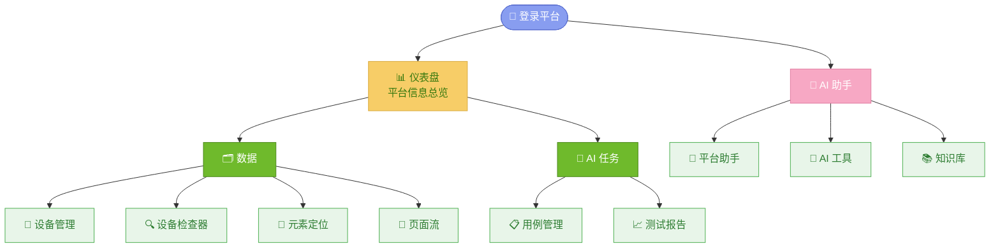
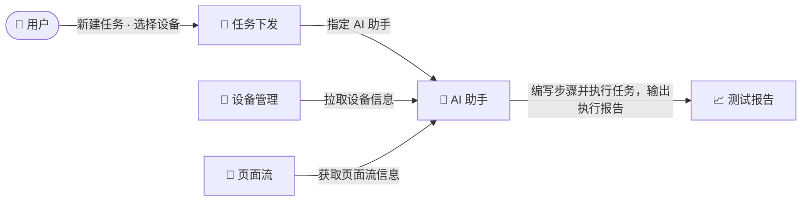

# 需求大纲 — Android-AutoTests

> 版本：v3.6 · 日期：2026-08-21
> 本文档是平台的**需求总纲**，聚焦功能定位、用户场景、模块职责边界和交互流程。
---

## 一、项目定位

### 1.1 一句话定位

> 为 **测试工程师**设计的 **AI 测试平台**，让测试工程师指挥**AI 助手**去完成测试任务。

### 1.2 解决的痛点

### 1.3 产品边界

---

## 二、目标用户

### 2.1 用户画像

### 2.2 用户核心旅程

---

## 三、平台业务场景

### 3.1 登录功能总览

### 3.2 数据业务流

### 3.3 AI 助手业务流

> 任务执行由后端引擎完成（无前端页面），业务链路图不单独出节点。

---

## 四、子模块功能规格索引

> 以下子 PRD 为各模块的完整功能规格：功能定位、前端页面交互、数据表单设计、正常/异常场景、约束条件。
> 每份末尾含 **附录A：功能边界规则**。
> **开发进度 / 文档进度**按 HEAD（`300471d6`，2026-09-16）实测：开发进度对照「前端页面 / 后端接口 / 数据表 / 执行链」，文档进度对照「子 PRD 是否存在 + 接口文档与 `urls.py` 路由的一致性」。

| 模块 | 子 PRD 文件 | 核心功能场景 | 开发进度 | 文档进度 |
|------|-----------|------|------|------|
| 登录模块 | `PRD-00-登录模块.md` | 登录 · 注册 · 刷新令牌 · 登出 · 当前身份 · 会话与账号管理 | 已开发（登录/注册两态前端页面 + `apps/accounts` 五端点 `login`/`register`/`refresh`/`logout`/`me` + 会话基础设施；复用内置 `auth_user`，无自有表） | 有子 PRD（2026-09-20 新建）；`API-登录.md` 与代码一致（五端点 + 尾斜杠约定） |
| 仪表盘 | `PRD-01-仪表盘.md` | KPI 概览 · 执行趋势 · 任务执行结果 · 活动时间线 | 已开发（前端页面 + 只读聚合接口，无自有表） | 无子 PRD；接口文档 `API-仪表盘.md` 与代码一致 |
| 设备管理 | `PRD-02-设备管理.md` | ADB 扫描 · 连接 · 锁定/释放 · 排队 · 断连处理 | 已开发（前端页面 + 设备生命周期与锁接口 + 数据表） | 无子 PRD；`API-设备管理.md` 与代码一致（含 `manager` / `@api_view` 口径） |
| 设备检查器 | `PRD-03-设备检查器.md` | 一键 dump 快照落库 · 快照回看/删除 · 筛减导入元素定位 | 已开发（前端页面 + 快照抓取与回看接口 + 快照表） | 有子 PRD（2026-09-21 新建）；`API-设备检查器.md` 有 2 处与代码不一致（见 PRD 附录） |
| 元素定位 | `PRD-04-元素定位.md` | 页面树/分组树 · 元素 CRUD · 跳转流 · 测试点标记 | 已开发（前端页面 + 三域资产接口 + 数据表） | 有子 PRD（2026-09-21 新建）；`API-元素定位.md` 严重滞后（仍写已下线的 Web/API 域与「三项目」），见 PRD 附录 |
| 用例管理 | `PRD-05-用例管理.md` | 目录树 · 步骤编排 · XPath 选取 · YAML 导入导出 · 批量操作 | 已开发（前端页面 + 项目/目录/文件/用例行接口 + 数据表） | 无子 PRD；`API-用例管理.md` 与代码一致（含「已移除」清单） |
| 执行引擎 | `PRD-06-执行引擎.md` | 任务卡片 · 智能调度 · 实时进度 · 停止/重跑 · 历史审计 | 部分开发（后端设备控制与执行结果输出能力，无前端页面） | 无子 PRD；`API-执行引擎.md` 仍为下线声明，与新口径待同步 |
| 测试报告 | `PRD-07-测试报告.md` | 报告列表 · 在线详情 · 失败分析 · 趋势图 · 文件下载 | 部分开发（前端页面 + 只读接口；执行链下线后无新数据） | 无子 PRD；`API-测试报告.md` 与代码一致（含 legacy 平铺信封说明） |
| AI 助手 | `PRD-08-AI助手.md` | 智能体管理 · 流式对话 · NL 生成用例 · 设备操控 · 知识库 | 已开发（前端页面 + 智能体/对话/任务/知识库/工具箱接口 + 数据表；主对话与 SSE 已移除） | 无子 PRD；`API-AI助手.md` 基本一致，缺技能树与技能文件 2 个端点 |
| 工作流工作台 | `PRD-09-工作流工作台.md` | 目录资源库 · VueFlow 页面流 · JSON 导入导出 | 已开发（前端画布 + 目录/文档接口 + 数据表） | 无子 PRD；`API-工作流.md` 与代码一致（legacy + DRF 双路径） |
| 评测中心 | `PRD-11-评测中心.md` | 题库管理 · 评测运行 · 机器/人工评分 · KB 自测 | 已开发（前端寄宿于 AI 助手页面 + 题库/运行/结果接口 + 数据表） | 无子 PRD；`API-评估器.md` 与代码一致（DRF router + legacy 平铺） |

---
