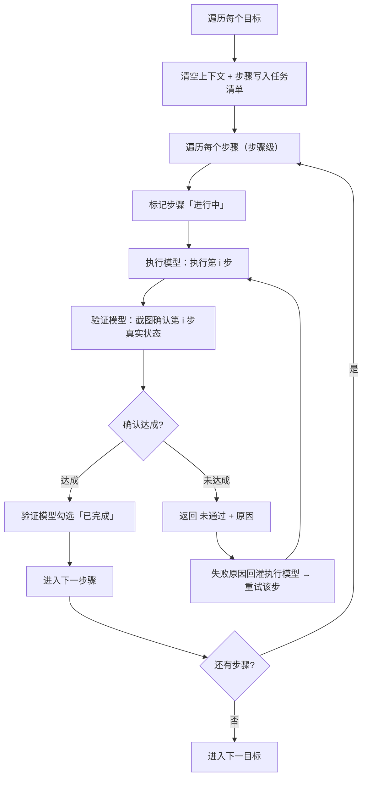
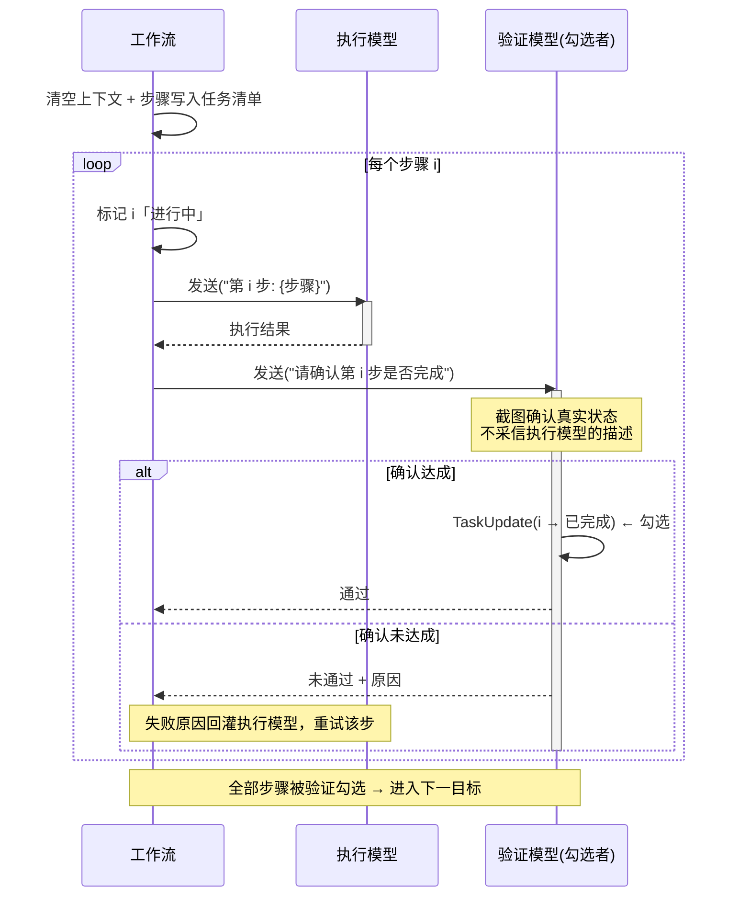

我把项目里**真正 import `agentscope` 的实际代码**（排除 `dev_docs/项目笔记` 那些学习笔记）都过了一遍，结论如下。

## 一句话结论

项目用的是 **AgentScope 2.0 的 SDK 层（进程内）**：`Agent` + `Toolkit` + `FunctionTool` + `Model` + `Middleware` + `RAG`，用自写的编排逻辑串成一个「planner → executor ↔ verifier」设备执行工作流。**没有**用 AgentScope 自带的 Agent Service / Pipeline / Realtime / A2A / MCP 等应用层设施。

核心代码集中在 `engines/ai/agentscope/`（引擎实现），RAG 在 `apps/ai_assistant/rag_service.py`。

---

## 实际用到的功能（按模块）

### 1. Agent 与 ReAct 循环 — `agentscope.agent`

在 `engines/ai/agentscope/model.py` 中，`Agent` + `ContextConfig` + `ReActConfig` 是装配核心：

- 三个角色 Agent：**planner（规划）/ executor（执行）/ verifier（验收）**，各自 `Agent(name=..., system_prompt=..., model=..., toolkit=...)`。
- **ContextConfig**：executor/verifier 用 `max_image_num=5` 限制上下文里的图片数量（防截图堆爆 token）。
- **ReActConfig**：executor 用 `max_iters=8` 限制单步推理-行动迭代次数。
- 交互用 `await agent.reply(UserMsg(...))`，并手动 `state.context.clear()` 在每个步骤间清空上下文（`workflow.py`）。

### 2. 模型层 — `agentscope.model` + `agentscope.credential`

`model.py` 的 `create_model()` 按 provider 选择模型类：

- **DeepSeekChatModel**（默认，`thinking_enable=True` 开思维链）
- **OpenAIChatModel**（兼容类，vision 图片模式 / 自定义 base_url 都走它）
- **DashScopeChatModel**（阿里云）
- 对应 Credential：`DeepSeekCredential` / `OpenAICredential` / `DashScopeCredential`
- provider 白名单与默认 base_url 在 `apps/ai_assistant/provider_registry.py` 统一解析（dashscope/openai/anthropic/deepseek/gemini/custom）

### 3. 工具系统 — `agentscope.tool` + `agentscope.permission` + `agentscope.skill`

`engines/ai/agentscope/tool_wrapper.py`：

- 继承 **`FunctionTool`** 做成 `PlatformFunctionTool`，把 Django 层的纯函数工具（`apps/ai_assistant/tools.py`，如 `screenshot_page` / `click_ratio` / `xpath_action` / `device_action`）包成 AgentScope 工具。
- 用 **`is_read_only` / `is_concurrency_safe`** 让写工具串行执行（避免并发破坏设备动作顺序）。
- 重写 **`check_permissions`** 用 `PermissionBehavior` / `PermissionDecision`：只读→`ALLOW`、平台内部锁→`ALLOW`、写操作→`ASK`（即权限/HITL 体系）。
- **`Toolkit`** 组装工具，并通过 **`LocalSkillLoader(directory="engines/ai/skills", scan_subdir=True)`** 加载共享 skill（当前有 `skill-creator` 和 `platform-tools-manual` 两个）。
- **`ToolChunk` + `TextBlock` + `DataBlock` + `Base64Source`**：把截图工具返回的图片 base64 封装成多模态工具结果喂回模型。

### 4. 消息与多模态 — `agentscope.message`

- 输入用 `UserMsg`；工具返回图用 `DataBlock(source=Base64Source(...))`。
- `workflow.py` 里还消费了 **`ThinkingBlock` / `ToolCallBlock` / `ToolResultBlock` / `TextBlock`** 来做结构化日志 dump 和「从回复里提取最后一张截图」（`_extract_last_screenshot`），把 executor 的截图再喂给 verifier。

### 5. 中间件 — `agentscope.middleware`

`engines/ai/agentscope/usage_tracker.py`：

- 继承 **`MiddlewareBase`** 实现 `UsageCaptureMiddleware`，挂在 **`on_model_call`** 钩子上，捕获模型响应里 `cache_input_tokens` / `cache_creation_input_tokens`（AgentScope 的 `ModelCallEndEvent` 只带 input/output token，缓存字段得从这里拿），并按对话聚合做计费统计。

### 6. RAG — `agentscope.rag` + `agentscope.embedding`

`apps/ai_assistant/rag_service.py`（这是独立于设备执行工作流的另一块）：

- **`KnowledgeBase`**：以 `data/rag_datas/**/*.md` 为知识源（如 GoveeHome 功能说明）。
- **自定义 `VectorStoreBase` 子类 `ChromaVectorStore`**：用 chromadb 本地持久化向量库对接 AgentScope 的 `VectorStoreBase` 接口（`insert/search/list_documents/list_chunks`）。
- **`TextParser` + `ApproxTokenChunker`**（chunk_size=256 / overlap=32）做解析与切块。
- **Embedding 模型**：`OllamaEmbeddingModel` / `DashScopeEmbeddingModel` / `OpenAIEmbeddingModel` 三选一（环境变量 `EMBEDDING_PROVIDER` 切换）。
- 用到的数据类型：`Chunk` / `DocumentSummary` / `VectorRecord` / `VectorSearchResult`。

### 7. 自研编排（不是 AgentScope Pipeline）

`engines/ai/agentscope/workflow.py` 里的 `DeviceExecutionWorkflow` 是**项目自己写的编排循环**，只是用 `Agent.reply()` 当最小执行单元：

```
planner 出 Plan(goal+steps) → 逐 step：executor 执行(截图) → verifier 截图验收
→ 验收 false 回灌 actual 重试 → 超过 max_loops 判失败
```

不是用 AgentScope 的 `pipeline` / `GoalPipeline`。

---

## 明确未使用的 AgentScope 功能

| 功能 | 状态 |
|------|------|
| **Agent Service**（FastAPI 后端 + Web UI） | ❌ 已下线，改进程内（`config/agentscope_config.py` 是遗留的 service 配置，PORT/Redis/Workspace 等字段已不再生效） |
| **Pipeline / GoalPipeline** | ❌ 自研 workflow 替代 |
| **Realtime 语音 Agent** | ❌ |
| **A2A 协议** | ❌ |
| **MCP Client**（`agentscope.mcp`） | ❌ 只出现在学习笔记里，代码未用 |
| **长期记忆 Memory**（ReMe/Mem0） | ❌ |
| **Workspace / Sandbox**（Docker/E2B） | ❌（工具直接走进程内 `engines.device` 引擎） |
| **Channels**（飞书/钉钉/Discord） | ❌ |

---

**涉及文件**（点击查看）：
- `engines/ai/agentscope/engine.py`、`model.py`、`config.py`、`tool_wrapper.py`、`workflow.py`、`usage_tracker.py`
- `apps/ai_assistant/rag_service.py`、`tools.py`、`engine_adapter.py`、`provider_registry.py`、`views/tool_gateway.py`
- `config/agentscope_config.py`（遗留 service 配置）、`requirements.txt`（`agentscope>=2.0.7.post1`）

需要我画一张「AgentScope 各模块 → 项目实际调用点」的对照图，或者深入讲某一块（比如 `PlatformFunctionTool` 的权限/并发设计、RAG 的 chromadb 适配）吗？